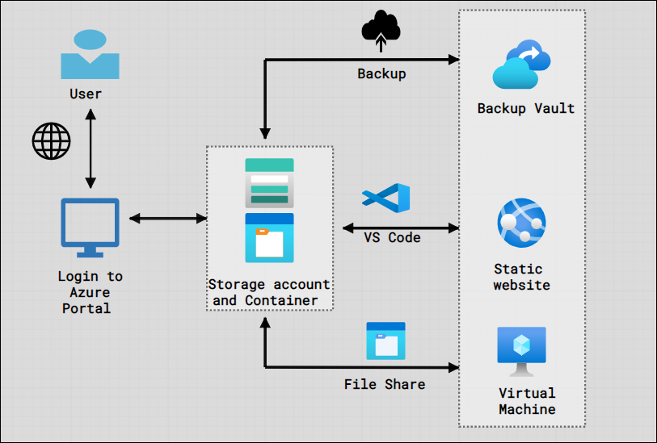

# Lab 03 - Configure and deploy a non-relational data storage solution 
# Student lab manual

## Lab scenario

In order to improve management of Azure resources, you have been tasked with implementing the following functionality:

- Configure an Azure Storage account. An Azure storage account contains all of your Azure Storage data objects: blobs, files, queues, and tables. The storage account provides a unique namespace for your Azure Storage data that is accessible from anywhere in the world over HTTP or HTTPS.

- Configure an Azure blob storage. Azure Blob Storage allows you to store large amounts of unstructured object data. You can use Blob Storage to gather or expose media, content, or application data to users.

- Upload some files to the blob container and apply the lifecycle policy. Azure Storage lifecycle management offers a rule-based policy that you can use to transition blob data to the appropriate access tiers or to expire data at the end of the data lifecycle. A lifecycle policy acts on a base blob, and optionally on the blob's versions or snapshots.

- Configure a static website to aceess the blob container. You can serve static content (HTML, CSS, JavaScript, and image files) directly from a storage container. Azure Storage static website hosting is a great option in cases where you don't require a web server to render content. 

- Secure blob storage and enable backup/soft delete. To secure your blob storage you can use access keys, shared access signatures. Blob soft delete protects an individual blob, snapshot, or version from accidental deletes or overwrites by maintaining the deleted data in the system for a specified period of time. During the retention period, you can restore a soft-deleted object to its state at the time it was deleted. After the retention period has expired, the object is permanently deleted.

- Configure Azure files. Azure Files offers fully managed file shares in the cloud that are accessible via the industry standard Server Message Block (SMB) protocol, Network File System (NFS) protocol, and Azure Files REST API. Azure file shares can be mounted concurrently by cloud or on-premises deployments. SMB Azure file shares are accessible from Windows, Linux, and macOS clients. 

## Objectives

In this lab, you will have:

+ Exercise 1: Create Storage account and configure a static website to access the blob container and apply lifecycle management policy
+ Exercise 2: Secure blob storage and enable backup and soft delete
+ Exercise 3: Setup Azure File share and access from a Virtual machine

## Estimated timing: 30 minutes
## Solution Architecture

