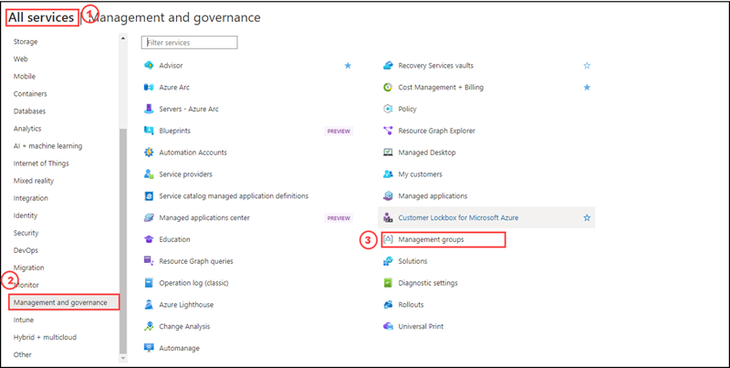
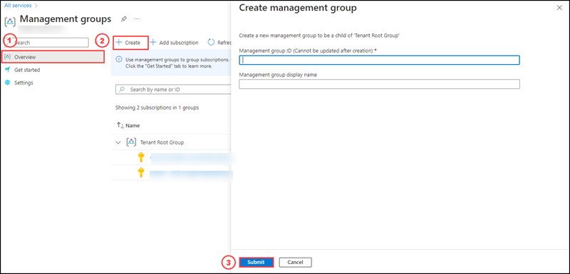
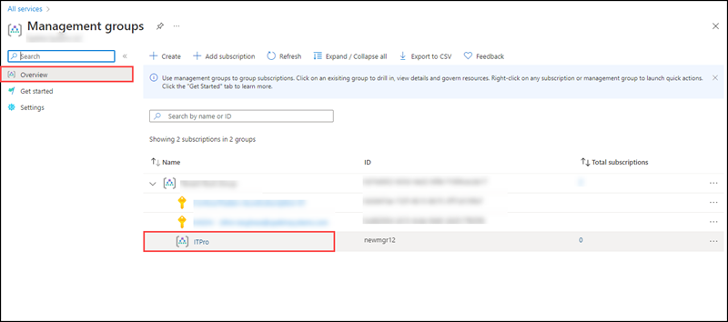
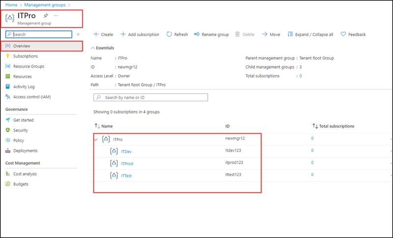

# Lab 01 - Design a Governance Solution
# Student lab manual
## Lab scenario

In order to improve management of Azure resources in Contoso, you have been tasked with implementing the following functionality:

- Management Groups in Azure to manage access, policy, and compliance across multiple subscriptions. You can organize subscriptions into management groups and apply your governance policies to the management groups. All subscriptions within a management group automatically inherit the policies applied to the management group.

- Assign subscriptions to the management groups to separate billing environments, such as development, test, and production.

- Assign Policies to enforce different rules over your resource configurations so the configurations stay compliant with corporate standards.
- Cost Analysis - Microsoft Cost Management is a suite of tools that help organizations monitor, allocate, and optimize the cost of their Microsoft Cloud workloads. 

## Objectives

In this lab, we will:

+ Task 1: Create Management Groups
+ Task 2: Create Child Management Groups
+ Task 3: Assign Subscriptions to management groups
+ Task 4: Assign Policies and Governance to management groups
+ Task 5: Review the cost data and explore the cost manager

## Estimated timing: 30 minutes
## Architecture diagram

## Instructions

### Exercise 1

#### Task 1: Create Management Groups

In this task, you will create a Management Group via the Azure portal.

#### Pre-requisites for this task
If you don't have an Azure subscription, create a free account before you begin by clicking [here](https://azure.microsoft.com/en-us/free/).

Any Azure AD user in the tenant can create a management group without the management group write permission assigned to that user if hierarchy protection isn't enabled. This new management group becomes a child of the Root Management Group or the default management group and the creator is given an "Owner" role assignment. Management group service allows this ability so that role assignments aren't needed at the root level. No users have access to the Root Management Group when it's created. To avoid the hurdle of finding the Azure AD Global Admins to start using management groups, we allow the creation of the initial management groups at the root level.

#### Steps:

1. Log into the Azure portal.

2. Select All services > Management + governance.

3. Select Management Groups.

4. Select + Create.

5. Enter the management group id and display name, then click submit.

**Note: The Management Group ID is the directory unique identifier that is used to submit commands on this management group. This identifier isn't editable after creation as it's used throughout the Azure system to identify this group. The root management group is automatically created with an ID that is the Azure Active Directory ID. For all other management groups, assign a unique ID.**

**The display name field is the name that is displayed within the Azure portal. A separate display name is an optional field when creating the management group and can be changed at any time.**

6. Navigate to the Management Groups blade. Review the **Overview** information and note that the new Management Group has been created. 

#### Task 2: Create Child Management Groups

In this task, you will create three management groups under the management group you have created in the previous task via Azure Portal.

#### Pre-requisites for this task

Complete Task 1.

1. Go to the Azure Portal, Select Management Groups, review the Overview, click on the management group which you have created in the previous task.

2. Repeat step 4 to Step 6 from Task 1 to create three more management groups

3. After completing the creation of management groups, go to the parent management group whihc you have created on the first task, and click on it. In the Overview section you can see the other three management groups.

#### Task 3: Assign subscriptions to management groups

In this task, you will assign subscriptions to the newly created management groups via Azure Portal.

#### Pre-requisites for this task

Complete Task 1 and Task 2

#### Steps:

You can add subscriptions to the management groups that you created.

1. From the Azure portal, open Management Groups and select the management group for your subscription.

2. 
