# Instructions

## Exercise 1: Create Management Groups and assign Subscriptions

In this exercise you will create three management groups and assign subscriptions to each management groups via Azure portal.

In this Exercise, you will have:

+ Task 1: Create Management Groups.
+ Task 2: Create Child Management Groups.
+ Task 3: Assign subscriptions to management groups

### Task 1: Create Management Groups

In this task, you will create a Management Group via the Azure portal.

#### Pre-requisites for this task

An Azure account. Any Azure AD user in the tenant can create a management group without the management group write permission assigned to that user if hierarchy protection isn't enabled. This new management group becomes a child of the Root Management Group or the default management group and the creator is given an "Owner" role assignment. Management group service allows this ability so that role assignments aren't needed at the root level. No users have access to the Root Management Group when it's created. To avoid the hurdle of finding the Azure AD Global Admins to start using management groups, we allow the creation of the initial management groups at the root level.

#### Steps:

1. Log into the Azure portal.

2. Select **All Services** and select **Azure Active Directory**.

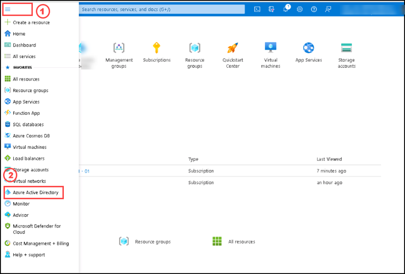

3. On the Azure Active Directory page, please select **Properties** under **Manage tab**, then select **Yes** for **Access management for Azure resources**, then select **Save**. 

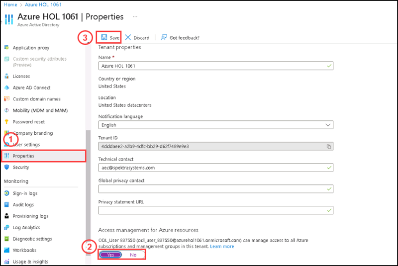

4. Please go to **Home** tab and search for **Management Groups**, then select **Management Groups** from the list.

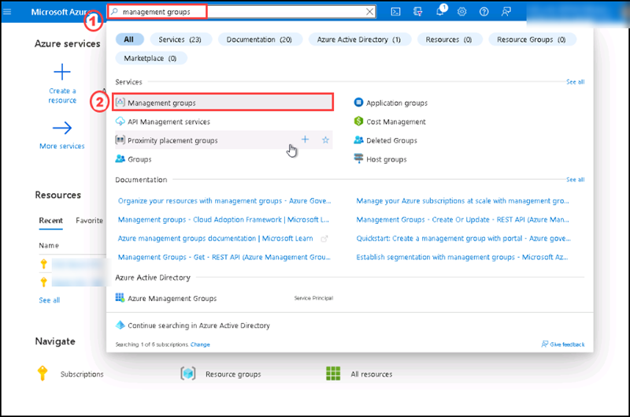

5. On the Management Groups page, in the Overview section, please select the Tenant Root group.

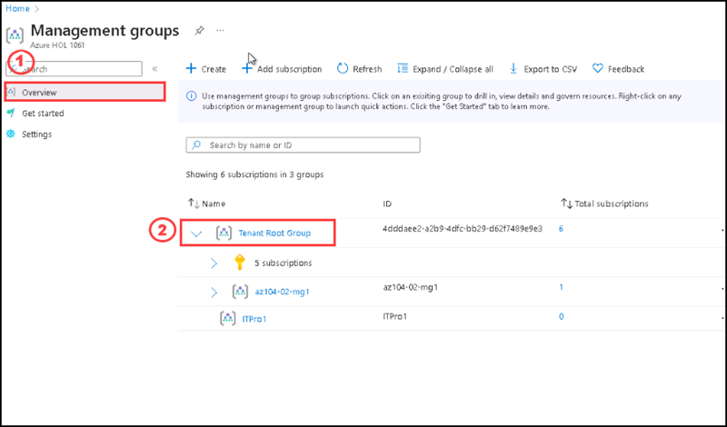

6. On the Tenant Root Group page, please select **Acces Control**, then select **+ Add** and then select **Add Role Assignment**.

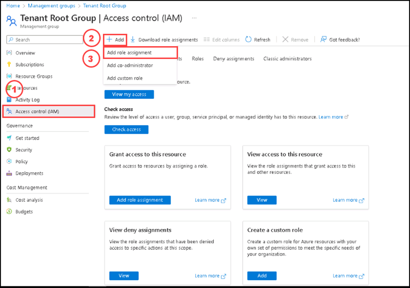

7. On the Add Role Assignment Page, please select **Owner** and select **Next**.

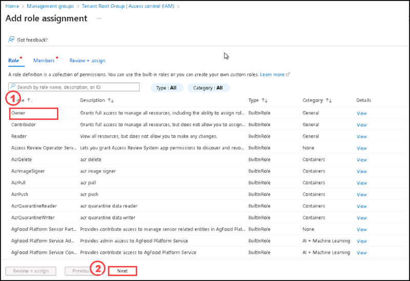

8. On the Add Role Assignment Page, under Members tab, please select **+Select members**. Then on the Select members side screen, please select the current user name and then select **Select** button.

9. After selecting the user, please select **Review + Assign**.

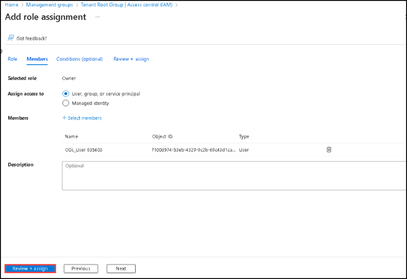

10. Once completed the assignment, you can see the current user having **owner** role under **Access Control** section on the Tenant Root Group page. 

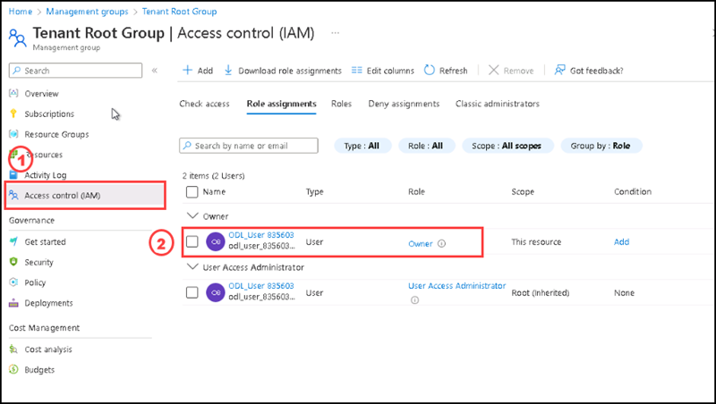

>**Now you can create child management groups and assign subscriptions to each group**.

>**Note: The Management Group ID is the directory unique identifier that is used to submit commands on this management group. This identifier isn't editable after creation as it's used throughout the Azure system to identify this group. The root management group is automatically created with an ID that is the Azure Active Directory ID. For all other management groups, assign a unique ID.**

>**The display name field is the name that is displayed within the Azure portal. A separate display name is an optional field when creating the management group and can be changed at any time.**

### Task 2: Create Child Management Groups

In this task, you will create three management groups under the management group you have created in the previous task via Azure Portal.

#### Pre-requisites for this task

Complete Task 1.

1. On the Management Group page, please select **+ Create**

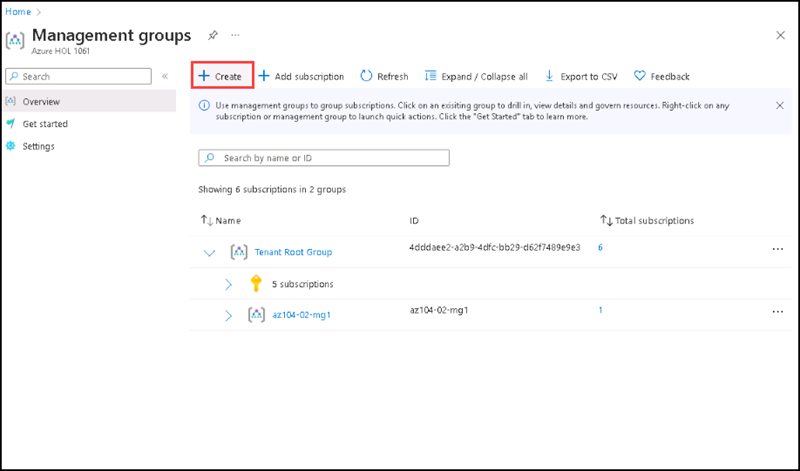

2. On the Create management group side screen, please enter the **Management Group ID** and **Management group display name**, then select **Submit**.

  | Settings | Values |
  |  -- | -- |
  | Management Group ID | **IT-Contoso** |
  | Management group display name* | **IT-Contoso** |

3. On the maangement groups page, overview section, you can see the newly created child management group named **IT-Contoso**.

4. Add a child group by clicking on the elipsis **(...)** on the right side of the newly created child management group named **IT-Contoso**.

5. On the Create management group side screen, please enter the **Management Group ID** and **Management group display name**, then select **Submit**.

  | Settings | Values |
  |  -- | -- |
  | Management Group ID | **IT-Support-c** |
  | Management group display name* | **IT-Support-c** |

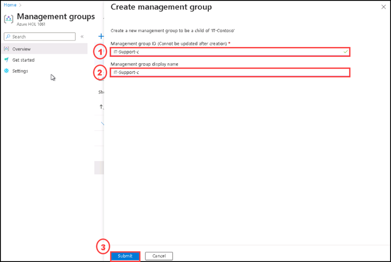

6. By using step 4 and step 5, please add another child management group with the following details:

  | Settings | Values |
  |  -- | -- |
  | Management Group ID | **IT-Service-c** |
  | Management group display name* | **IT-Service-c** |

7. Expand the **IT-Contoso** management group, you can see the newly created child management groups.

### Task 3: Assign subscriptions to management groups

In this task, you will assign subscriptions to the newly created management groups via Azure Portal.

#### Pre-requisites for this task

Complete Task 1 & Task 2

#### Steps:

You can add subscriptions to the management groups that you created.

1. From the Azure portal, open Management Groups and select the management group for your subscription.

2. Expand the Subscriptions under Tenant Root Group on the Mangement groups page.

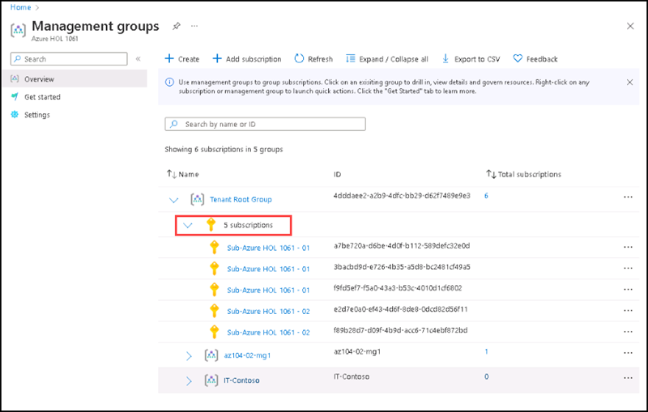

3. Click on elipsis **(...)** on the right side of the first subscription listed, then click on **Move**.

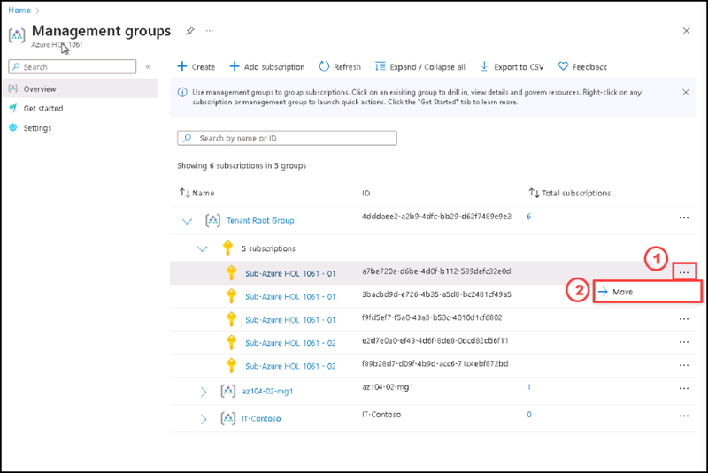

4. Add another two subscriptions to the child management groups of the **IT-Contoso** managament group by using the step 3.

5. Expand the all the child managment groups which you created on this exercise and can see the subscriptions assigned to each management group.

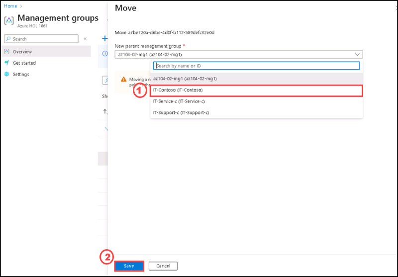

In this exercise you have created three child management groups and add subscriptions on it.

### Clean up resources

>**Note : Please do not delete resources you deployed in this lab. You will reference them in the next lab of this module.**

#### Review

In this lab, you have:

- Created Management Groups.
- Created Child Management Groups.
- Assigned subscriptions to management groups

