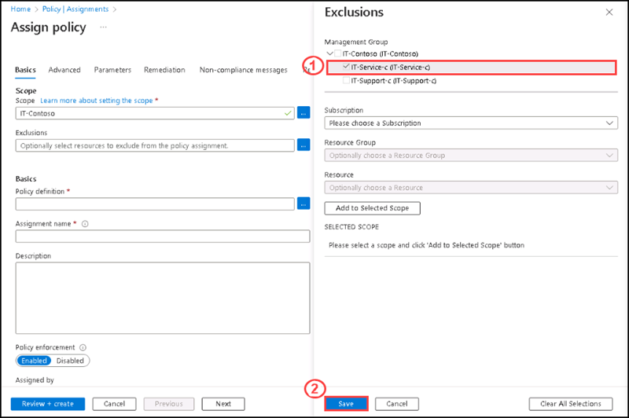
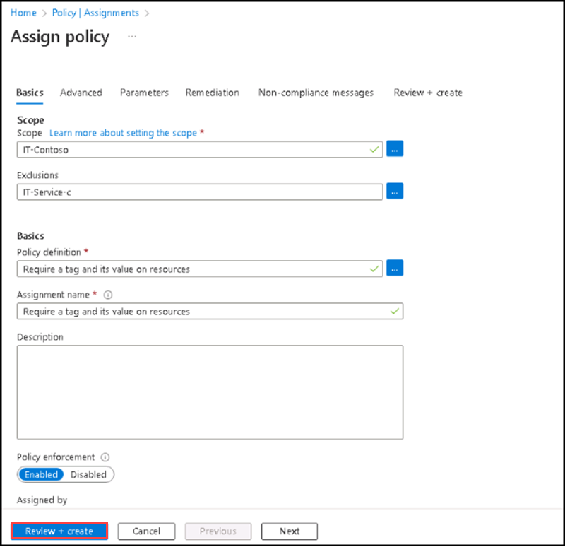

## Instructions

### Exercise 2

#### Task 1: Assign policies and governance to management groups

The first step in enforcing Azure Policy compliance is to assign a policy definition. A policy definition specifies how a policy is enforced and what effect it has. In this task, use the built-in policy definition Inherit a tag from the resource group if missing to add the specified tag and its value from the parent resource group to new or updated resources that are missing the tag.

#### Pre-requisites for this task

Complete Exercise 1

#### Steps:

1. Go to search box and enter policy, then select **Policy** from the list.

2. Select **Assignments** on the left side of the Azure Policy page and then select **Assign Policy**.
      
      **Note: An assignment is a policy that has been assigned to take place within a specific scope.**

3. On the **Assign Policy** page under **Basic** tab for **Scope** section you can see the default subscription selected or else please select the default subscription. 

4. Please click on **Exclusions** elipsis **(...)** towards the right side of the exclusions.

6. On the Exclusions side screen Select the Resource group **ODL-AZ-305M02-838938** and then select **Add to selected scope** and then **Save**.

7. Please click on **Policy Definitions** elipsis **(...)**.

8. On the **Available Definitions** sidescreen take a moment to browse through the list of built-in policy definitions that are available for you to use.

9. On the search box please type **tag** and select **Require a tag and its value on resources** built in definition, then click **Save**.

10. By selecting the policy definition, the assignment name also filled automatically.

11. Click on **Next** at the bottom, review the **Advanced** tab and leave the default settings as it is.

12. Click on **Next** at the bottom, under the **Parameters** tab please enter the following details:

    | Tag name | **Managementgrp** |
    | -------- | ----------------- |
    | Tag value | **IT-Support-c** |
    
    

11. Leave the default settings of other options as it is.

12. Please select **Review + Create**.

 

13.

  
