## Instructions

## Exercise 2: Manage Governance via Azure Policy

In this exercise you are going to add an assignment policy through an Azure buil-in policy and enforcing it to a storage account.

In this Exercise, you will have:

+ Task 1: Create an Assignment through an Azure built-in Policy
+ Task 2: Applying the Policy definition to a Storage account.

## Estimated timing: 30 minutes

### Task 1: Create an Assignment through an Azure built-in Policy

In this task, you will assign the built-in *Require a tag and its value on resources* policy to the resource group. 

#### Pre-requisites for this task

Complete Exercise 1

#### Steps:

1. Go to search box and enter policy, then select **Policy** from the list.

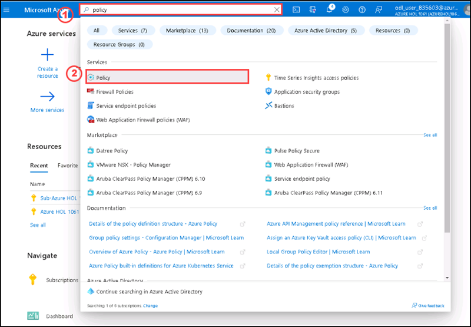

2. Select **Assignments** on the left side of the Azure Policy page and then select **Assign Policy**.
      
      >**Note: An assignment is a policy that has been assigned to take place within a specific scope.**

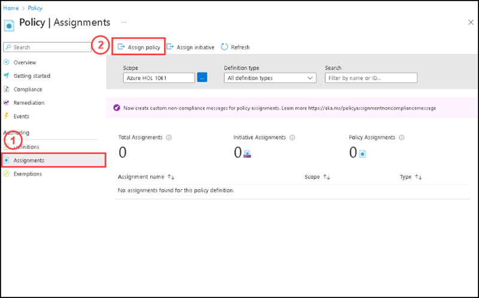

3. On the **Assign Policy** page under **Basic** tab for **Scope** section you can see the default subscription selected or else please select the default subscription. 

4. Please click on **Exclusions** elipsis **(...)** towards the right side of the exclusions.

5. On the Exclusions side screen Select the Resource group **ODL-AZ-305M02-838938** and then select **Add to selected scope** and then **Save**.

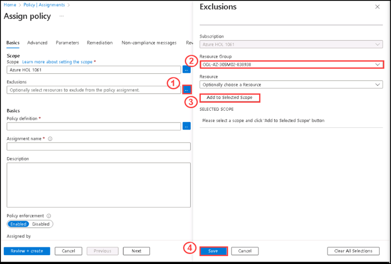

6. Please click on **Policy Definitions** elipsis **(...)**.

7. On the **Available Definitions** sidescreen take a moment to browse through the list of built-in policy definitions that are available for you to use.

8. On the search box please type **tag** and select **Require a tag and its value on resources** built in definition, then click **Save**.

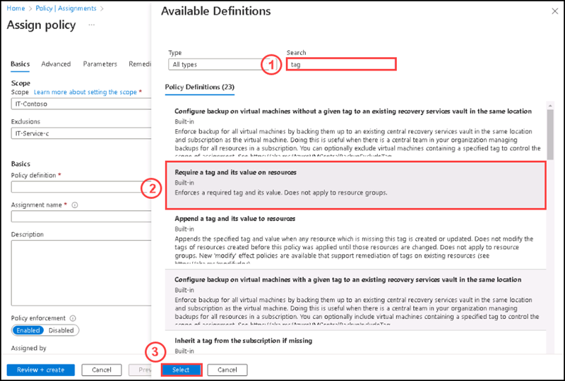

9. By selecting the policy definition, the assignment name also filled automatically.

10. Click on **Next** at the bottom, review the **Advanced** tab and leave the default settings as it is.

11. Click on **Next** at the bottom, under the **Parameters** tab please enter the following details:

    | Tag name | **Role** |
    | -------- | ----------------- |
    | Tag value | **Owner** |
    
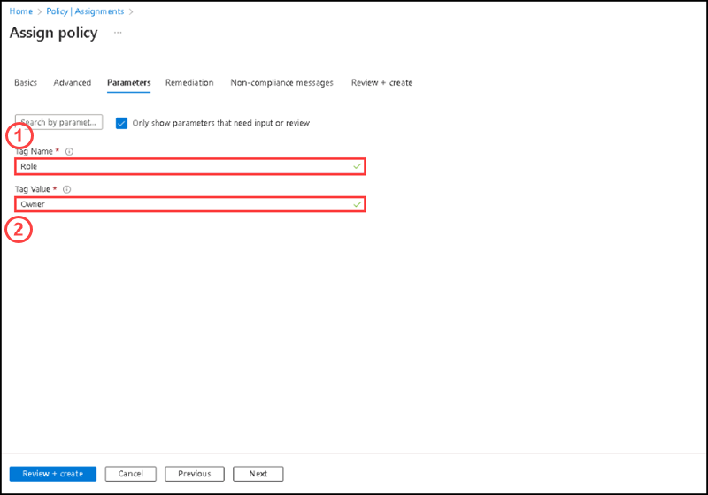    

12. Leave the default settings of other options as it is.

13. Please select **Review + Create**.

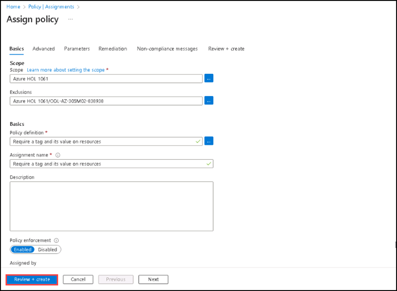 

14. After the validation, please select **Create**.

15. On the Assignments section, you can see the newly created **Assignment**.

#### Task 2: Applying the Policy definition to a Storage account.

In this task you are going to create a storage account by using the resource group which you have applied the Policy assignment.Then you will check the Policy assigment validation.

#### Pre-requisites for this task

Complete Exercise 1, Exercise 2 -  Task 1

#### Steps:

1. On the Azure portal, please select **All Services** and select **Storage accounts**.

2. On the **Storage accounts** page, please select **+Create**.

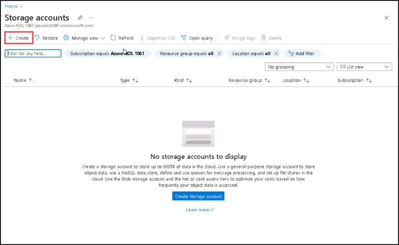

3. On the Storage account page, keep the default subscription selected, then please select a resource group included in the policy assignment from the resource group list.

4. Please enter a name of the storage account on the **storage account name** and then click **Review**.

    | Setting | Value |
    | --- | --- |
    | Storage account name | any globally unique combination of between 3 and 24 lower case letters and digits, starting with a letter |

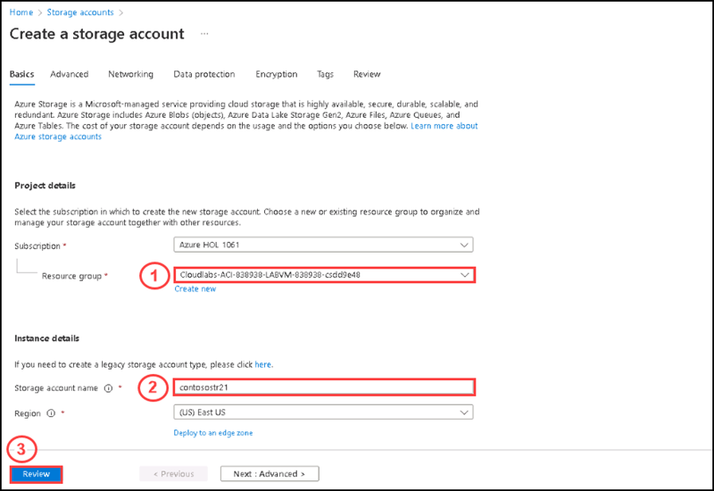

5. You can see the validation failed, and there is a validation error. Please click on the **validation error**, a side screen of error details will open. It shows the error happens due to the policy.

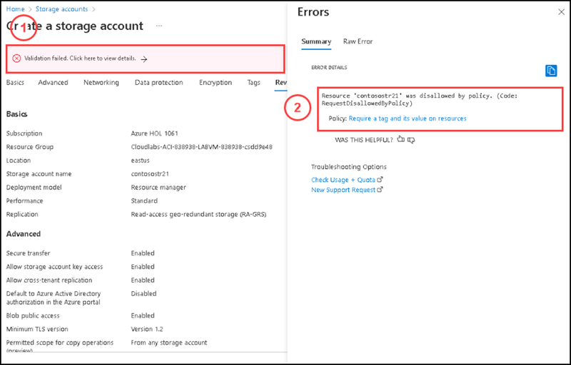

6. On the same page, please select **Tags** tab and enter the following details and click **Review**:

      | Name | **Role** |
      | ---- | -------- |
      | Value | **Owner** |
 
 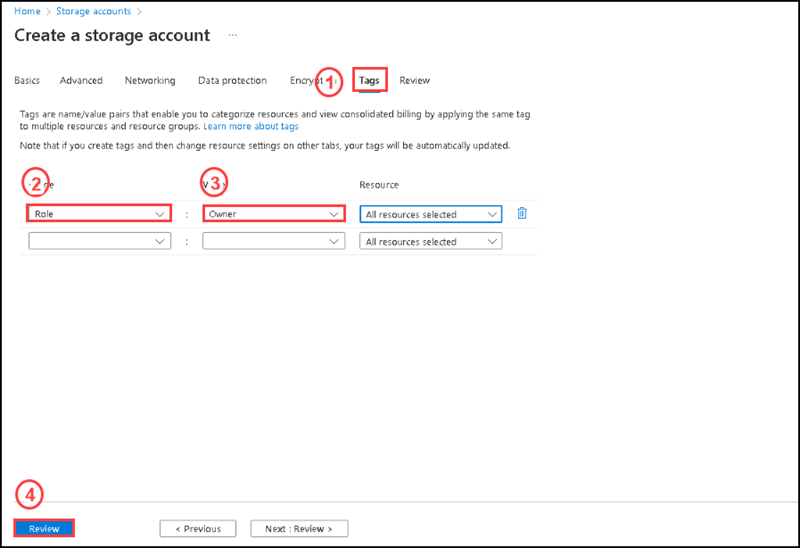
      
7. Now you can see the validation passed successfully.

8. Please click **Create**.

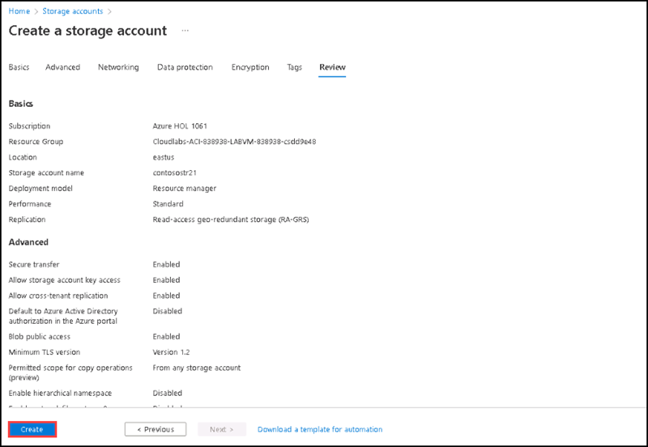

9. You have successfully created the storage account now.

      **Note : If you want to check with the excluded resource group from policy assignment, you can create another storage account by using the same steps, but by selecting the excluded resource group.**    

### Task 3: Clean up resources

   >**Note**: Remember to remove any newly created Azure resources that you no longer use. Removing unused resources ensures you will not see unexpected charges, although keep in mind that Azure policies do not incur extra cost.
   
   >**Note**:  Don't worry if the lab resources cannot be immediately removed. Sometimes resources have dependencies and take a longer time to delete. It is a common Administrator task to monitor resource usage, so just periodically review your resources in the Portal to see how the cleanup is going. 

1. In the portal, search for and select **Policy**.

1. In the **Authoring** section, click **Assignments**, click the ellipsis icon to the right of the assignment you created in the previous task and click **Delete assignment**. 

1. In the portal, search for and select **Storage accounts**.

1. In the list of storage accounts, select the resource group corresponding to the storage account you created in the last task of this lab. Select **Tags** and click **Delete** (Trash can to the right) to the **Role:Owner** tag and press **Apply**. 

1. Click **Overview** and click **Delete** on the top of the storage account blade. When prompted for the confirmation, in the **Delete storage account** blade, type the name of the storage account to confirm and click **Delete**. 

#### Review

In this lab, you have:

- Created and assigned a built in policy via the Azure portal
- Enforced tagging  and checked the validation via an Azure policy

  
