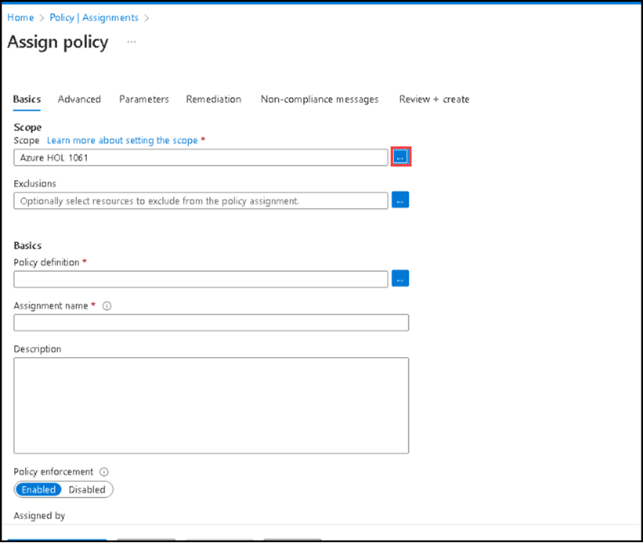
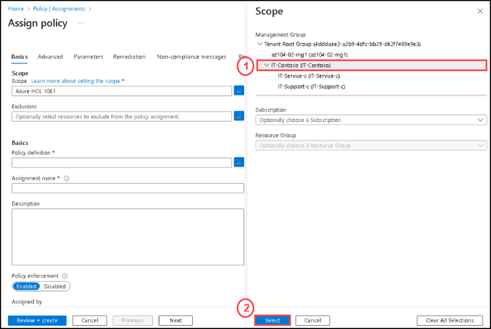

## Instructions

### Exercise 2

#### Task 1: Assign policies and governance to management groups

The first step in enforcing Azure Policy compliance is to assign a policy definition. A policy definition specifies how a policy is enforced and what effect it has. In this task, use the built-in policy definition Inherit a tag from the resource group if missing to add the specified tag and its value from the parent resource group to new or updated resources that are missing the tag.

#### Pre-requisites for this task

Complete Exercise 1

#### Steps:

1. Go to search box and enter policy, then select **Policy** from the list.

2. Select **Assignments** on the left side of the Azure Policy page and then click on the elipsis **(...)** of scope. 
**Note: An assignment is a policy that has been assigned to take place within a specific scope.**

3. On the **Assign Policy** page under **Basic** tab for **Scope** section please click on the elipsis **(...)** towards the right side of the scope. 

4. On the Scope side screen, please select **IT-Contoso** under **Management Group**.

5. Please click on **Exclusions** elipsis **(...)** towards the right side of hte exclusions.

6. 

  
