# Instructions

## Exercise 1: Add a user and provide the accessibility of the resources.

In order to allow Contoso users to authenticate by using Azure AD, you have been tasked with provisioning users and group accounts. Membership of the groups should be updated automatically based on the user job titles. 

In this lab, you will:

+ Task 1: Create and configure Azure AD users 
+ Task 2: Add Accessibility of Resources
+ Task 3: Add Custom RBAC roles

### Task 1: Create and configure Azure Active Directory users

In this task you are going to create and configure Azure Active DIrectory users.

#### Pre-requisites for this task

An Azure account 

#### Steps:

1. Sign in to the [Azure portal](https://portal.azure.com).

2. In the Azure portal, Go to **All Services** and select **Azure Active Directory**.

   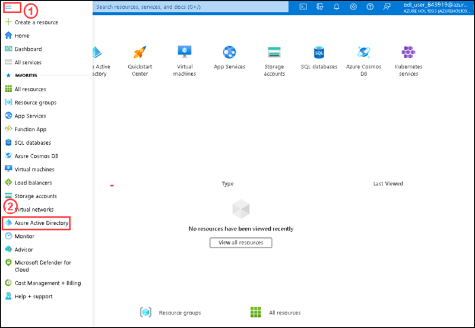

3. On the Azure Active Directory blade, scroll down to the **Manage** section, click **User settings**, and review available configuration options.

   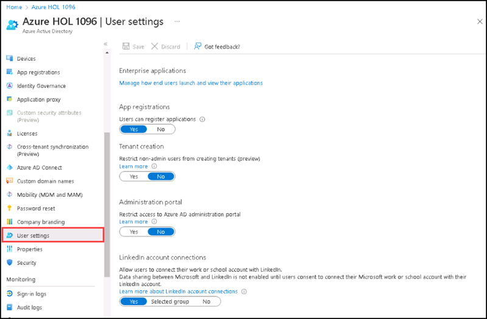

4. On the Azure Active Directory blade, in the **Manage** section, click **Users**, and then click your user account to display its **Profile** settings. 

   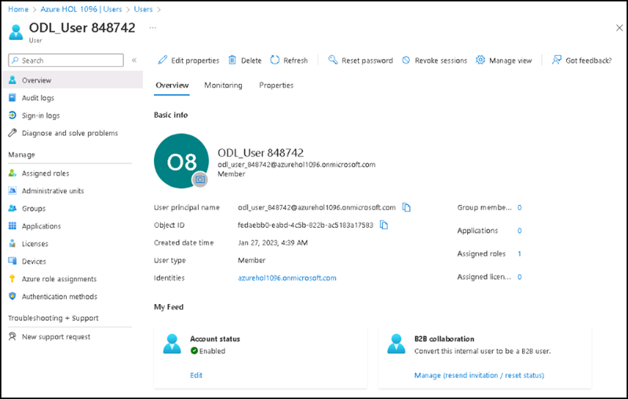

5. Click **Edit properties**, in the **Settings** section, and check the usage location is UNited States, if not set **Usage location** to **United States** and click **Save** to apply the change.

   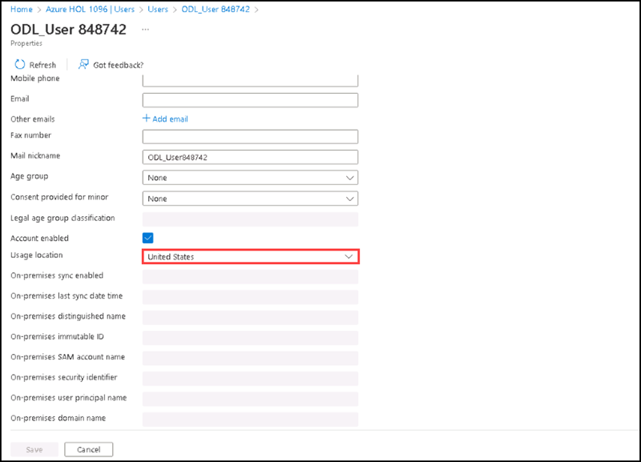

    >**Note**: This is necessary in order to assign an Azure AD Premium P2 license to your user account later in this lab.

6. Go back to the **Users - All users** blade, and then click **+ New user**.


7. In the new user page please enter the following settings (leave others with their defaults) and select **Save**.

    | Setting | Value |
    | --- | --- |
    | User name | **az305-01a-aaduser1** |
    | Name | **az305-01a-aaduser1** |
    | Let me create the password | enabled |
    | Initial password | **Provide a secure password** |
    | Usage location | **United States** |
    | Job title | **Cloud Administrator** |
    | Department | **IT** |

    >**Note**: **Copy to clipboard** the full **User Principal Name** (user name plus domain). You will need it later in this task.

7. Refresh the users page you can see the newly created user named **az305-01a-aaduser1** click on it.

8. In the **Manage** section, click **Assigned roles**, then click **+ Add assignment** button.

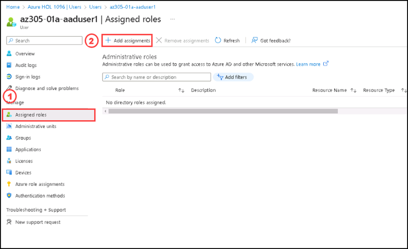

9. On the **Directory roles** side screen, please search for **User Administratoe** role and select the role, then select **Add**.

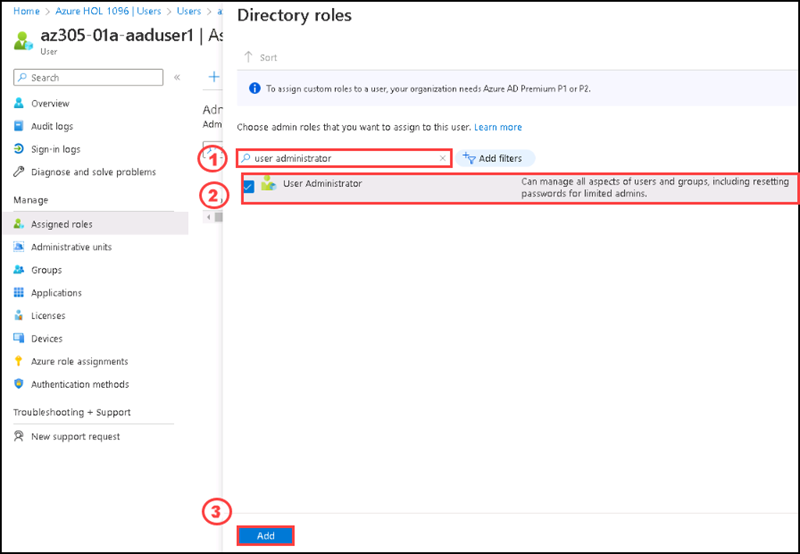

10. Keep refresh **Assigned roles** page , you can see the **User Administrator** role added successfully.

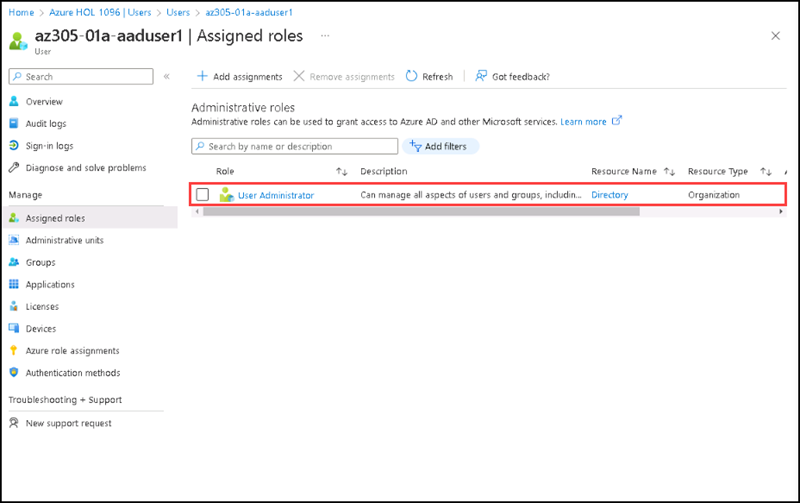

11. Open an **InPrivate** browser window and sign in to the [Azure portal](https://portal.azure.com) using the newly created user account. When prompted to update the password, change the password to a secure password of your choosing. 

    >**Note**: Rather than typing the user name (including the domain name), you can paste the content of Clipboard.

12. In the **InPrivate** browser window, in the Azure portal, search for and select **Azure Active Directory**.

    >**Note**: While this user account can access the Azure Active Directory tenant, it does not have any access to Azure resources. This is expected, since such access would need to be granted explicitly by using Azure Role-Based Access Control. 

13. In the **InPrivate** browser window, on the Azure AD blade, in the **Manage** section, click **Users**, and then click **+ New user**.

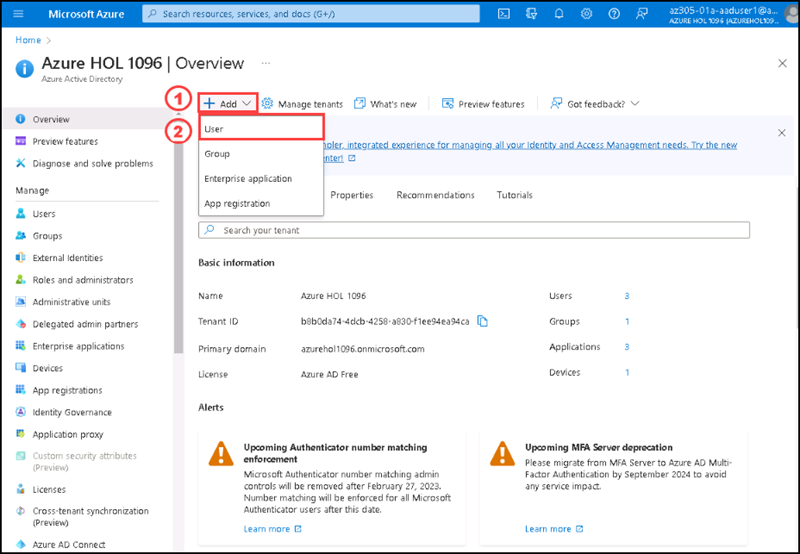

14. Create a new user with the following settings (leave others with their defaults):

    | Setting | Value |
    | --- | --- |
    | User name | **az305-01a-aaduser2** |
    | Name | **az305-01a-aaduser2** |
    | Let me create the password | enabled |
    | Initial password | **Provide a secure password** |
    | Usage location | **United States** |
    | Job title | **System Administrator** |
    | Department | **IT** |

15. You have successfully created the new user.

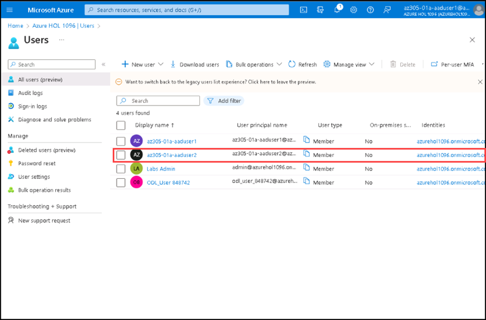

16. Sign out as the az305-01a-aaduser1 user from the Azure portal and close the InPrivate browser window.

### Task 2: Add Accessibility of Resources

In this task you are going to give resource accessibility to the user az305-01a-aaduser1.

#### Pre-requisites for this task

Complete Task 1 

#### Steps:

1. Go to Azure portal, search **Research groups** on the search box of the Home page and select **esource groups** from the list.

2. Select the resource group named **ODL-AZ-305-M02B-XXXXXXX**.

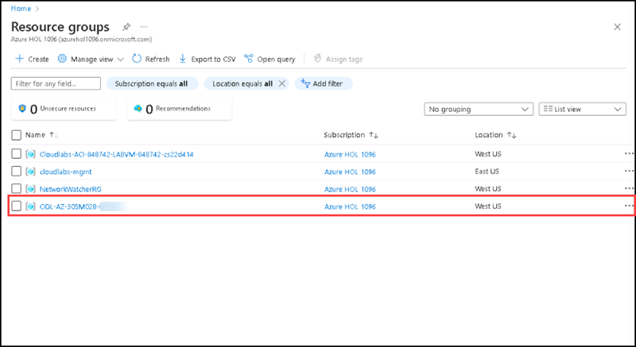

3. In the resource group page, please select **Access control (IAM)**, then select **+Add**, then select **Add role assignment**.

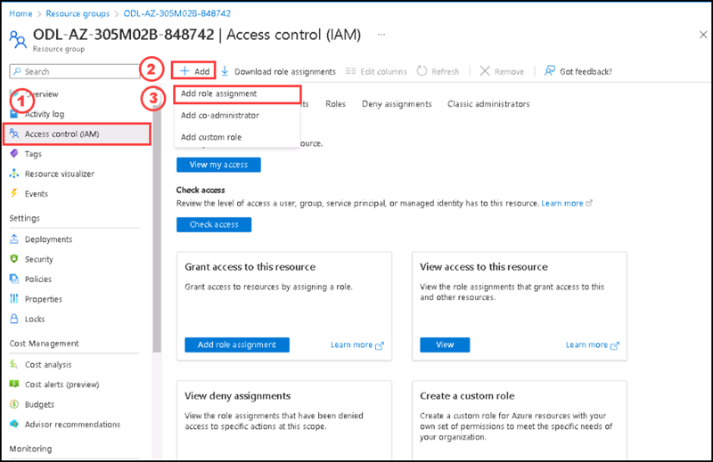

4. In the **Add role assignment** page, please select **Virtual machine contributor** role by searching on the search bar and then select **Next** at the botom.

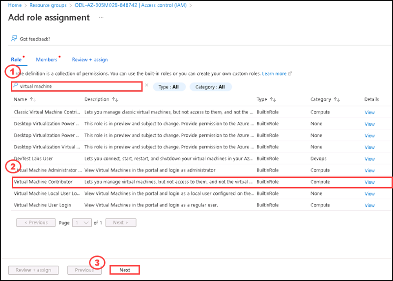

5. In the **Members** tab, please select **+Select members**, then select the user **az305-01a-aaduser1**, and select **Select**.

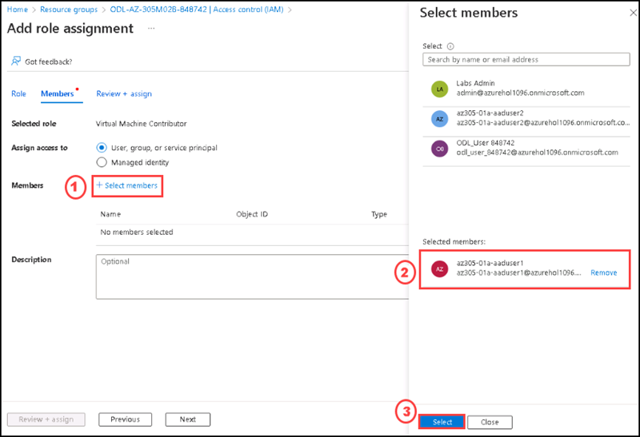

6. Please select **Review + Assign** at the bottom, review the role assignment settings.

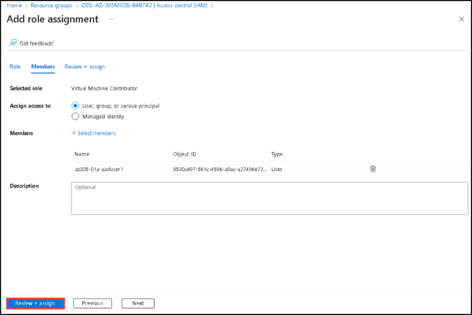

7. Click **Review + assign** to assign the role.

After a few moments, the user is assigned the Virtual Machine Contributor role at the **ODL-AZ-305-M02B-XXXXXXX** resource group scope.

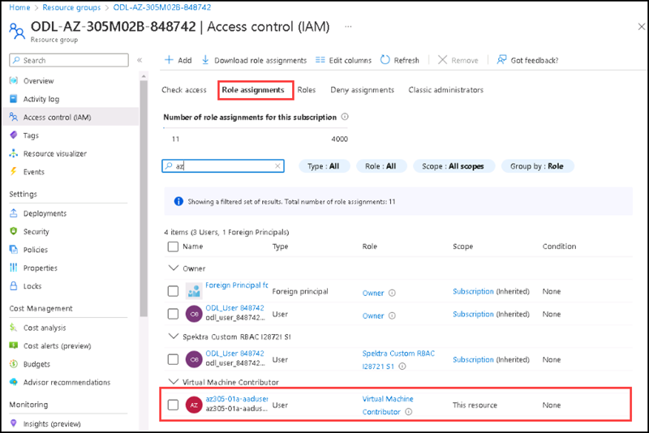

### Task 3: Add Custom RBAC roles

Create a custom role in Azure Role-Based Access Control (RBAC) if none of the built-in roles meet your specific access needs. Custom roles can be created using Azure PowerShell, Azure Command-Line Interface (CLI), and the REST API. Just like built-in roles, custom roles can be assigned to users, groups, and applications at subscription, resource group, and resource scopes.

#### Pre-requisites for this task

Complete Task 1 & Task 2

#### Steps:

1. Go to the **ODL-AZ-305-M02B-XXXXXXX** resource group.

2. On the resource group page, please select **Access control (IAM)**, then select **+Add**, then select **Add custom role**.


3. On the **Create a custom role** page, under **Basics** tab,  please enter the following details and then select **Next** at the bottom.

   | Section | Values |
   | ------- | ------ |
   | Name | **Virtual machine operator** |
   | Description | **This role is for monitoring and restarting the virtual machines on the resource group scope.** |
   | Baseline permissions | Select **Start from scratch** |
   
 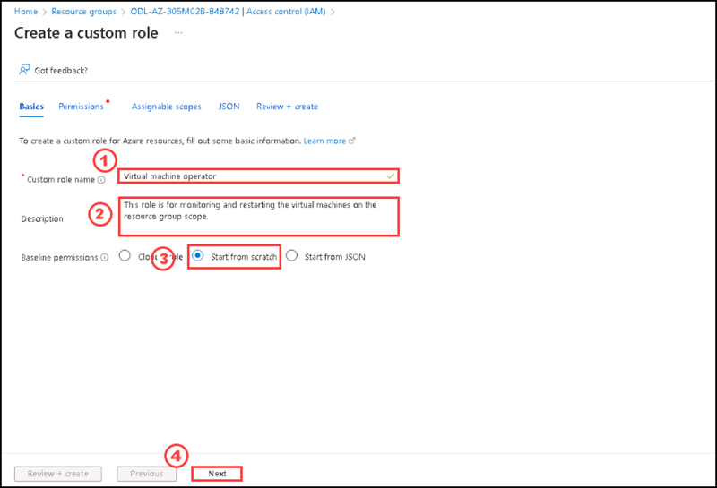  

4. Go to **JSON** tab, and click on **Edit**.

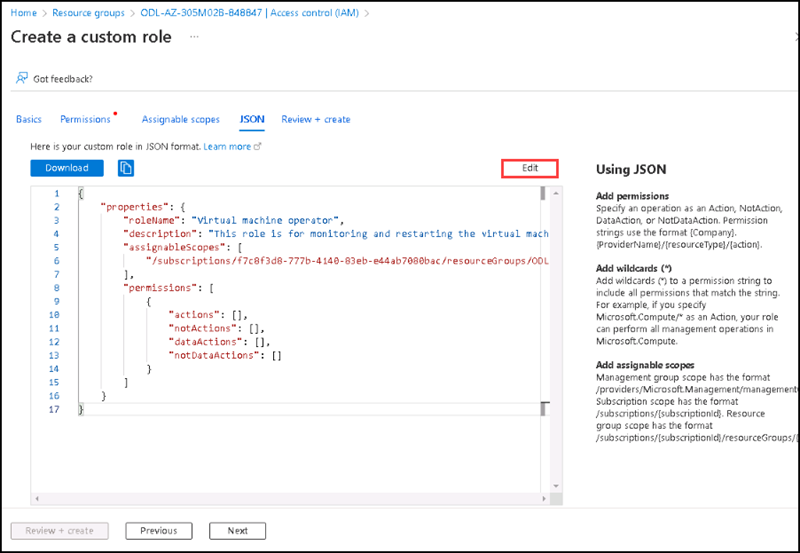  

5. Please enter the following JSON script inside the **action** section, then click **Save**.

   ```JSON
         "Microsoft.Storage/*/read",
          "Microsoft.Network/*/read",
          "Microsoft.Compute/*/read",
          "Microsoft.Compute/virtualMachines/start/action",
          "Microsoft.Compute/virtualMachines/restart/action",
          "Microsoft.Authorization/*/read",
          "Microsoft.ResourceHealth/availabilityStatuses/read",
          "Microsoft.Resources/subscriptions/resourceGroups/read",
          "Microsoft.Insights/alertRules/*",
          "Microsoft.Insights/diagnosticSettings/*",
          "Microsoft.Support/*"
   ```
   
   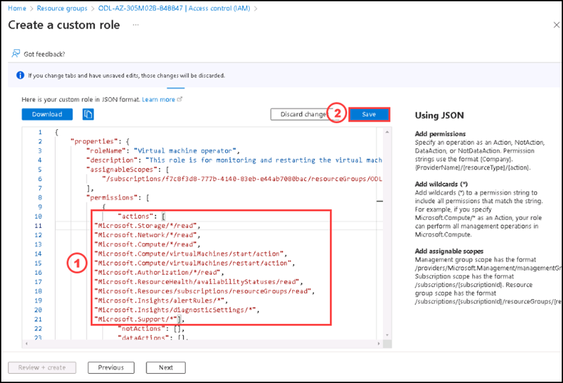  
   
6. Please select **Review + assign**, then click **Create**.

 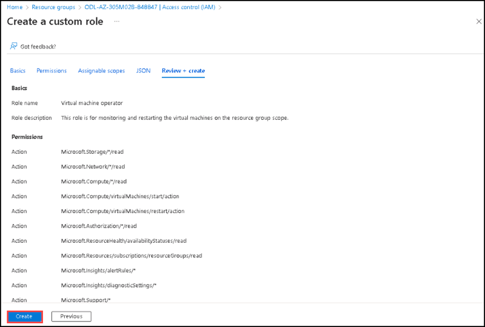 

7. You will get a message saying that **You have successfully created the custom role Virtual machine operator.** please click **OK** to that message.

8. On the **Role** tab please search **virtual machine operator**, you can see the custom role listed.

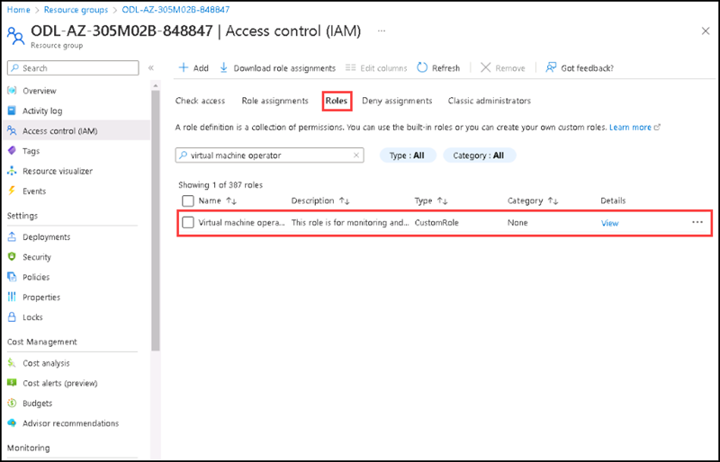

9. Select **+Add**, then select **Add role assignment**. You are going to assign the custom role to the user **az305-01a-aaduser1**.

10. In the **Add role assignment** page, on the **Role** tab, please select **Virtual machine operator** by searching on the search bar.

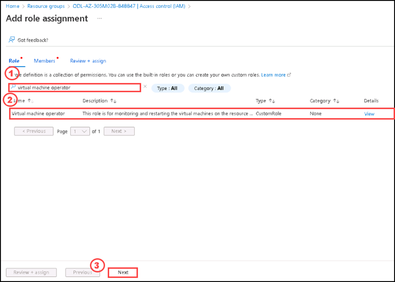

11. on the **Members** tab, please select **+Select members**.

12. On the **Select members** side screen please select **az305-01a-aaduser1** user and select **Select**.

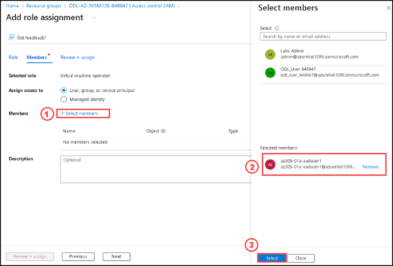

13. Please select **Review + Assign** at the bottom, review the role assignment settings

14. Click **Review + assign** to assign the role.

15. Take an **In private window** for Azure portal and login with the user **az305-01a-aaduser1**, then go to the resource group **ODL-AZ-305-M02B-XXXXXXX** and select the virtual machine from the over view section. You can see the option to connect and restart the virtual machines are enabled.


### Clean up resources

>**Note : Please do not delete resources you deployed in this lab. You will reference them in the next lab of this module.**

#### Review

In this lab, you have:

- Created and configured Azure AD users.
- Provide accessibility to the resources.
- configured a custom role and provide the accessiblity of it to the user.


