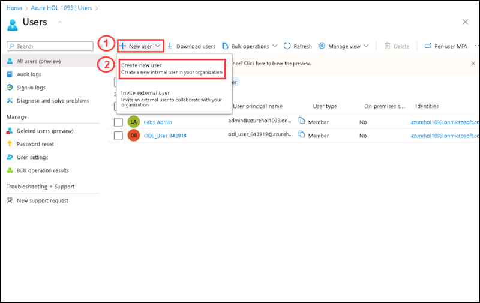
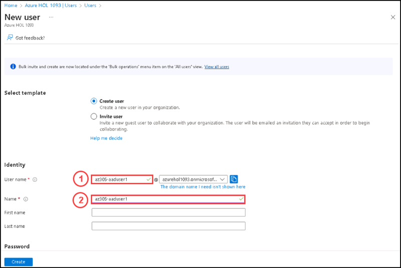
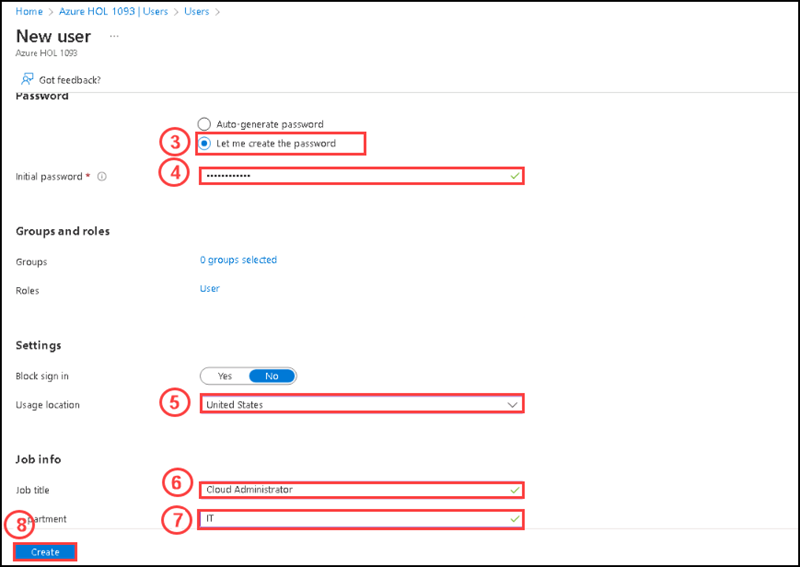
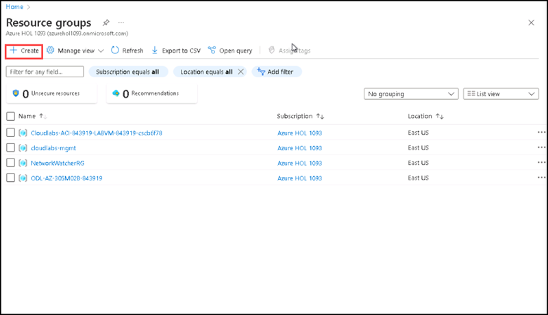
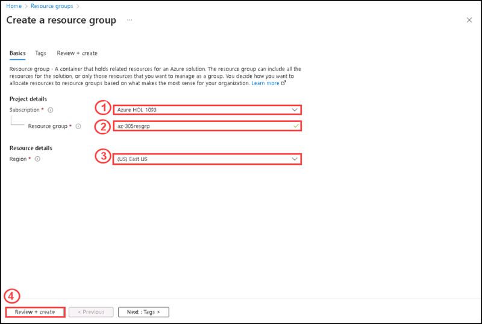
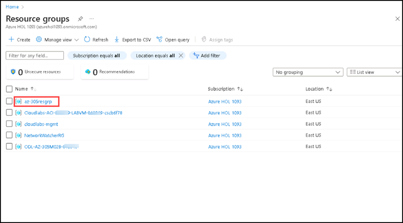
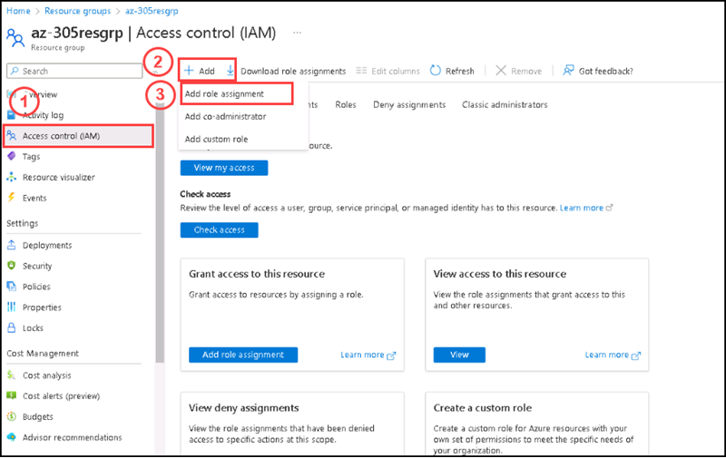
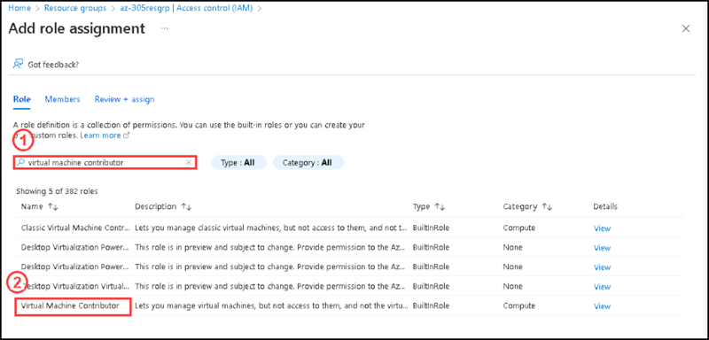
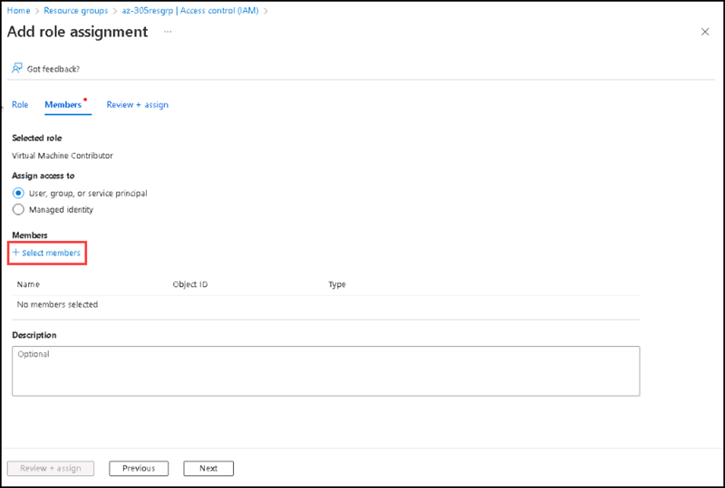
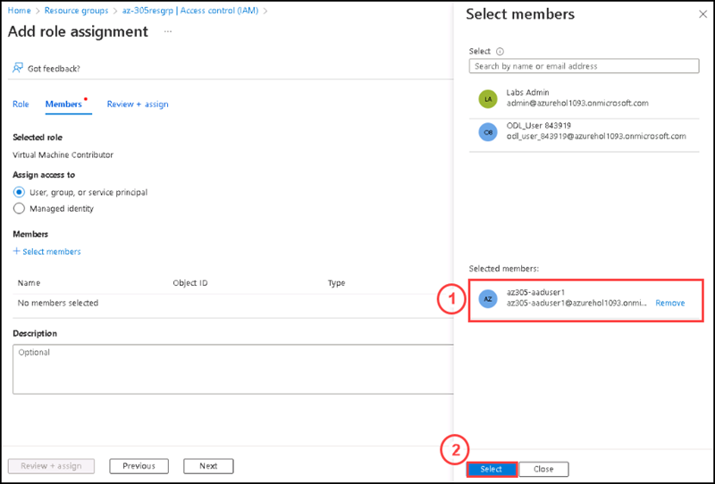

# Instructions

## Exercise 1: Add a user and provide the accessibility of the resources.

In this Exercise, you will grant Azure AD admin role to access your SQL server.

### Task 1: Create a new user.

In this task you are going to create a new user.

#### Pre-requisites for this task

An azure account with global administrative privilege.

#### Steps:

1. On the **Home** page, please select **All services**, then select **Azure active directory**.

2. On the Active directory page, please select **Users**.

3. On the Users page, pleasse select **+ New user**, then select **Create new user**.

4. On the **New user** page, please enter the following details:

    | Setting | Value |
    | --- | --- |
    | User name | **az305-aaduser1** |
    | Name | **az305-aaduser1** |
    | Let me create the password | enabled |
    | Initial password | **Pa$$w0rd123!** |
    | Usage location | **United States** |
    | Job title | **Cloud Administrator** |
    | Department | **IT** |
    
    
  
  
5. On the **Home** page please search resource groups, then select resource groups from the below list.

6. On the **Resource groups** page, please select **+ Create**.

7. On the **Create a resource group** page, please enter the following details, then click **Review + Create**.

    | Setting | Value |
    | --- | --- |
    | Subscription | Default subscription selected |
    | Resource group | **az-305resgrp** |
    | Region | **East US** |

8. Once the review completed, please click on **Create**.

9. Click **Refresh** to refresh the list of resource groups. You can see the newly created resource group there.

10. Please select the resource group named **az-305resgrp**.

11. On the **az-305resgrp** page, please select **Access control (IAM)**, then select **+ Add**, then select **Add role assignment**.

12. On the **Add role assignment** page, please search **Virtual machine contributor** role under **Role** tab. Then select **Virtual machine contributor** role.

13. Click on **Next** from teh bottom.

14. On the **Members** tab, please select **+ Select members**.

15. On the **Select members** side screen, please select the user named **az305-aaduser1*, then select **Select**.

16. Then click on **Review + Assign** from the bottom.

After a few moments, the user is assigned the Virtual Machine Contributor role at the **az-305resgrp** resource group scope.

