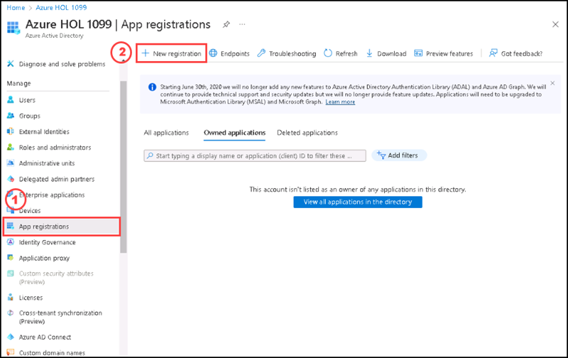
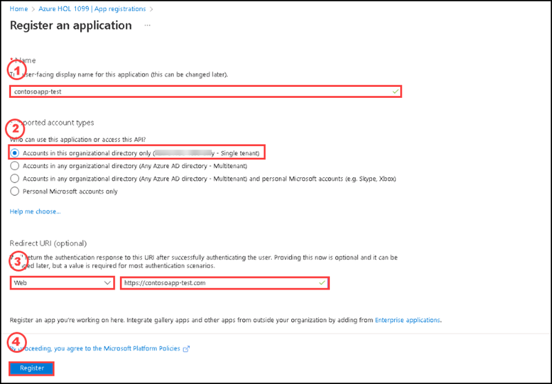
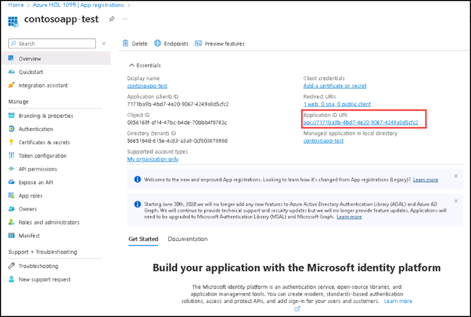
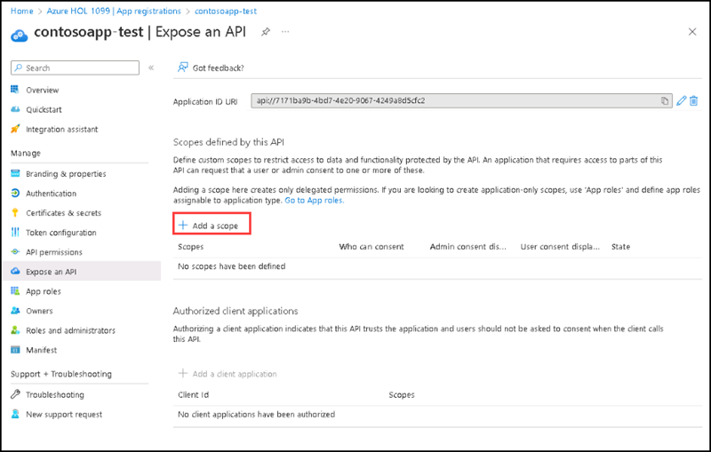
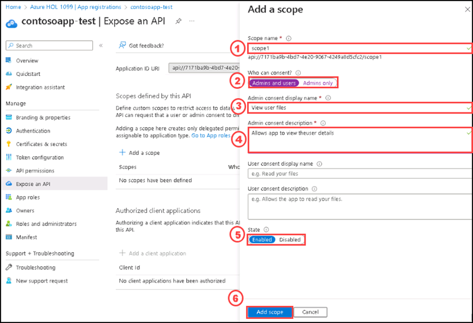
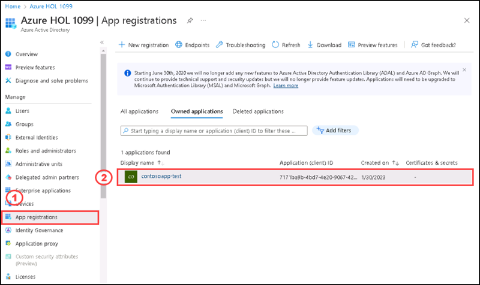
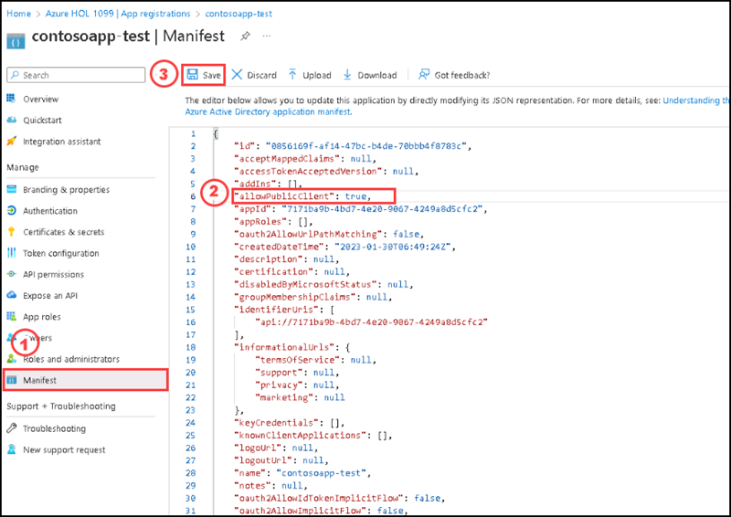
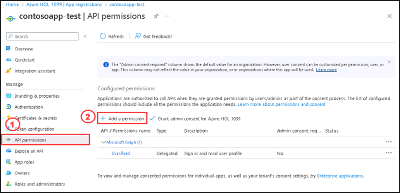
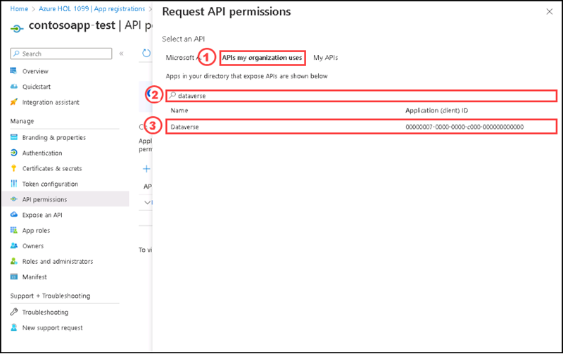
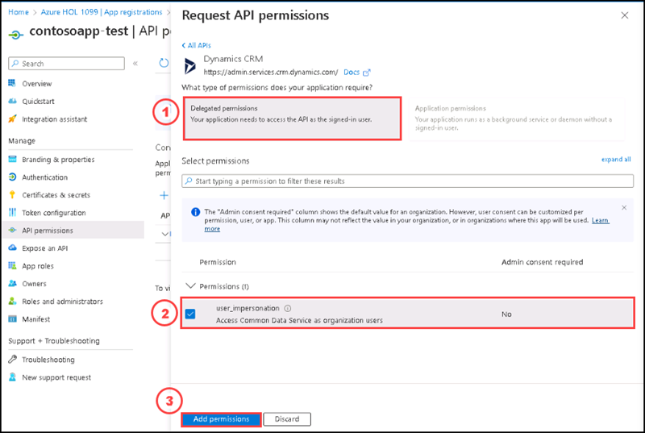

# Instructions

## Exercise 3: Add App Registration for Access via Apps.

In this exercise you are going to register an application with Azure Active Directory, which enables a user with Power Apps user account to connect to their Microsoft Dataverse environment from client applications using OAuth authentication.

In this exercise, you will:

+ Task 1: Create an application registration.

### Estimated Timing: 30 minutes

### Task 1: Create an application registration

App registration is a way to reserve an application in AAD (Azure Active Directory), to integrate an application with Azure, you must register it in the App Registration.

In this task you are going to create an application registration.

#### Pre-requisites for this task

An Azure account.

#### Steps:

1. In the Azure portal, go to **Active Directory**, then select **App registrations**, then select **+ New registration**.

    

2. In the **Register an application** page, enter your application's registration information:

    | Section | Values |
    | ------- | ------ |
    | Name | **contosoapp-test** |
    | Supported account types | Select **Accounts in this organizational directory only** |
    | Redirect URI (optional) | Select **Web** and enter **https://contosoapp-test.com** |
    
3. Select **Register** to create the application. 

    
    
4. On the **Overview** section of **contosoapp-test**, select **Application ID URI**.

    
    
    **Note**:Under the Application ID URI if you don't find the link, click on "Add Application URI" and click on **set** and **save**. 

5. Select **+ Add scope**.

    

6. On the **Add a scope** side screen please enter the following information:
  
    | Section | Values |
    | ------- | ------ |
    | Scope name | **scope1** |
    | Who can consent? | Select **Admins and Users** |
    | Admin consent display name | **View user files** |
    | Admin consent description | **Allows app to view theuser details** |
    | State | **Enabled** |
   
    

7. Once the **Scope** is added, go to **Active Directory**, then select **App registrations**. Select the **contosoapp-test**.

    

9. Select **Manifest** tab, in the manifest editor, set the **allowPublicClient** property to **true** and click on **Save**.

    

10. Select **API permissions** tab, click on **Add a permission**.

    

11. On the **Request API permission**, please select **APIs my organization uses**, then search **dataverse** on the search bar, select **Dataverse**.

    

12. Select **Delegated permissions** and check the **user_impersonation** option and click on **Add permissions**.

    

This completes the registration of your application in Azure Active Directory.

#### Review

In this lab, you have:

- Created an application registration.

