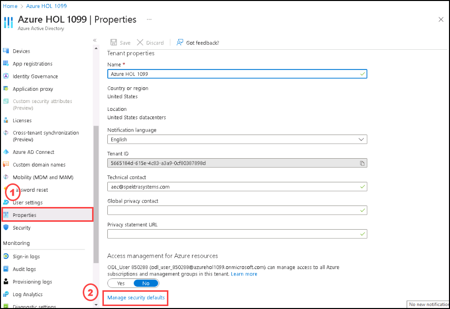

# Instructions

## Exercise 4: Enable Security Default / Disable Security Defaults

In this exercise you are going to Enable or disable the security defaults. Security defaults make it easier to help protect your organization from identity-related attacks with preconfigured security settings:

  - Requiring all users to register for Azure AD Multi-Factor Authentication.
  - Requiring administrators to do multifactor authentication.
  - Requiring users to do multifactor authentication when necessary.
  - Blocking legacy authentication protocols.
  - Protecting privileged activities like access to the Azure portal.

In this lab, you will:

+ Task 1: Enable Security Default

### Task 1: Enable Security Default

In this task you are going to enable the security defaults.

#### Pre-requisites for this task

An Azure account with security administrator, Conditional Access administrator, or global administrator privilege.

#### Steps:

1. Go to Azure Active directory.

2. Select **Properties**, then select **Manage Security defaults**.

    

3. on the **Enable security defaults** side screen Set the Enable security defaults toggle to **Yes** then select **Save**.

    

  
