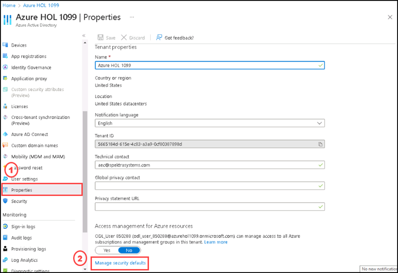
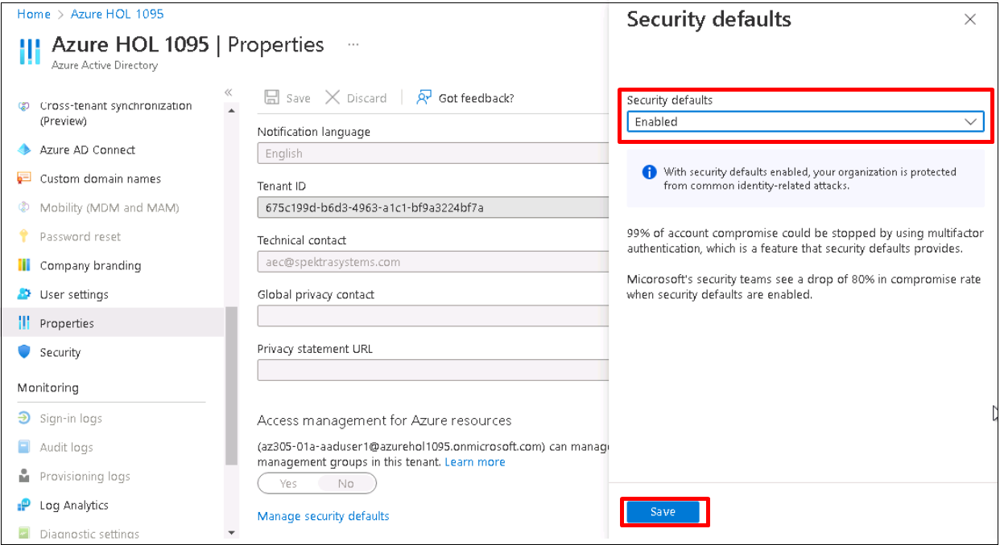
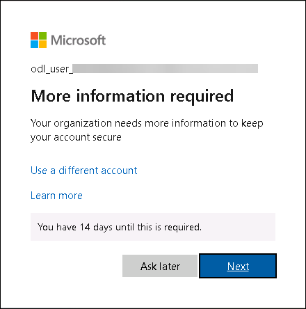
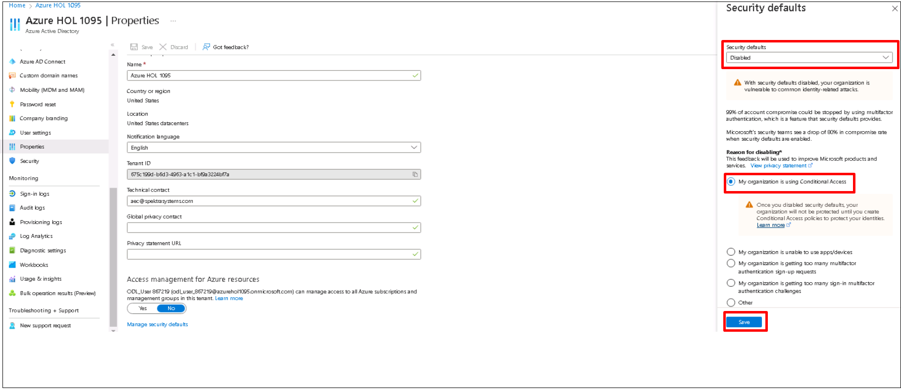
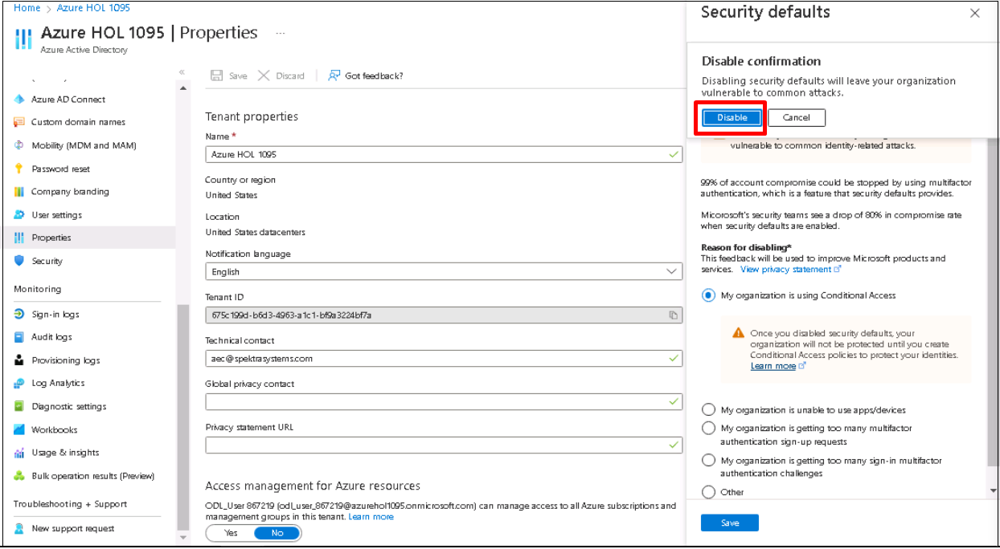
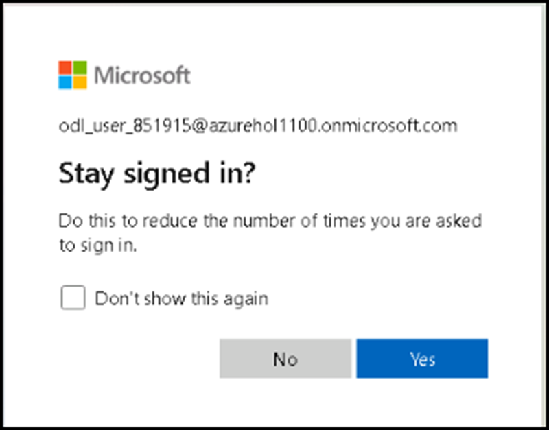

## Exercise 4: Enable Security Default / Disable Security Defaults

In this exercise you are going to Enable or disable the security defaults. Security defaults make it easier to help protect your organization from identity-related attacks with preconfigured security settings. It enforces the following:

  - Requiring all users to register for Azure AD Multi-Factor Authentication.
  - Requiring administrators to do multifactor authentication.
  - Requiring users to do multifactor authentication when necessary.
  - Blocking legacy authentication protocols.
  - Protecting privileged activities like access to the Azure portal.

In this exercise, you will perform the following task:

+ Task 1: Enable Security Default

### Estimated Timing: 25 minutes

### Task 1: Enable Security Default

In this task you are going to enable the security defaults.

#### Pre-requisites for this task

An Azure account with security administrator, Conditional Access administrator, or global administrator privilege.

#### Steps:

1. Go to Azure Active directory.

2. Select **Properties**, then select **Manage Security defaults**.

    

3. On the **Security defaults** side screen, set the Security defaults to **Enabled** from the drop down and then select **Save**.

    

 Now your Security defaults are enabled.
 
4.  Take an **In private window**, enter the link https://www.office.com/?auth=2 and login with the username and password provided in environment details.

You can see there is a message showing **You have 14 days until this is required**. This means all users in your tenant must enroll in multifactor authentication (MFA) via Azure AD Multi-Factor Authentication. Users have 14 days to sign up for Azure AD Multi-Factor Authentication via the Microsoft Authenticator app or any app that supports OATH TOTP. After 14 days, the user is unable to sign in until registration is completed. After enabling security defaults, a user's 14-day period begins after their first successful interactive sign-in.

5. To disable the Security defaults please repeat step 1 and step 2. On the **Security defaults** side screen, set the Security defaults to **Disabled** from the drop down then select any one of the option listed (here selected **My organization is using Conditional Access**), then select **Save**.

6. A pop-up will appear about the confirmation to disable the Security defaults, select **Disable**. 

7. Test again with Office 365 login by taking an **In private window**, enter the link https://www.office.com/?auth=2 and login with the username and password provided in environment details.

You can see there is no message like **skip for now (14 days until this is required)**

## Review

In this exercise, you have completed the following:

- Enabled and disabled the security defaults.

## Proceed to Exercise 5
