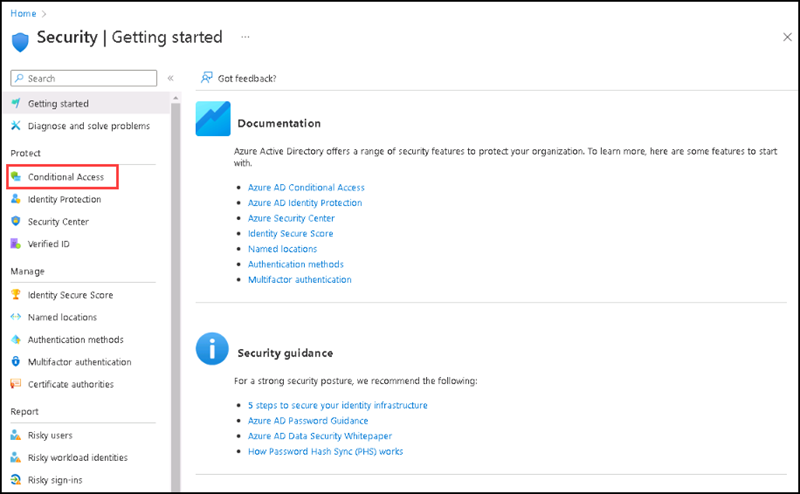
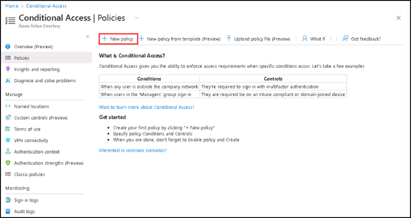
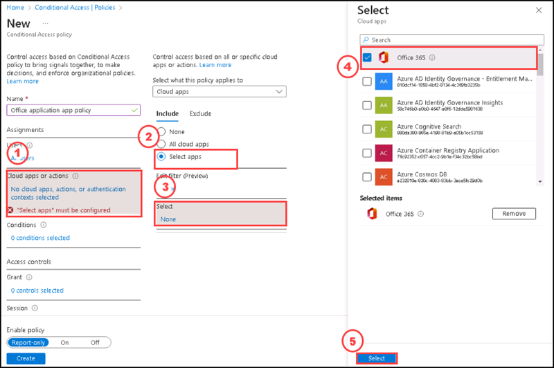
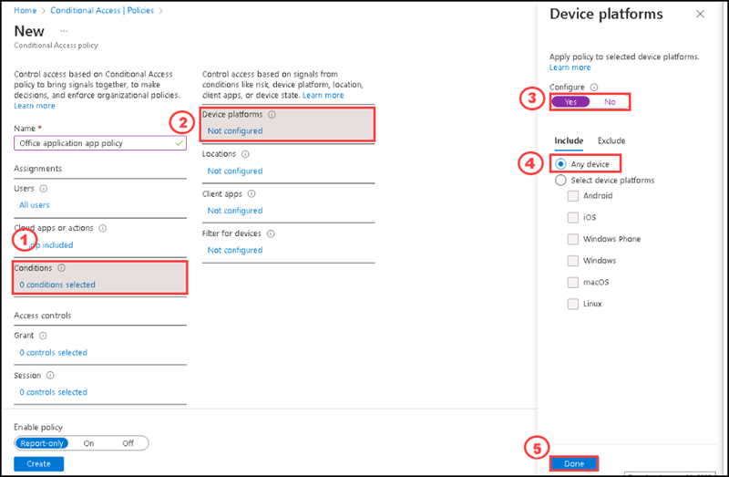
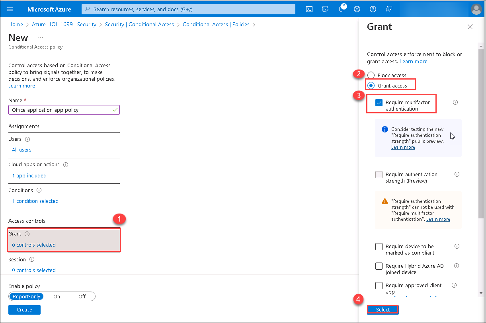
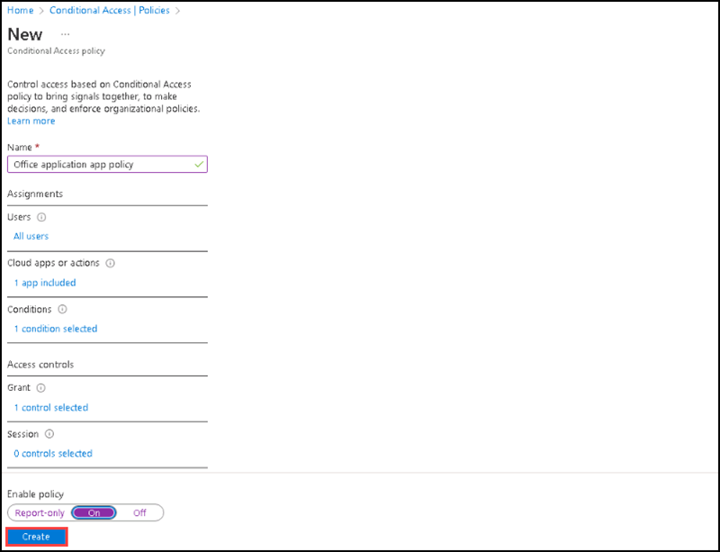
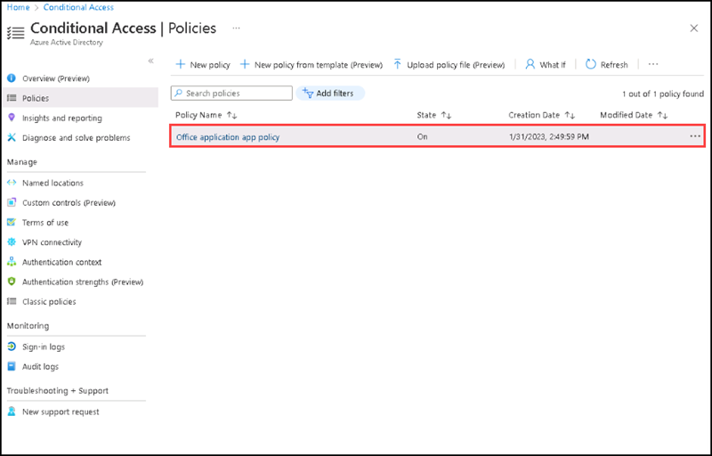

# Instructions

## Exercise 5: Create an Azure Active Directory Conditional Access Policy

In this exercise you are going to configure Azure Active Directory conditional access policy to provide the user to access Office 365 application.

In this exercise, you will:

+ Task 1: Create an Azure Active Directory Conditional Access Policy

### Estimated Timing: 45 minutes

### Task 1: Create an Azure Active Directory Conditional Access Policy

In this task you are going to create a Conditional access policy to access Office 365 application.

#### Pre-requisites for this task

An Azure account with security administrator, Conditional Access administrator, or global administrator privilege.

#### Steps:

1. Browse to **Azure Active Directory** then under **Manage** select **Security** then select **Conditional Access**.

    

2. Select **New Policy**.

    

3. On the **New Conditional access policy**, enter **Office application app policy** for **Name**.

4. For Assignments, Select **0 users selected**, under **Include** tab select **All users**

Then, based on the applications used, you can define the scope of the Conditional Access policy. The controls are similar to those used to select users and groups. Granular inclusion and exclusion of applications is possible. In this case, we've chosen Office 365 as the application to which the Conditional Access policy will be applied.

5. For Cloud apps or actions, select **No cloud apps, actions, or authentication contexts selected** then under **Include** tab select **Selected apps** then under **select** click **None** , then select **Office 365**, then select **Select** from the bottom.   

    

The Conditions section allows IT administrators to further define the Conditional Access policy. You can apply the policy based on the following criteria under the  Conditions section:
    + Device platforms—Apply the policy to selected operating systems
    + Locations—Apply the policy based on the IP range the end user is logging in from
    + Client apps—Software the user is employing to access the cloud app
    + Filter for devices—Whether the device the user is signing in from is Hybrid Azure AD joined or marked as compliant
Here, we apply the policy based on the device platform being used. To do so, please go to next step (step 6)

6. Select **) conditions selected** under **Conditions**, then select **Not configured** under **Device platforms**, then set **Configure** toggle to **Yes**, then under **Include** select **Any device** and then select **Done**.

    

You can configure control over user access enforcement to block or grant access after applying the conditions you want to set for the Conditional Access policy. Many interesting settings can be applied to the Grant access option. These are some examples:
    + Require multi-factor authentication
    + Require device to be marked as compliant
    + Require Hybrid Azure AD joined device
    + Require approved client app
    + Require app protection policy
We are setting the Grant access option and requiring multi-factor authentication for all users accessing Office 365 with any device type. To do so, please go to next step (step 7)

7. Under **Grant** Select **0 controls selected** , then on the **Grant** side screen, please select **Grant Access**, then select **Require multifactor authentication**, then select **Select**.

    

The Session configuration is the final section. There, you can limit user access to specific cloud applications by using session controls. There are the following options:
    + Use app enforced restrictions
    + Use Conditional Access App Control
    + Sign-in frequency
    + Persistence browser session
    + Customize continuous access evaluation
    + Disable resilience defaults

Here we are not configuring session.

8. Select **On** under **Enable policy**

>**Note**: You will not be able to turn your Conditional Access policy to On if you have not turned off the Security defaults setting in Azure Active Directory (Azure AD).

9. Select **Create**.

    

Now, you have created the conditional access policy named **Office application app policy**. You can see it on Conditional access policies page.

    

10. You can test the conditional access policy by taking an in private window of your browser and enter http://portal.office.com then login with the credentials given in the Environment details.

11. It will ask for configuring **Microsoft Authenticator**

#### Review

In this lab, you have:

- Created and configured Conditional access policy. 

