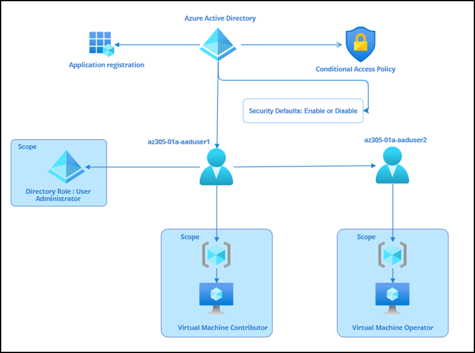

# Lab 02 - Implement Authentication and Authorization by using Azure Active Directory and RBAC policies

# Student lab manual

## Lab scenario

In order to improve management of Azure users, permissions and roles in Contoso organization, you have been tasked with implementing the following functionality:

- Add a user and provide the accessibility of the resources. You will create a user and assigning permission to the user to access virtual machines, for that you are going to apply Azure RBAC policies. Cloud resource access management is a critical function for any organization that uses the cloud. Azure Role-Based Access Control (Azure RBAC) allows you to manage who has access to Azure resources, what those resources can do, and what areas they can access.

- Assign Active Directory Role & Custom RBAC. You will assign User Administrator role to the newly created user and will test it. This role can manage all aspects of users and groups, including resetting passwords for limited admins. Also you will create a custom RBAC role for Virtual machine operator. This role helps the user to access the virtual machine and check the availabilityof it.

- Add App Registration. You are going to register a client application in order to access Power apps to connect to their Dataverse environment.

- Enable Security Default / Disable Security Defaults. Security defaults in Azure Active Directory (Azure AD) make it easier to be secure and help protect your organization. Security defaults contain preconfigured security settings for common attacks such as password spray, replay, and phishing. You are going to enable the security defaults and see the changes happened on the logon screen of the application.

- Create an Azure Active Directory Conditional Access Policy. Conditional access is the tool used by Azure AD to bring together signals, make decisions, and enforce organizational policies. 

## Objectives

In this lab, you will have:

+ Exercise 1: Add a user and provide the accessibility of the resources.
+ Exercise 2: Assign Active Directory Role & Custom RBAC.
+ Exercise 3: Add App Registration for Access via Apps.
+ Exercise 4: Enable Security Default / Disable Security Defaults
+ Exercise 5: Create an Azure Active Directory Conditional Access Policy

## Estimated timing: 160 minutes
## Solution Architecture

  
