# Lab 03 - Configure and deploy a non-relational data storage solution 
# Student lab manual

## Lab scenario

In order to improve management of Azure resources, you have been tasked with implementing the following functionality:

- Configure an Azure Storage account. An Azure storage account contains all of your Azure Storage data objects: blobs, files, queues, and tables. The storage account provides a unique namespace for your Azure Storage data that is accessible from anywhere in the world over HTTP or HTTPS.

- Configure an Azure blob storage. Azure Blob Storage allows you to store large amounts of unstructured object data. You can use Blob Storage to gather or expose media, content, or application data to users.

- Upload some files to the blob container and apply the lifecycle policy. Azure Storage lifecycle management offers a rule-based policy that you can use to transition blob data to the appropriate access tiers or to expire data at the end of the data lifecycle. A lifecycle policy acts on a base blob, and optionally on the blob's versions or snapshots.

- Configure a static website to aceess the blob container. You can serve static content (HTML, CSS, JavaScript, and image files) directly from a storage container. Azure Storage static website hosting is a great option in cases where you don't require a web server to render content. 

- Secure blob storage and enable backup/soft delete. Blob soft delete protects an individual blob, snapshot, or version from accidental deletes or overwrites by maintaining the deleted data in the system for a specified period of time. During the retention period, you can restore a soft-deleted object to its state at the time it was deleted. After the retention period has expired, the object is permanently deleted.

- Configure Azure files. Azure Files offers fully managed file shares in the cloud that are accessible via the industry standard Server Message Block (SMB) protocol, Network File System (NFS) protocol, and Azure Files REST API. Azure file shares can be mounted concurrently by cloud or on-premises deployments. SMB Azure file shares are accessible from Windows, Linux, and macOS clients. 

## Objectives

In this lab, you will:

+ Task 1: Create Azure Storage account
+ Task 2: Configure Azure Blob storage
+ Task 3: Configure a static website to access the blob container and upload files to the blob container
+ Task 4: Upload files to the blob container and apply the lifecycle policy
+ Task 5: Secure blob storage and enable backup/soft delete
+ Task 6: Configure Azure files

## Estimated timing: 30 minutes
## Architecture diagram

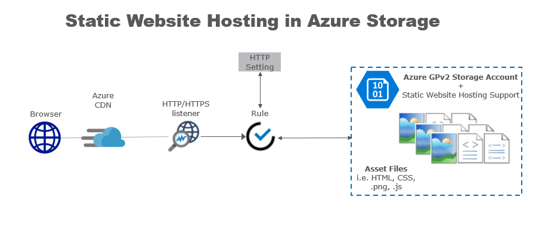

## Instructions

### Exercise 1

#### Task 1: Create Azure Storage account

In this task, you will create an azure storage account.

#### Pre-requisites for this task

An Azure account

#### Steps

1. Double click on the Edge browser icon from the desktop.

2. Enter the login credentials. For credentials, please see the environment details tab on the lab guide.

3. Once the portal opened completely, click on all services on the left portal menu and select storage accounts

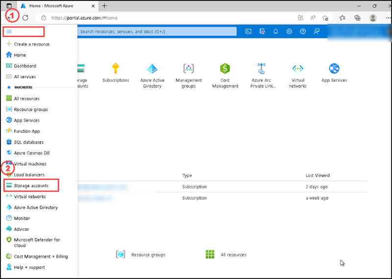

4. On the storage accounts page please select create, 

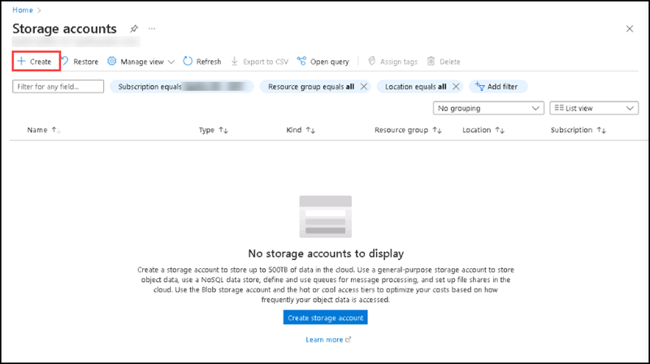

5. Create a Storage account page will open. You can see the options for your new storage account are organized into tabs in the Create a storage account page.

6. Basic tab shows a standard configuration of the basic properties for a new storage account. On the basic tab, select the subscription, if the default subscription is not using, then create a new resource group.

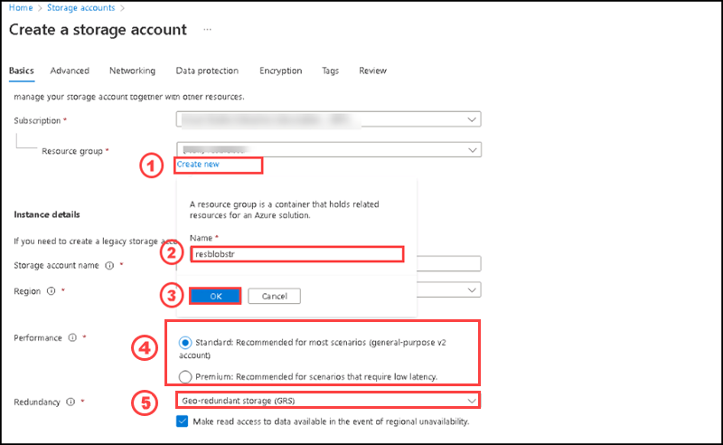

7. For Storage account name option please provide any name with small letter alphabets and numbers.

8. Select the region option as East US

9. On the performance options: Select standard

10. Select Geo-Redundant storage on the redundancy option

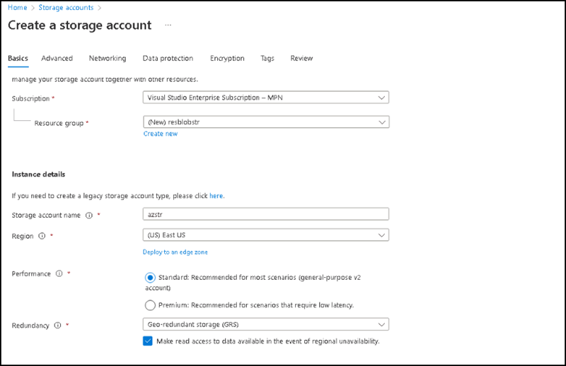

11. Go to Advanced tab, review the options and the default values of it. Please dont change any values.

12. Go to Networking tab, and review the options and the default values of it.

13. Go to Data Protection tab, and review the options and the default values of it.

14. Go to Encryption tab, and review the options and the values.

15. After reviewing all tabs, select the review button from the bottom left of the page.

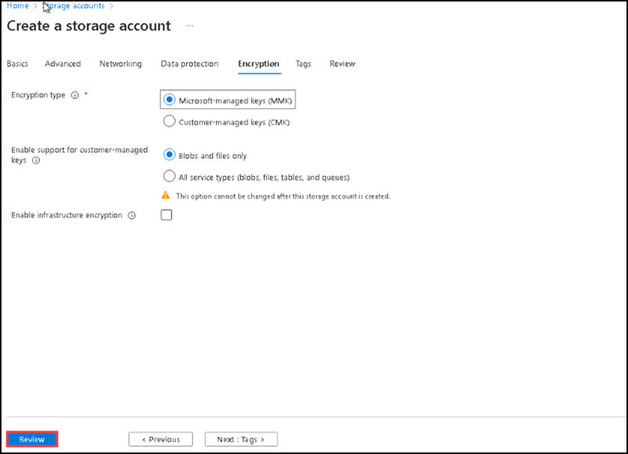

16. After completing the validation, please click on Create button from the bottom left of the page.

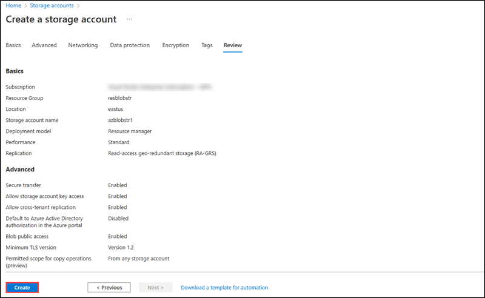

17. After completing the deployment, Please click on **Go to resource**.

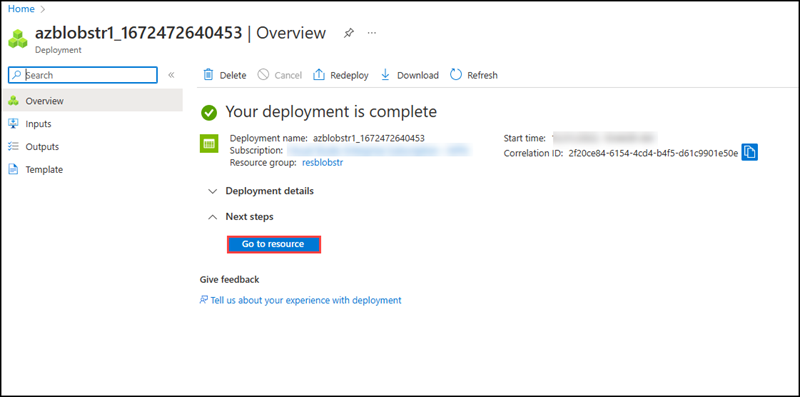

18. You can see the newly created Storage account, please go through the overview section.

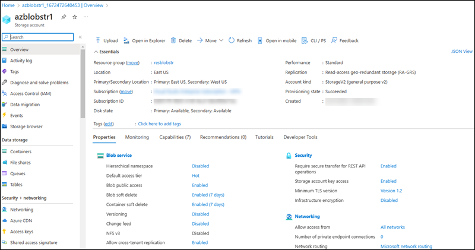

#### Task 2: Create a blob container

In this task, you will learn how to use the Azure portal to create a blob container in a storage account.

#### Pre-requisites for this task

An Azure account, a storage account (Complete Task 1)

#### Steps

1. Navigate to your new storage account in the Azure portal.

2. In the left menu for the storage account, scroll to the Data storage section, then select Containers.

3. Select the + Container button.

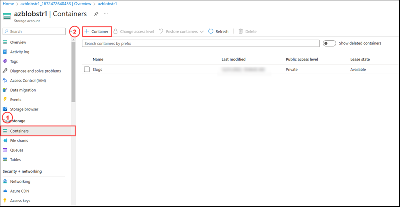

4. Type a name for your new container. The container name must be lowercase, must start with a letter or number, and can include only letters, numbers, and the dash (-) character. For more information about container and blob names, see Naming and referencing containers, blobs, and metadata.

5. Set the level of public access to the container. The default level is Private (no anonymous access).

6. Select Create to create the container.

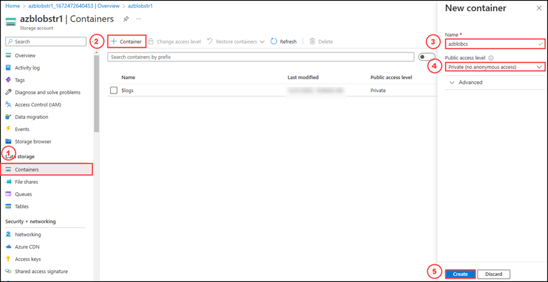

7. After completing the deployment, you can see the newly created blob container on the container's section, If its not listed please refresh the page.

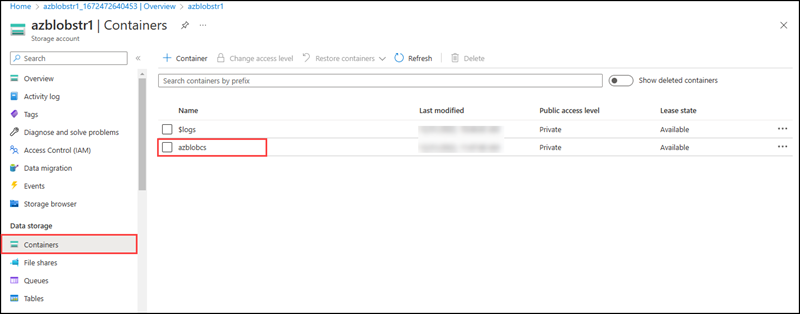

#### Task 3: Upload a block blob

In this task, you will learn how to use the Azure portal to upload a block blob in your newly created blob container in a storage account.

#### Pre-requisites for this task

An Azure account, a storage account (Complete Task 1), an azure blob container (Complete Task 1 & Task 2). To upload a block blob to your new container in the Azure portal, follow these steps:

#### Steps

1. In the Azure portal, navigate to the container you created in the previous section.

2. Select the container to show a list of blobs it contains. This container is new, so it won't yet contain any blobs.

3. Select the Upload button to open the upload blade and browse your local file system to find a file to upload as a block blob. You can optionally expand the Advanced section to configure other settings for the upload operation.

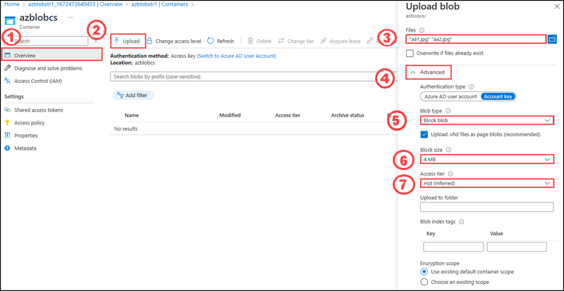

After entering all the details, please select the upload button to upload the blob.

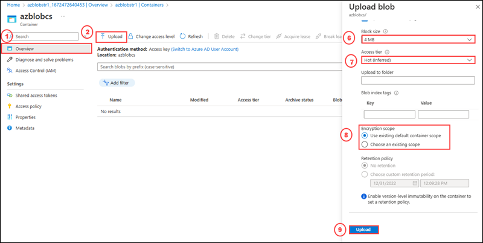
