# Lab 03 - Configure and deploy a non-relational data storage solution 
# Student lab manual

## Lab scenario

In order to improve management of Azure resources, you have been tasked with implementing the following functionality:

- Configure an Azure Storage account. An Azure storage account contains all of your Azure Storage data objects: blobs, files, queues, and tables. The storage account provides a unique namespace for your Azure Storage data that is accessible from anywhere in the world over HTTP or HTTPS.

- Configure an Azure blob storage. Azure Blob Storage allows you to store large amounts of unstructured object data. You can use Blob Storage to gather or expose media, content, or application data to users.

- Upload some files to the blob container and apply the lifecycle policy. Azure Storage lifecycle management offers a rule-based policy that you can use to transition blob data to the appropriate access tiers or to expire data at the end of the data lifecycle. A lifecycle policy acts on a base blob, and optionally on the blob's versions or snapshots.

- Configure a static website to aceess the blob container. You can serve static content (HTML, CSS, JavaScript, and image files) directly from a storage container. Azure Storage static website hosting is a great option in cases where you don't require a web server to render content. 

- Secure blob storage and enable backup/soft delete. To secure your blob storage you can use access keys, shared access signatures. Blob soft delete protects an individual blob, snapshot, or version from accidental deletes or overwrites by maintaining the deleted data in the system for a specified period of time. During the retention period, you can restore a soft-deleted object to its state at the time it was deleted. After the retention period has expired, the object is permanently deleted.

- Configure Azure files. Azure Files offers fully managed file shares in the cloud that are accessible via the industry standard Server Message Block (SMB) protocol, Network File System (NFS) protocol, and Azure Files REST API. Azure file shares can be mounted concurrently by cloud or on-premises deployments. SMB Azure file shares are accessible from Windows, Linux, and macOS clients. 

## Objectives

In this lab, you will:

+ Task 1: Create Azure Storage account
+ Task 2: Configure Azure Blob storage
+ Task 3: Configure a static website to access the blob container and upload files to the blob container
+ Task 4: Upload files to the blob container and apply the lifecycle policy
+ Task 5: Secure blob storage and enable backup/soft delete
+ Task 6: Configure Azure files

## Estimated timing: 30 minutes
## Architecture diagram

## Instructions

## Exercise 1

### Task 1: Create an Azure Storage account

In this task, you will learn how to use Azur portal to create an azure storage account.

#### Pre-requisites for this task

An Azure account

#### Steps

1. Double click on the Edge browser icon from the desktop.

2. Enter the login credentials. For credentials, please see the environment details tab on the lab guide.

3. Once the portal opened completely, click on all services on the left portal menu and select storage accounts

4. On the storage accounts page please select create, 

5. Create a Storage account page will open. You can see the options for your new storage account are organized into tabs in the Create a storage account page.

6. Basic tab shows a standard configuration of the basic properties for a new storage account. On the basic tab, select the subscription, if the default subscription is not using, then create a new resource group.

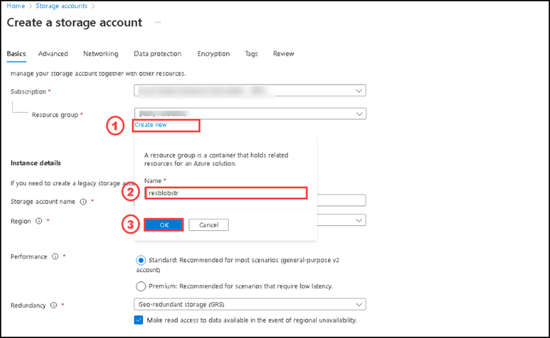

7. For Storage account name option please provide any name with small letter alphabets and numbers.

8. Select the region option as East US

9. On the performance options: Select standard

10. Select Geo-Redundant storage on the redundancy option

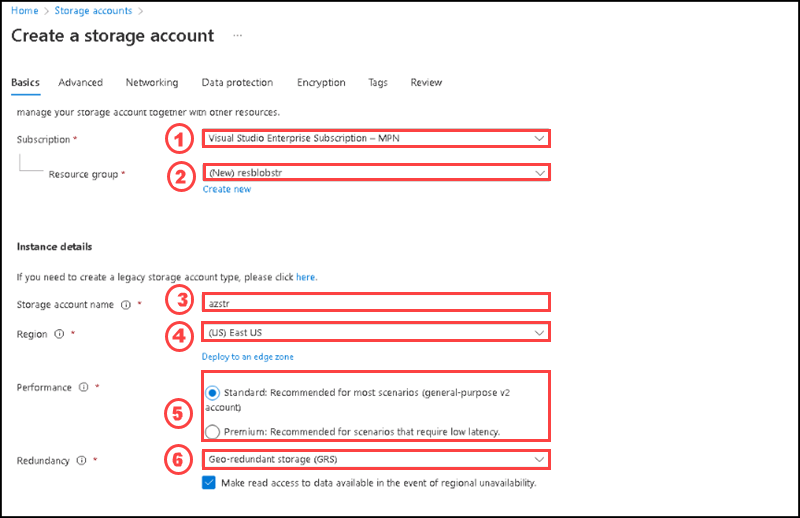

11. Go to Advanced tab, review the options and the default values of it. Please dont change any values.

12. Go to Networking tab, and review the options and the default values of it.

13. Go to Data Protection tab, and review the options and the default values of it.

14. Go to Encryption tab, and review the options and the values.

15. After reviewing all tabs, select the review button from the bottom left of the page.

16. After completing the validation, please click on Create button from the bottom left of the page.

17. After completing the deployment, Please click on **Go to resource**.

18. You can see the newly created Storage account, please go through the overview section.

### Task 2: Create a blob container

In this task, you will learn how to use the Azure portal to create a blob container in a storage account.

#### Pre-requisites for this task

An Azure account, a storage account (Complete Task 1)

#### Steps

1. Navigate to your new storage account in the Azure portal.

2. In the left menu for the storage account, scroll to the Data storage section, then select Containers.

3. Select the + Container button.

4. Type a name for your new container. The container name must be lowercase, must start with a letter or number, and can include only letters, numbers, and the dash (-) character. For more information about container and blob names, see Naming and referencing containers, blobs, and metadata.

5. Set the level of public access to the container. The default level is Private (no anonymous access).

6. Select Create to create the container.

7. After completing the deployment, you can see the newly created blob container on the container's section, If its not listed please refresh the page.

### Task 3: Upload a block blob

In this task, you will learn how to use the Azure portal to upload a block blob in your newly created blob container in a storage account.

#### Pre-requisites for this task

An Azure account, a storage account (Complete Task 1), an azure blob container (Complete Task 1 & Task 2). To upload a block blob to your new container in the Azure portal, follow these steps:

#### Steps

1. In the Azure portal, navigate to the container you created in the previous task.

2. Select the container to show a list of blobs it contains. This container is new, so it won't yet contain any blobs.

3. Select the Upload button to open the upload blade and browse your local file system to find a file to upload as a block blob ( you can upload multiple files). You can optionally expand the Advanced section to configure other settings for the upload operation. 

4. After entering all the details, please select the upload button to upload the blob.

5. After completing the uploading process of block blobs, you can see the blobs listed in the container. If its not seeing, Please select the overview tab of the container and select refresh.

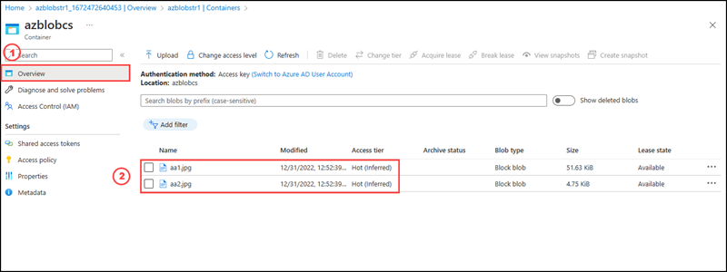

### Task 4: Configure a static website to access the blob container

In this task, you will learn how to use the Azure portal to configure a static website to access the blob container.

#### Pre-requisites for this task

An Azure account, a storage account (Complete Task 1), an azure blob container (Complete Task 1 & Task 2). To configure a static website to access the blob container, follow these steps:

#### Steps

1. Launch Visual Studio Code by double click on Vscode icon from desktop.

2. On the toolbar, click Extensions. Search for Azure Storage, and select the Azure Storage extension from the list. Then click the Install button to install the extension.

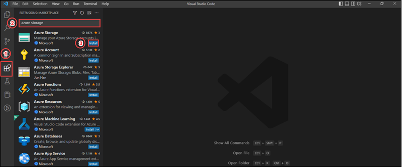

3. Open the Azure portal in your web browser.

4. Locate your storage account and display the account overview.

5. Select Static website to display the configuration page for static websites under data management section.

6. Select Enabled to enable static website hosting for the storage account.

7. In the Index document name field, specify a default index page of index.html. The default index page is displayed when a user navigates to the root of your static website.

8. In the Error document path field, specify a default error page of 404.html. The default error page is displayed when a user attempts to navigate to a page that does not exist in your static website. Click Save.

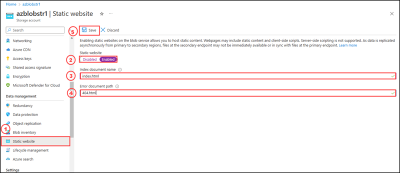

9. The Azure portal now displays your static website endpoints (primary and secondary). Azure Storage automatically creates a container named $web. The $web container will contain the files for your static website.

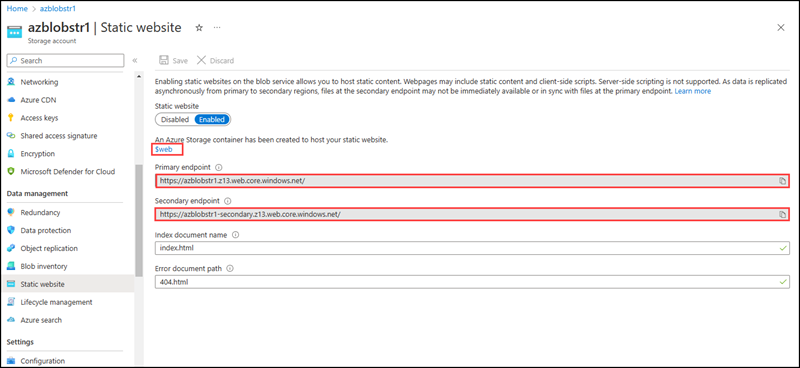

Next, create a Hello World web page with Visual Studio Code and deploy it to the static website hosted in your Azure Storage account.

10. Create an empty folder named mywebsite on your local file system.

11. Launch Visual Studio Code, and open the folder that you just created from the Explorer panel, by selecting open folder option.

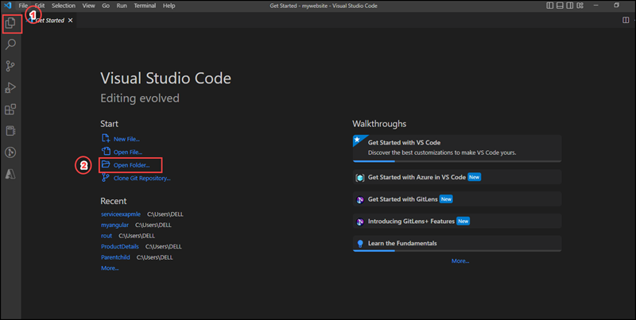

12. Select Yes, I trust the authors Trust folder and enable all features.

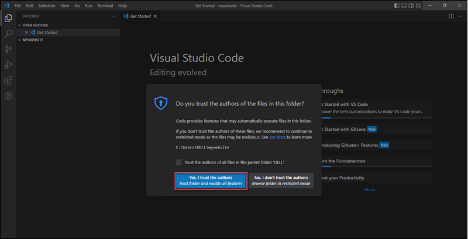

13. Create the default index file in the mywebsite folder, by selecting Add file option and provide the name index.html in the name box.

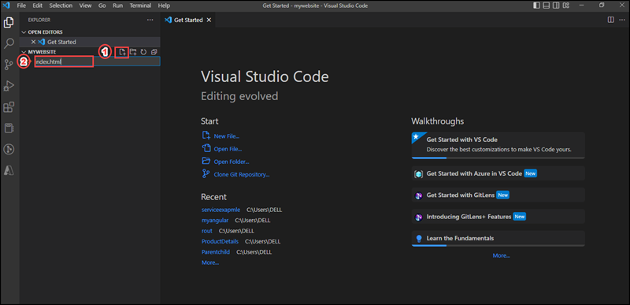

14. Open index.html in the editor, paste the following text into the file, and save it:

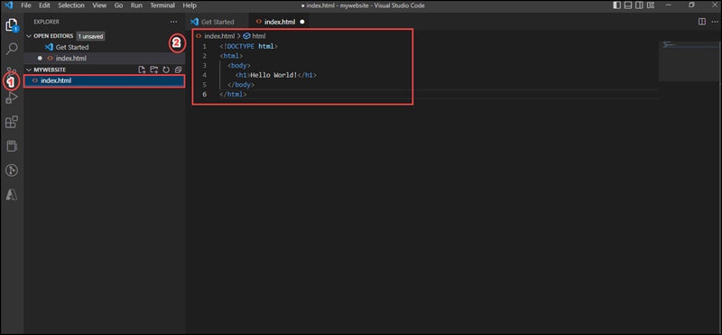

15. Create the default error file and name it 404.html.

16. Open 404.html in the editor, paste the following text into the file, and save it:

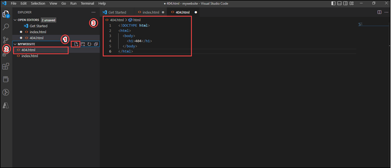

17. Click on the Azure logo where you will be asked to log in. Once you have authenticated to Azure with the extension, right-click on the $web storage container under  —>  –> Blob Containers as you can see below. You’ll then see an option to Deploy to Static Website. Select that option.

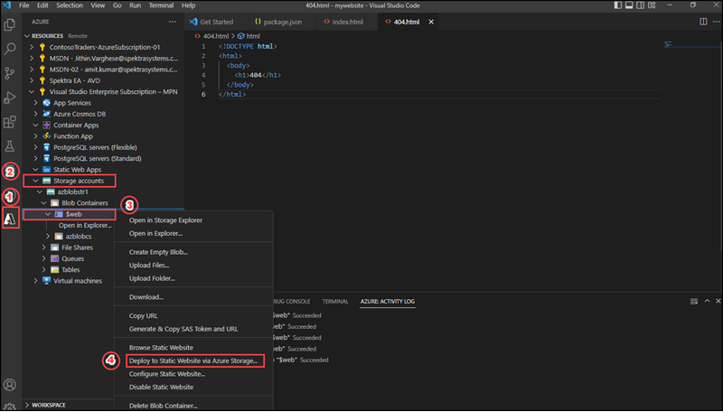

18. Choose the folder containing the two files mentioned earlier. 

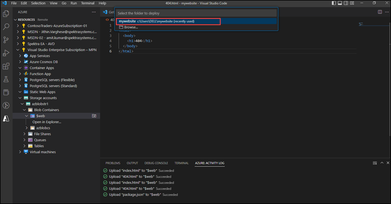

19. Visual Studio Code will then deploy those files as your static page and return a success message to you. Please select  Browse to website button.Or Once the files have been uploaded, navigate to the primary endpoint you received earlier.

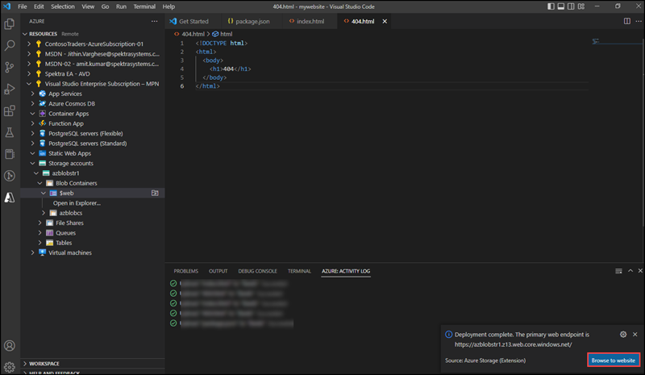

20. This is the index.html page you uploaded through Visual studio code. Now you can see it in as Azure hosted static website.

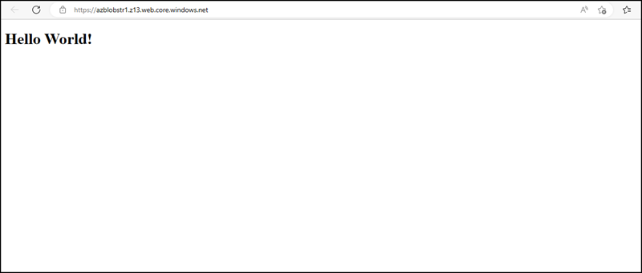

### Task 5: Apply the lifecycle Management Policy

In this task, you will learn how to use the Azure portal to Apply the lifecycle management policy of a storage account. Azure Storage lifecycle management offers a rule-based policy that you can use to transition blob data to the appropriate access tiers or to expire data at the end of the data lifecycle. A lifecycle policy acts on a base blob, and optionally on the blob's versions or snapshots. For example, if you have defined an action to move a blob from the hot tier to the cool tier if it has not been modified for 30 days, then the lifecycle management policy will move the blob 30 days after the last write operation to that blob.

#### Pre-requisites for this task

An Azure account, a storage account (Complete Task 1), an azure blob container (Complete Task 1 & Task 2). Before doing the steps to configure Lifecycle management policy, please go to the storage account created on the previous task and select configuration under settings to view the configuration of your storage account, which you are going to apply Lifecycle management policy.

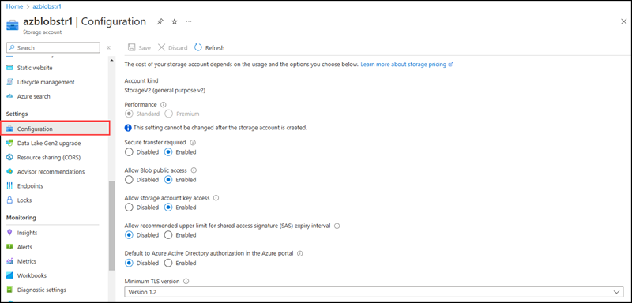

#### Steps

1. Go to Lifecycle management under Data management of the storage account created on the previous task. Please select Add rule.

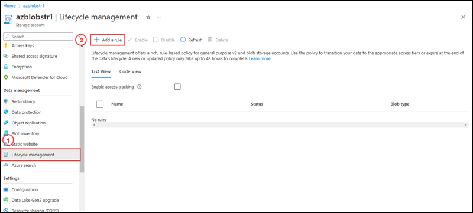

2. On the Add a rule page please enter the rule name as Testrule and keep the default settings as it is and select Next

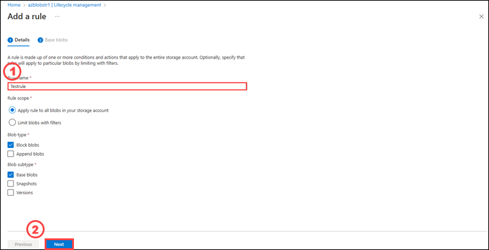

3. On the Add a rule page, under the Base blob tab, enter the following settings as per the image below: and please select add button.

4. You have now created your lifecycle management policy for storage blobs, after 30 days, your storage blobs will be moved to the cool access tier.

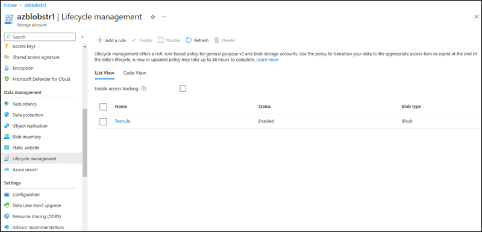

If you are not seeing newly created lifecycle management policy please select the lifecycle management and select refresh.

### Task 6: Secure blob storage and enable backup and soft delete

In this task, you will learn how to use the Azure portal to secure your blob storage and enable backup and soft delete.

#### Pre-requisites for this task

An Azure account, a storage account (Complete Task 1), an azure blob container (Complete Task 1 & Task 2 & Task3). Securing access to your Blob storage is a critical step for any Azure administrator or engineer. The following steps outline available security features to help you configure your Blob storage to be secured.

#### Steps

By default, storage accounts encrypt the data using Microsoft-managed keys. You can continue using these Microsoft-managed keys for data encryption, or you can manage encryption using your keys.

If you choose to use your own encryption keys, you have two options, and you can use either type of key management or both.

Use a customer-managed key. These keys must be stored in an Azure Key Vault.

Use a customer-provided key. These keys are used for Blob storage operations. A client who makes read or write requests against Blob storage can use an encryption key on the request. This method provides granular control over how blob data is encrypted and decrypted.

To configure a storage account to use a customer-managed key stored in a Key Vault:

1. If creating a new Key Vault, place the Key Vault in the same region as the storage account and enable purge protection. If you have an existing key vault, go to the Key Vault’s Settings, then choose Properties to enable purge protection.

    Create a Key Vault if you don’t have an existing one available. Check out the following quickstart on creating a key vault using the Azure portal.

    1. Open Azure portal, in the Search box, enter Key Vault.
    
    2. From the results list, choose Key Vault.
    
    
    
    3. On the Key Vault section, choose Create.

    
    
    4. On the Create key vault section provide the following information:
        
       **Name: A unique name is required. For this quickstart, we use contoso-vault3.**
        
       **Subscription: Choose a subscription.**
        
       **Under Resource Group, select the previously created resource group.**
        
       **In the Location pull-down menu, choose a location (East US where your storage account located).**
        
       **Choose to enable purge protection.**
        
       **Leave the other options to their defaults.**
        
       
            
    5. After providing the information above, select Review + Create.

    
    
    6. After the validation completed, please select Create.

    7. Once the deployment complete, please select Go to resource button.
   
   Take note of the two properties listed below:

   **Vault Name: In the example, this is contoso-vault3. You will use this name for other steps.**
      
   **Vault URI: In the example, this is https://contoso-vault3.vault.azure.net/. Applications that use your vault through its REST API must use this URI.**
      
    At this point, your Azure account is the only one authorized to perform operations on this new vault

3. In the storage account, navigate to Security + Networking, then choose Encryption.

4. For Encryption type, select the radio button for Customer-managed keys.

5. For the Key selection, ensure the Select from key vault value is selected, then choose the link for Select a key vault and key.

6. In the Select a key page, select the subscription, key store type, and key vault to store the customer-managed encryption key. If you have an existing key stored in the key vault, select the key from the dropdown. Otherwise, select Create a new key

7. On the Create a Key page, select Generate for the options dropdown list, enter name as contosostr345-key, keep the default settings as it is and please select Create button.

8. In the Select a key window, ensure the newly created key is selected in the Key dropdown, then click Select.

9. Back in the Encryption settings, click Save.

#### To secure your blob storage you can configure Shared Access Signatures (SAS)

Shared access signatures work through a signed URI that includes a token and a set of query parameters. The token determines which resources the client can access. To create a shared access signature:

#### Steps to configure shared access signatures as follows:

1. Navigate to the storage account in the Azure portal.

2. In the storage account, navigate to Security + networking, then choose Shared access signature.

3. In the Shared access signature pane, choose the storage account services and options the shared access signature should have. This example gives Read and List permissions to Blobs in a container. Always use the principle of least privilege when assigning permissions to a SAS. Please select the options as per the below image

4. Choose a start and end time for how long the SAS should be valid.

5. If needed, you can also limit what IP addresses can send requests to the storage account using the SAS.

6. As a best practice, only allow the HTTPS protocol when using the SAS URI.

7. Finally, choose which access key to sign the shared access signature. If you revoke the access key, any shared access signature created from the access key is invalidated.

8. Once you configured all the options, then select Generate SAS and connection string.

9. The wizard produces three options for using the SAS: a connection string for applications, a SAS token, and a Blob service SAS URL.

By providing the SAS, you can control what resources they have access to, what permissions they have on those resources, and how long they have access to the resources.

#### Enable backup and Soft delete

By enabling Soft delete you can protect your data from accidental deletion, from the following steps you can easily configure soft delete for your blob storage.

#### Steps

1. In the Azure portal, navigate to your storage account which you created on previous task.

2. Locate the Data Protection option under Data management.

3. In the Recovery section, select Turn on soft delete for blobs.

4. Specify a retention period between 1 and 365 days. Microsoft recommends a minimum retention period of seven days. In this example provide 7 days.
Save your changes.

#### Configure Backup for Azure Blob Storage

Azure Blob backup is configured at the storage account level. As a result, operational backup protects all blobs in the storage account.

Using the Backup Center, you can configure backup for multiple storage accounts. You can also configure backup for a storage account using the Data Protection properties of the storage account. This section covers both methods for configuring backup.

Before Configuring backup, the storage account should have a Backup vault and Storage account backup contributor role.

#### To configure the Backup vault please follow below steps:

A backup vault is a management entity that stores recovery points that have been created over time and provides an interface for performing backup operations. These include on-demand backups, restores, and the creation of backup policies.

1. Type Backup vaults in the search box.

2. Under Services, select Backup vaults.

3. On the Backup vaults page, select Add.

4. Make sure the correct subscription is selected under Project details on the Basics tab, then select the resource group which you have created on the previous task.

5. Under Instance details, type myVault for the Backup vault name and choose your region of choice, in this case East US for your Region.

6. Now choose your Storage redundancy. Storage redundancy cannot be changed after protecting items to the vault. We recommend that if you're using Azure as a primary backup storage endpoint, continue to use the default Globally-redundant setting.

**Note : If you don't use Azure as a primary backup storage endpoint, choose Locally redundant, which reduces the Azure storage costs. Learn more about geo and local redundancy.**

7. Please review the options and the values, and select Create button to create the backup vault.

8. Please select Go to resource, to view the newly created backup vault.

9. You can see the backup vault now.

After creating the backup vault, you need to configure the storage account backup conrtibutor role.

#### To configure the Storage account backup contributor role please follow below steps:

1. In the storage account that needs to be protected, navigate to the Access Control (IAM) tab on the left navigation pane.

2. Select Add role assignments to assign the required role.

3. In the Add role assignment pane:

4. Under Role, choose Storage Account Backup Contributor.

5. Under Members tab, on the Assign access to option, choose User, group or service principal and select Next button.

6. On the Members option, please select + Select members. Under Select members side screen, Please type name of the backup vault which you created on the previous task on the search box and select the back up vault by clicking on it.

7. After selecting the backup vault, please select Select option.

8. Please select Next button, then select Review + Assign button.

9. After completing the assigning process, please select role assignments tab and you can see the newly configured storage account backup contributor role

#### Steps to configure Backup

#### Using Backup Center

To start configuring backup:

1. Search for Backup Center in the search bar.

2. Navigate to Overview -> +Backup.

3. From the DataSource type dropdown list Select Azure Blobs (Azure Storage) as the DataSource type on the Initiate: Configure Backup tab and select continue button.

4. On the Basics tab, please select Select vault option.

5. Please select the backup vault, and select Select button from the Select a Vault side screen.

6. On the Configure Backup page, please select Create new for Backup policy option under Backup policy tab.

7. On the Create Backup policy page, under Basics tab, please provide Policy name as backvaultp1 (you can provide any name) and select Review+Create button.

8. Please review the content, under Review+create tab and select Create button.

9. Once creates the backup policy, it will automatically selected on the backup policy option on Configure backup page under Backup policy tab.

10. On Configure Backup page, under Datasources tab, please select +Add/Edit boption.

11. Under Select resources to backup side screen, please select the storage account which you created on Task 1 and then select Select(1 item) button.

12. Backup verifies that the vault has sufficient permissions to allow backup configuration on the selected storage accounts. Validations take time to complete. Following validation, the Backup readiness column will indicate whether the Backup vault has sufficient permissions to configure backups for each storage account.
Here, you can see the success status under Backup readiness tab, please select Next button.

13. After completing the review successfully, please select configure backup button.

14. Please wait for completing the configuration process, then select Vaults option under Manage pane on the Backup center page, you can see the backup vault successfully configured.

### Task 7: Setup Azure File and access from a Virtual machine

In this task, you will learn how to use the Azure portal to set up a file share and accessing it from a virtual machine.

#### Pre-requisites for this task

Azure Files provides fully managed cloud file shares that can be accessed via the industry standard Server Message Block (SMB) or Network File System (NFS) protocols.

An Azure account, a storage account (Complete Task 1). The following steps outline only one of many possible, viable approaches.

#### Steps

1. To select the storage account go to all services and select storage account.

2. From the list of storage accounts select the storage account whihc you have created on the previous task.

2. Select the file shares under data storage pane and select + File share option.

3. On the New file share side screen enter the name as contosofiles, then the tier keep as Transaction optimized and select Create button.

4. Create a new txt file called welcome.txt on your local machine by opening notepad.

5. Select the newly created file share.

6. On the overview section, select Upload option.

7. On the Upload files side screen, please select browse button and then select the text file which you created on the previous step and select upload.

8. You can see the uploaded file in the azure file share, if its not visible please click on refresh button on the top menu.

9. You've already created an Azure storage account and a file share with one file. Next, to represent the on-premises server, create an Azure VM with Windows Server 2019 Datacenter. IN azure portal on the search bar please enter virtual machines and select virtual machines from the options listed.

10. On the Virtual machines page, please select Create.

11. On the Create a Virtual machine page under Basics tab, please enter the following details:

    | Settings | Values |
    |  -- | -- |
    | Subscription | **Use default supplied** |
    | Resource group | **Select the resource group name** |
    | Virtual machine name | **contosoVm** |
    | Region | **(US) East US**|
    | Availability options | **No infrastructure redundancy options required** |
    | Image | **Windows Server 2019 Datacenter - Gen2** |
    | VM Architecture | **X64** |

12. Please enter the following details under Basics tab:  
    
    | Settings | Values |
    |  -- | -- |
    | Size | **Standard_DS1_v2 - 1 vcpu, 3.5 GiB memory** |
    | Administrator account username | **azureuser** |
    | Administrator account password (type in carefully!) | **Pa$$w0rd123!**|
    | Inbound port rules - | **Allow select ports **|
    | Select inbound ports | **RDP (3389)** and **HTTP (80)**| 

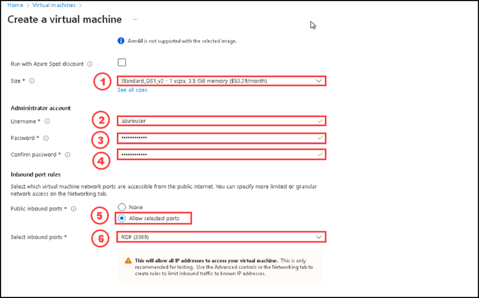

13. After entering all the details on Basics tab please switch to Disks tab and enter the details as per the below image:

14. Switch to the Networking tab to ensure **RDP (3389)** is selected in section **Select inbound ports**.

15. Switch to the Monitoring tab and Select Disable option for Boot diagnostics under Diagnostics section.

 
16. Leave the remaining values on the defaults and then click the **Review + create** button at the bottom of the page.

17. After successfully completed the validation, please select Create.

18.Once the deployment completed, please select Go to resources.

19. On the ContosoVm virtual machine page, at the overview section, please select Connect.

20. On the **Connect to virtual machine** page, keep the default options to connect with the public IP address over port 3389 and click **Download RDP File**. A file will download on the bottom left of your screen.

21. **Open** the downloaded RDP file (located on the bottom left of your lab machine) and click **Connect** when prompted. 

22. In the **Windows Security** window, sign in using the Admin Credentials you used when creating your VM **azureuser** and the password **Pa$$w0rd123!**. 

23. You may receive a warning certificate during the sign-in process. Click **Yes** or to create the connection and connect to your deployed VM. You should connect successfully.

A new Virtual Machine (contosoVm) will launch inside your Lab. Close the Server Manager and dashboard windows that pop up (click "x" at top right). You should see the blue background of your virtual machine. **Congratulations!** You have deployed and connected to a Virtual Machine running Windows Server. Please dont close the vm window.

24. In the Azure portal, navigate to the storage account which you created on the previous task and select fileshares and select **contosofiles**.

25. On the overview section, please select connect.

26. Select a drive letter then click on show script, then copy the contents of the show script and paste it in a Notepad.

27. In the VM, open PowerShell and paste in the contents of the Notepad, then press enter to run the command. It should map the drive. You have successfully mapped the drive.

28. Open the windows explorer in the virtual machine and double click on contosofiles, you can see the text file named welcome.txt created on fileshares  contosofiles in azure portal.

### Clean up resources

When you're done, delete the resource group. Deleting the resource group deletes the storage account, the Azure file share, virtual machine and any other resources that you deployed inside the resource group.

1. Select Home and then Resource groups.

2. Select the resource group you want to delete.

3. Select Delete resource group. A window opens and displays a warning about the resources that will be deleted with the resource group.

4. Enter the name of the resource group, and then select Delete.
