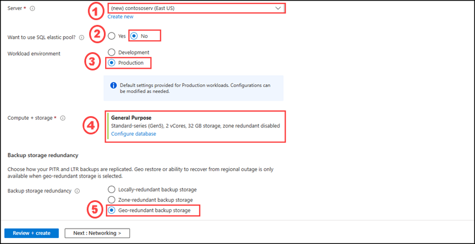

## Instructions

## Exercise 1: Configure and deploy a relational data storage solution 

### Task 1: Create a single database with Adventure Works pre-loaded

In this task, you will learn how to use Azur portal to create a single database with Adventure works sample database

#### Pre-requisites for this task

An Azure account, a resource group

#### Steps

1. Login into Azure portal and on the search box type SQL database, then please select the SQL database option from the list.

2. Please select the + Create button.

3. Under Basic tab, please enter the following details:

    | Settings | Values |
    |  -- | -- |
    | Subscription | **Use default supplied** |
    | Resource group | **Select the resource group name created on the previous exercise** |
    | Database name | **adventureworkscontoso** |
   
 

4. For server, click Create new.

 

5. On Create SQL Database Server page, please enter the following details:

    | Settings | Values |
    |  -- | -- |      
    | Server name | **contososerv** |
    | Location | **East US** |
    | Authentication method | **Use SQL authentication** |
    | Server admin login | **contosoadmin** 
    | Password |  **Contoso@123** 
    | Confirm password | **Contoso@123** |    
    
     

6. After creating the database server, please enter the following 

    | Settings | Values |
    |  -- | -- |      
    | Server name | **contososerv** |
    | Want to use SQL elastic pool? | **No** |
    | Workload environment | **Production** |
    | Compute + storage | **General Purpose (Standard-series (Gen5), 2 vCores, 32 GB storage, zone redundant disabled)** |
    | Backup storage redundancy |  **Geo-redundant backup storage** |
    
 

7. On the Networking tab, for Connectivity method, select Public endpoint.

8. For Firewall rules, set Add current client IP address to Yes. Leave Allow Azure services and resources to access this server set to No. 

 

9. Under Connection policy, choose the Default connection policy, and leave the Minimum TLS version at the default of TLS 1.2.

10. Select Next: Security at the bottom of the page.

