## Instructions

## Exercise 1: Configure and deploy a relational data storage solution 

### Task 1: Create a single database with Adventure Works pre-loaded

In this task, you will learn how to use Azur portal to create a single database with Adventure works sample database

#### Pre-requisites for this task

An Azure account, a resource group

#### Steps

1. Login into Azure portal and on the search box type SQL database, then please select the **SQL database** option from the list.

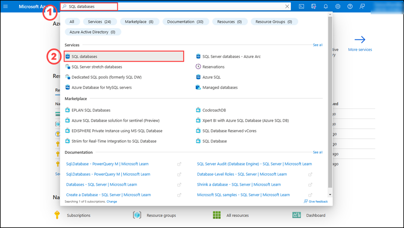

2. Please select the **+ Create** button.

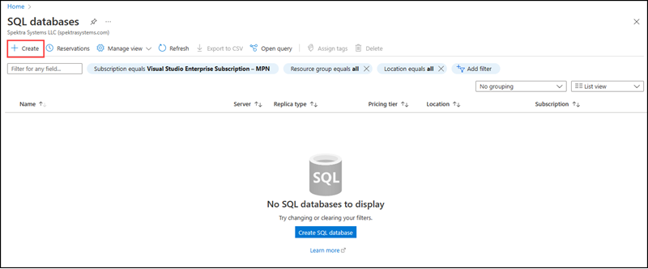

3. Under **Basic** tab, please enter the following details:

    | Settings | Values |
    |  -- | -- |
    | Subscription | **Use default supplied** |
    | Resource group | **Select the resource group name from the dropdown list** |
    | Database name | **adventureworkscontoso** |
   
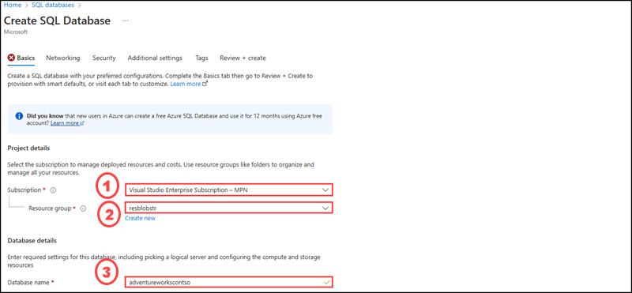 

4. For server, click **Create new**.

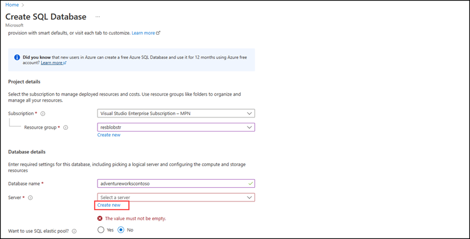 

5. On **Create SQL Database Server** page, please enter the following details:

    | Settings | Values |
    |  -- | -- |      
    | Server name | **contososerv** |
    | Location | **East US** |
    | Authentication method | **Use SQL authentication** |
    | Server admin login | **contosoadmin** 
    | Password |  **Contoso@123** 
    | Confirm password | **Contoso@123** |    
    
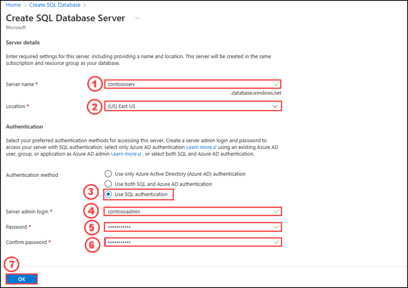     

6. After creating the database server, please enter the following 

    | Settings | Values |
    |  -- | -- |      
    | Server name | **contososerv** |
    | Want to use SQL elastic pool? | **No** |    |
    | Compute + storage | **General Purpose (Standard-series (Gen5), 2 vCores, 32 GB storage, zone redundant disabled)** |
    | Backup storage redundancy |  **Geo-redundant backup storage** |
    
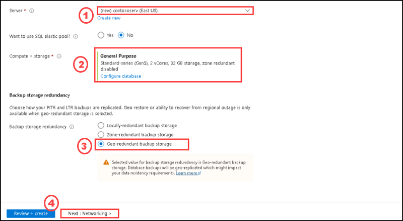 

7. On the **Networking** tab, for **Connectivity method**, select **Public endpoint**.

8. For **Firewall rules**, set **Add current client IP address** to **Yes**. Leave **Allow Azure services and resources to access this server** set to **No**. 

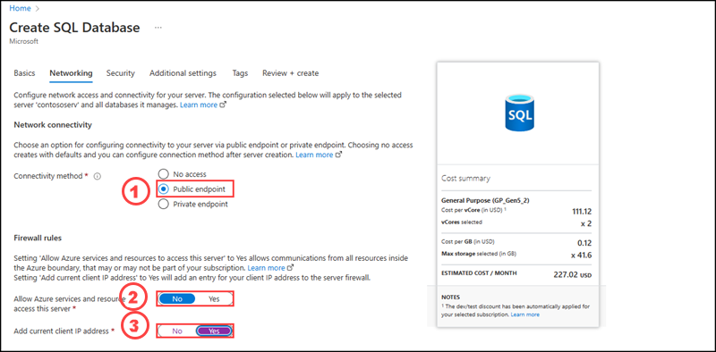 

9. Under **Connection policy**, choose the **Default connection policy**, and leave the **Minimum TLS version** at the default of **TLS 1.2**.

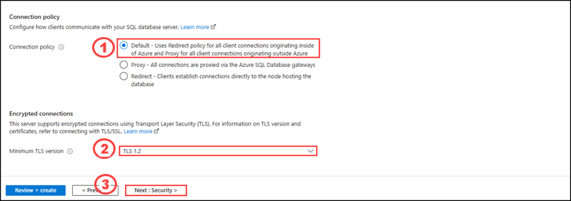 

10. Select **Next: Security** at the bottom of the page, then keep the default settings as it is.

11. Select **Next: Additional settings** at the bottom of the page.

12. On the **Additional settings** tab, in the **Data source** section, select **Sample** for Use existing data and click **Ok** on the **AdventureWorksLT** dialogue box. Instead of an empty blank database, this creates an AdventureWorksLT sample database with tables and data to query and experiment with.

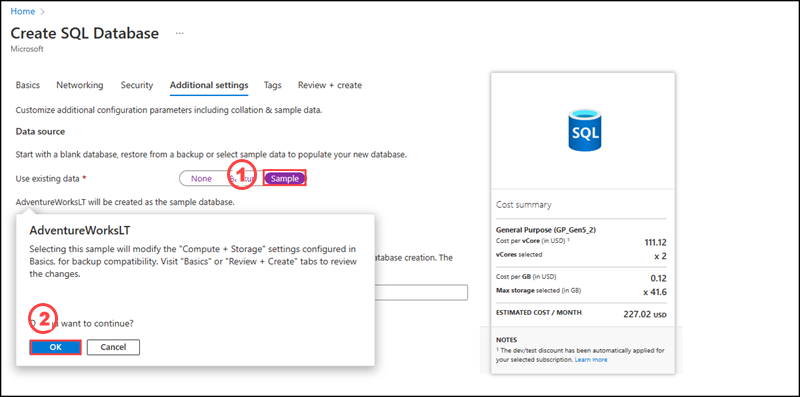

13. After selecting AdventureWorksLT sample database, please select **Review + Create**.

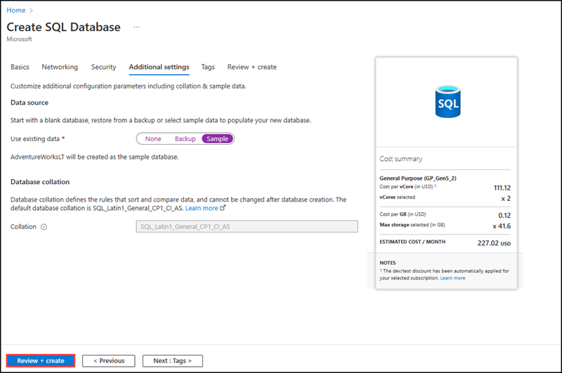

14. After validation completed successfully, please select **Create**.

15. Once the deployment completed, please select **Go to Resource**.

16. On the **adventureworkscontoso** database page please select **Query Editor**, then enter the following details:

    | Settings | Values |
    |  -- | -- |      
    | Login | **contosoadmin** |
    | Password | **Contoso@123** |
    
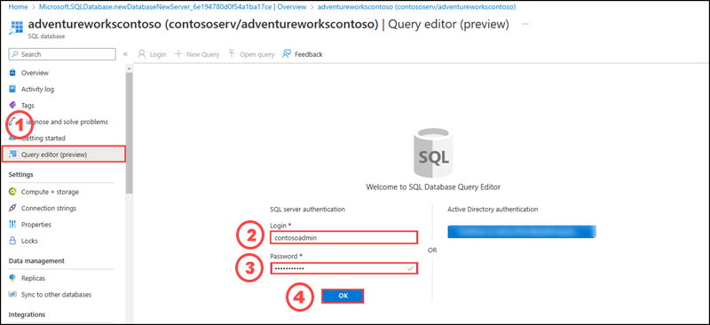  
 
 17. After opening the Query editor, please expand tables and right click on **SalesLT.Product** table, then select **Select Top 1000 rows**.

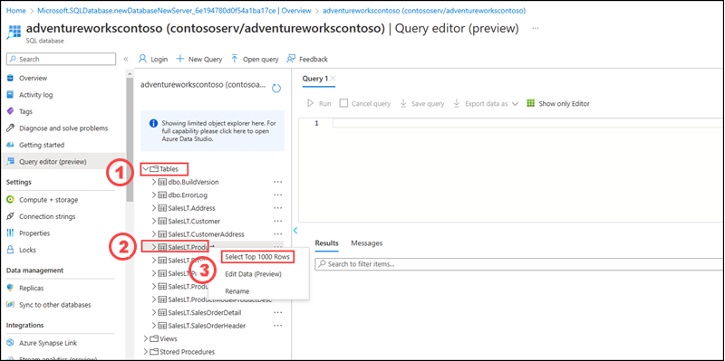 
 
 18. After executing the query, you can see the T-SQL statement on the query pane and the list of products in the result pane.

 

19. CLick on **Start** on the desktop of the virtual machine, then expand **Microsoft SQL Server Tools18**, then select **Microsoft SQL Server Management Studio 18**.

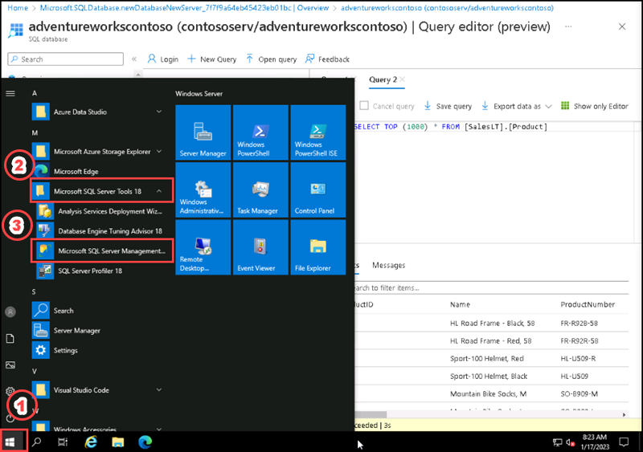

20. After opening **SSMS** on the **Connect to server** box, please enter the following details and click **Connect**.

    | Settings | Values |
    |  -- | -- |      
    | Servertype | **Database Engine** |
    | Servername | **contososerv.database.windows.net** |
    | Authentication | **SQL Server Authentication** |
    | Login | **contosoadmin** |
    | Password | **Contoso@123** |

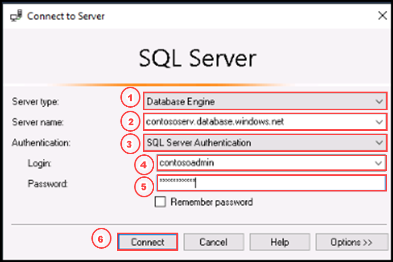

21. Expand the databases on the **Object explorer** you can see the database named adventureworkscontoso which configure in the azure sql database.

22. Expand the **adventureworks** database, then expand tables, right click on the table named **SalesLT.Product** and click on **Select top 100 rows**.

In this exercise, you have configure an Azure SQL Database and query it through SQL Server Management Studio (SSMS). Please dont cleanup the resources as we need it for next exercises.
