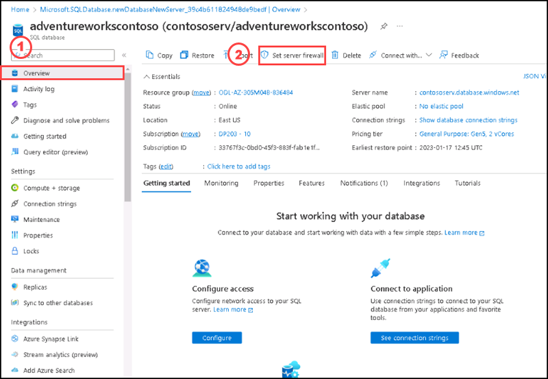
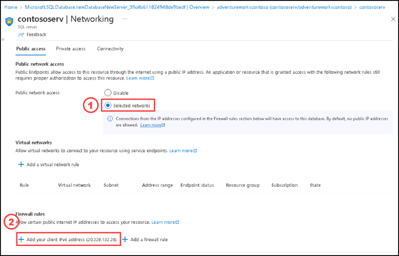
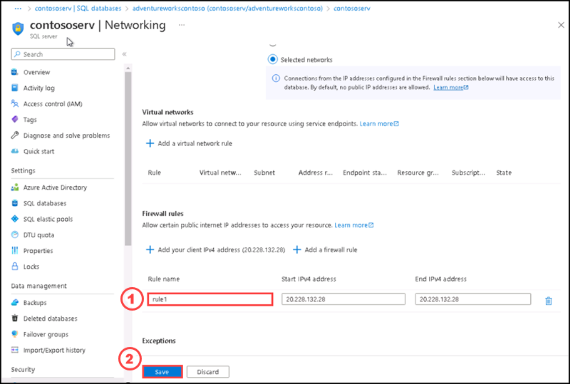
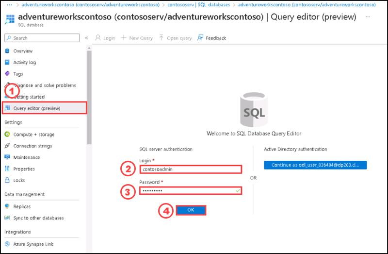
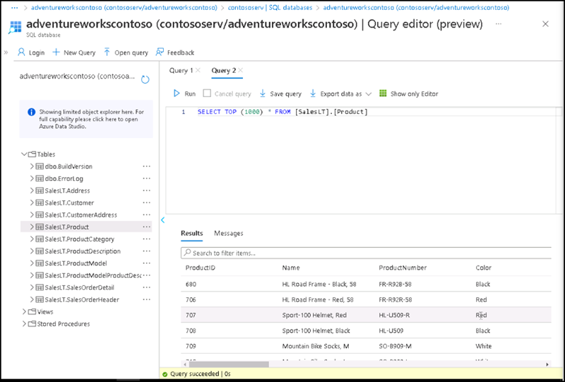
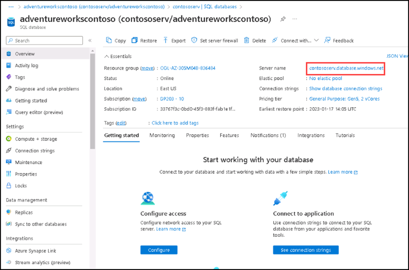
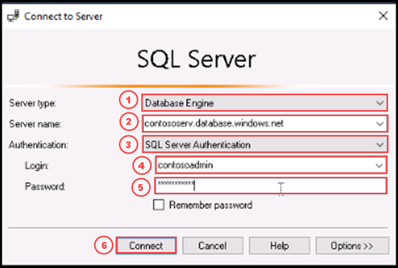
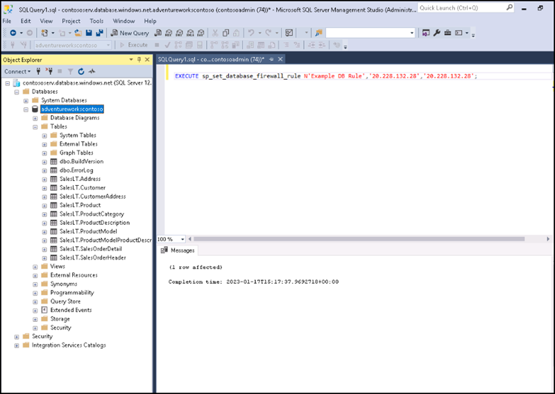

# Instructions

## Exercise 2: Enable Firewall rules and connect to Database.

In this exercise, you will configure Server firewall and database firewall to Adventureworks database and connect it. 

In this exercise, you will:

+ Task 1: Set up server-level firewall rules using Azure Portal.
+ Task 2: Setup database firewall rules.

### Estimated Timing: 30 minutes

### Task 1: Set up server-level firewall rules using Azure Portal

In this task you will configure Server firewall. Azure SQL Server is protected by server-level firewall rules. As a result, it applies to all underlying Azure SQL Databases. Before reaching the Azure server or database, each connection must pass through the firewall.

#### Pre-requisites for this task

An Azure account, a resource group and an Azure SQL Database (Complete Exercise 1).

#### Steps:

1. Login into Azure portal.

2. Please select the database you have created on the previous exercise. Select **Set Server Firewall** on the **Overview** section.

3. On the Networkinmg page, Please select **Selected Networks**. To add your current IP address to a new server-level firewall rule, select **+ Add your client IP**. This rule has the ability to open Port 1433 for a single IP address or a range of IP addresses. 

**Note: You can also configure the firewall by selecting Add a firewall rule.**

4. Change the **Rule name** as **rule1** then choose **Save**. Port 1433 is now open on the server, and a server-level IP-based firewall rule for your current IP address is created.

5. Under **settings**, please select **SQL databases**, then select **adventureworkscontoso**.

6. On the **adventureworkscontoso** page please select **Query Editor**, provide the login as **contosoadmin** and Password **Contoso@123** then click **Ok**.

7. Expand the **tables**, then click on the elipsis **(...)** of the table named **SalesLT.Product** and select **Select Top rows**.

8. You can see the data available on the table SalesLT.product.

### Task 2: Setup database firewall rules

Database-level firewall rules only apply to individual databases. The database will retain these rules during a server failover. Database-level firewall rules can only be configured using Transact-SQL (T-SQL) statements, and only after you've configured a server-level firewall rule. In this task you will configure a database fireewall rule.

#### Pre-requisites for this task

Complete Exercise 1, Exercise 2 - Task 1.

#### Steps:

1. Click on the **Start** button of the virtual machine desktop and type **SSMS** and select **Microsoft SQL Server Management Studio**.

2. Go to the Azure portal, on the **adventureworkscontoso** database page, copy the **server name**.

 

3. Back to the SSMS window, on the **Connect to server** box, please paste the server name copied from the azure portal on the server name property.

| Settings | Values |
|  -- | -- |
| Server tpe | **Database Engine** |
| Server name | **contososerv.database.windows.net** |
| Authentication |  **SQL Server Authentication** |
| Login | **contosoadmin** |
| Password | **Contoso@123** |

4. In Object Explorer, right-click the database and select New Query.

5. In the query window, add the following statement and modify the IP address to your public IP address:

      EXECUTE sp_set_database_firewall_rule N'Example DB Rule','20.228.132.28','20.228.132.28';
      
 6. Select **Execute**.   

 
 
 >**If any server failover happens adventureworkscontoso database will retain the data.**

### Clean up resources

>**Please do not delete resources you deployed in this lab. You will reference them in the next lab of this module.**

### Review

In this lab, you have:

+ Configured server-level firewall rules using Azure Portal.
+ Configured database firewall rules.

