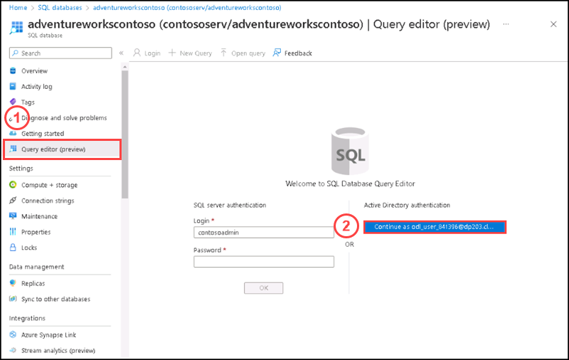
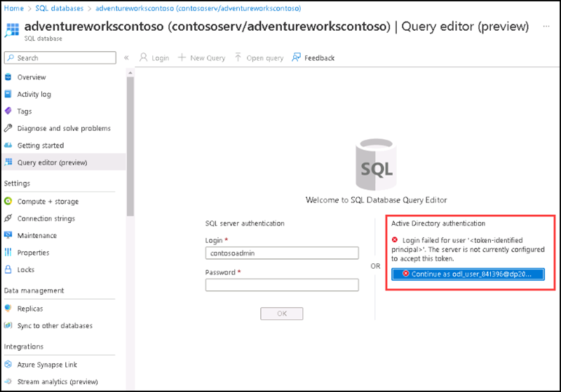
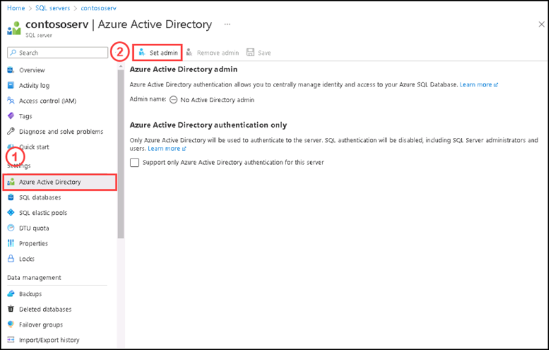
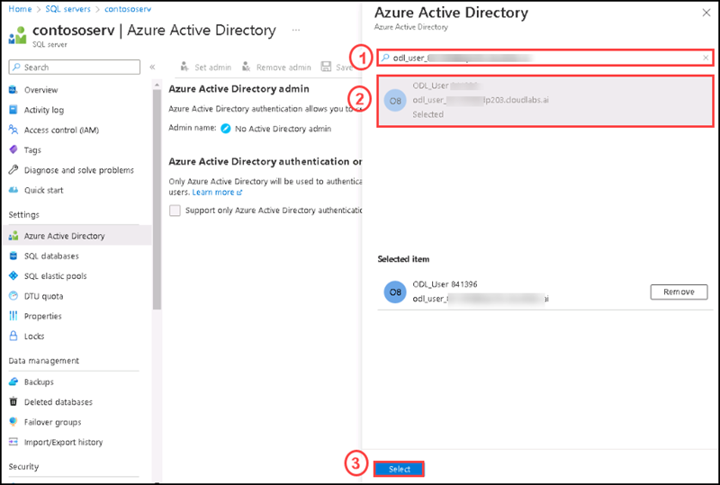
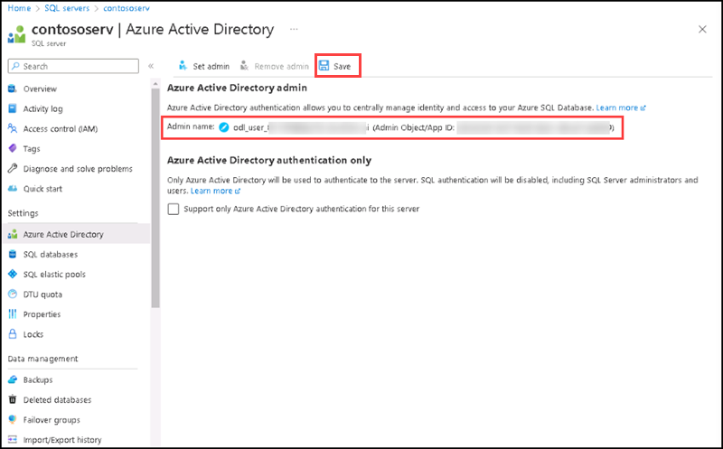
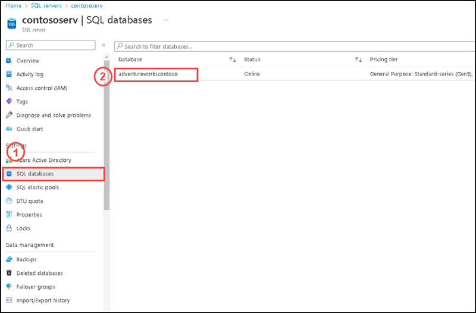
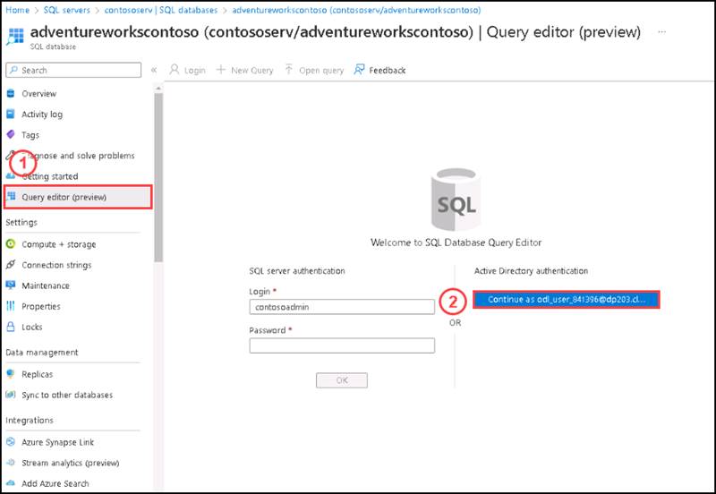
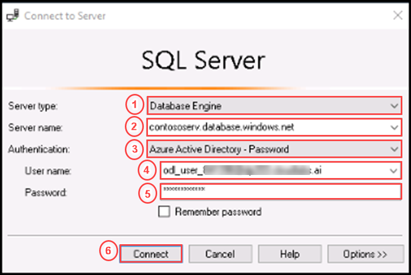
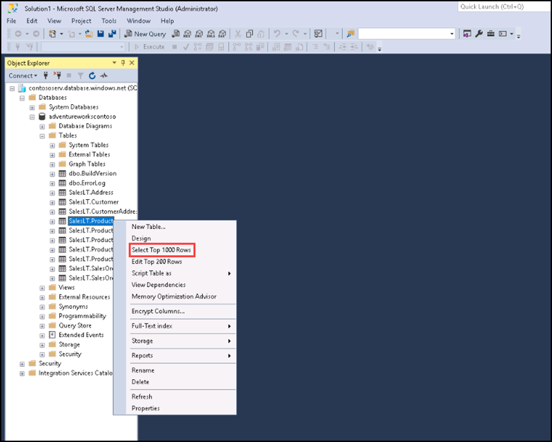
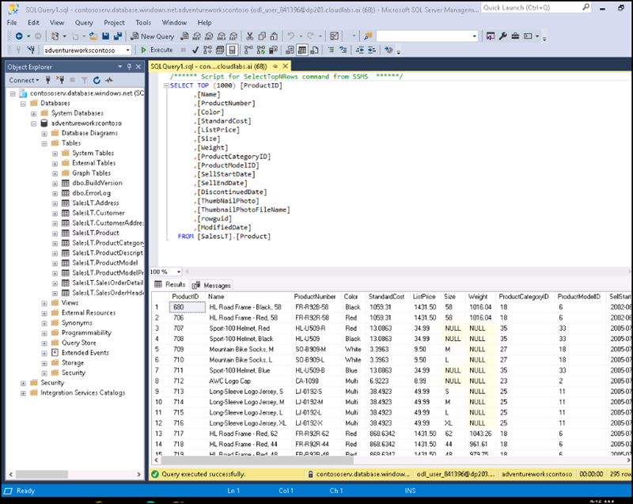

# Instructions

## Exercise 3: Enable Azure Active Directory authentication and query the Database.

Each Azure server (which hosts SQL Database) starts with a single server administrator account that serves as the server's administrator. As an Azure AD account, create a second administrator account. This principal is created as a contained database user in the server's master database. Administrator accounts are members of the db owner role in all user databases and log in as the dbo user. If a server does not have an Azure Active Directory administrator, then Azure Active Directory logins and users receive a Cannot connect to server error.

In this Exercise, you will grant Azure AD admin role to access your SQL server.

In this Exercise you will have:
    
  + Task 1: Set the current user as Admin and Query the data by using Azure Active Directory Authentication

### Estimated Timing: 30 minutes

### Task 1: Set the current user as Admin and Query the data by using Azure Active Directory Authentication

In this task you are going to grant permission to SQL server created on previous exercise through Azure Active Directory.

#### Pre-requisites for this task

Complete Exercise 1 & Exercise 2.

#### Steps:

1. Login to Azure portal if you have logged out.

2. Please search for SQL servers on the search box of the home page and then select SQL server from the list.

3. Please select the SQL Server which you created in previous exercise (in this example it would be **contososerve**).

4. Please go to SQL databases under settings and select **adventureworkscontoso** database from the list.

5. On the **adventureworkscontoso** database page, please select **Query editor** and then click on **Active Directory authentication** as the current user selected.

    
    
6. You can see a **Login failed for the current user** error.

    
    
7. Go back to **contososerve** SQL server page and please select **Azure Active Directory**, then select **Set admin**.

    

8. On the **Azure Active Directory** side screen please enter the current user name in search box and select from the list. Then click on **Select** button at bottom.

    
    
9. Verify under **Azure Active Directory Admin** section that the current user added as an admin and then click **Save**.   

    
    
10. On left side please select **SQL databases**, then select **adventureworkscontoso** from the databases list.

    
    
11. On the **adventureworkscontoso** database page, please select **Query editor** and then click on the current user selected under **Azure Active Directory authentication**.

    
    
12. You can see the authentication completed suucessfully and can retreive the data from any table.

     
    
13. You can query the data by using SSMS with Azure Active Directory authentication. For that please open **SQL Server Management Studio**, (by clicking on the start button of the windows operating system and type SSMS).

14. On the **Connect to server** window please enter the following details:

    | Settings | Values |
    |  -- | -- |
    | Server tpe | **Database Engine** |
    | Server name | **contososerv.database.windows.net** |
    | Authentication |  **Azure Active Directory - password** |
    | Login | **odl_user_XXXXXXX@dp203.cloudlabs.ai** (Enter the current user set as admin) |
    | Password | **XXXXXXXX** (Enter the password of the current user) |

      

15. After connecting the database, please expand **adventureworkscontoso** database and expand tables, then right click on any of the table and click on **Select top 1000 rows**.

    

16. You can see the data retrieved succesfully.

    

### Review

In this lab, you have:

+ Configured Azure Active Directory authentication for SQL Server via Azure Portal.
+ Queried the data using Azure Active Directory authentication.
