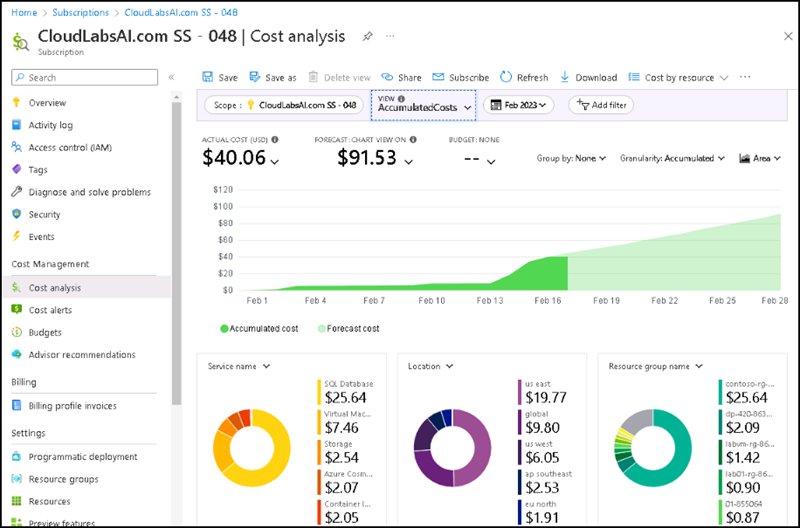
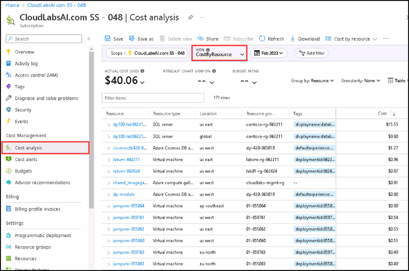
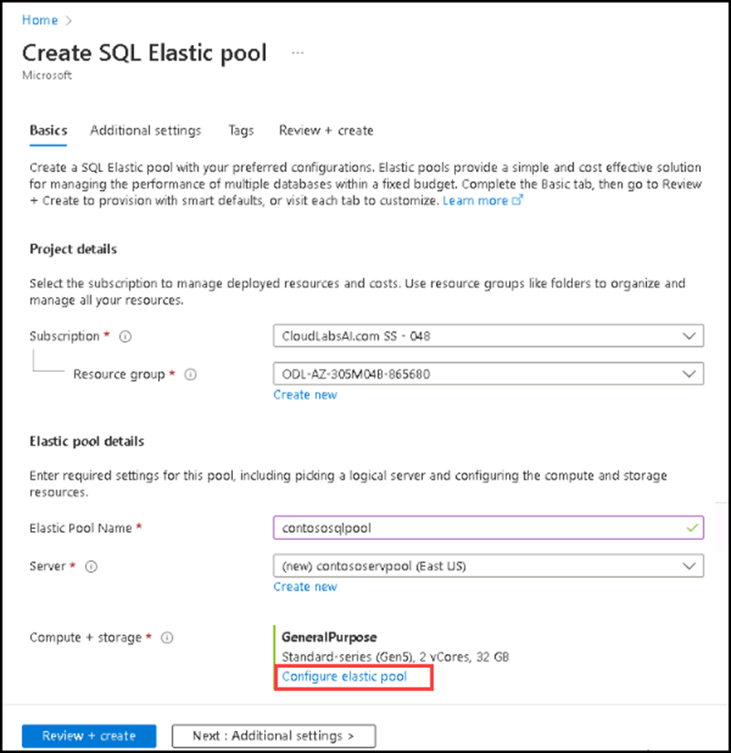
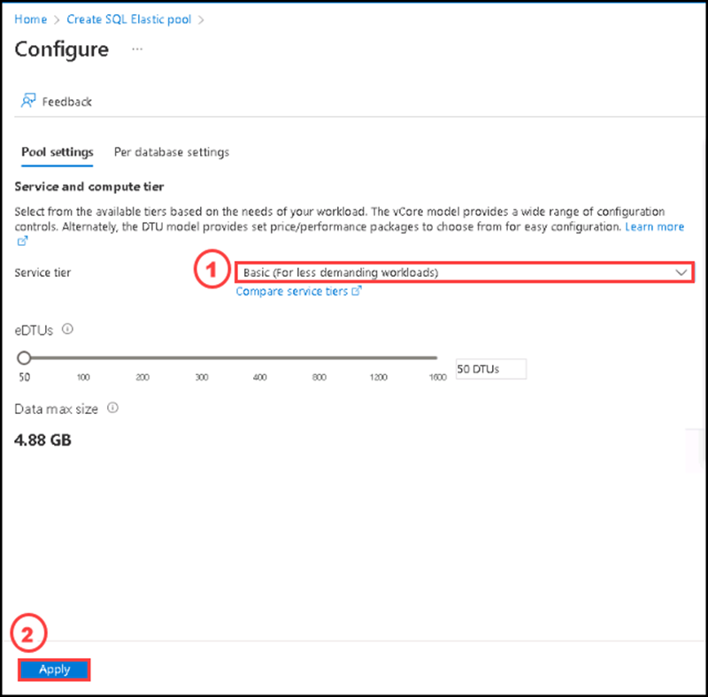
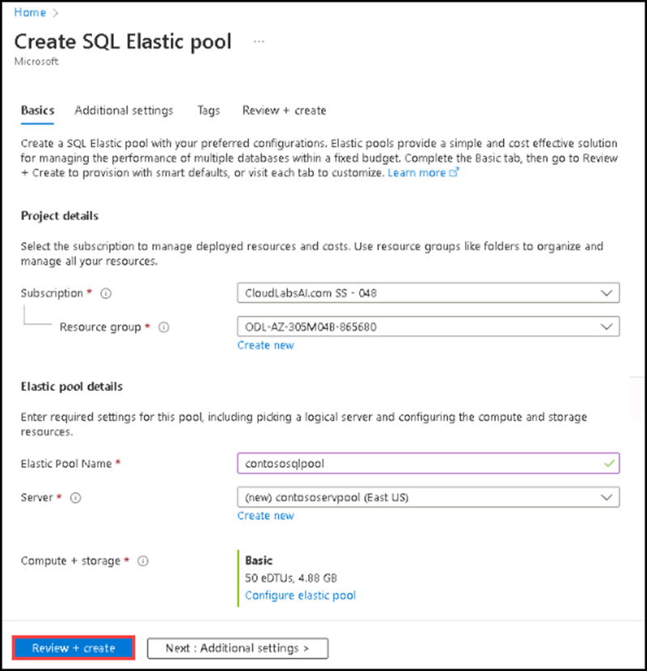
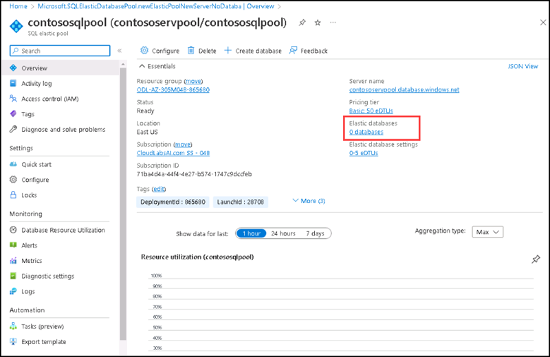
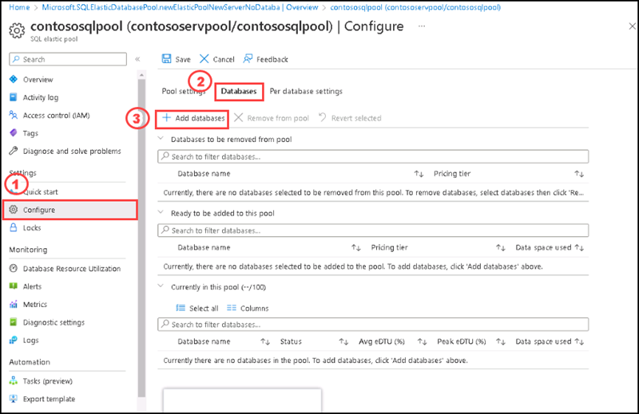
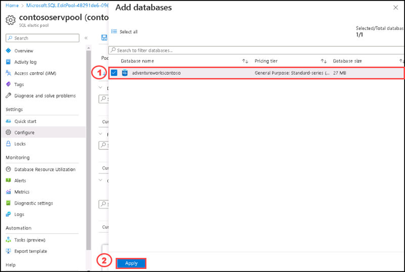
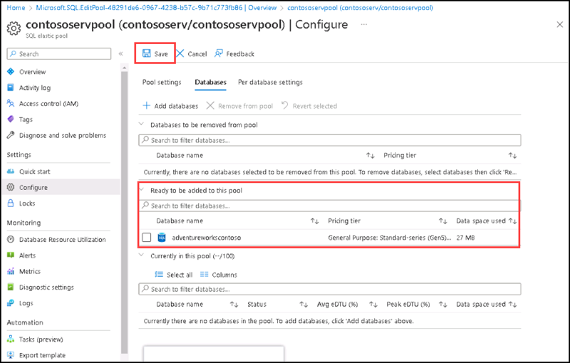
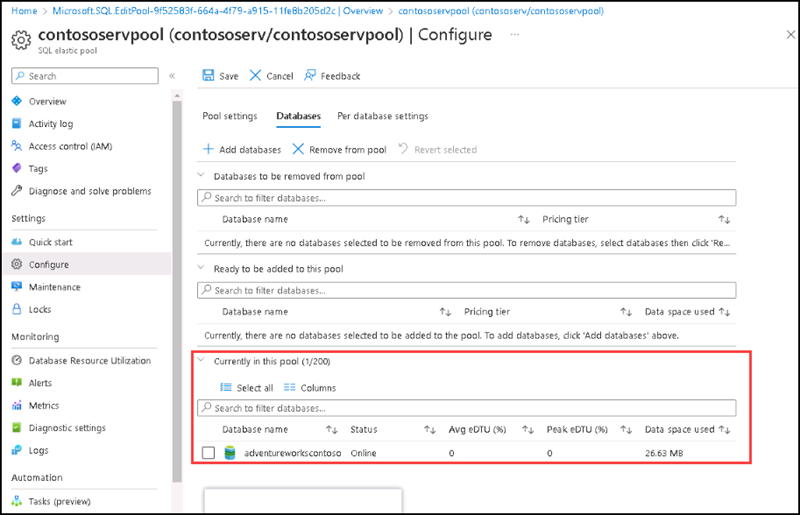

# Instructions

## Exercise 5: Review the Database Cost and Convert the Database into elastic pool.

You can see the estimated costs in the portal as you begin using Azure SQL Database. Costs for Azure SQL Database are only a portion of the monthly costs in your Azure bill. The elastic pools in Azure DBs provide a cost-effective solution for fluctuating usage demands. With resource pooling, these elastic pools can configure multiple SQL databases. As a result, you have the freedom to build a high-end database server that your databases can use based on their workload requirements. These elastic pools allow you to reduce costs for multiple databases without sacrificing performance.

In this Exercise, you will review the cost estimation of the database and conver the database into elastic pool.

In this Exercise you will have:

  + Task 1: Review the Cost estimate
  + Task 2: Convert the database into Elastic Pool.

### Estimated Timing: 30 minutes

### Task 1: Review the Cost Estimate.

In this task you are going review the cost estimation of your database.

#### Pre-requisites for this task

Complete Exercise 1 & Exercise 2 & Exercise 3 & Exercise 4.

#### Steps:

1. Go to the Azure portal and navigate to the Subscription. 

2. On the Subscription page, please select **Cost Analysis** under **Cost Management** section .

3. View the Accumulated costs there.

4. You can change the view of cost analysis per resources and find out the cost per resources.

### Task 2: Convert the database into Elastic Pool.

In this task you are going to create a SQL elastic pool and convert the database into Elastic Pool.

#### Pre-requisites for this task

Complete Exercise 1 & Exercise 2 & Exercise 3 & Exercise 4.

#### Steps:

1. Go to Azure portal, home page and then search elastic pool on the search bar, select **SQL elastic pools** from the list.

2. On the **SQL elastic pools** page please select **Create**.

3. On the **Create SQL Elastic pool** page under **Basic** tab please enter the following informations:

    | Settings | Values |
    |  -- | -- |
    | Subscription | **Use default supplied** |
    | Resource group | **Select the resource group name ODL-AZ-305M04B-XXXXX from the dropdown list** |
    | Elastic pool name | **contososqlpool** |
    | Server name | Select **contososerv** |

4. On the **Create SQL Elastic pool** page under **Basic** tab, for **Compute + storage** option, please select **Configure elastic pool**.

 

5. On the **Configure** page, under **Pool settings**, for **Service tier** please select **Standard (for workloads with typical performance requirements)** then select **Apply**.

 

6. On the **Create SQL Elastic pool** page, select **Review + Create**.

 

7. After completing the validation please select **Create88.

It will take 2-3 minutes to complete the deployment.

8. After completing the deployment please select **Go to resource**. The elastic pool dashboard displays resource configuration, elastic databases, and elastic database settings. As shown below, there is no database in the elastic pool.

 

9. To add database, please select the **0 databases**.

10. On the **Configure** page, under **Databases** tab, please select **+ Add databases**.

11. On the **Add databases** side screen, please select **adventureworkscontoso** database, then select **Apply**.

12. Now it shows the database **adventureworkscontoso** added to the elastic pool, it lists the database into the option – Ready to be added to this pool. Please select **Save**.

13. It starts a deployment to add Azure SQL Database into the elastic pool, and will take 2-3 minutes to complete the deployment. Please select **Go to resource** after completing the deployment.

14. Select **Configure**, then under **Databases** tab, you can see the database **adventureworkscontoso** added.

You have successfully added your database to the elastic pool.

### Clean up resources

   >**Note**: Remember to remove any newly created Azure resources that you no longer use. Removing unused resources ensures you will not see unexpected charges, although keep in mind that Azure policies do not incur extra cost.
   
   >**Note**:  Don't worry if the lab resources cannot be immediately removed. Sometimes resources have dependencies and take a longer time to delete. It is a common Administrator task to monitor resource usage, so just periodically review your resources in the Portal to see how the cleanup is going.

   >**When you're done, delete the resource group. Deleting the resource group deletes the storage account, the Azure file share, virtual machine and any other resources that you deployed inside the resource group.**

1. Select Home and then Resource groups.

2. Select the resource group then select the resources you have created inthis lab, Sql database, Sql server, elastic pool, then select Delete
    
#### Review

In this lab, you have:

- Reviewed the cost analysis in the subscription scope.
- Deployed Sql elastic pool and added Sql database into the elastic pool.

