# Instructions

## Exercise 1: Deploy a Quickstart template on Azure 

Azure Quickstart Templates is a collection of templates contributed by the community. You can use the sample templates to help you create your own templates.
In this exercise, you are going to deploy a quickstart template on Azure and deploy a traffic manager profile.

In this exercise, you will:

+ Task 1: Deploy a quickstart template on Azure.
+ Task 2: Deploy an App service to another region.
+ Task 3: Deploy a Traffic Manager Profile.

### Estimated Timing: 60 minutes

### Task 1: Deploy a quickstart template on Azure.

In this task, you will learn how to use Azure portal to deploy a template by using Deploy a custom template.

#### Pre-requisites for this task

An Azure account

#### Steps:

1. Go to Azure Portal, enter **Custom deployment** on search bar, then select **Deploy a custom template**.

    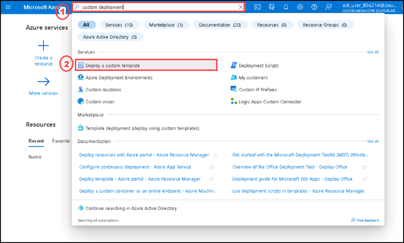

2. On the **Custom deployment** page please select template source as **Quickstart templates**, Select **demos/web-app-regional-vnet-private-endpoint-sql-storage** from the Quickstart template dropdown, then select **Select template**.

    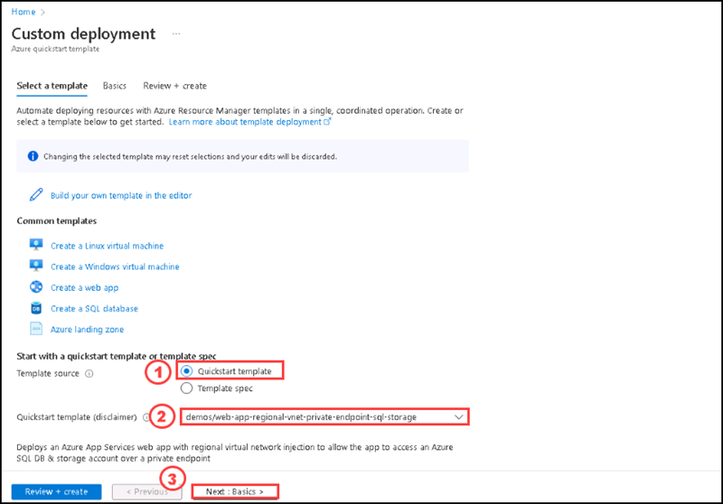

3. Under **Basics** tab please enter the following details:

    | Section | Values |
    | ------- | ------ |
    | Resource group | Select **Create new**, enter the name **newres123**, then click **Ok**. |
    | Region |  **West US** |
    | Sql Administrator Login Name | **contososqladmin** |
    | Sql Administrator Login Password | **Pa$$w0rd123!** |
    | V Nets | Enter **[{"name":"hub-vnet","addressPrefixes":["10.1.0.0/16"],"subnets":[{"name":"PrivateLinkSubnet","addressPrefix":"10.1.1.0/24","udrName":null,"nsgName":null,"delegations":null,"privateEndpointNetworkPolicies":"Disabled","privateLinkServiceNetworkPolicies":"Enabled"}]},{"name":"spoke-vnet","addressPrefixes":["10.2.0.0/16"],"subnets":[{"name":"AppSvcSubnet","addressPrefix":"10.2.1.0/24","udrName":null,"nsgName":null,"privateEndpointNetworkPolicies":"Enabled","privateLinkServiceNetworkPolicies":"Enabled","delegations":[{"name":"appservice","properties":{"serviceName":"Microsoft.Web/serverFarms"}}]}]}]** |
    
    >**Note:** If you are unable to see the entire value for V Nets option then please zoom out the broswer tab of your machine. 
    
 4. Select **Review + create**.    
    
    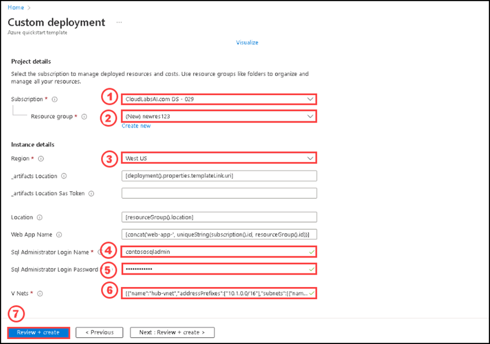      

5. After passing validation, please select **Create**.

6. The deployment will take 10 minutes to complete. After completing the deployment, please select **Go to resource group**.

7. Please review all the resources deployed on the resource group **newres123**.

8. On the **Overview** section of the resource group, please select the **App service** named **web-app-XXXXXXXX-XXXXXXXX**.

    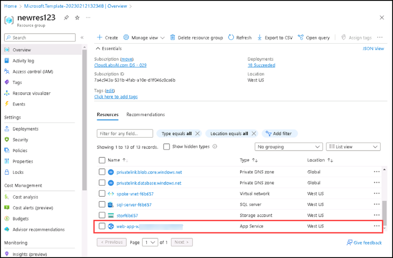

9. On the **Overview** section of the  resource group, please copy the **URL** of the App service.

    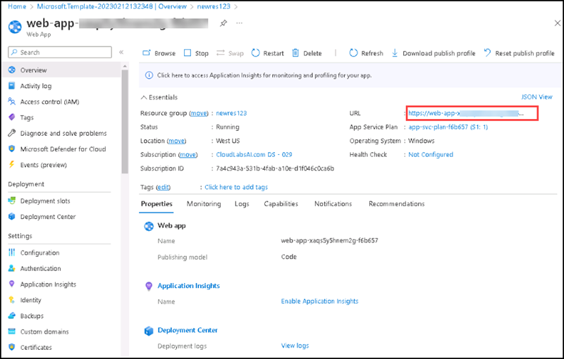

10. Open another tab of browser and paste the URL of app service. You will get the default page of the App.

    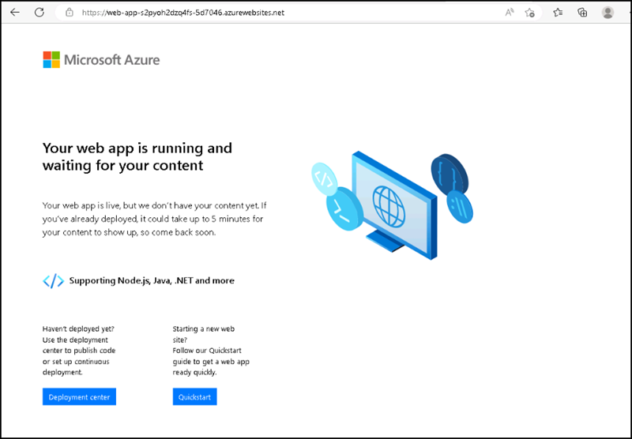
    
    >**Note**: It might take few minutes to load the page.

The application is running successfully.

### Task 2: Deploy an App service to another region

In this task, you are going to deploy another app service to a different region.

#### Pre-requisites for this task

Complete Exercise 1 - Task 1

#### Steps:

1. In the Azure portal, search for **Web Apps** on the **search** box of the **Home** page, then select **App Services** from the list below.

2. On the **App Services** page, select **+ Create**.

3. On the **Create Web App** page, enter the following details on the **Basics** tab and then select **Next: Deployment>** at the bottom.

    | Section | Values |
    | ------- | ------ |
    | Subscription | **Default** Select the default subscription |
    | Resource group | Select **newres123** |
    | Name | **web-app-EastUS** |
    | Publish | **Code** |
    | Runtime stack | Select **.Net 6 (LTS)** |
    | Operating System | Select **Windows** |
    | Region | Select **East US**. |
    | Windows Plan | Select **Create new** and enter **contosoappplanEastUS1** in the text box |
    | Pricing plan | Select **Standard S1 (100 total ACU, 1.75 GB memory, 1 vCPU)** |

    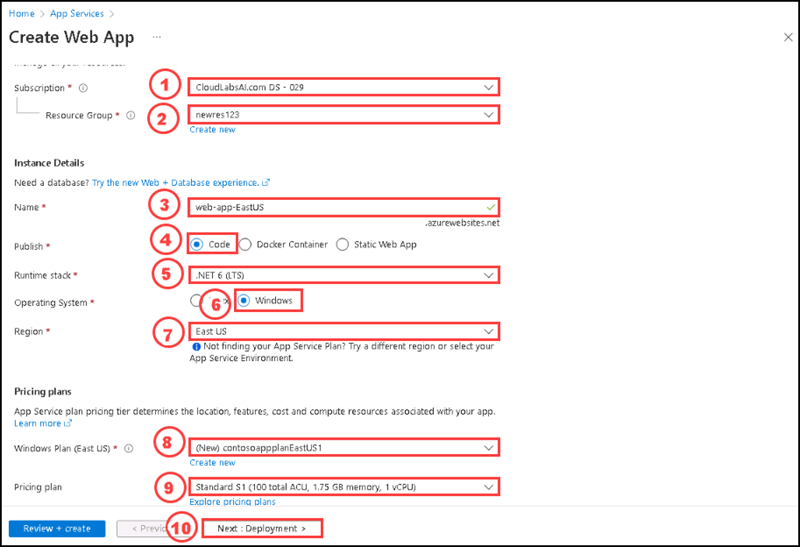

4. On the **Deployment** tab review the default settings and select **Next: Networking>** at the bottom.

5. On the **Networking** tab, please review the default settings and select **Next: Monitoring>** at the bottom.

6. On the **Monitoring** tab, set **Enable Application Insights** to **No** and then select **Review + create**.

    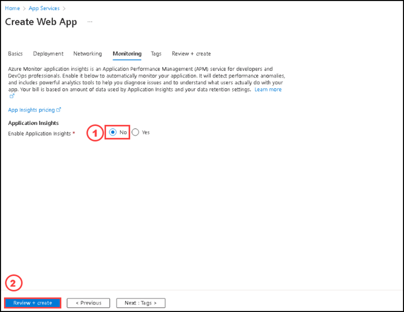

7. After completing the validation, select **Create**. After completing the deployment, select **Go to resource**.

You have successfully deployed another web app.

### Task 3: Deploy a Traffic Manager Profile

In this task, you are going to deploy a traffic manager profile.

#### Pre-requisites for this task

Complete Exercise 1 - Task 1 & Task 2

#### Steps:

1. Go to Home page, and search for **Traffic Manager Profile**, then select **Traffice Manager Profile** from the list.

2. On the **Traffic Manager** page, please select **+ Create**.

    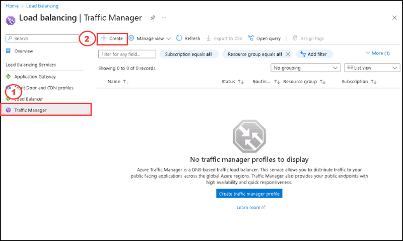

3. On the **Create Traffic Manager Profile** page, please enter the following informations and then select **Create**. 

    | Section | Values |
    | ------- | ------ |
    | Name | **contosotrafficmanager-1**  |
    | Routing method | Select **Priority** |
    | Subscription | **Default** Select the default subscription |
    | Resource group | **newres123** |

    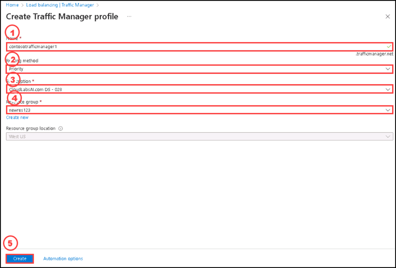
    
4.  Once the deployment is succeeded, click on **Refresh** to see the **contosotrafficmanager-1**.

    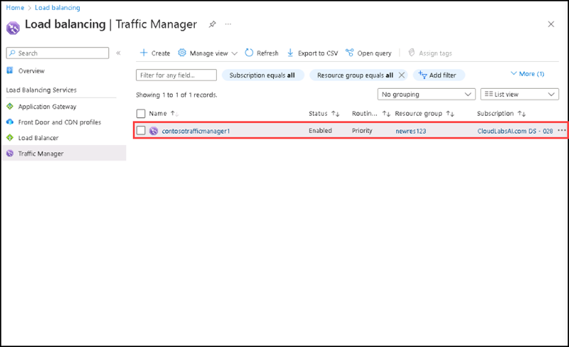

### Review

In this lab, you have:

   - Deployed a quickstart template.
   - Verified the application is running.
   - Deployed an App service to another region.
   - Depoyed a Traffic manager profile.
    
