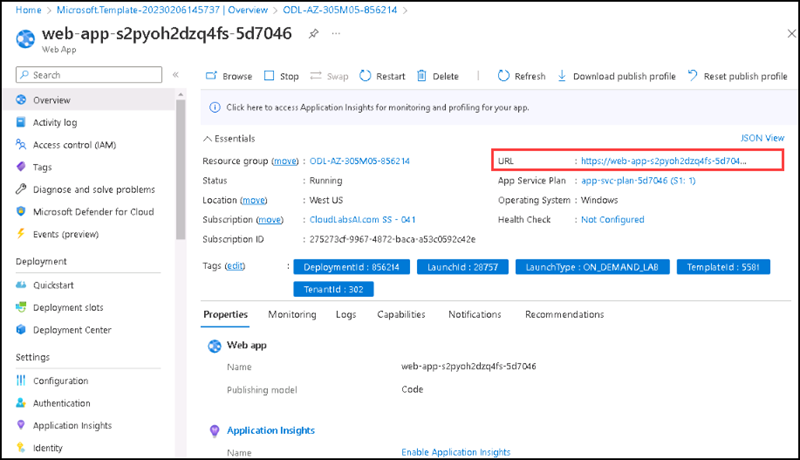

# Instructions

## Exercise 1: Deploy a Quickstart template on Azure 

In this exercise, you are going to deploy a quickstart template on Azure. 

In this exercise, you will:

+ Task 1: Deploy a quickstart template on Azure.

### Estimated Timing: 60 minutes

### Task 1: Deploy a quickstart template on Azure.

In this task, you will learn how to use Azur portal to deploy a template by using Deploy a custom template.

#### Pre-requisites for this task

An Azure account

#### Steps

1. Go to Azure Portal, enter **Custom deployment** on search bar, then select **Deploy a custom template**.

    

2. On the **Custom deployment** page please select template source as **Quickstart templates**, Select **web-app-regional-vnet-private-endpoint-sql-storage** from the Quickstart templates dropdown, then select **Select template**.

    

3. Under **Basics** tab please enter the following details:

    | Section | Values |
    | ------- | ------ |
    | Resource group | Select **ODL-AZ-305M05-XXXXX** |
    | Region |  **West US** |
    | Sql Administrator Login Name | **contososqladmin** |
    | Sql Administrator Login Password | Select **Pa$$w0rd123!** |
    | V Nets | Enter **[{"name":"hub-vnet","addressPrefixes":["10.1.0.0/16"],"subnets":[{"name":"PrivateLinkSubnet","addressPrefix":"10.1.1.0/24","udrName":null,"nsgName":null,"delegations":null,"privateEndpointNetworkPolicies":"Disabled","privateLinkServiceNetworkPolicies":"Enabled"}]},{"name":"spoke-vnet","addressPrefixes":["10.2.0.0/16"],"subnets":[{"name":"AppSvcSubnet","addressPrefix":"10.2.1.0/24","udrName":null,"nsgName":null,"privateEndpointNetworkPolicies":"Enabled","privateLinkServiceNetworkPolicies":"Enabled","delegations":[{"name":"appservice","properties":{"serviceName":"Microsoft.Web/serverFarms"}}]}]}]** |
    
    
 4. After entering all the informations please select **Review + create**.    
    
       

5. After passing validation, please select **Create**.

6. The deployment will take 10 minutes to complete. After completing the deployment, please select **Go to resource group**

7. On the **Overview** section of the resource group, please select the **App service** named **web-app-s2pyoh2dzq4fs-5d7046**.

    

8. On the **Overview** section of the  resource group, please copy the Url of the App service.

    

9. Take another tab of browser and paste the url of app service. You will get the default page of the App.

The application is running successfully.

### Clean up resources

>**Please do not delete resources you deployed in this lab. You will reference them in the next lab of this module.**

### Review

In this lab, you have:

    - Deployed a quickstart template.
    - Verified the application is running.
    
