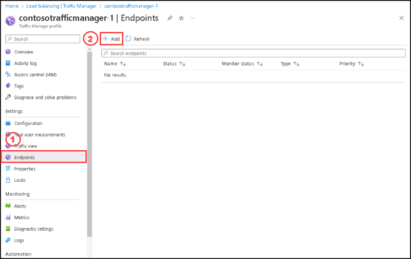
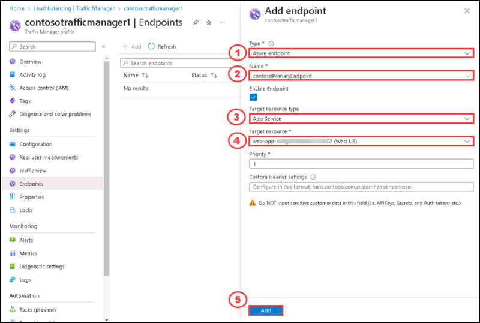
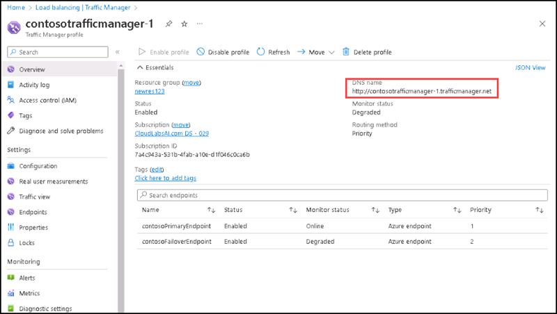
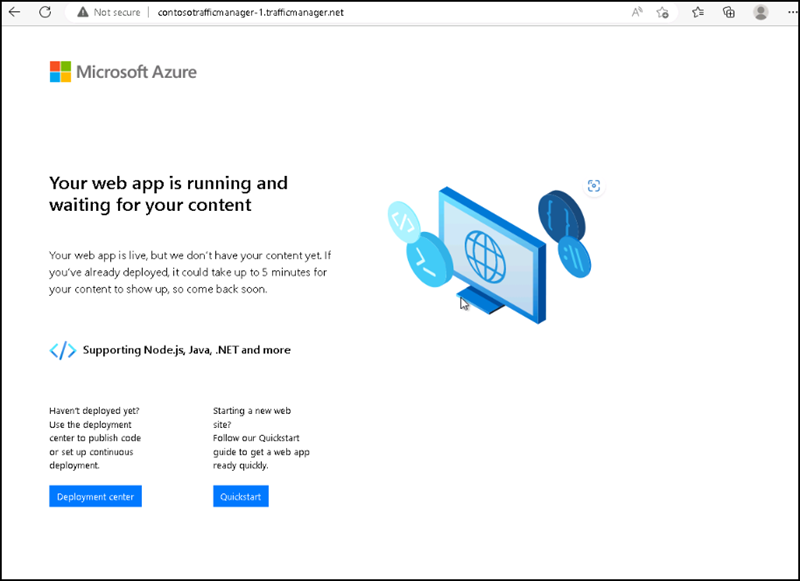
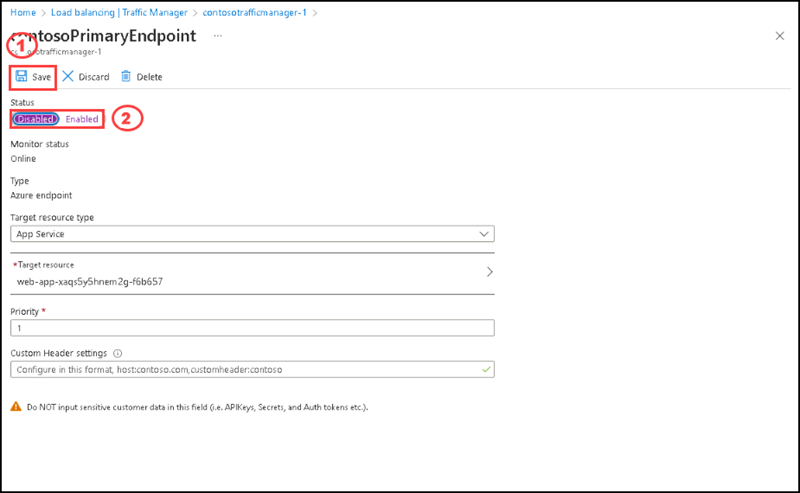
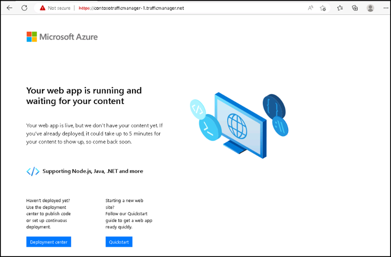

# Instructions

## Exercise 2: Review High Availability Capabilities (Test Failover)

In this exercise, you are going to deploy a quickstart template on Azure. 

In this exercise, you will:

+ Task 1: Add Traffic Manager endpoints.
+ Task 2: Test Traffic Manager profile

### Estimated Timing: 60 minutes

### Task 1: Deploy a quickstart template on Azure.

In this task, you will learn how to use Azur portal to deploy a template by using Deploy a custom template.

#### Pre-requisites for this task

An Azure account

#### Steps

### Task 1: Add Traffic Manager endpoints

In this task, you are going to add the website in the **East US** as primary endpoint to route all the user traffic. Add the website in **West US** as a failover endpoint. When the primary endpoint is unavailable, traffic automatically routes to the failover endpoint.

#### Steps:

1. In **Load balancing | Traffic Manager** page, please select **contosotrafficmanager-1**, in the **Settings** section, select **Endpoints**, and then select **+ Add**. 

    

2. On the **Add Endpoint** side screen, please enter the following informations and then select **Add**.

    | Section | Values |
    | ------- | ------ |
    | Type | Select **Azure endpoint**  |
    | Name | Enter **contosoPrimaryEndpoint** |
    | Target resource type | Select **App Service** |
    | Target resource | Select **web-app-XXXXX-XXXX (West US)** |
    | Priority | Select **1** |
    
    

3. To create a failover endpoint for your second Azure region, repeat steps 1 and 2 with these settings:

    | Section | Values |
    | ------- | ------ |
    | Type | Select **Azure endpoint**  |
    | Name | Enter **contosoFailoverEndpoint** |
    | Target resource type | Select **App Service** |
    | Target resource | Select **web-app-EastUS (East US)** |
    | Priority | Select **2** |

You have successfully added both the endpoints.

### Task 2: Test Traffic Manager profile

#### Steps: 

1. Go to the **Overview** section of the **Traffic Manager profile** that you created in the preceding Exercise.

2. Copy the **DNS** name of the **contosotrafficmanager-1**.

    

3. Open a new tab of your browser and enter the DNS name of your Traffic Manager profile to view your Web App's default website.

    

You can see the Web app running successfully .

To view Traffic Manager failover in action, disable your primary site:

4. In the Traffic Manager Profile page, from the **Overview** section, select **contosoPrimaryEndpoint**.

5. In **contosoPrimaryEndpoint**, select **Disabled** and then select **Save**.

    

6. Close **contosoPrimaryEndpoint**. Notice that the status is Disabled now.

7. Copy the DNS name of your Traffic Manager Profile from the preceding step to view the website in a new web browser session.

    

Verify that the web app is still available.

The primary endpoint isn't available, so you were routed to the failover endpoint.

### Clean up resources

>**Please do not delete resources you deployed in this lab. You will reference them in the next lab of this module.**

### Review

In this lab, you have:

   - Added Traffic manager endpoints.
   - Tested Traffic manager profile.

