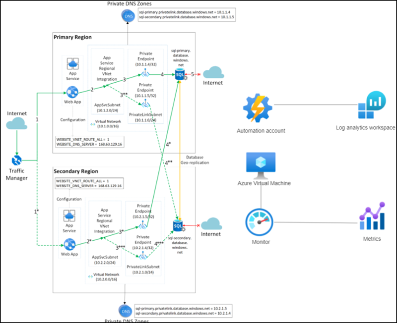

# Lab 05 - Deploy & Monitor a three-tier traditional application to Azure cloud platform
# Student lab manual

## Lab scenario

With the move to the cloud, many teams have adopted agile development methods. These teams must iterate quickly and repeatedly deploy their solutions to the cloud. Teams must be assured their infrastructure is in a reliable state. Application code must be managed through a unified process.

To meet these challenges in your design for Contoso Traders, you're investigating how to automate deployments by using the practice of infrastructure as code. So you are going to deploy a custom template by using Azure portal.

- Deploy a Quickstart template on Azure. Azure Quickstart Templates is a collection of templates contributed by the community. You can use the sample templates to help you create your own templates. In this lab, you will discover a website resource definition and incorporate it into your own template. It takes 12 minutes to complete this instruction.

- Review High Availability Capabilities (Test Failover). You perform a test failover to validate your replication and disaster recovery strategy, ensuring that no data is lost or downtime occurs. A test failure has no effect on ongoing replication or your production environment.

- Monitor and assess the solutions and data in the Azure cloud platform. Azure Monitor assists you in increasing the availability and performance of your applications and services. It provides an all-in-one solution for gathering, analyzing, and acting on telemetry from your cloud and on-premises environments. This data assists you in understanding how your applications are performing and proactively identifying issues that affect them and the resources on which they rely.

## Objectives

In this lab, you will have:

+ Exercise 1: Deploy a Quickstart template on Azure
+ Exercise 2: Review High Availability Capabilities (Test Failover)
+ Exercise 3: Monitor and assess the solutions and data in the Azure cloud platform

## Estimated timing: 160 minutes
## Solution Architecture

  
