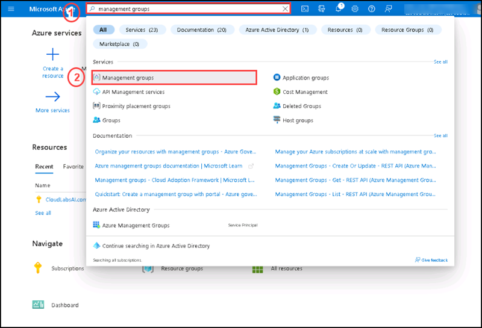
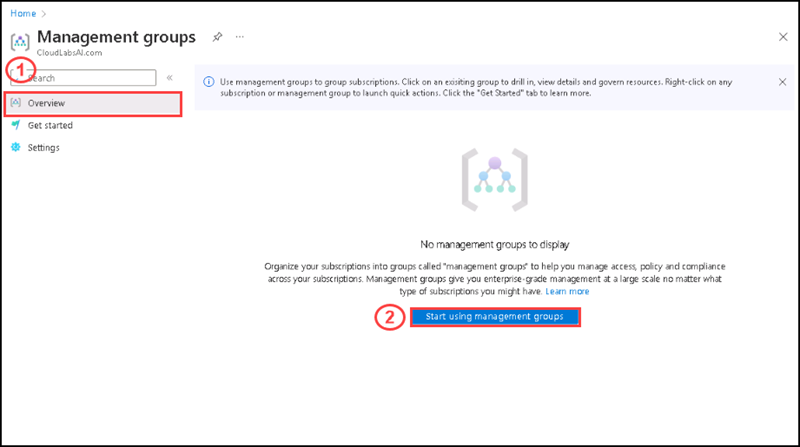
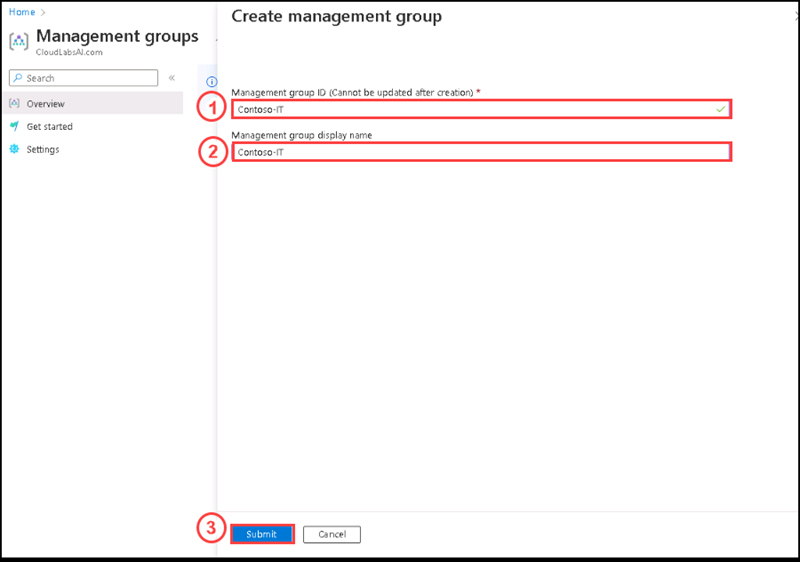
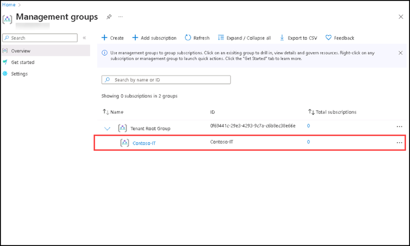
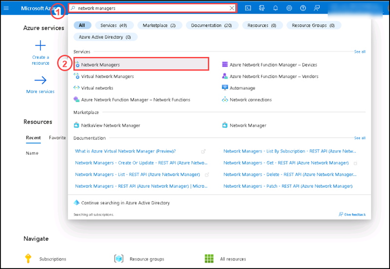
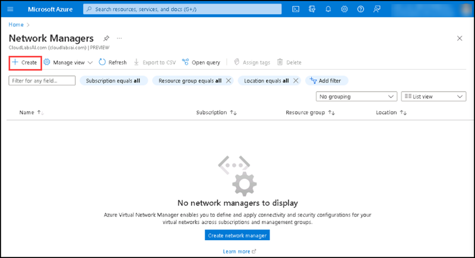
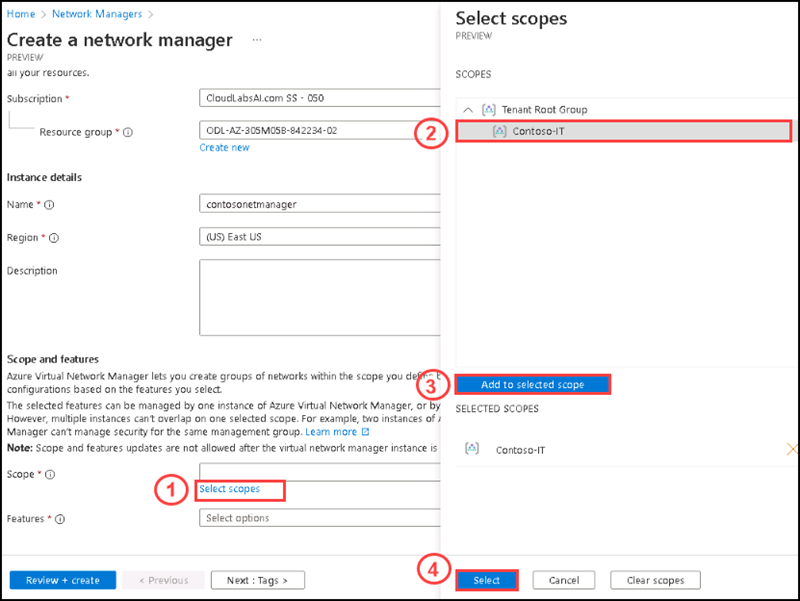
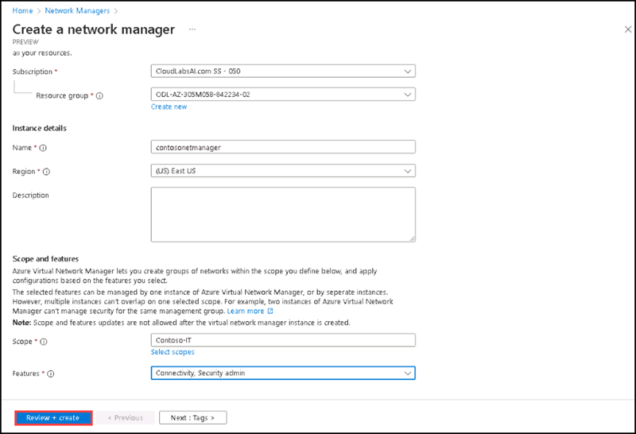
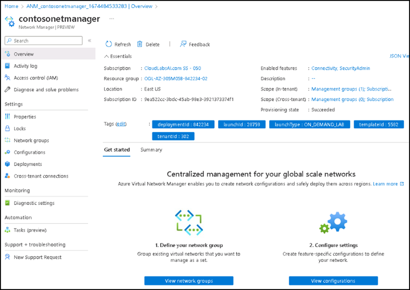

# Instructions

## Exercise 1: Create a Virtual Network Manager

Deploy a network manager instance with the defined scope and access you need.

In this Exercise, you will have:

  + Task 1: Create a Management group.
  + Task 2: Create a Virtual Network Manager.

### Task 1: Create a Management group

In this task you are going to create a management group.

#### Pre-requisites for this task

An Azure account

#### Steps:

1. Sign in to the Azure portal.

2. On the **Home** page please enter **Management groups** on the search box, then select **Management groups** from the below list.

3. On the **Management group** page, please select **Start using management groups** on the **Overview** section.

4. On the **Create management group** side screen please enter **Contoso-IT** for **Management group ID** and **Management group display name**, then click **Submit**.

5. After a while, you can see the newly management group created under the Tenant root group.

### Task 2: Create a Virtual Network manager

In this task you are going to create a virtual network manager.

#### Pre-requisites for this task

Complete Task 1.

#### Steps:

1. Go to the **Home** page.

2. On the **Home** page please enter **Network managers** on the search box, then select **Network managers** from the below list.

  
  
3. On the Network managers page please select **+ Create**.

4. On the **Create a network manager** page, under **Basics** tab please enter the following details:

  | Section | Values |
  | ------- | ------ |
  | Subscription | **The default subscription** |
  | Resource group | **ODL-AZ-305M05B-XXXXXX-02** |
  | Name | **contosonetmanager** |
  | Region | **East US** |
  
5. For **Scope**, please select **Select scopes**, then on the Select scopes side screen, please select **Contoso-IT** management group, then click on **Add to selected scope** and click **Select**.

6. For **Features**, please select **Connectivity** and **Security Admin**

7. Once entered all the values, please select **Review + Create**.

8. After completing the review, please select **Create**.

9. Please click on **Go to resource** after comlpeting the deployment.

10. You can see the newly created virtual network manager named **contosonetmanager**.

### Clean up resources

>**Please do not delete resources you deployed in this lab. You will reference them in the next lab of this module.**

### Review

In this lab, you have:

+ Created a management group.
+ Created a virtual network manager.

