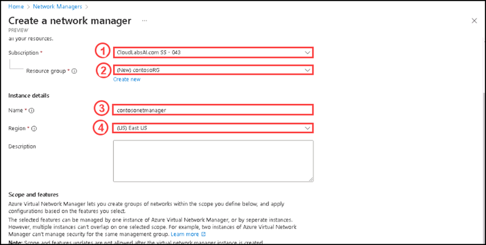
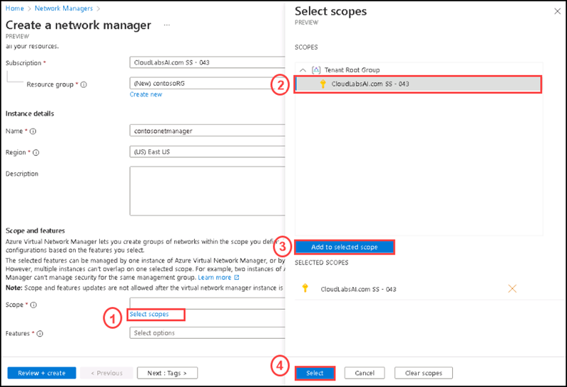

# Instructions

## Exercise 1: Create a Virtual Network Manager

Deploy a Network manager instance with the defined scope and access you need. You are going to use this Network manager for the deployment of hub and spoke network topology.

In this Exercise, you will have:

  + Task 1: Create a Virtual Network Manager.

### Estimated Timing: 30 minutes

### Task 1: Create a Virtual Network manager

In this task you are going to create a virtual Network manager.

#### Pre-requisites for this task

An Azure account

#### Steps:

1. Go to the **Home** page.

2. On the **Home** page please enter **Network managers** on the search box, then select **Network managers** from the below list.

    
  
3. On the Network managers page please select **+ Create**.

    

4. On the **Create a network manager** page, under **Basics** tab please enter the following details:

    | Section | Values |
    | ------- | ------ |
    | Subscription | **The default subscription** |
    | Resource group | **contosoRG** (Create a new resource group by clicking on **Create new** on the Resource group section.) |
    | Name | **contosonetmanager** |
    | Region | **East US** |
  
   
     
  
5. For **Scope**, please select **Select scopes**, then on the Select scopes side screen, please select **subscription** , then click on **Add to selected scope** and click **Select**.

   

6. For **Features**, please select **Connectivity** and **Security Admin**

   

7. Once entered all the values, please select **Review + Create**.

   

8. After completing the review, please select **Create**.

9. Please click on **Go to resource** after comlpeting the deployment.

10. You can see the newly created virtual network manager named **contosonetmanager**.

     

### Clean up resources

>**Please do not delete resources you deployed in this lab. You will reference them in the next lab of this module.**

### Review

In this lab, you have:

+ Created a virtual network manager.

