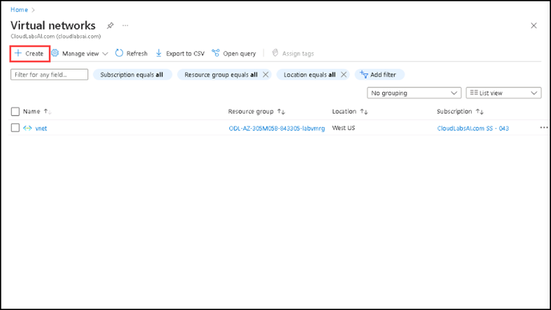
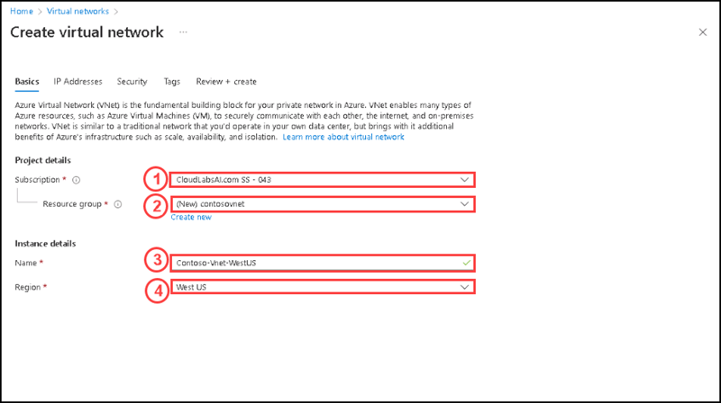
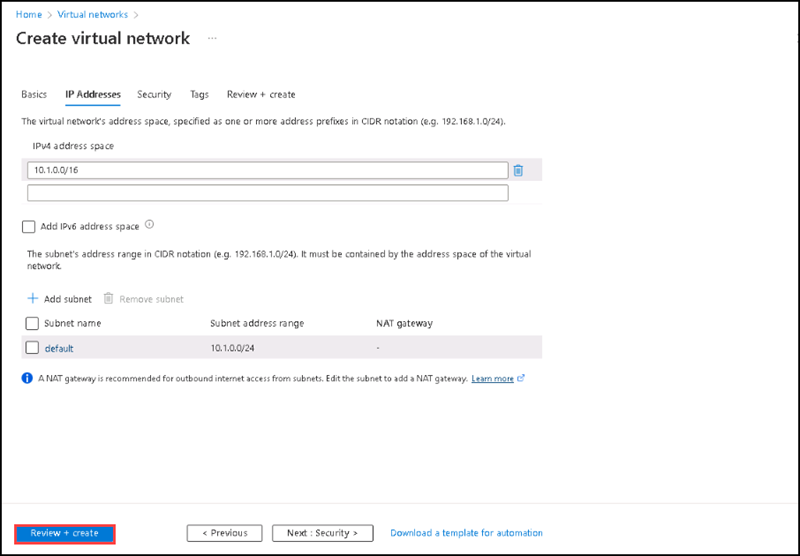
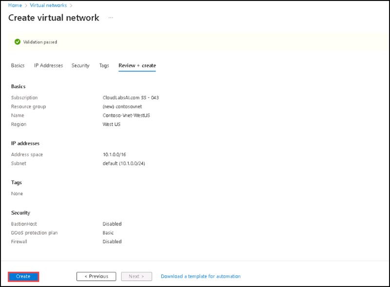
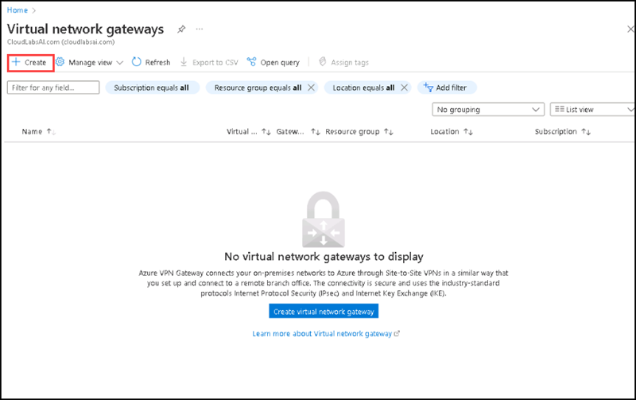
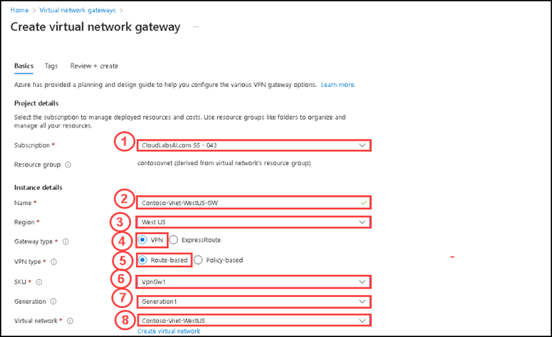
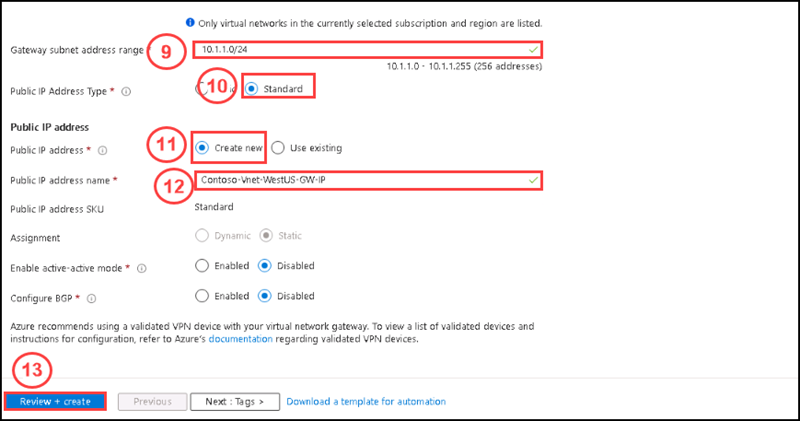

# Instructions

## Exercise 2: Create virtual networks and deploy a virtual network gateway

In this exercise, you are going to create three virtual networks having two same region and one different region. Then you will deploy a virtual network gateway into a virtual network to connect another virtual networks.

In this Exercise, you will have:

  + Task 1: Create virtual networks.
  + Task 2: Deploy a virtual network gateway.

### Estimated Timing: 120 minutes

### Task 1: Create virtual networks

In this task you are going to create three virtual networks. One will be in the West US region and the other two will be in the East US region.

#### Pre-requisites for this task

Complete Exercise 1.

#### Steps:

1. Search for **Virtual networks** on the **search** box of the **Home** page, then select **Virtual networks** from the list below.

2. Please select the **+ Create** on the **Virtual network** page.

    
  
3. On the **Create Virtual Network** page, please enter the following details on Basics tab:

    | Section | Values |
    | ------- | ------ |
    | Subscription | **Default** Select the default subscription |
    | Resource group | Select or create a new resource group to store the virtual network, here we will use a resource group named **contosovnet** |
    | Name | **Contoso-Vnet-WestUS** |
    | Region | **West US** |
  
    
  
4. Go to **Next: IP Addresses**, then on the **IP Addresses** tab, please review the default IP addresses and subnet given, then select **Review + create**.
  
    
  
5. Once the validation passed successfully, please click on **Create**.

    
 
6. After completing the deployment, please select **Go to resource**.

7. Repeat steps 2-5 to create two more virtual networks into the same resource group with the following information:

   **Second Virtual Network:**
  
    | Section | Values |
    | ------- | ------ |
    | Name | **Contoso-Vnet-EastUS** | 
    | Resource group | **contosovnet** |
    | Region | **East US** |
  
  
   For the **IP Addresses** tab keep the default settings.
  
   **Third Virtual Network:**
  
    | Section | Values |
    | ------- | ------ |
    | Name | **Contoso-Vnet-EastUS-A** |
    | Resource group | **contosovnet** |
    | Region | **East US** |
  
   For the **IP Addresses** tab keep the default settings.
  
   After completing this task, you deployed three virtual networks.
 
 ### Task 2: Deploy a virtual network gateway

Deploy a virtual network gateway into the hub virtual network. This virtual network gateway is required for the spokes to be able to use the hub as a gateway setting.

In this task you are going to deploy a virtual network gateway.

#### Pre-requisites for this task

Complete Exercise 1 & Exercise 2 - Task 1.

#### Steps:

1. Search for **Virtual network gateways** on the **search** box of the **Home** page, then select **Virtual network gateways** from the list below.

2. Please select **+ Create** on the **Virtual Network gateways**.

    
 
 3. On the **Basics** tab, enter or select the following settings, then click **Review + Create**.

     | Section | Values |
     | ------- | ------ |
     | Subscription | **Default** Select the default subscription |
     | Name | Enter **Contoso-Vnet-WestUS-GW** for the virtual network gateway name. |
     | Region | **West US** |
     | Gateway type| **VPN** |
     | VPN type | **Route based** |
     | SKU | **VpnGw1** |
     | Generation | **Generation1** |
     | Virtual network | **Contoso-Vnet-WestUS** |
     | Gateway subnet address range | **Keep the default** |
     | Public IP Address Type | **Standard** |
     | Public Address | **Create new** |
     | Public IP address name | **Contoso-Vnet-WestUS-GW-IP** |
  
     
     
  
4.  After the validation passed successfully, please select **Create**.

>**Note** : The deployment of a virtual network gateway can take about 30 minutes. You can move on to the next section while waiting for this deployment to complete.
 
 ### Clean up resources

>**Please do not delete resources you deployed in this lab. You will reference them in the next lab of this module.**

### Review

In this lab, you have:

+ Deployed three virtual networks.
+ Deployed a Virtual Network gateway.
 
