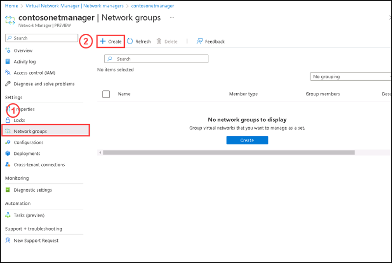
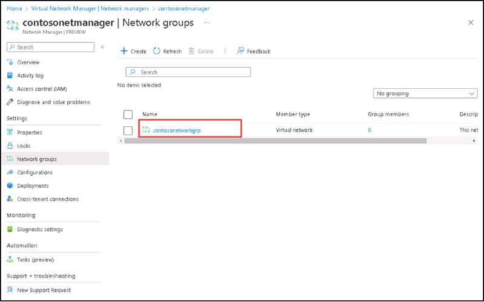
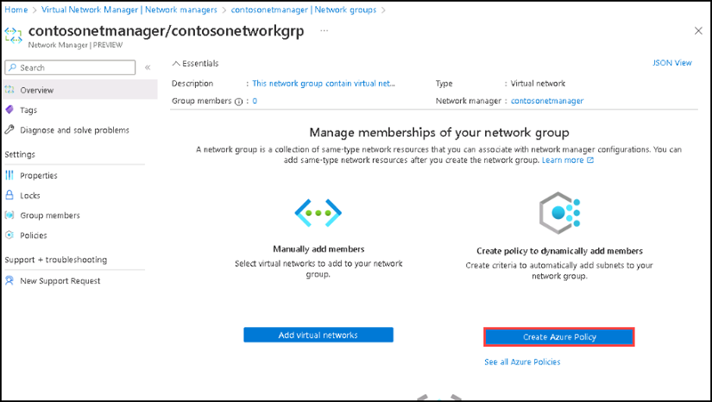
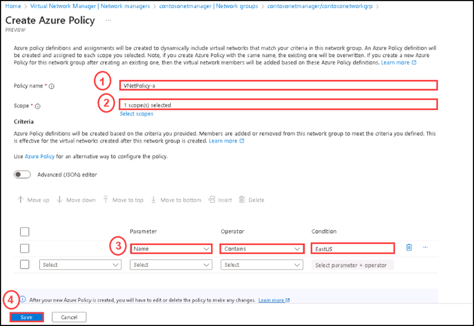
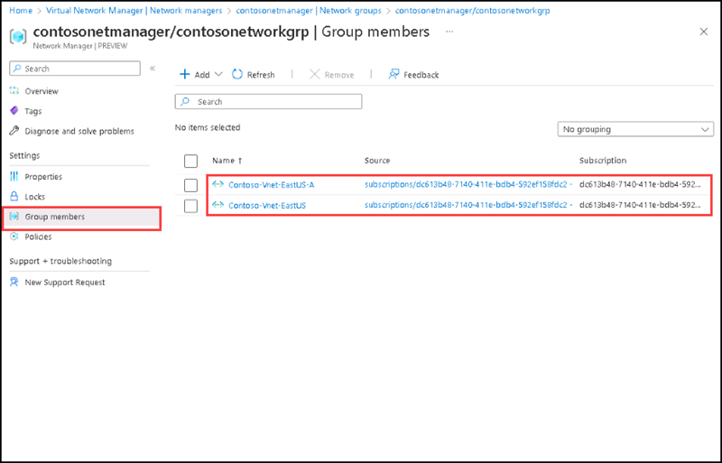

# Instructions

## Exercise 3: Create a dynamic network group

In this exercise you will set up a dynamic network group.

In this Exercise, you will have:

  + Task 1: Create a dynamic group.

### Task 1: Create a dynamic group.

#### Pre-requisites for this task

Complete Exercise 1 & Exercise 2.

#### Steps:

1. Go to your Azure Virtual Network Manager instance named **contosonetmanager**.

2. On the **contosonetmanager** page, please select **Network groups**, then select **+ Create**.

    

3. On the **Create network group** side screen please enter the name as **contosonetworkgrp**.

4. On the description please enter **This network group contain virtual networks in the East US region**, then click **Create**.

    

5. From the Network groups page, select the created network group to configure the network group.

    

6. On the Overview section of the **contosonetmanager/contosonetworkgrp** page, select **Create Azure Policy** under **Create policy to dynamically add members**.

    

7. On the **Create Azure Policy** page, select or enter the following information, then select **Save**.

    | Section | Values |
    | ------- | ------ |
    | Policy name | Enter **VNetPolicy-a** in the text box. |
    | Scope | Scope already selected, if its not, please select the current subscription. |
    | Parameter | Select **Name** from the drop-down.|
    | Operator | Select **Contains** from the drop-down. |
    | Condition | Enter **EastUS** to dynamically add the two East US virtual networks into this network group. |
  
    

8. Under **Settings**, select **Group Members** to view the membership of the group based on the conditions defined in Azure Policy. If its not seeing please keep refresh.

    

 ### Clean up resources

>**Please do not delete resources you deployed in this lab. You will reference them in the next lab of this module.**

### Review

In this lab, you have:

+ Deployed dynamic network group.
+ Added an azure policy to dynamically add the networks into the group.
