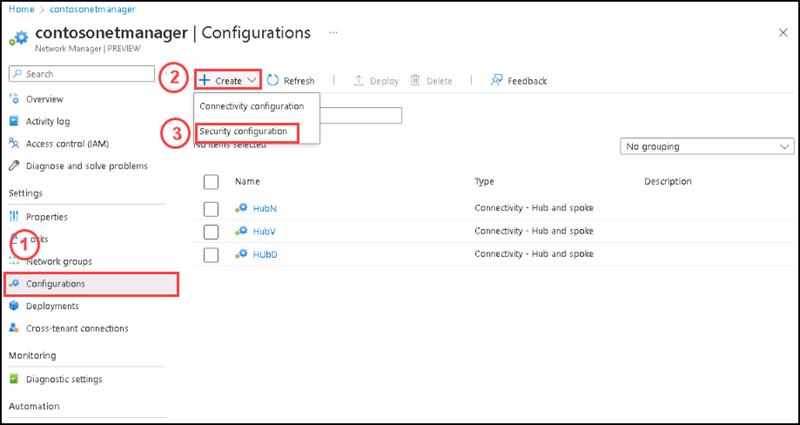
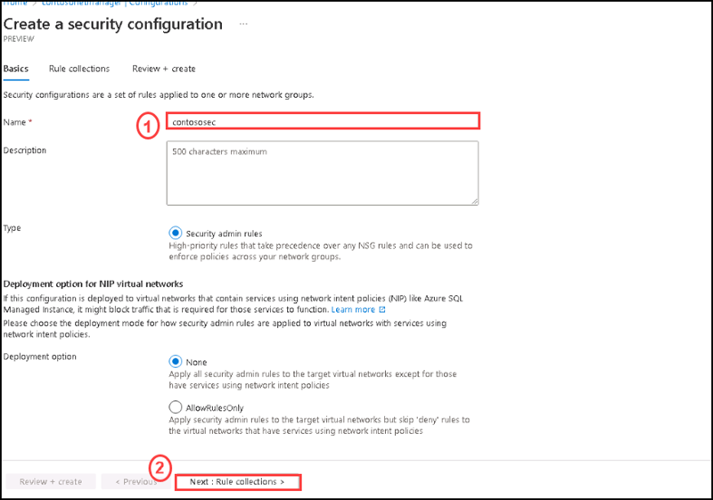
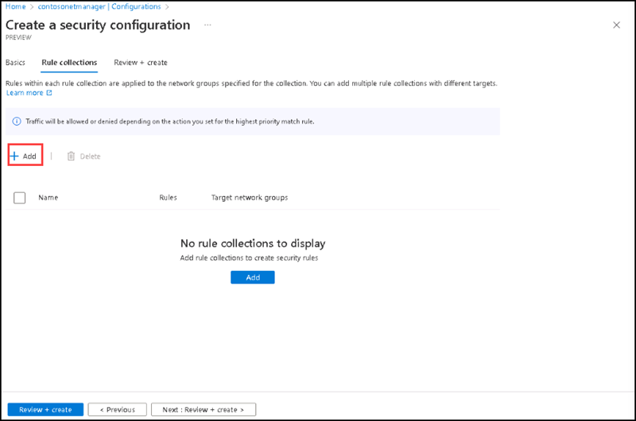
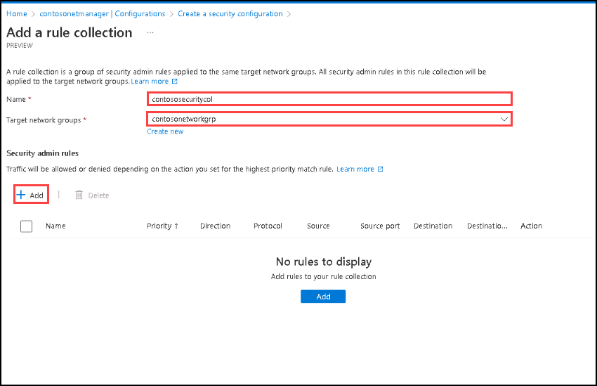
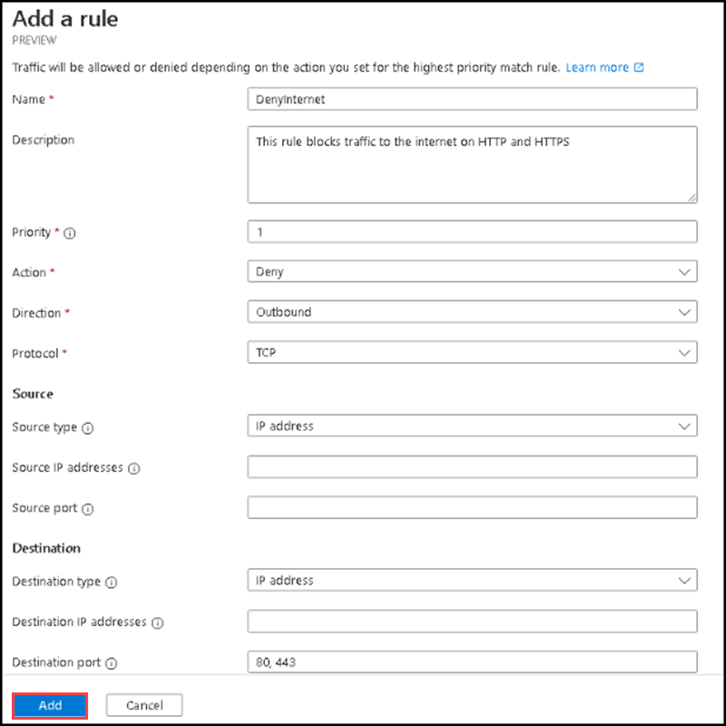
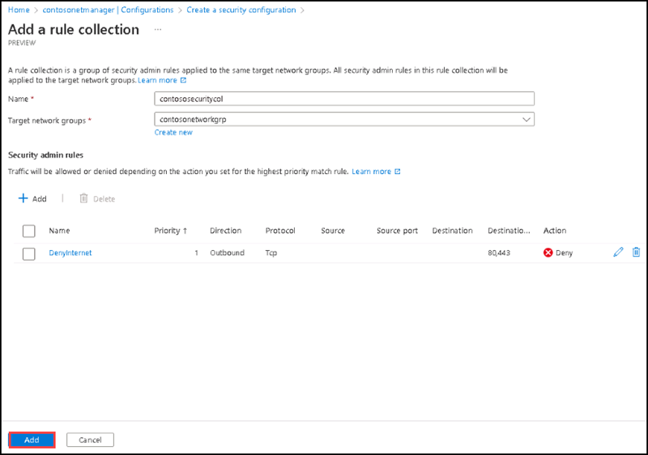
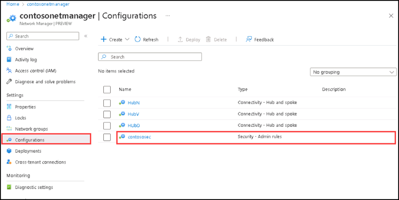
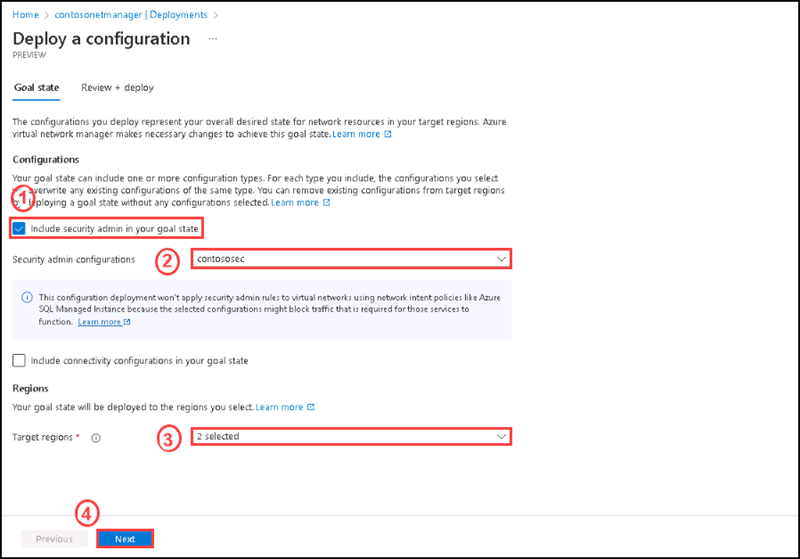
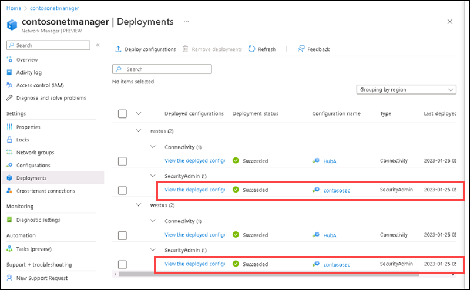

# Instructions

## Exercise 5: Create security configuration and Deploy the security admin configuration

A security admin configuration contains a set of rule collections. Each rule collection contains one or more security admin rules. You then associate the rule collection with the network groups that you want to apply the security admin rules to. In this exercise you will create security configuration and deploy security admin coniguration.

In this Exercise, you will have:

  + Task 1: Create security configuration.
  + Task 2: Deploy the security admin configuration.

### Estimated Timing: 30 minutes

### Task 1: Create security configuration

In this task, you are going to create secuirty configuration for the virtual network manager created on the previous exercise.

#### Pre-requisites for this task

Complete Exercise 1 & Exercise 2 & Exercise 3 & Exercise 4.

#### Steps:

1. Go to the **contosonetmanager** page, then select **Configuration** under **Settings**, then select + Create, and select SecurityAdmin from the menu to begin creating a SecurityAdmin configuration.

    

2. Enter the name **contososec** for the configuration, then select **Next: Rule collections**.

    

3. Under **Rule Coolections** tab, please select **+ Add**.

    

4. On the **Add a rule collection** page, enter the name as **contososecuritycol** then select **contosonetworkgrp** as Target network group. Then click **+ Add**.

    

5. On the **Add a rule** side screen, please enter the following details:

    | Section | Values |
    | ------- | ------ |
    | Name | **DenyInternet** |
    | Description | **This rule blocks traffic to the internet on HTTP and HTTPS** |
    | Priority | **1** |
    | Action | Select **Deny** |
    | Direction | Select **Outbound** |
    | Protocol | Select **TCP** |
    | Destination port | Enter **80, 443** |

    

6. After adding the security admin rule, please select **Add**.

    

7. Please select **Review + Create**, then select **Create**.

8. On the Configuration section, you can see the security configuration named **contososec**.

    

### Task 2: Deploy the security admin configuration

In this task, you are going to deploy the security admin configuration.

#### Pre-requisites for this task

Complete Exercise 1 & Exercise 2 & Exercise 3 & Exercise 4 & Exercise 5- Task 1

#### Steps:

1. Select **Deployments** under **Settings**, then select **Deploy configurations**.

2. Under Configurations, Select **Include security admin in your goal state** and the **contosoSec** configuration you created in the previous task. Then select West US and East US as the target regions and select Next.

    

3. Please select **Review + Deploy**, then select **Deploy**.

    You should now see the deployment show up in the list for the selected region. The deployment of the configuration can take several minutes to complete.

    

### Clean up resources

>**Please do not delete resources you deployed in this lab. You will reference them in the next lab of this module.**

### Review

In this lab, you have:

+ Created security configuration.
+ Deployed the security admin configuration.
