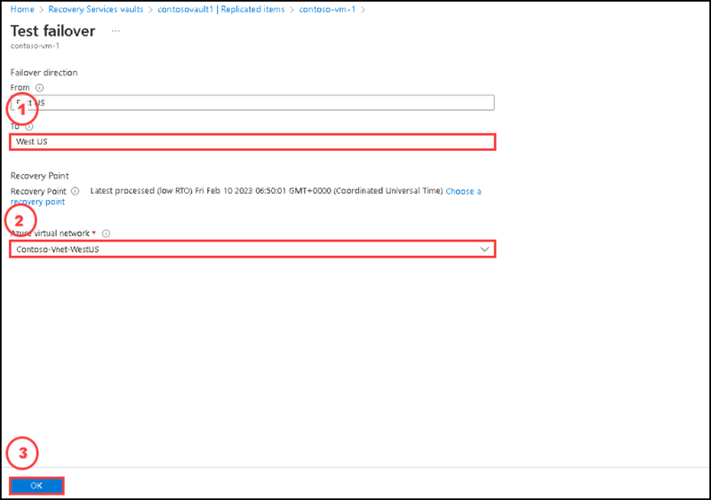

# Instructions

## Exercise 6: Verify deployment of configurations

In this Exercise, you will have:

  + Task 1: Verify from a Virtual network.
  + Task 2: Verify from a Virtual machine.
   
### Task 1: Verify from a Virtual network

#### Pre-requisites for this task

Complete Exercise 1 & Exercise 2 & Exercise 3 & Exercise 4 & Exercise 5

#### Steps:

1. Go to **Contoso-Vnet-EastUS** virtual network and select **Network Manager** under **Settings**. You'll see the **HubA** connectivity configuration applied.

2. Go to **Contoso-Vnet-WestUS** virtual network and select **Peerings** under **Settings**. You'll see virtual network peerings created by Virtual Network Manager with ANM in the name.

3. Go to **Contoso-Vnet-EastUS** virtual network and select **Network Manager** under **Settings** and select the **SecurityAdmin** tab to see the security admin rules applied to this virtual network.

### Task 2: Verify from a Virtual machine

In this task you are going to dpeloy a test virtual machine into **Contoso-Vnet-EastUS** virtual network and then verify the connection configurations.

#### Pre-requisites for this task

Complete Exercise 1 & Exercise 2 & Exercise 3 & Exercise 4 & Exercise 5

#### Steps:

1. Go to home page and search for virtual machines in the search box, then select **Virtual machines** from the below list.

2. On the Virtual machines page, please select **+ Create** and then select **Azure virtual machine**.

3. On the **Basics** tab of the **Create a virtual machine** page, please enter the following details, then select **Next:Disk>** from the bottom.

    | Section | Values |
    | ------- | ------ |
    | Subscription | Select the default subscription |
    | Resource group | **contosovnet** |
    | Virtual machine name | **contosotest** |
    | Region | **East US** |
    | Image | **Windows Server 2019 Datacenter - x64 Gen2** |
    | VM Architecture | **X64** |
    | Size | **Standard_DS1_v2 - 1 vcpu, 3.5 GiB memory** |
    | User | **azureuser** |
    | Password | **Passw0rd123!** |
    | Confirm password | **Passw0rd123!** |
    
    
  
  
4. On the **Disks** tab, for **OS disk type** please select **Standard SSD (Locally-redundant storage), then select **Next:Networking>**.

5. On the **Networking** tab for **Virtual network** please select **Contoso-Vnet-EastUS** virtual network, keep the default values of other settings as it is, then select **Review + Create**.

  

6. After Validation passed successfully, please select **create**.

7. Once completed the deployment, please go to the **contosotest** virtual machine created in **Contoso-Vnet-EastUS** and select **Networking** under **Settings**. Select **Outbound port rules** and you'll see the security admin rule applied.

  

8. Select the network interface name.
  
   

9. Please select **Effective Routes** under **Help** to see the routes for the virtual network peerings. The 10.1.0.0/16 route with the next hop of VNetGlobalPeering is the route to the hub virtual network. The 10.3.0.0/16 route with the next hop of ConnectedGroup is route to the other spoke virtual network. All spokes virtual network will be in a ConnectedGroup when Transitivity is enabled.

 

### Clean up resources

>**Please do not delete resources you deployed in this lab. You will reference them in the next lab of this module.**

### Review

In this lab, you have:

+ Verified from a Virtual network.
+ Verified from a Virtual machine.
    
