# Instructions

## Exercise 7: Create a Load Balancer and Test the Load balancer

In this exercise, you will use Azure Virtual Networks created on the previous exercise to deploy a load balancer and test it.

In this Exercise, you will have:

  + Task 1: Create load balancer.
  + Task 2: Create NAT gateway.
  + Task 3: Create virtual machines.
  + Task 4: Install IIS.
  + Task 5: Test the load balancer.

### Estimated Timing: 80 minutes

### Task 1: Create load balancer.

In this task, you'll create a zone redundant load balancer that load balances virtual machines. With zone-redundancy, one or more availability zones can fail and the data path survives as long as one zone in the region remains healthy.

During the creation of the load balancer, you'll configure:

+ Frontend IP address
+ Backend pool
+ Inbound load-balancing rules
+ Health probe

#### Pre-requisites for this task

Complete Exercise 1 & Exercise 2 & Exercise 3 & Exercise 4 & Exercise 5 & Exercise 6.

#### Steps:

1. In the search box at the top of the portal, enter **Load balancer**. Select **Load balancers** in the search results.

2. In the **Load balancer** page, select **+ Create**.

    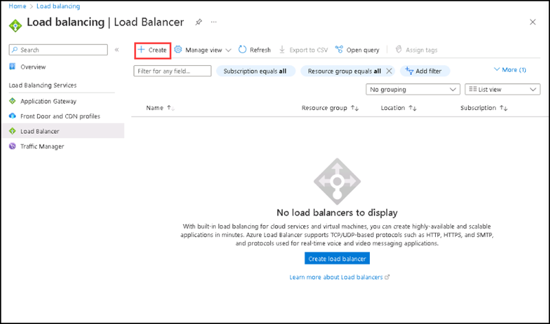

3. In the **Basics** tab of the **Create load balancer** page, enter or select the following information:

    | Section | Values |
    | ------- | ------ |
    | Subscription | **Default** Select the default subscription |
    | Resource group | Select **contosovnet** |
    | Name | Enter **contosoLB** for the Load balancer name. |
    | Region | **East US** |
    | SKU | Leave the default **Standard**. |
    | Type | Select **Public** |
    | Tier | Leave the default **Regional** |
    
  
4. Select Next: Frontend IP configuration at the bottom of the page.

5.  In **Frontend IP configuration**, select **+ Add a frontend IP configuration**.

6. On the **Add Frontend IP Configuration** side screen, Enter **contosoIP** in Name box, Select **IPv4** for the IP version, then Select **IP address** for the IP type.

7. Select Create new in Public IP address.

8. In Add a public IP address, enter **contosopublicIP** for Name.

9. Select **Zone-redundant** in Availability zone.

10. Leave the default of **Microsoft Network** for Routing preference.

11. Select Add.

12. Select **Next: Backend pools** at the bottom of the page.

13. In the **Backend pools** tab, select **+ Add a backend pool**.

14. Enter **contosoBackendPool** for Name in Add backend pool.

15. Select **contoso-Vnet-EastUS** in Virtual network.

16. Select **IP Address** for Backend Pool Configuration.

17. Select **Save**.

18. Select **Next: Inbound rules** at the bottom of the page.

19. Under **Load balancing rule** in the Inbound rules tab, select **+ Add a load balancing rule**.

20. In **Add load balancing rule** side screen, please enter or select the following information:

    | Section | Values |
    | ------- | ------ |
    | Name | **contosoHTTPRule** |
    | Frontend IP address | Select **contosoIP** |
    | Backend pool | Select **contosoBackendPool** |
    | Protocol | Select TCP |
    | Port | Enter 80 |
    | Backend port | Enter 80 |
    | Health probe | Select **Create new**. In Name, enter **contosoHealthProbe**. Select **TCP** in Protocol. Leave the rest of the defaults, and select OK. |
    | Session persistence | Select **None** |
    | Idle timeout (minutes) | Enter or select 15 |
    | TCP reset | Select **Enabled** |
    | Floating IP | Select **Disabled** |
    | Outbound source network address translation (SNAT) | Leave the default of **(Recommended) Use outbound rules to provide backend pool members access to the internet** |
  
21. Select **Add** on the **Add load balancing rule** side screen.

22. Select the **Review + create** button at the bottom of the **Create load blanacer**page, then select **Create**.

23. After completing the deployment, please select **Go to resource**.

You can see the newly created Load balancer named **ContosoLB**.

   
### Task 2: Create NAT gateway

In this task, you'll create a NAT gateway for outbound internet access for resources in the virtual network. 

#### Pre-requisites for this task

Complete Exercise 1 & Exercise 2 & Exercise 3 & Exercise 4 & Exercise 5 & Exercise 6.

#### Steps:

1. In the search box at the top of the portal, enter **NAT gateway**. Select **NAT gateways** in the search results.

2. In NAT gateways, select **+ Create**.

    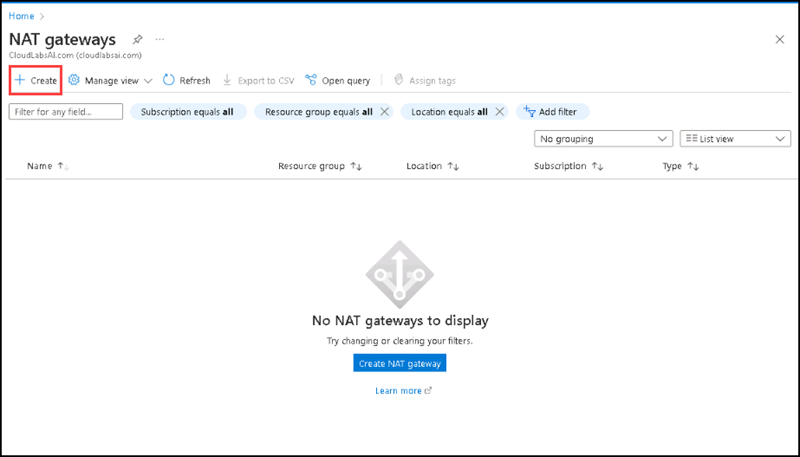

3. In Create network address translation (NAT) gateway, enter or select the following information:

    | Section | Values |
    | ------- | ------ |
    | Subscription | Default subscription |
    | Resource group | Select **contosovnet** |
    | NAT gateway name | **contosoNatGateway** |
    | Region | **East US** |
    | Availability zone | **None** |
    | Idle timeout (minutes) | **15** |

    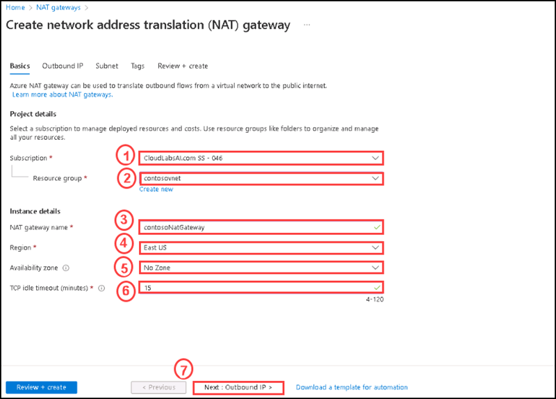

4. Select the **Outbound IP** tab or select **Next: Outbound IP** at the bottom of the page.

5. In **Outbound IP**, select **Create a new public IP address** next to Public IP addresses.
  
    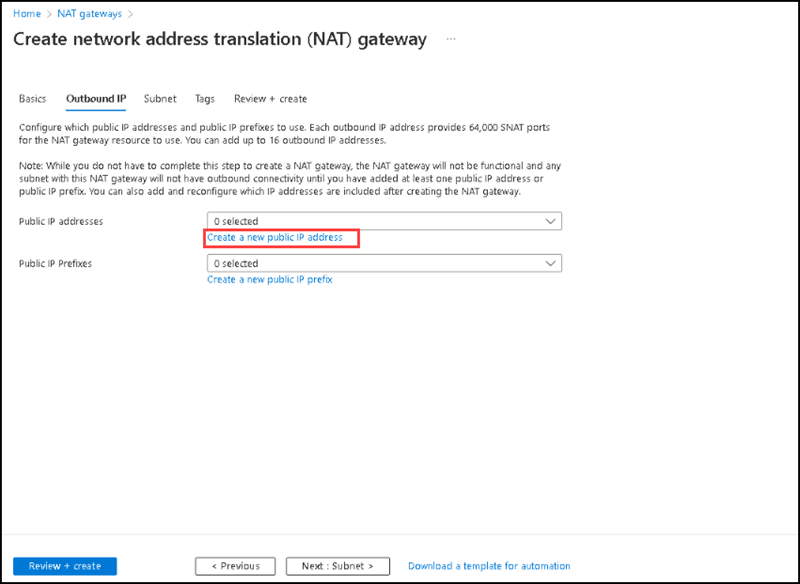

6. Enter contosoNATgatewayIP in Name, then select **Ok**.

    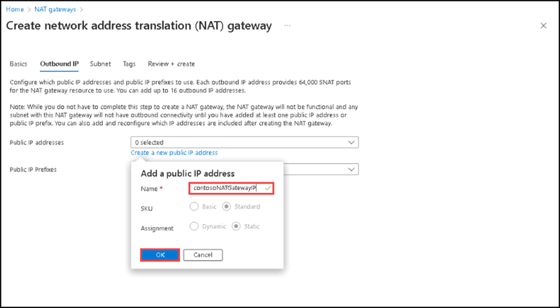

7. Select the **Subnet** tab or select the **Next: Subnet** button at the bottom of the page

8. In **Virtual network** in the Subnet tab, select **contoso-Vnet-EastUS**, then select **default** under **Subnet name**.

9. Select the **Review + create** button at the bottom of the page.

10. Select **Create**.

11. After completing the deployment, please select **Go to resource**.

You can see the **contosoNatGateway** under the **Resources** list of **contosovnet** resource group's **Overview** section.

### Task 3: Create virtual machines

In this task, you'll create two Virtual machines (contosoVM1 and contosoVM2) in two different zones (Zone 1, and Zone 2).

These VMs are added to the backend pool of the load balancer that was created earlier. 

#### Pre-requisites for this task

Complete Exercise 1 & Exercise 2 & Exercise 3 & Exercise 4 & Exercise 5 & Exercise 6.

#### Steps:

1. In the search box at the top of the portal, enter **Virtual machine**. Select **Virtual machines** in the search results.

2. In Virtual machines, select **+ Create > Azure virtual machine**.

3. In **Create a virtual machine**, enter or select the following values in the **Basics** tab:

    | Section | Values |
    | ------- | ------ |
    | Subscription | Default subscription |
    | Resource group | Select **contosovnet** |
    | Virtual machine name | **contosoVM1** |
    | Region | **East US** |
    | Availability Options | Select **Availability zones** |
    | Availability zone | Select **Zone 1** |
    | Security type | Select **Standard** |
    | Image | Select **Windows Server 2019 Datacenter-X64-Gen2** |
    | Azure Spot instance | Leave the default of unchecked. |
    | Size | Select **Standard_DS1-V2 - 1 -vcpu, 3.5 Gib memory** |
    | User name | **azureuser** |
    | Password | **Pa$$w0rd123!** |
    | Confirm Passowrd | **Pa$$w0rd123!** |
    | Public inbound ports | Select **None** |
  
    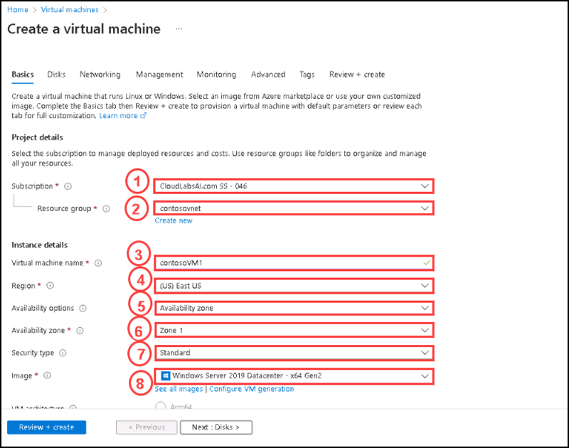 
    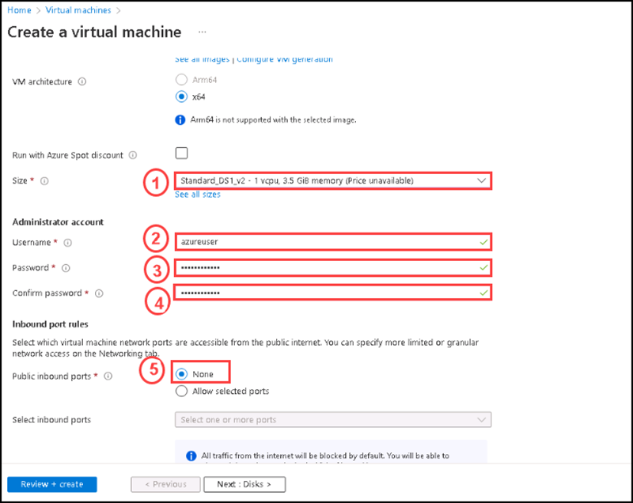
  
4. Select **Next: Disks**, then for **OS Disk type** select **Standard SSD**, then Select the **Networking** tab or  **Next: Networking**.

5. In the **Networking** tab, select or enter the following information:

    | Section | Values |
    | ------- | ------ |
    | Virtual network | Select **contoso-Vnet-EastUS** |
    | Subnet | Select **default** |
    | Public IP | Select **None** |
    | NIC network security group | Select **Advanced** |
    | Configure network security group | Skip this setting until the rest of the settings are completed. Complete after **Select a backend pool**. |
    | Delete NIC when VM is deleted | Leave the default of **unselected**. |
    | Accelerated networking | Leave the default of **selected**. |
    | Place this virtual machine behind an existing load balancing solution? | Select **Checked** |
    | Load-balancing options | Select **Azure load balancer** |
    | Select a load balancer | Select **contosoLB** |
    | Select a backend pool | Select **contosoBackendPool** |
    | After entered all options above please go to **Configure network security group** | Select **Create new**. In the Create network security group, enter **contosoNSG** in Name. Under Inbound rules, select **+Add an inbound rule**. On the side screen, Under Service, select **HTTP**. Under Priority, enter **100**. In Name, enter **contosoNSGRule**. Select **Add**. Select **OK** |
  
6. Select **Review + Create**, then select **Create**.

You have created contosoVM1 virtual machine.

7. Follow the steps 1 through 6 to create another VM with the following values and all the other settings the same as contosoVM1: 

    | Section | Values |
    | ------- | ------ |
    | Virtual machine name | **contosoVM2** |
    | Availability zone | **Zone 2** |
    | Network security group | Select the existing **contosoNSG** |
  
  You have created contosoVM2 virtual machine.
  
 ### Task 4: Install IIS

In this task you are going to install IIS server to the newly created virtual machine.

#### Pre-requisites for this task

Complete Exercise 1 & Exercise 2 & Exercise 3 & Exercise 4 & Exercise 5 & Exercise 6.

#### Steps:

1. Select the Virtual machine contosoVM1.

2. On the **Overview** page, select **Connect**, then **Bastion**.

    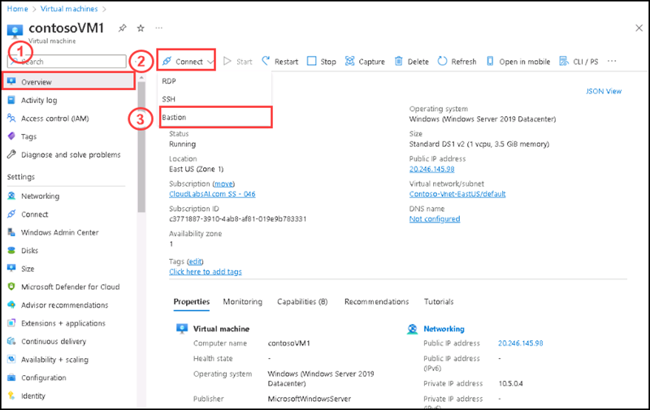

3. Select **Deploy Bastion**. It will take several minutes to deploy bastion.

    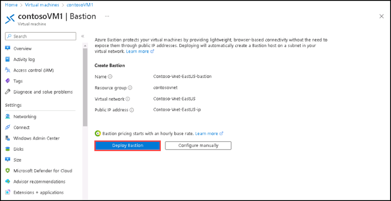

4. After completing the deployment please enter contosoVM1 username : **azureuser** and password: **Pa$$w0rd123!**, and keep **authentication type** as **Password** then select **connect**. 

    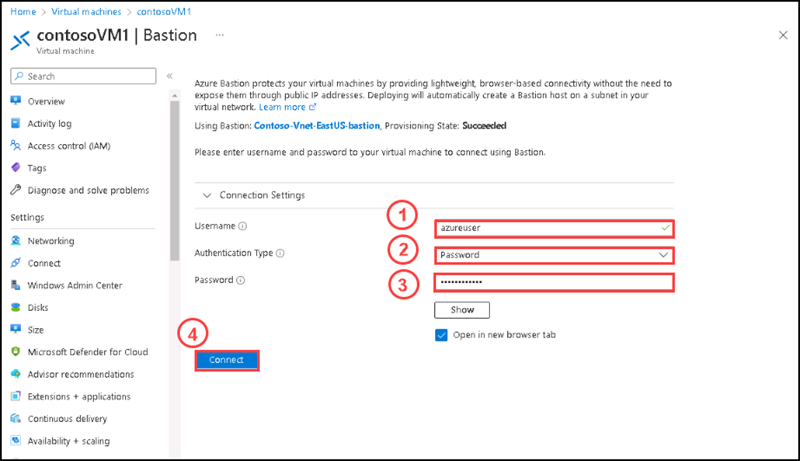


5. Once contosoVM1 opens in the browser, please open the Powershell and enter the following scripts:

    In the PowerShell Window, run the following commands to:

    + Install the IIS server
    + Remove the default iisstart.htm file
    + Add a new iisstart.htm file that displays the name of the VM:

    ```powershell
    # Install IIS server role
    Install-WindowsFeature -name Web-Server -IncludeManagementTools

    # Remove default htm file
    Remove-Item  C:\inetpub\wwwroot\iisstart.htm

    # Add a new htm file that displays server name
    Add-Content -Path "C:\inetpub\wwwroot\iisstart.htm" -Value $("Hello World from " + $env:computername)
    ```

    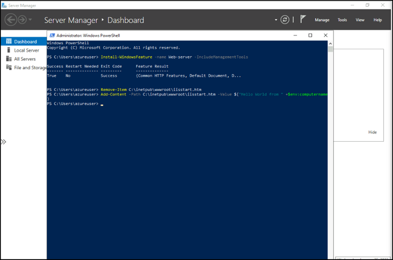

6. Close the Bastion session with contosoVM1.

 
 ### Task 5: Test the load balancer

In this task, you are going to test the load balnacer deployed on the previous tasks.

#### Pre-requisites for this task

Complete Exercise 1 & Exercise 2 & Exercise 3 & Exercise 4 & Exercise 5 & Exercise 6.

#### Steps:

1. In the search box at the top of the page, enter Public IP. Select Public IP addresses in the search results.

2. In Public IP addresses, select contosoPublicIP.

    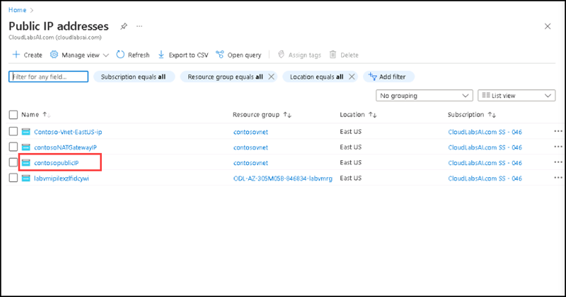

3. Copy the IP address. Paste the public IP into the address bar of your browser. 

    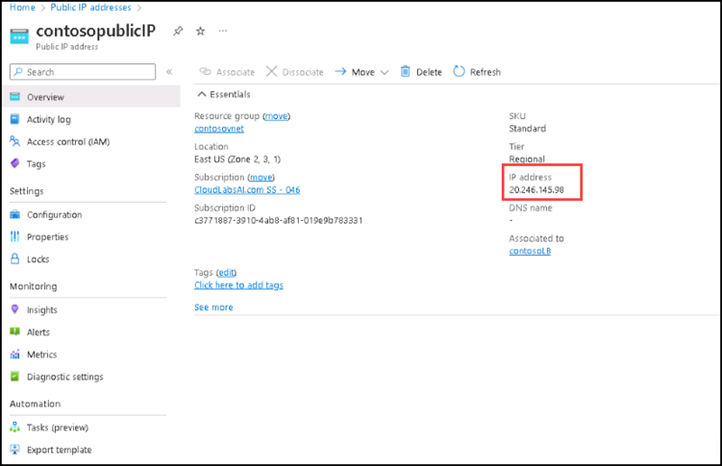

4. The custom VM page of the IIS Web server is displayed in the browser.

    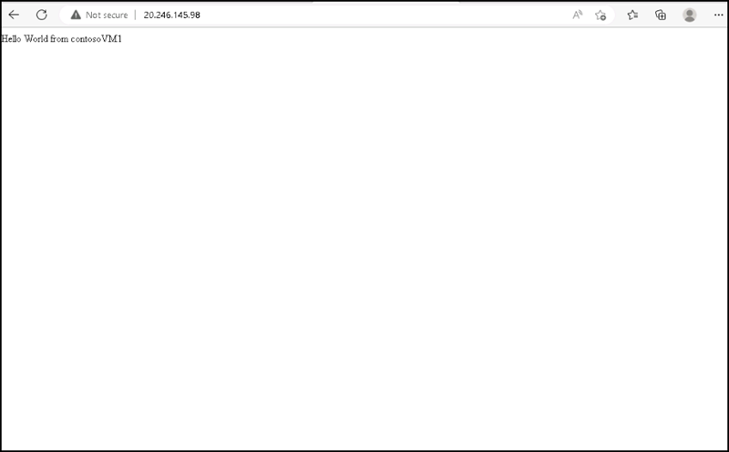

You have successfully tested the Load balancer.

### Clean up resources

   >**Note**: Remember to remove any newly created Azure resources that you no longer use. Removing unused resources ensures you will not see unexpected charges, although keep in mind that Azure policies do not incur extra cost.
   
   >**Note**:  Don't worry if the lab resources cannot be immediately removed. Sometimes resources have dependencies and take a longer time to delete. It is a common Administrator task to monitor resource usage, so just periodically review your resources in the Portal to see how the cleanup is going.

   >**When you're done, delete the resource group. Deleting the resource group deletes the storage account, the Azure file share, virtual machine and any other resources that you deployed inside the resource group.**

1. Select Home and then Resource groups.

2. Select the resource group you want to delete.

3. If the lock is restricted to delete the resource group, please go to the Locks under settings tab of the resource group and select delete.

3. Select Delete resource group. A window opens and displays a warning about the resources that will be deleted with the resource group.

4. Enter the name of the resource group, and then select Delete.
    
#### Review

In this lab, you have:

- Deployed a Load balancer.
- Configured a Nat gateway.
- Created two virtual machines.
- Install IIS on the newly created virtual machine.
- Tested the Load balancer.
