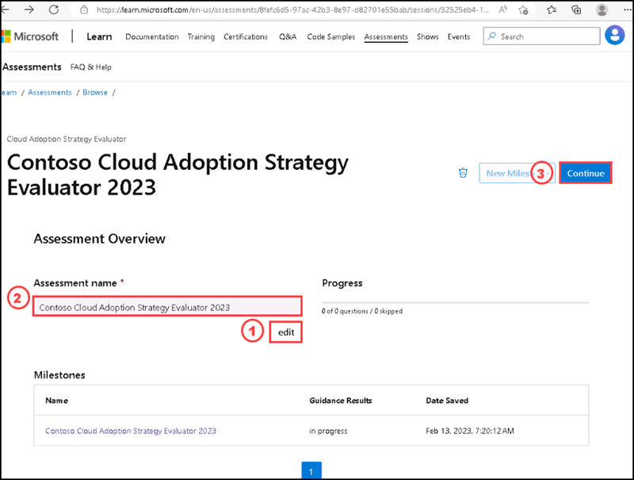
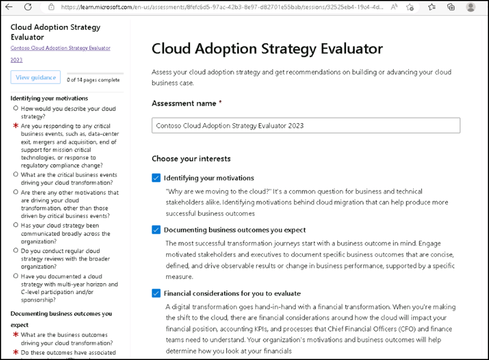
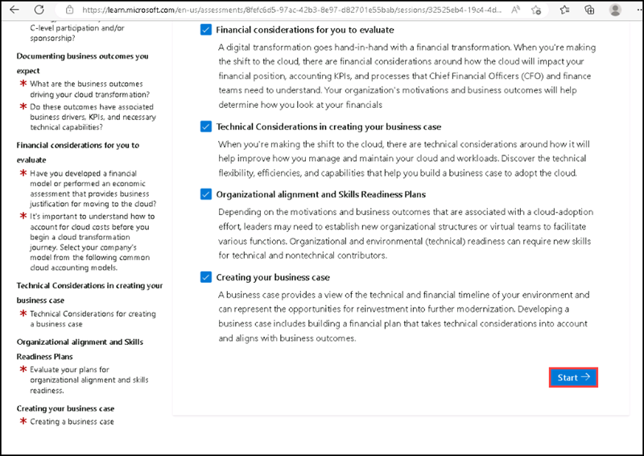
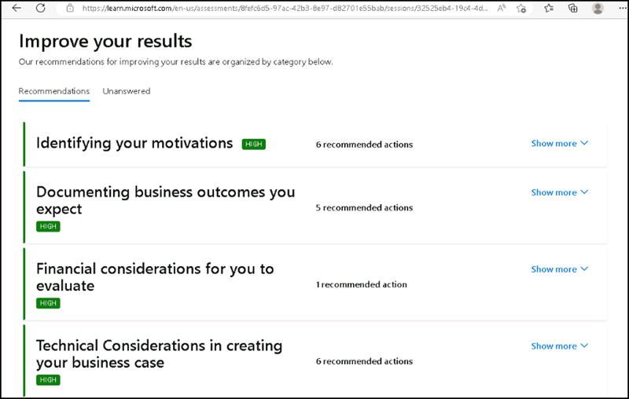

## Instructions

## Exercise 1: Prepare and deploy Cloud Adoption plan and customize it.

In this Exercise, you will have:

+ Task 1: Document the business strategy
+ Task 2: Assess the digital estate
+ Task 3: Create a cloud adoption plan

## Estimated timing: 60 minutes

### Task 1: Document the business strategy

The Cloud Adoption Framework includes the Cloud Adoption Strategy Evaluator, which can assist you in evaluating your overall cloud adoption strategy. This assessment provides recommendations based on cloud economics principles to assist your organization in developing a strong business case and enabling successful cloud adoption.

#### Pre-requisites for this task

A Microsoft account

#### Steps

 Strategy define business justification and expected adoption outcomes. The Cloud Adoption Strategy Evaluator evaluates your strategy posture in the following areas of the Strategy methodology:
 
   + Identifying motivations
   + Documenting expected business outcomes
   + Evaluating financial considerations
   + Technical considerations in creating a business case

1. Please select **[Cloud Adoption Strategy Evaluator](https://learn.microsoft.com/en-us/assessments/8fefc6d5-97ac-42b3-8e97-d82701e55bab/sessions/32525eb4-19c4-4d71-a803-a80a7d959850?mode=pre-assessment&id=8fefc6d5-97ac-42b3-8e97-d82701e55bab&session=32525eb4-19c4-4d71-a803-a80a7d959850)** to assesses your strategy posture across distinct areas. Please sign in with your microsoft account.

2. Select **Edit** and enter the name **Contoso Cloud Adoption Strategy Evaluator 2023**, then select **Save**, then select **Continue**.

   

3. On the **Choose your interests** section please select all options and then select **Start**.

   
   
   

4. On **Identifying your motivations** Please select the answers for each questions:

   1. How would you describe your cloud strategy?
      
       Please select : **Require optimization** then select **Next**

   2. Are you responding to any critical business events, such as, data-center exit, mergers and acquisition, end of support for mission critical technologies, or response to regulatory compliance change?

      Please select : **Yes** then select **Next**
      
   3. What are the critical business events driving your cloud transformation?

      Please select : **Merger, acquisition or divestiture** then select **Next**
      
   4. Are there any other motivations that are driving your cloud transformation, other than those driven by critical business events?   
      
       Please select : **Cost savings**, **Optimization of internal operations**, **Increase in business agility**, **Scaling to meet market and/or geographic demands**, **Improved customer experiences and engagements**, **Transformation of products or services**, **Preparation for, or building new technical capabilities** then select **Next**
  
   5. Has your cloud strategy been communicated broadly across the organization?
      
      Please select : **Yes** then select **Next**
      
   6. Do you conduct regular cloud strategy reviews with the broader organization?  

       Please select : **Yes, consistently** then select **Next**

   7. Have you documented a cloud strategy with multi-year horizon and C-level participation and/or sponsorship?

      Please select : **No, I would like to document a strategy** then select **Next**

      

5. On **Documenting business outcomes you expect** section, Please select the answers for each questions:

    1. What are the business outcomes driving your cloud transformation?
       
       Please select : All of the options except None of the above, then select **Next**
    
    2. Do these outcomes have associated business drivers, KPIs, and necessary technical capabilities?

       Please select : **Yes** then select **Next**
6. On **Financial considerations for you to evaluate** section, Please select the answers for each questions:    
    
    1. Have you developed a financial model or performed an economic assessment that provides business justification for moving to the cloud?

       Please select : **Yes** then select **Next**

    2. It's important to understand how to account for cloud costs before you begin a cloud transformation journey. Select your company's model from the following common cloud accounting models.

       Please select : **Cost center model** then select **Next**

 7. On **Technical Considerations in creating your business case** Please select the answers for each questions: 

     1. Do you have an understanding of how your resources need to scale out depending on usage, utilization, and demand in a cloud context?

        Please select : **Yes**
     
     2. Have you identified the workloads that need to be built with highly available infrastructure?

        Please select : **Yes**
      
     3. Have you identified the workloads that have specific Security and Compliance requirements?

        Please select : **Yes**
     
     4. Have you identified resources where you can rightsize and optimize capacity?

        Please select : **Yes**

     5. Have you selected an initial cloud workload?

        Please select : **Yes**

     6. Are you familiar with the Azure Hybrid Benefit and how to use it to optimize licensing costs?

        Please select : **Yes**
     
     7. Are you familiar with Azure Reservations and pay-as-you-go pricing models?
       
       Please select : **Yes**
     
     8. Are you familiar with Azure Spot Virtual Machines and how they can help you save?

        Please select : **Yes**
        
     9. Do you have a strong understanding of the baseline financial data in your on-premises datacenter today?

        Please select : **Yes**, then select **Next**.
        
8. On **Organizational alignment and Skills Readiness Plans** section, Please select the answers for each questions:

   1. Do the appropriate people and teams have foundational level knowledge of cloud services and how those services are provided with Microsoft Azure?

      Please select : **Yes**
   
   2. Do your developers understand cloud computing concepts as well as, general cloud computing models, and services such as Public, Private and Hybrid cloud and IaaS, PaaS and SaaS?

      Please select : **Yes**
   
   3. Do you have a Cloud Center of Excellence (CCoE) staffed with cross-discipline members, For example, CTO, Finance, DevOps and Talent Management?

      Please select : **Yes**, then select **Next**.

9. On **Creating your business case** section, Please select the answers for each questions:

   1. Do you understand the key components of building a business case?

      Please select : **Yes**

   2. Do you know how to build a digital transformation timeline?

      Please select : **Yes**, then select **View guidance**.

10. Review the evaluation of your strategy, and select **guidance** tab that can help you improve your business case for cloud adoption.

11. Scroll down and at the **Improve your results** section, please select **Recommendations** tab and expand each section by clicking on **Show more**. Please review it and you can document it in Microsoft word or Excel file.

    

### Task 2: Assess the digital estate

#### Gather inventory data for a digital estate

Developing an inventory is the first step for digital estate planning. In this process, a list of IT assets that support specific business functions are collected for later analysis and rationalization. This article assumes that a bottom-up approach to analysis is most appropriate for planning. 

#### Take inventory of a digital estate

The inventory that supports a digital estate changes depending on the desired digital transformation and corresponding transformation journey.

- **Cloud migration:** We often recommend that during a cloud migration, you collect the inventory from scanning tools that create a centralized list of all virtual machines and servers. Some tools can also create network mappings and dependencies, which help define workload alignment.

- **Application innovation:** Inventory during a cloud-enabled application innovation effort begins with the customer. Mapping the customer experience from start to finish is a good place to begin. Aligning that map to applications, APIs, data, and other assets creates a detailed inventory for analysis.

- **Data innovation:** Cloud-enabled data innovation efforts focus on the product or service. An inventory also includes a mapping of the opportunities for disrupting the market, as well as the capabilities needed.

- **Security:** Inventory provides security the understanding to help assess, protect, and monitor the organization's assets.

#### Accuracy and completeness of an inventory

An inventory is rarely complete in its first iteration. We strongly recommend the cloud strategy team aligns stakeholders and power users to validate the inventory. When possible, use additional tools like network and dependency analysis to identify assets that are being sent traffic, but that are not in the inventory.

#### Next steps

After an inventory is compiled and validated, it can be rationalized. Inventory rationalization is the next step to digital estate planning.

#### Rationalize the digital estate

Cloud rationalization is the process of evaluating assets to determine the best approach to hosting them in the cloud. After you've determined an approach and aggregated an inventory, cloud rationalization can begin. Cloud rationalization discusses the most common rationalization options.

#### Traditional view of rationalization

It's easy to understand rationalization when you visualize the traditional process of rationalization as a complex decision tree. Each asset in the digital estate is fed through a process that results in one of five answers (the five Rs of rationalization). For small estates, this process works well. For larger estates, it's inefficient and can lead to significant delays. Let's examine the process to see why. Then we'll present a more efficient model.

**Inventory:** A thorough inventory of assets, including applications, software, hardware, operating systems, and system performance metrics, is required for completing a full rationalization by using traditional models.

**Quantitative analysis:** In the decision tree, quantitative questions drive the first layer of decisions. Common questions include the following:

- Is the asset in use today?
- If so, is it optimized and sized properly?
- What dependencies exist between assets? These questions are vital to the classification of the inventory.

**Qualitative analysis:** The next set of decisions requires human intelligence in the form of qualitative analysis. Often, the questions that come up here are unique to the solution and can be answered only by business stakeholders and power users. These decisions typically delay the process, slowing things down considerably. This analysis generally consumes 40 to 80 FTE hours per application.

**Rationalization decision:** In the hands of an experienced rationalization team, the qualitative and quantitative data creates clear decisions. Unfortunately, teams with a high degree of rationalization experience are expensive to hire or take months to train.

#### Rationalization at enterprise-scale

If this effort is time consuming and daunting for a 50-VM digital estate, imagine the effort that's required to drive business transformation in an environment with thousands of VMs and hundreds of applications. The human effort required can easily exceed 1,500 FTE hours and nine months of planning.

While full rationalization is the end state and a great direction to move in, it seldom produces a high ROI (return on investment) relative to the time and energy that's required.

When rationalization is essential to financial decisions, it's worth considering a professional services organization that specializes in cloud rationalization to accelerate the process. Even then, full rationalization can be a costly and time-consuming effort that delays transformation or business outcomes.

The rest of this article describes an alternative approach, known as incremental rationalization.

#### Incremental rationalization

The complete rationalization of a large digital estate is prone to risk and can suffer delays because of its complexity. The assumption behind the incremental approach is that delayed decisions stagger the load on the business to reduce the risk of roadblocks. Over time, this approach creates an organic model for developing the processes and experience required to make qualified rationalization decisions more efficiently.

#### Inventory: Reduce discovery data points

Few organizations invest the time, energy, and expense in maintaining an accurate real-time inventory of the full digital estate. Loss, theft, refresh cycles, and employee onboarding often justify detailed asset tracking of end-user devices. The ROI of maintaining an accurate server and application inventory in a traditional, on-premises datacenter is often low. Most IT organizations have more urgent issues to address than tracking the usage of fixed assets in a datacenter.

In a cloud transformation, inventory directly correlates to operating costs. Accurate inventory data is required for proper planning. Unfortunately, current environmental scanning options can delay decisions by weeks or months. Fortunately, a few tricks can accelerate data collection.

Agent-based scanning is the most frequently cited delay. The robust data that's required for a traditional rationalization can often only be collected with an agent running on each asset. This dependency on agents often slows progress, because it can require feedback from security, operations, and administration functions.

In an incremental rationalization process, an agentless solution could be used for an initial discovery to accelerate early decisions. Depending on the level of complexity in the environment, an agent-based solution might still be required, but it can be removed from the critical path to business change.

#### Quantitative analysis: Streamline decisions

Regardless of the approach to inventory discovery, quantitative analysis can drive initial decisions and assumptions. This is especially true when trying to identify the first workload or when the goal of rationalization is a high-level cost comparison. In an incremental rationalization process, the cloud strategy team and the cloud adoption teams limit the five Rs of rationalization to two concise decisions and only apply those quantitative factors. This streamlines the analysis and reduces the amount of initial data that's required to drive change.

For example, if an organization is in the midst of an IaaS migration to the cloud, you can assume that most workloads will either be retired or rehosted.

#### Qualitative analysis: Temporary assumptions

By reducing the number of potential outcomes, it's easier to reach an initial decision about the future state of an asset. When you reduce the options, you also reduce the number of questions asked of the business at this early stage.

For example, if the options are limited to rehosting or retiring, the business needs to answer only one question during initial rationalization, which is whether to retire the asset.

"Analysis suggests that no users are actively using this asset. Is that accurate, or have we overlooked something?" Such a binary question is typically much easier to run through qualitative analysis.

This streamlined approach produces baselines, financial plans, strategy, and direction. In later activities, each asset goes through further rationalization and qualitative analysis to evaluate other options. All assumptions that you make in this initial rationalization are tested before migrating individual workloads.

#### Challenge assumptions

The outcome of the prior section is a rough rationalization that's full of assumptions. Next, it's time to challenge some of those assumptions.

#### Retire assets

In a traditional on-premises environment, hosting small, unused assets seldom causes a significant impact on annual costs. With a few exceptions, FTE effort that's required to analyze and retire the actual asset outweighs the cost savings from pruning and retiring those assets.

When you move to a cloud accounting model, retiring assets can produce significant savings in annual operating costs and up-front migration efforts.

It's not uncommon for organizations to retire 20% or more of their digital estate after completing a quantitative analysis. We recommend conducting further qualitative analysis before taking action. After it's confirmed, retiring those assets can produce the first ROI victory of the cloud migration. This is often one of the biggest cost-saving factors. Therefore, the cloud strategy team should oversee the validation and retirement of assets, in parallel with execution of the Migrate methodology, to achieve an early financial win.

#### Program adjustments

A company seldom embarks on just one transformation journey. The choice between cost reduction, market growth, and new revenue streams is rarely a binary decision. As such, we recommend that the cloud strategy team work with IT to identify assets on parallel transformation efforts that are outside of the scope of the primary transformation journey.

In the IaaS migration example given in this article:

- Ask the DevOps team to identify assets that are already part of a deployment automation and remove those assets from the core migration plan.

- Ask the data and R&D teams to identify assets that are powering new revenue streams and remove them from the core migration plan.

This program-focused qualitative analysis can be executed quickly and creates alignment across multiple migration backlogs.

You might still need to consider some assets as rehost assets for a while. You can phase in later rationalization after the initial migration.

#### Select the first workload

Implementing the first workload is key to testing and learning. It's the first opportunity to demonstrate and build a growth mindset.

#### Business criteria

To ensure business transparency, identify a workload that is supported by a member of the cloud strategy team's business unit. Preferably choose one in which the team has a vested stake and strong motivation to move to the cloud.

#### Technical criteria

Select a workload that has minimum dependencies and can be moved as a small group of assets. We recommend that you select a workload with a defined testing path to make validation easier.

The first workload is often deployed in an experimental environment with no operational or governance capacity. It's important to select a workload that doesn't interact with secure data.

#### Qualitative analysis

The cloud adoption teams and the cloud strategy team can work together to analyze this small workload. This collaboration creates a controlled opportunity to create and test qualitative analysis criteria. The smaller population creates an opportunity to survey the affected users, and to complete a detailed qualitative analysis in a week or less. For common qualitative analysis factors, see the specific rationalization target in the five Rs of rationalization.

#### Migration

In parallel with continued rationalization, the cloud adoption team can begin migrating the small workload to expand learning in the following key areas:

- Strengthen skills with the cloud provider's platform.
- Define the core services and Azure standards needed to fit the long-term vision.
- Better understand how operations might need to change later in the transformation.
- Understand any inherent business risks and the business's tolerance for those risks.
- Establish a baseline or minimum viable product (MVP) for governance based on the business's risk tolerance.

#### Release planning

While the cloud adoption team is executing the migration or implementation of the first workload, the cloud strategy team can begin prioritizing the remaining applications and workloads.

#### Power of 10

The traditional approach to rationalization attempts to meet all foreseeable needs. Fortunately, a plan for every application is often not required to start a transformation journey. In an incremental model, the Power of 10 approach provides a good starting point. In this model, the cloud strategy team selects the first 10 applications to be migrated. Those ten workloads should contain a mixture of simple and complex workloads.

#### Build the first backlogs

The cloud adoption teams and the cloud strategy team can work together on the qualitative analysis for the first 10 workloads. This effort creates the first prioritized migration backlog and the first prioritized release backlog. This method enables the teams to iterate on the approach and provides sufficient time to create an adequate process for qualitative analysis.

#### Mature the process

After the two teams agree on the qualitative analysis criteria, assessment can become a task within each iteration. Reaching consensus on assessment criteria usually requires two to three releases.

After the assessment has moved into the incremental execution process of migration, the cloud adoption team can iterate faster on assessment and architecture. At this stage, the cloud strategy team is also abstracted, reducing the drain on their time. This also enables the cloud strategy team to focus on prioritizing the applications that are not yet in a specific release, ensuring tight alignment with changing market conditions.

Not all of the prioritized applications will be ready for migration. Sequencing is likely to change as the team does deeper qualitative analysis and discovers business events and dependencies that might prompt reprioritization of the backlog. Some releases might group together a small number of workloads. Others might just contain a single workload.

The cloud adoption team is likely to run iterations that don't produce a complete workload migration. The smaller the workload, and the fewer dependencies, the more likely a workload is to fit into a single sprint or iteration. For this reason, we recommend that the first few applications in the release backlog be small and contain few external dependencies.

#### End state

Over time, the cloud adoption team and the cloud strategy team together complete a full rationalization of the inventory. This incremental approach enables the teams to get continually faster at the rationalization process. It also helps the transformation journey to yield tangible business results sooner, without as much upfront analysis effort.

In some cases, the financial model might be too tight to make a decision without additional rationalization. In such cases, you might need a more traditional approach to rationalization.

#### Align cost models with the digital estate to forecast cloud costs

After you've rationalized a digital estate, you can align it to equivalent costing models with the chosen cloud provider. Discussing cost models is difficult without focusing on a specific cloud provider. To provide tangible examples in this article, Azure is the assumed cloud provider.

Azure pricing tools help you manage cloud spend with transparency and accuracy, so you can make the most of Azure and other clouds. Providing the tools to monitor, allocate, and optimize cloud costs, empowers customers to accelerate future investments with confidence.

- Azure Migrate: Azure Migrate is perhaps the most cost effective approach to cost model alignment. This tool allows for digital estate inventory, limited rationalization, and cost calculations in one tool.

- [Total cost of ownership (TCO) calculator](https://azure.microsoft.com/pricing/tco/calculator/): Lower the total cost of ownership of your on-premises infrastructure with the Azure cloud platform. Use the Azure TCO calculator to estimate the cost savings you can realize by migrating your application workloads to Azure. Provide a brief description of your on-premises environment to get an instant report.

- [Azure pricing calculator](https://azure.microsoft.com/pricing/calculator/): Estimate your expected monthly bill by using our pricing calculator. Track your actual account usage and bill at any time using the billing portal. Set up automatic email billing alerts to notify you if your spend goes above an amount you configure.

- Azure Cost Management + Billing: Azure Cost Management + Billing is a cost management solution that helps you use and manage Azure and other cloud resources effectively. Collect cloud usage and billing data through application program interfaces (APIs) from Azure, Amazon Web Services, and Google Cloud Platform. With that data, gain full visibility into resource consumption and costs across cloud platforms in a single, unified view. Continuously monitor cloud consumption and cost trends. Track actual cloud spending against your budget to avoid overspending. Detect spending anomalies and usage inefficiencies. Use historical data to improve your forecasting accuracy for cloud usage and expenditures.

### Task 3: Create a cloud adoption plan

To deploy the cloud adoption plan, open the Azure DevOps demo generator. This tool deploys the template to your Azure DevOps tenant. This tool requires the following steps:

1. Verify that the Selected Template field is set to Cloud Adoption Plan. If it isn't, select Choose template to choose the right template.

2. Select your Azure DevOps organization from the Select Organization menu.

3. Type a name for your new project. The cloud adoption plan has this name when it's deployed to your Azure DevOps tenant.

4. Select Create Project to create a project in your tenant that's based on the strategy and plan template. A progress bar shows your progress toward the deployment of the project.

5. When deployment is finished, select Navigate to project to see your new project.

After you deploy your project plan, you can use Microsoft Excel to modify it. It's easier to create workloads or assets by using Microsoft Excel compared to the Azure DevOps browser experience.

