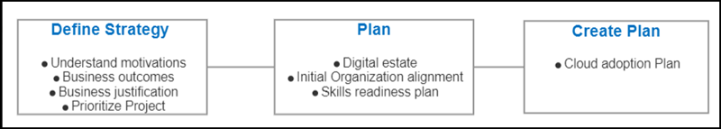

# Lab 07 - Prepare and deploy Cloud Adoption plan and customize it
# Student lab manual

## Lab scenario

Contoso Traders is a modern trading company. The company has been a popular retail destination for more than 30 years. It now has more than 50 physical locations. Several years ago, its CEO anticipated changes in retail and purchased a competing e-commerce startup that was rapidly growing in niche markets. Today, the company is regarded as an innovative leader with customer-focused local storefronts.
The new CIO of Contoso Traders is focused on improving technical operations across the board in order to drive greater innovation throughout the organization while minimizing disruptions to core business operations. The cloud will be critical in this transition. A key component of this strategy will be a shift in operating model, from a centralized command-and-control model to one based on delegated responsibilities led by a cloud center-of-excellence team. This transition will most likely take several years. In each of the upcoming projects, the CIO will look for small incremental steps to transition.
Contoso Traders has three datacenters at the moment. One is in the same office building as employees; the company owns both the building and the datacenter. The other two datacenters are located in different locations and are leased from datacenter providers. Physical and virtual servers coexist in the datacenters. Because different people with different strategy ideas have led the IT department over the years, the virtualization platforms are a mix of Hyper-V and VMware. Windows Server is the primary operating system on the company's servers, with a mix of Windows Server 2008 R2, Windows Server 2012, and Windows Server 2016. The company only has a few instances of Windows Server 2019. Despite IT team members' efforts, upgrading operating systems to the latest version or following a consistent strategy has never been a priority for the organization.A few Linux and other open-source servers are available. The IT operations team is unfamiliar with the servers because they were introduced by the development team without collaboration between the teams.

The leases for the two external datacenters are set to expire in 18 months and two years. The IT manager and finance director have discussed it, and they have decided not to renew the leases. Instead, they're considering a project to upgrade, consolidate, and replace their datacenter with the cloud. The new CIO is taking advantage of this project to rethink IT operations.

#### Team

+ CIO: This is the first transformation effort to begin since the new CIO was appointed. The CIO will keep a close eye on the project and investigate how IT works in the cloud.
+ CTO: The smaller of the two external datacenters houses IT assets, including the retail innovations team's experiments. In addition, that datacenter houses mainstreamed innovations that are now considered production IT assets. The CTO wants to ensure that the company continues to innovate while also properly supporting existing innovations.
+ Project managers: As part of the IT department, project managers ensure that projects are completed on time and within budget. They make certain that all relevant stakeholders are involved.
+ Team in charge of central operations or infrastructure: The datacenters are currently managed by the operations team. This group is in charge of hardware maintenance, operating systems, patch management, networking, and after-hours support. The majority of team members are familiar with the current infrastructure but lack coding experience. The vast majority have Microsoft qualifications in Windows Server.
+ Developer: Contoso Traders' in-house development team creates the website for the online store, which is hosted in its own datacenter.
+ IT manager: The IT manager oversees the operations, development, and project management teams. This manager wishes to improve the IT department's performance, replace outdated servers, and make Contoso Traders more competitive. Another goal is to make things easier for the operations team, which manages a variety of systems.
+ Finance director: The finance director wishes to reduce budget costs wherever possible. This director is familiar with the IT department's capital expenditures and equipment.

#### Common blockers

**Scenario 1: The chief information officer is concerned about progress**

The team has migrated a few hundred virtual machines (VMs) to Azure over the last three months. The team has retired 30% of the VMs in the current datacenter. The team members believe they are ahead of schedule, but no production hosts have yet been retired.

As the project's deadline approaches, the Chief Information Officer (CIO) has begun to express concerns about progress toward retiring physical infrastructure in existing datacenters. Unfortunately, the team lacks a clear dependency map that shows which hosts are required for each VM and when a host is no longer required.
Customers who are new to cloud migration frequently have this experience. Engaging an experienced partner, as well as proper planning, can alleviate these concerns.

**Scenario 2: Cost misalignment**

The Contoso Traders migration team has successfully completed its migration-factory processes. Recently, the finance director joined the team to review the budget and overall progress. That meeting did not go as expected. The progress toward business objectives has been well received, but cloud costs are rising much faster than expected. According to updated projections, the final costs of cloud hosting will be significantly higher than anticipated.

Customers frequently encounter issues with proper controls as cloud adoption grows. By hastening the migration effort, the migration team has bypassed critical steps concerning governance and the establishment of proper guardrails. The first indicator of this missed step is the cost. Fortunately, it's the simplest to regain control of.

**Scenario 3: Operations support**

When a migration results in a production workload being hosted in the cloud, the business becomes dependent on the operations of those cloud assets. This dependency was overlooked by Contoso Traders. It was simply assumed that the central operations team would manage operations using its existing tools and processes. That assumption may turn out to be incorrect.

#### Getting-started guides

The Cloud Adoption Framework covers the entire lifecycle of cloud adoption. Various methodologies can be used throughout the lifecycle to assist a specific role in performing a defined function.

When dealing with an adoption stumbling block, however, there isn't time to mature along all of those potential roles and methodologies. The framework's getting-started guides extract actionable tasks and deliverables from each relevant methodology to assist a smaller team in delivering results more quickly.

On the [getting-started page](https://learn.microsoft.com/en-us/azure/cloud-adoption-framework/get-started/), the guides categorize blockers as follows:

+ Establish teams: Depending on your adoption strategy and operating model, you may need to create several teams. These guides will assist you in establishing new teams or redistributing responsibilities if a dedicated team is not required.
+ Improve controls: As cloud adoption grows, a solid operating model is required to ensure sound decision-making and proper organizational change. To develop your cloud operating model, align people and improve operations.
+ Accelerate adoption: While cloud adoption necessitates technical change, digital transformation with the cloud necessitates more than just IT. Utilize these resources to begin aligning various teams in order to accelerate migration and innovation efforts.
+ Align foundation: Your company's cloud is built on a series of foundational decisions that can have an impact on all cloud-based outcomes. This guide and conceptual information can assist you in making and documenting key decisions.

## Objectives

In this lab, you will:

+ Exercise 1: Prepare and deploy Cloud Adoption plan and customize it

## Estimated timing: 100 minutes
## Solution Architecture

  
  
