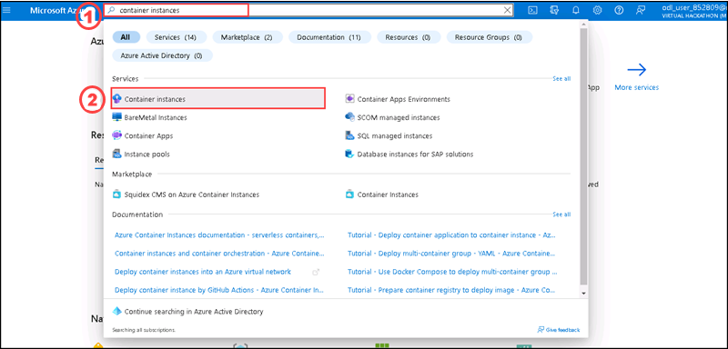
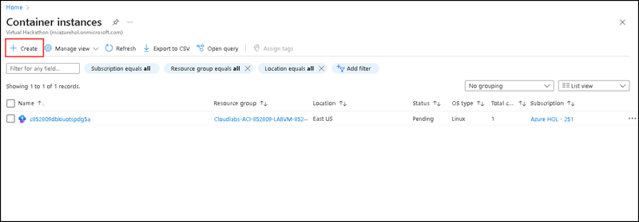
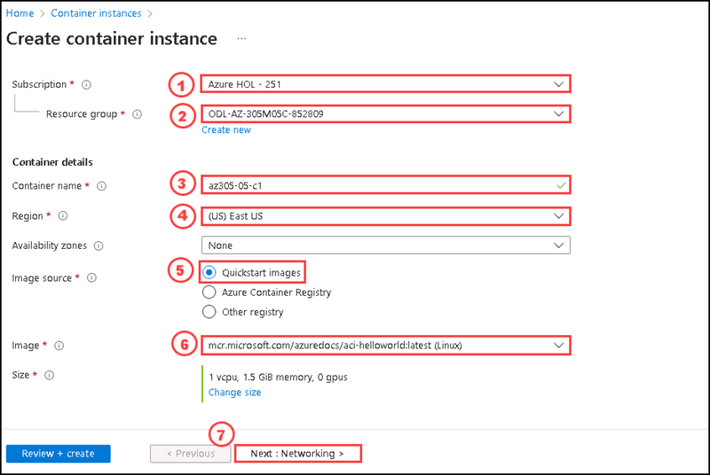
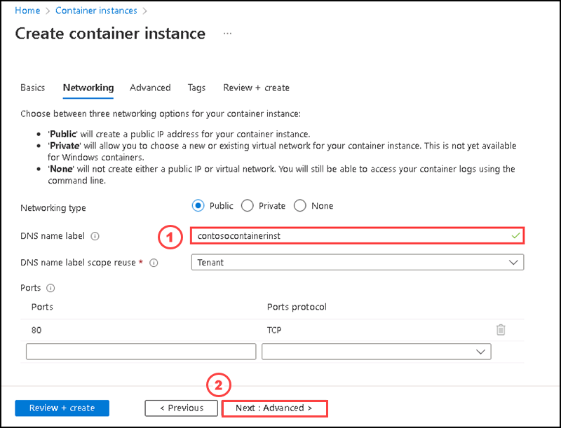
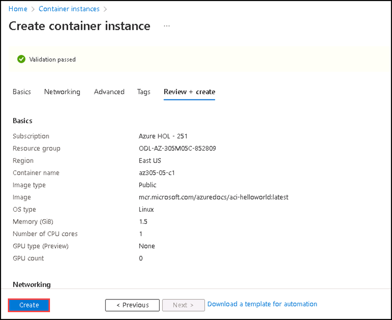
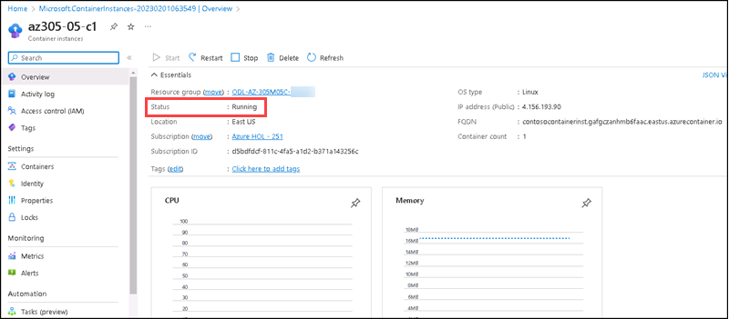
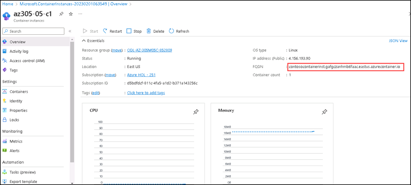
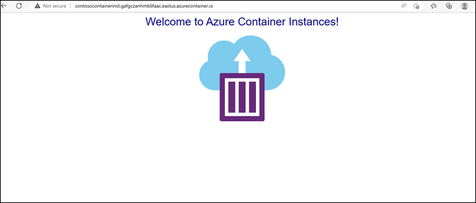
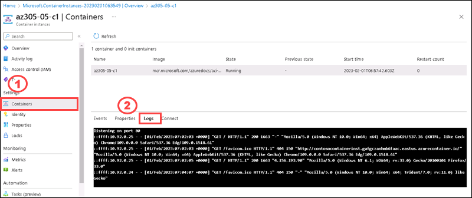

# Instructions

## Exercise 1: Create Azure Container instance

In this exercise, you are going to deploy an Azure container instance and review the functionalities of it.

In this exercise, you will have:

  + Task 1: Deploy a Docker image by using the Azure Container Instance
  + Task 2: Review the functionality of the Azure Container Instance.

### Estimated Timing:30 minutes

### Task 1: Deploy a Docker image by using the Azure Container Instance

In this task, you will create a new container instance for the web application.

#### Pre-requisites for this task

An Azure account

#### Steps:

1. Sign in to the Azure portal.

2. In the Azure portal, search for locate Container instances on the search bar and then select **Container instances**.  

3. on the Container instances blade, click **+ Create**.

4. On the Basics tab of the Create container instance blade, specify the following settings (leave others with their default values):

    | Setting | Value |
    | ---- | ---- |
    | Subscription | the name of the Azure subscription you are using in this lab |
    | Resource group | Select the resource group **ODL-AZ-305M05C-XXXXX** |
    | Container name | **az305-05-c1** |
    | Region | the name of a region where you can provision Azure container instances |
    | Image Source | **Quickstart images** |
    | Image | **mcr.microsoft.com/azuredocs/aci-helloworld:latest (Linux)** |

5. Click **Next: Networking >** and, on the **Networking** tab of the **Create container instance** blade, specify the following settings (leave others with their default values):

    | Setting | Value |
    | --- | --- |
    | DNS name label | any valid, globally unique DNS host name |
 
  >**Note**: Your container will be publicly reachable at dns-name-label.region.azurecontainer.io. If you receive a **DNS name label not available** error message, specify a different value.
 
 
 
 6. Click **Next: Advanced >**, review the settings on the **Advanced** tab of the **Create container instance** blade without making any changes, click **Review + Create**, ensure that the validation passed and click **Create**.

>**Note**: Wait for the deployment to complete. This should take about 3 minutes.

#### Task 2: Review the functionality of the Azure Container Instance

In this task, you will review the deployment of the container instance.

1. On the deployment blade, click the **Go to resource** link.

1. On the **Overview** blade of the container instance, verify that **Status** is reported as **Running**.

1. Copy the value of the container instance **FQDN**, open a new browser tab, and navigate to the corresponding URL.

1. Verify that the **Welcome to Azure Container Instance** page is displayed.

1. Close the new browser tab, back in the Azure portal, in the **Settings** section of the container instance blade, click **Containers**, and then click **Logs**.

1. Verify that you see the log entries representing the HTTP GET request generated by displaying the application in the browser.

### Clean up resources

>**Please do not delete resources you deployed in this lab. You will reference them in the next lab of this module.**

#### Review

In this lab, you have:

- Deployed a Docker image by using the Azure Container Instance
- Reviewed the functionality of the Azure Container Instance

