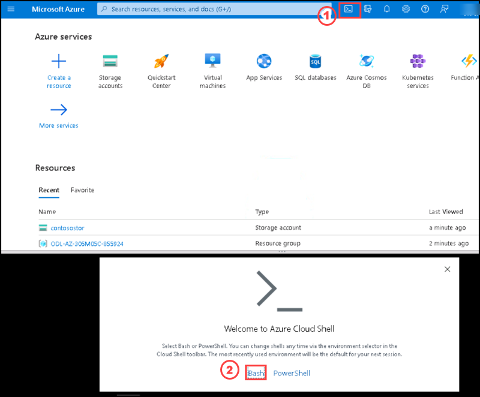
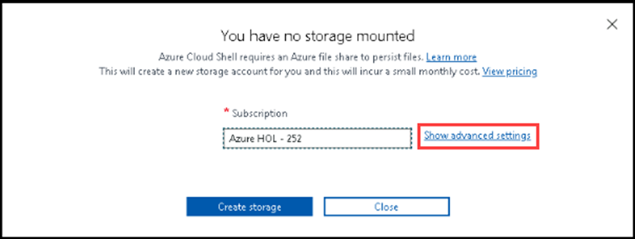
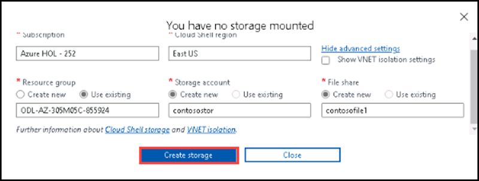
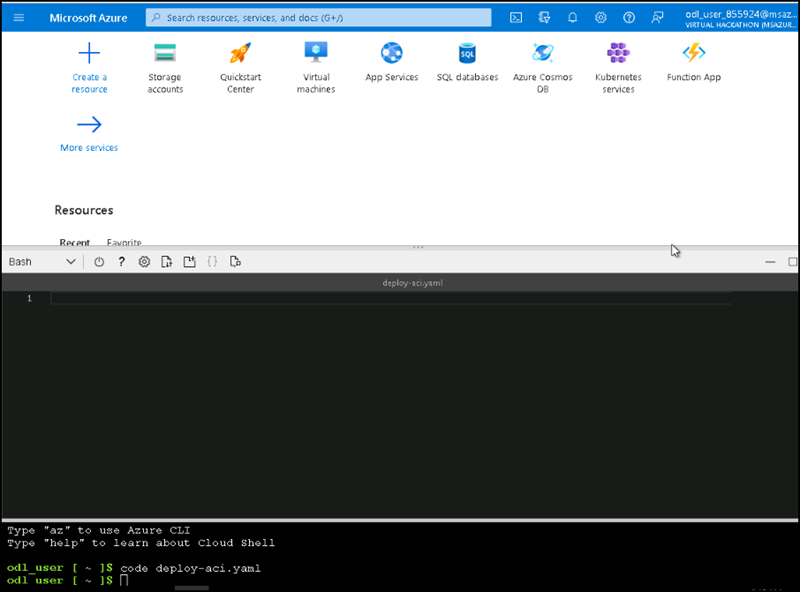
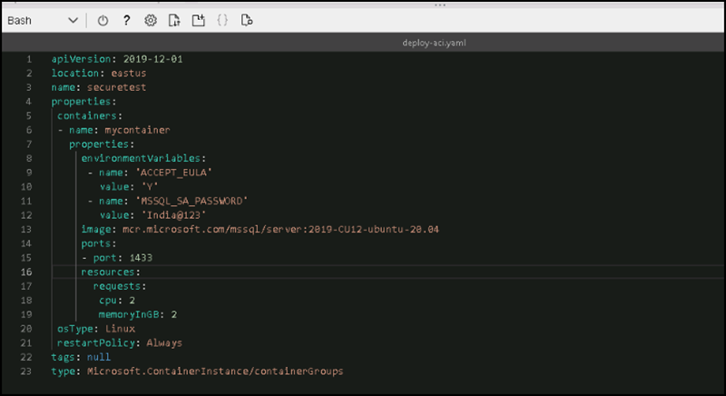
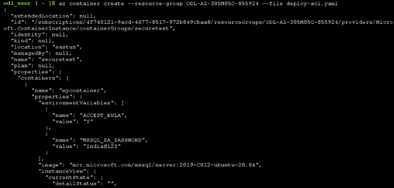
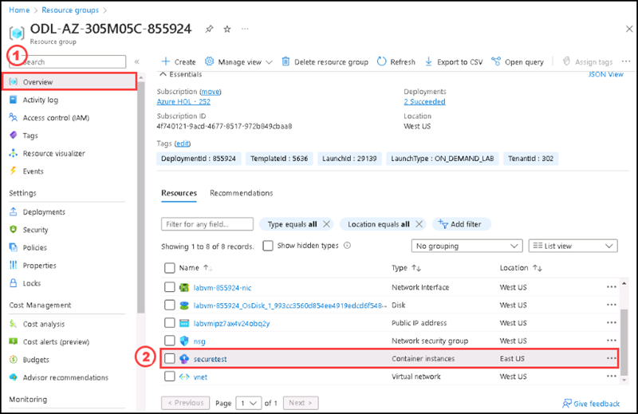
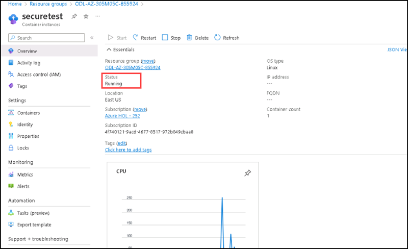

# Instructions

## Exercise 2: Deploy Azure Container instance using a YAML file

In this exercise, you are going to deploy an Azure Container instance by using YAML file and review the functionalities of it.

In this Exercise, you will have:

  + Task 1: Deploy an Azure container instance by using YAML file.

### Estimated Timing: 45 minutes

### Task 1: Deploy an Azure container instance by using YAML file.

In this task, you are going to deploy an Azure container instance by using YAML file.

#### Pre-requisites for this task

An Azure account.

#### Steps:

1. Go to Azure portal, from the top please select **Cloud shell**. Then select **Bash**



2. Please select **Show advanced settings**.



3. On the **Create a Storage account** page please enter the following details and select **Review**.
    
    | Setting | Action |
    | -- | -- |
    | **Subscription** drop-down list | Retain the default value |
    | **Resource group** section | PLease click on **Use existing** then Select **ODL-AZ-305M05C - XXXXX** |
    | **Storage account name** text box | Enter **contosostor** |
    | **Region** drop-down list | Select **(US) East US** |
    | **File share** section | Enter **contosofile1** option |
    
    The following screenshot displays the configured settings in the **Create a storage account** blade.


 
4. Please wait for sometime and let the **Bash** terminal open.

5. Please enter the command **code deploy-aci.yaml** to create an empty YAML file to write the scripts.

6. You can see an empty YAML file created in the name of **deploy-aci.yaml**.



7. Please copy the following YAML script to the **deploy-aci.yaml** file.

    ```YAML
    apiVersion: 2019-12-01
    location: eastus
    name: securetest
    properties:
    containers:
    - name: mycontainer
    properties:
    environmentVariables:
    - name: 'ACCEPT_EULA'
    value: 'Y'
    - name: 'MSSQL_SA_PASSWORD'
    value: 'India@123'
    image: mcr.microsoft.com/mssql/server:2019-CU12-ubuntu-20.04
    ports:
    - port: 1433
    resources:
    requests:
    cpu: 2
    memoryInGB: 2
    osType: Linux
    restartPolicy: Always
    tags: null
    type: Microsoft.ContainerInstance/containerGroups
    ```
Let’s understand the script before executing it in the terminal for container deployment.

  + location: It is the Azure region where we want to deploy the resources
  + Container properties:
      +  Define environment variables using key “name” and value “..”
  + Image: The azure container image for SQL Server
  + Ports: Enter the SQL Server port number for communication. We will use the default port 1433 in this section.
  + Specify CPU and MemoryInGB in the script for your container configuration
  + The OS type: Linux, it should be as per the application image we specified in the script
  + type: It is the Azure container type. Its value will be – Microsoft.CotainerInstance/containerGroups

Your YAML file will look like this:



8. Please enter the command **az container create --resource-group ODL-AZ-305M05C-XXXXX --file deploy-aci.yaml**

9. You get JSON script output that shows the Azure Container instance is deployed successfully.



10. Go to **Resource groups**, then select **ODL-AZ-305M05C-XXXXX**, on the **Overview** section you can see the container instance named **securetest**. please select the container instance.



11. On the overview section, you can see the status as **Running**.




### Clean up resources

>**Please do not delete resources you deployed in this lab. You will reference them in the next lab of this module.**

#### Review

In this lab, you have:

- Deployed an Azure Container instance using YAML file.

