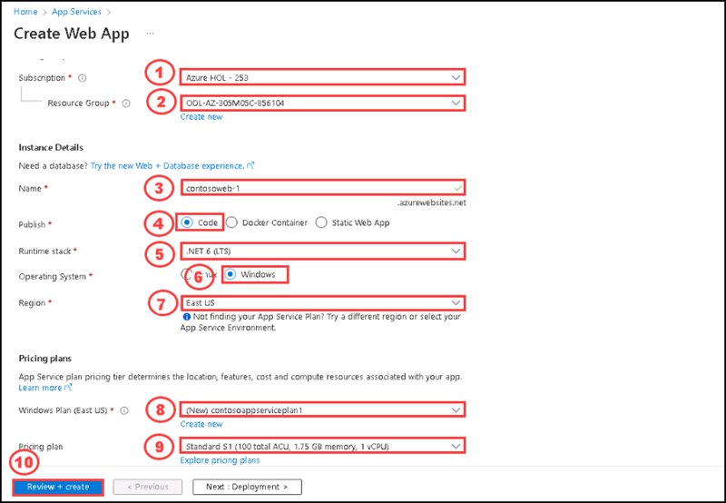
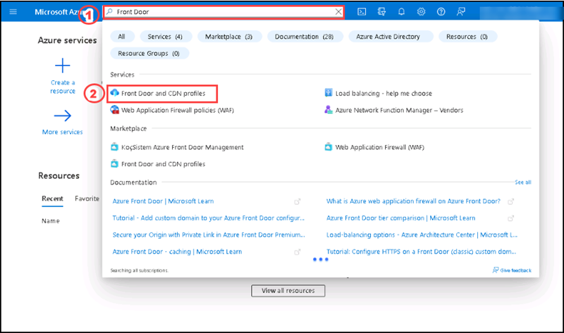
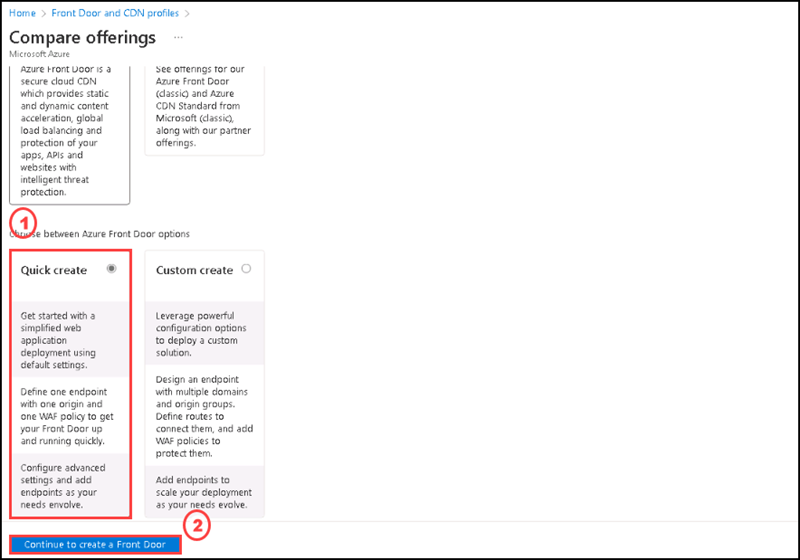
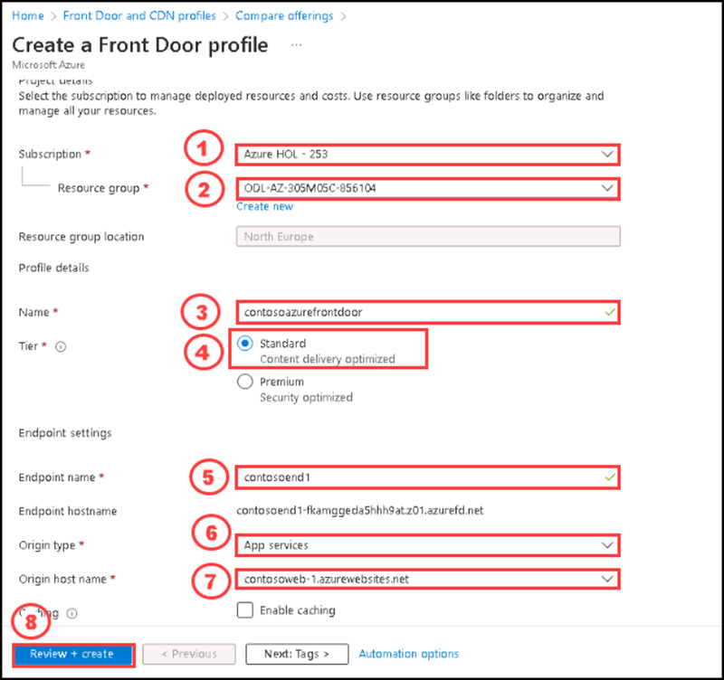
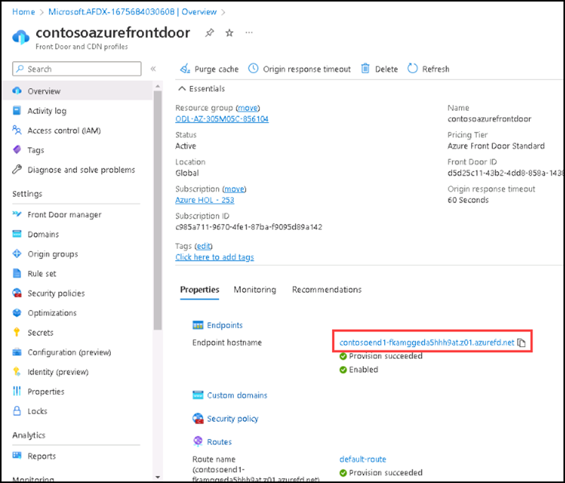
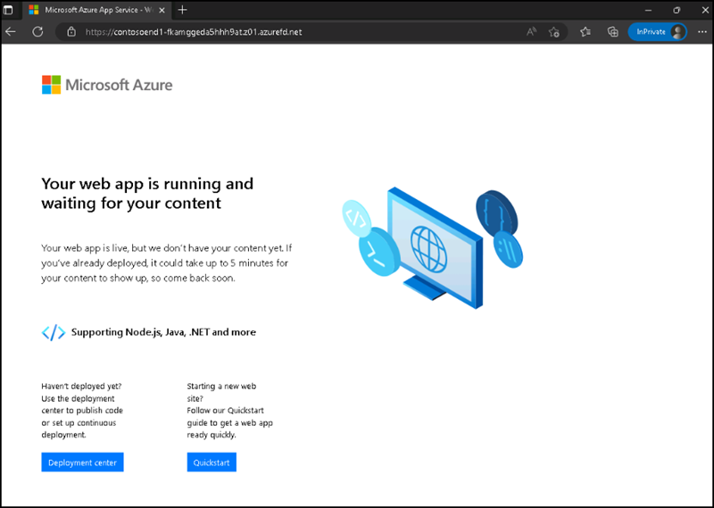
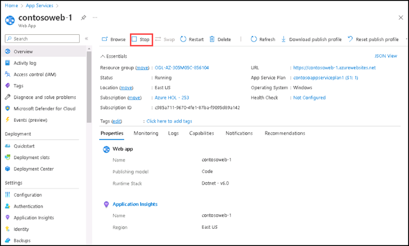
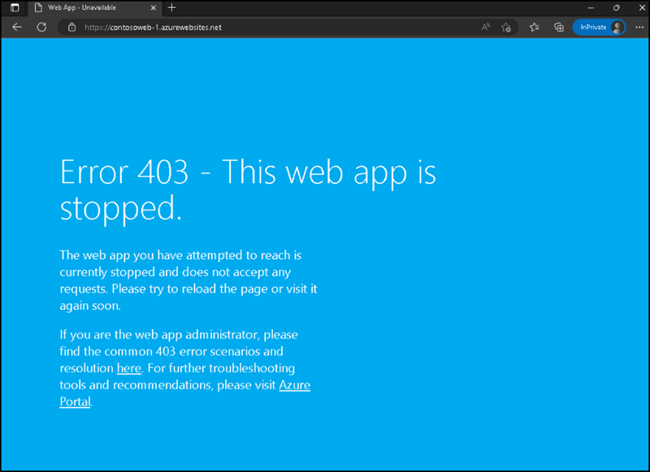

# Instructions

## Exercise 3: Configure Front door profile and deploy App services in Azure.

In this exercise, you will create two Web App instances that are deployed in two different Azure regions. Both web application instances will run in Active/Active mode, so either one can service incoming traffic. This configuration differs from an Active/Stand-By configuration, where one acts as a failover.

In this Exercise, you will have:

  + Task 1: Create two instances of a web app.
  + Task 2: Create a Front Door Profile.
  + Task 3: View Azure Front Door in action

### Estimated Timing: 60 minutes

### Task 1: Create two instances of a web app.

In this task, you are going to create two instances of a web application that run in different Azure regions. Both the web application instances run in Active/Active mode, so either one can take traffic. This configuration differs from an Active/Stand-By configuration, where one acts as a failover.

#### Pre-requisites for this task

An Azure account with an active subscription.

#### Steps

1. Sign in to the Azure portal at [https://portal.azure.com](https://portal.azure.com/).

2. On the Azure home page, using the global search type **WebApp** and select **App Services** under services.

3. Click **+ Create** to create a Web App.

4. On the Create Web App page, on the **Basics** tab, enter or select the following information and then select **Review + create**

   | **Setting**      | **Value**                                                    |
   | ---------------- | ------------------------------------------------------------ |
   | Subscription     | Select your subscription.                                    |
   | Resource group   | Select the resource group **ODL-AZ-305M05C-XXXXX**           |
   | Name             | Enter a unique Name for your web app. This example uses **contosoweb-1** |
   | Publish          | Select **Code**.                                             |
   | Runtime stack    | Select **.NET 6 (LTS)**.                              |
   | Operating System | Select **Windows**.                                          |
   | Region           | Select **East US**.                                       |
   | Windows Plan     | Select **Create new** and enter **contosoappserviceplan1** in the text box. |
   | SKU and size     | Select **Standard S1 100 total ACU, 1.75 GB memory**.        |

5. Review the Summary, and then select **Create**.  

   ‎It might take several minutes for the deployment to complete.

6. Create a second web app. On the Azure Portal home page, search  **WebApp**.

7. Click **+ Create** to create a Web App.

8. On the Create Web App page, on the **Basics** tab, enter or select the following information.

   | **Setting**      | **Value**                                                    |
   | ---------------- | ------------------------------------------------------------ |
   | Subscription     | Select your subscription.                                    |
   | Resource group   | Select the resource group **ODL-AZ-305M05C-XXXXX**               |
   | Name             | Enter a unique Name for your web app. This example uses **contosoweb-2**. |
   | Publish          | Select **Code**.                                             |
   | Runtime stack    | Select **.NET 6 (LTS)**.                              |
   | Operating System | Select **Windows**.                                          |
   | Region           | Select **Central US**.                                          |
   | Windows Plan     | Select **Create new** and enter **contosoappserviceplan2** in the text box. |
   | SKU and size     | Select **Standard S1 100 total ACU, 1.75 GB memory**.        |

9. Select **Review + create**, review the Summary, and then select **Create**.   
   ‎It might take several minutes for the deployment to complete.

### Task 2: Create Front Door profile.

In this task, you are going to create an Azure Front Door profile using the Azure portal.

#### Pre-requisites for this task

An Azure account with an active subscription.

#### Steps

1. Go to the **Azure portal**, in the Home page please enter **Front Door and CDN Profiles** on the Search bar, then please select **Front Door and CDN Profiles** from the list.

2. On the **Front Door and CDN Profiles** page please select **+ Create**.

3. On the **Compare offerings** page, select **Quick create**. Then select **Continue to create a Front Door**.

4. On the **Create a Front Door Profile** please enter the following informations, then Select **Review + create**.

    | Section | Values |
    | ------- | ------ |
    | Subscription | **Default Subscription** |
    | Resource group | Select **ODL-AZ-305M05C-XXXXX** |
    | Name | **contosoazurefrontdoor** |
    | Tier | **Standard** |
    | Endpoint name | Enter a globally unique name **contosoend1** |
    | Origin type | Select the type of resource for your origin. Here, we select an **App service** as the origin that has Private Link enabled. |
    | Origin host name | **contosoweb-1** |
    
    

5. Wait for the resource to deploy, and then select **Go to resource**.

6. On the Front Door resource in the Overview blade, locate the **Origin Groups**, select the origin group created

7. To update the origin group select the name **default-origin-group** from the list. Select **Add an origin** . On the Add an Origin side screen please enter the following details:
    | Section | Values |
    | ------- | ------ |
    | Name | **contosowebaorigin2** |
    | Origin type | Select **App services** ||
    | Host name | **contosoweb-2** | 

8. Select **Add** to add the second Web App, then select **Update**. 

You have successfully updated the default origin.

### Task 3: View Azure Front Door in action

In this task, you are going to access the frontend host you created. 

#### Pre-requisites for this task

An Azure account with an active subscription.

#### Steps

1. On the **Front Door and CDN profiles** in the Overview blade, locate the **Endpoint hostname** that is created for your endpoint. Under **Properties** tab **Copy** this FQDN.

   

2. In an In-private window, navigate to the Front Door endpoint FQDN you copied in previous step. The default App Service page will be displayed.

   
   
3. To test instant global failover in action, try the following steps:

4. Switch to the Azure portal, search for and select **App services**. 

5. Select one of your web apps, select **Stop**, and then click on **Yes** to verify.

    

6. Switch back to your In-private browser and enter the Url. This time, you should see an error message.

    

   Congratulations! You have configured and tested an Azure Front Door.

### Clean up resources

   >**Note**: Remember to remove any newly created Azure resources that you no longer use. Removing unused resources ensures you will not see unexpected charges, although keep in mind that Azure policies do not incur extra cost.
   
   >**Note**:  Don't worry if the lab resources cannot be immediately removed. Sometimes resources have dependencies and take a longer time to delete. It is a common Administrator task to monitor resource usage, so just periodically review your resources in the Portal to see how the cleanup is going.

1. Select the resource group named **ODL-AZ-305M05C-XXXXX**

2. Select the contosowebapps, contosoappserviceplan, contosofrontdoor then select delete from the top.

    
#### Review

In this lab, you have:

- Created two instances of a web app.
- Created a Front Door Profile.
- Viewed Azure Front Door in action

