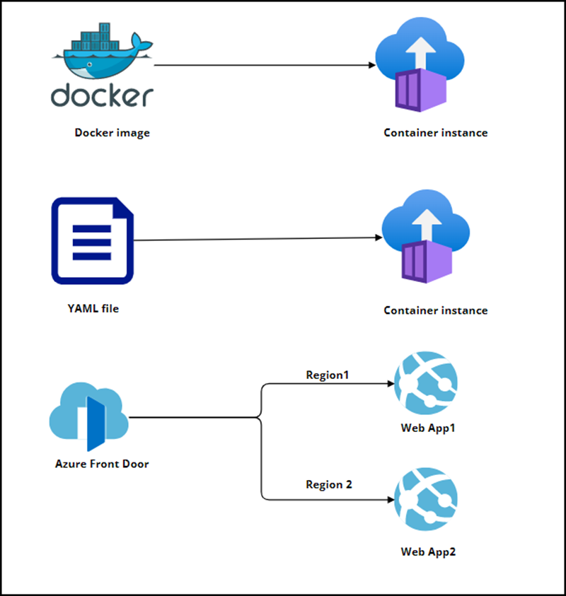

Lab 08 - Deploy Azure Container instance
# Student lab manual

## Lab scenario

Contoso is looking for a new platform to host its virtualized workloads. You identified a number of container images that can be used to achieve this goal. Because you want to reduce container management, you intend to investigate the use of Azure Container Instances for Docker image deployment. You have been tasked with following functionalities

- Creating an Azure Container instance. Azure Container Instances is a Microsoft Azure public cloud service that allows developers to deploy containers without having to provision or manage any underlying infrastructure. The service, which supports both Linux and Windows containers, eliminates the need for a developer to provision virtual machines or implement a container orchestration platform like Kubernetes in order to deploy and run containers. Instead, with Azure Container Instances (ACI), an organization can spin up a new container through the Azure portal or command-line interface (CLI), and Microsoft will provision and scale the underlying compute resources automatically. ACI also supports standard Docker images that a developer can get from a container registry like Docker Hub or Azure Container Registry.

- Reviewing the functionalities of Azure container instance. After deploying the container, start by viewing its logs with az container logs, and stream its standard out and standard error with az container attach. You can also view logs and events for container instances in the Azure portal, or send log and event data for container groups to Azure Monitor logs.

- Deploy Azure Container instance using a YAML file. Azure Container Instances supports the deployment of multiple containers onto a single host using a container group. A container group is useful when building an application sidecar for logging, monitoring, or any other configuration where a service needs a second attached process. You are going to deploy an Azure Container instance by using YAML file and review the functionalities of it.

- Configure Front door profile and deploy App services in Azure. You will create two Web App instances that are deployed in two different Azure regions. Both web application instances will run in Active/Active mode, so either one can service incoming traffic. This configuration differs from an Active/Stand-By configuration, where one acts as a failover. Azure Front Door is Microsoft's modern cloud Content Delivery Network (CDN) that provides global access for your users to your applications' static and dynamic web content. Azure Front Door delivers your content via Microsoft's global edge network, which includes hundreds of global and local points of presence (PoPs) located around the world near your enterprise and consumer end users.

## Objectives

In this lab, you will have:

+ Exercise 1: Create an Azure Container instance and reviewing it.
+ Exercise 2: Deploy Azure Container instance using a YAML file.
+ Exercise 3: Configure Front door profile and deploy App services in Azure

## Estimated timing: 135 minutes
## Solution Architecture

    
