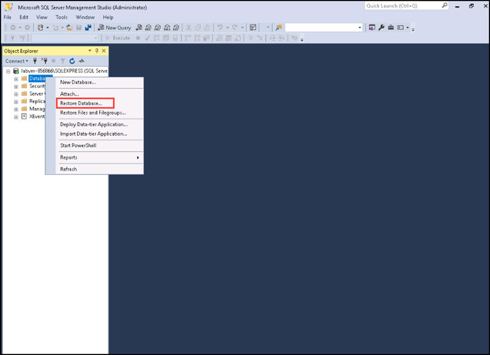
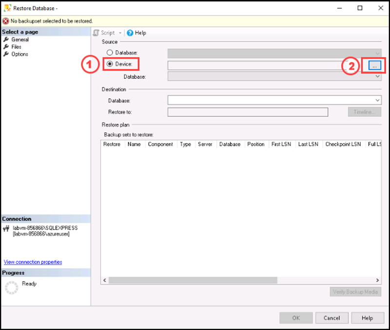
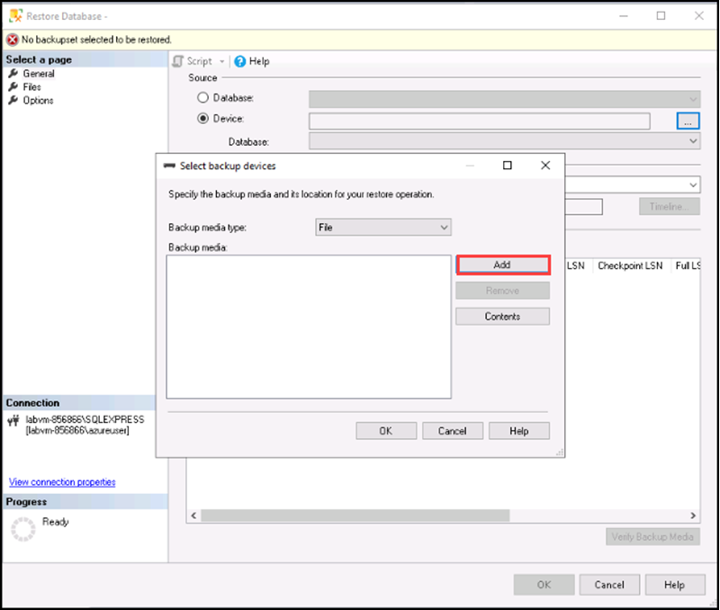
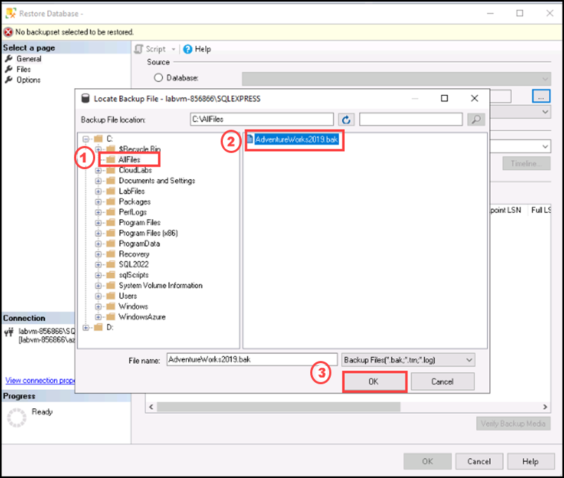
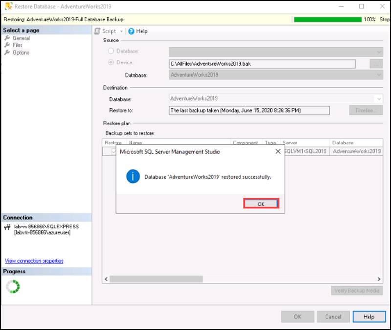
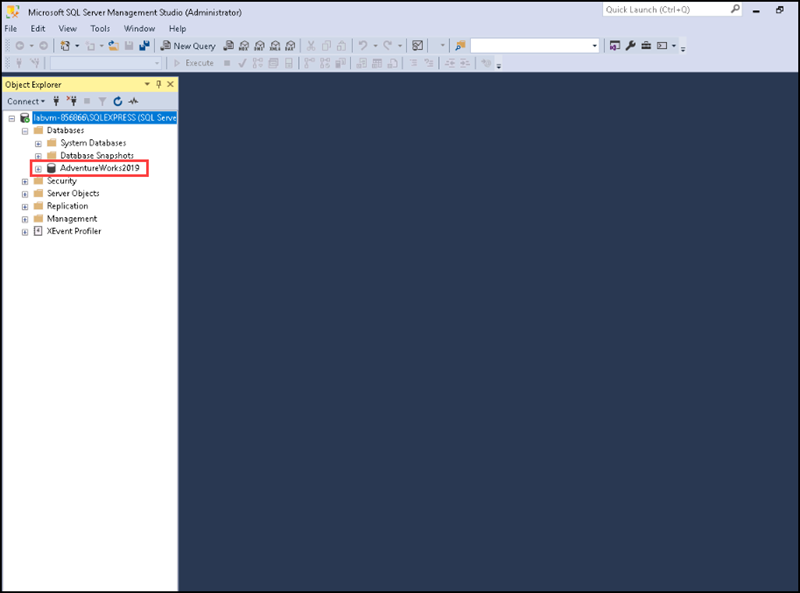

# Instructions

## Exercise 1: Install and Configure SQL Server.

In this exercise, you will install and configure SQL Server Express edition and will attach a sample database named Adventureworks2019.

In this exercise, you will:

+ Task 1: Install and Configure SQL Server.
+ Task 2: Configure AdventureWorks database.

### Estimated Timing: 60 minutes

### Task 1: Install and Configure SQL Server.

In this task, you will learn how to install and configure SQL Server express edition.

#### Steps

1. Open edge browser and navigate to this link : [SQL Server Download](https://www.microsoft.com/en-us/sql-server/sql-server-downloads). Scroll down and download SQL Server 2022 Express edition.

    

2. After dwonloading it, Open **File Explorer** and double click on the installer file from the **Downloads** folder to open it.

3. Once the installer open, select **Basic** tab to install the SQL Server engine with default configuration.

    

4. For Microsoft SQL Server License terms, select **Accept**.

    

5. For **Specify SQL Server Installation Location**, select **Install**.

    

6. The installation will take 5-7 minutes to complete. After completing the installation, select **Close**. Pop-up will appear asking to exit from **SQL Server Installer** then select **Yes**.

7. In the search bar of your **LabVM** search for **SQL Server Management Studio** and open it.

8. For server type please select **Database Engine**.

9. For **Server name** select **Browse more** from the drop down, on the **Local servers** tab of the **Browse for Servers** window, expand **Database Engine**, then select **labvm-XXXX\SQLEXPRESS**, and click on **Ok**.

10. For **Authentication**, select **Windows Authentication** and click on **Connect**.

    You hvae successfully connected the SQL server now.
    
11. Expand the server, under it expand the **Databases**, you can see there is no user defined database listed.

12. Visit the link to [Download](https://learn.microsoft.com/en-us/sql/samples/adventureworks-install-configure?view=sql-server-ver16&tabs=ssms) **Adventure works Sample database**.

13. Scroll down, under **OLTP** tab select **AdventureWorks2019.bak**. Please wait for the download to complete. After completing the download go to **Downloads** folder. Copy the file and paste it in **C:\AllFiles** folder.

14. Go to SSMS window, right click **Databases** folder on the **Object Explorer** window, then select **Restore Database**.

    

15. On the **Restore Database** window, select **Device**, then click on the **Ellipsis(...)** button.

    

16. On **Select backup devices** window, select **Add**.

    

17. On **Locate backup file** window, select **C:\AllFiles**, then select **AdventureWorks2019.bak** backup. Click **Ok**.

    

18. On **Select backup devices** window select **Ok**. And on the **Restore Database** window, select **Ok**.

19. After a while you will get a window showing **Database Adventureworks 2019 restored successfully**. Click on **Ok**.

    

20. Go to SSMS, expand the **Databases**, you can see the **Adventureworks2019** database.

    

You have successfully configured SQL server and Adventureworks database.

#### Review

In this exercise, you have:

- Installed and Configured SQL Server Express edition.
- Configured AdventureWorks database.

