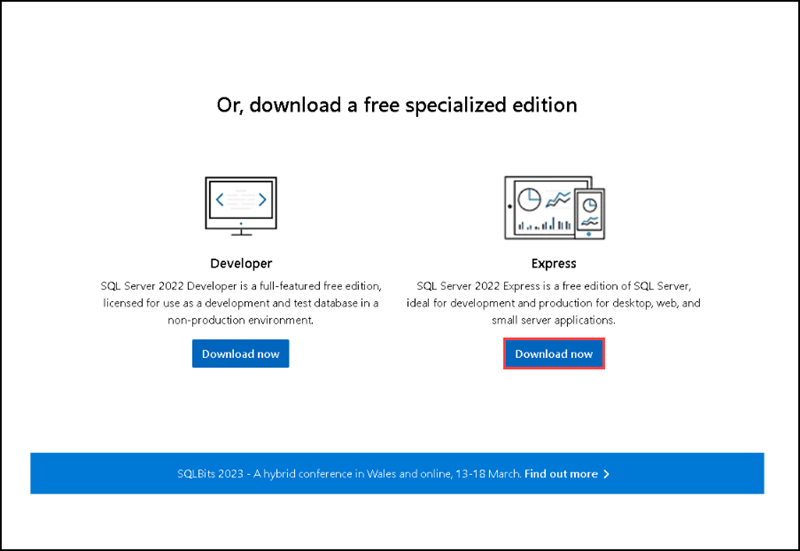
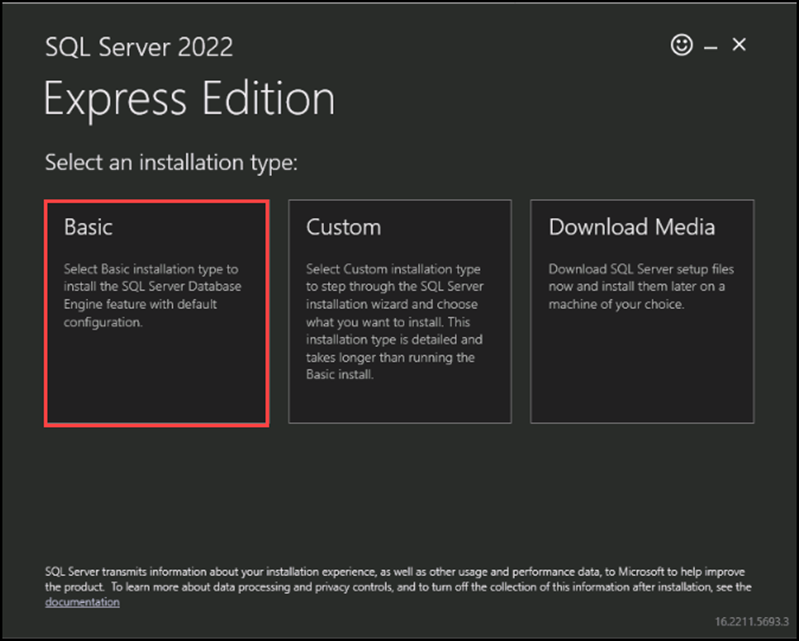
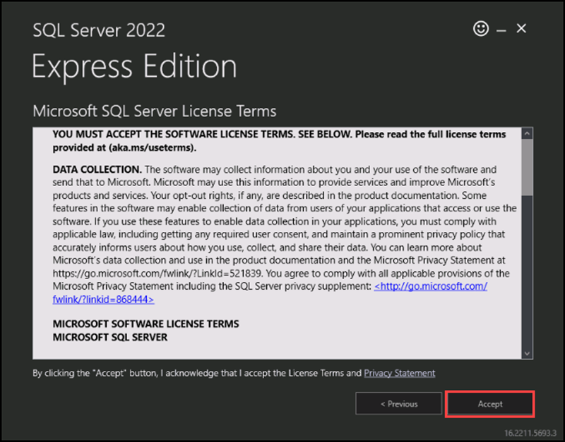
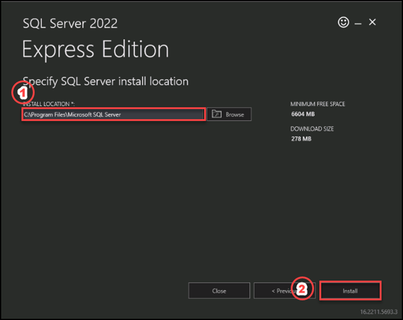

# Instructions

## Exercise 1: Migrate SQL Server database to Azure

In this exercise, you will:

+ Task 1: Install and Configure SQL Server.
+ Task 2: Configure Adventure works database.

### Estimated Timing: 60 minutes

### Task 1: Install and Configure SQL Server.

In this task, you will learn how to install and configure SQL Server express edition.

#### Pre-requisites for this task

An Azure account

#### Steps

1. Open edge browser and navigate to this link : [SQL Server Download](https://www.microsoft.com/en-us/sql-server/sql-server-downloads). Scroll down and download SQL Server 2022 Express edition.

2. After dwonloading it, please open the installer file from the downloads folder by double clicking on it.

3. Once the installer open please select **Basic** tab to install the SQL Server engine with default configuration.

4. For Microsoft SQL Server License terms please select **Accept**.

5. For **Specify SQL Server Installation Location** please select the default.

6. Thye installation will take 5-7 minutes to complete. After completing the installation please select close. If it ask for exiting from the installer please select **Yes**.

7. Open SQL Server Management Studio from the start button.

8. For server type please select **Database Engine**.

9. For Server name please select **Browse more**, then on the **Local servers** tab of the **Browse for Servers** window, please expand database engine, then select **LocalVm-XXXX\SQLEXPRESS**, then select **Ok**.

10. For Authentication select **Windows Authentication**. Then select **Connect**.

    You hvae successfully connected the SQL server now.
    
11. Expand the server, expand the database you can see there is no user defined databases.

12. Please go to this link to [Download](https://learn.microsoft.com/en-us/sql/samples/adventureworks-install-configure?view=sql-server-ver16&tabs=ssms) **Adventure works Sample database**.

  

