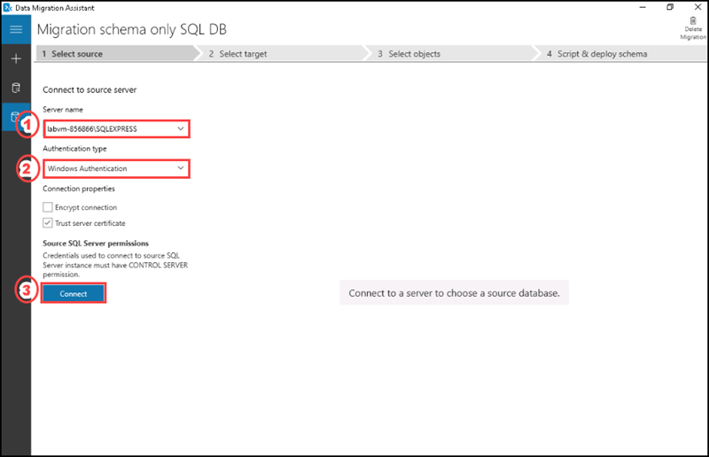

# Instructions

## Exercise 2: Migrate SQL Server database to Azure

In this exercise you are going to migrate SQL server database to Azure by using Data Migration Assistant.

In this exercise, you will:

+ Task 1: Create an Azure SQL database
+ Task 2: Set up server-level firewall rules using Azure Portal
+ Task 3: Install the Data Migration Assistant (DMA) on Windows
+ Task 4: Use the Data Migration Assistant to prepare for migration from SQL Server to Azure SQL Database
+ Task 5: Use Data Migration Assistant to migrate Schema and Data

### Estimated Timing: 100 minutes

### Task 1: Create an Azure SQL database

In this task, you will learn how to create an Azure SQL database by using Azure portal.

#### Pre-requisites for this task

Completed Exercise 1

#### Steps:

1. In the home page of Azure portal, please enter **SQL database** on the search bar and select **SQL databases** from the list.

2. On the SQL databases page, please select **+ Create**.

   

3. On the **Create SQL Database**, enter the following details.

    | Settings | Values |
    |  -- | -- |
    | Subscription | **Use default supplied** |
    | Resource group | **ODL-AZ-305M05D-XXXXX-AZ-305M05D** |
    | Database name | **contosodb1** |

    

4. For server, click **Create new**.

5. On **Create SQL Database Server** page, enter the following details, then click **Ok**.

    | Settings | Values |
    |  -- | -- |      
    | Server name | **contososerv** |
    | Location | **East US** |
    | Authentication method | **Use SQL authentication** |
    | Server admin login | **contosoadmin** 
    | Password |  **Contoso@123** 
    | Confirm password | **Contoso@123** |    

    

6. After creating the database server, enter the following details, then select **Review + create**. 

    | Settings | Values |
    |  -- | -- |      
    | Want to use SQL elastic pool? | **No** |    |
    | Compute + storage | **General Purpose (Standard-series (Gen5), 2 vCores, 32 GB storage, zone redundant disabled)** |
    | Backup storage redundancy |  **Locally-redundant backup storage** |

    

7. After the validation is passed, select **Create**.

>**Note:** The deployment will take few minutes to complete. Please wait till it gets succeeded. 

### Task 2: Set up server-level firewall rules using Azure Portal

In this task you will configure Server firewall. Azure SQL Server is protected by server-level firewall rules. As a result, it applies to all underlying Azure SQL Databases. Before reaching the Azure server or database, each connection must pass through the firewall.

#### Pre-requisites for this task

Completed Exercise 1 & Exercise 2 - Task 1

#### Steps:

1. In the Azure portal, go to the database you have created in the previous task. Select **Set Server Firewall** on the **Overview** section.

   

2. On the Networking page, select **Selected Networks**. To add your current IP address to a new server-level firewall rule, select **+ Add your client IPv4 address**. This rule has the ability to open Port 1433 for a single IP address or a range of IP addresses, then select **Save**.

   

3. Go to **contosodb1** database, select **Query editor (Preview)** provide the login as **contosoadmin** and Password **Contoso@123** then click on **Ok**.

You have successfully logged into the contosodb1 database.

### Task 3: Install the Data Migration Assistant (DMA) on Windows

In this task, you will learn how to install and configure Data Migration Assistant (DMA) on Windows.

#### Pre-requisites for this task

Completed Exercise 1 & Exercise 2 - Task 1 & Task 2

#### Steps:
 
1. Open up your web browser, and go to the download page for Microsoft Data Migration Assistant, please click [here](https://www.microsoft.com/en-us/download/details.aspx?id=53595).
    
    >**Note:** Please follow the steps in this task even if DMA is already installed, to ensure that you are using the latest version of the tool.

2. Confirm that your environment supports the software by checking the requirements list. If its ask for installing .Net Framework 4.8 please click [here](https://dotnet.microsoft.com/en-us/download/dotnet-framework/net48) to download. After downloading it, please go to the **Downloads** folder in **File explorer** and double click on the .Net installer file named **ndp48-web** to install it.

3. To download **DataMigrationAssistant.msi**, double click on the installer file in **Downloads** folder, and then select **Run**.

4. On the **Welcome** screen, select **Next**.

5. Select **I accept the terms in the License Agreement**, and then click on **Next**.

6. Read the **Privacy Statement**, and then select **Install**.

7. If prompted, allow UAC control for this application.

8. To complete install, select **Finish**.

### Task 4: Use the Data Migration Assistant to prepare for migration from SQL Server to Azure SQL Database

#### Pre-requisites for this task

Completed Exercise 1 & Exercise 2 - Task 1 & Task 2 & Task 3

#### Steps:

1. Select the **Start** button, type **Data Migration**, and then select **Microsoft Data Migration Assistant**.

2. To create a new project, on the left, select **+**.

    

3. On the **New** page, enter these values, and then select **Create**:

    | Property | Value |
    | --- | --- |
    | Project type | **Assessment** |
    | Project name | **Migration Assessment SQL DB** |
    | Assessment type | Database Engine |
    | Source server type | SQL Server |
    | Target server type | Azure SQL Database |
    
    
      

4. On the **Options** page, leave the default values, and then select **Next**.

5. On the **Connect to a server** page, enter these values, and then select **Connect**:

    | Property | Value |
    | --- | --- |
    | Server name | **labvm-XXXXXX\SQLEXPRESS** (Please go to SSMS and take the server name from there). |
    | Authentication type | **Windows Authentication** |
    | Encrypt connection | Deselected |
    | Trust server certificate | Selected |

     

6. On the **Add sources** page, select the **AdventureWorks** database, and click on **Add**.

     

7. On the **Select sources** page, select **Start Assessment**.

8. Review the SQL Server feature parity and compatibility issues found. Note how many feature parity issue there are.

     

9. Go to SSMS, right click on the server name, then select **Properties**.

    

10. On the **Server properties** window, select **Security**, then select **SQL Server and Windows Authentication** mode and click on **Ok**. 

    

11. In Azure portal, go to **contosodb1** database, then select **Query editor**.

12. Login with username as **contosoadmin** and Password as **Contoso@123**.

13. Expand the **Tables**, you can see there are no tables listed.

### Task 5: Use Data Migration Assistant to migrate Schema and Data

#### Pre-requisites for this task

Completed Exercise 1 & Exercise 2 - Task 1 & Task 2 & Task 3 & Task 4

#### Steps:

1. Open the **Microsoft Data Migration Assistant** tool, select the **+** New (+) icon. Enter the following details and then select **Create**.

    | Property | Value |
    | --- | --- |
    | Project type | **Migration** |
    | Project name | **contosodatamigration** |
    | Source server type | Select **SQL Server** |
    | Target server type | Select **Azure SQL Database** |
    | Migration scope | Select **Schema and Data** |

    

2. On the Select Source tab, select the server name **labvm-XXXXX\SQLEXPRESS**, then select **Windows Authentication** as Authentication type, and click on **Connect**. 

    

3. Select **Adventureworks2019**, then select **Next**.

4. Go to **contosodb1** database on azure portal, on the **Overview** section, copy the server name **contososerv.database.windows.net**.

5. Go to **Microsoft Data Migration Assistant** tool and on the **Connect to target server** tab on the server name section, paste the contosdb1 server name copied.

6. For the **Authentication type** please select **SQL Server Authentication**, then enter username as **contosoadmin**, and password as **Contoso@123**.

7. Select **Connect**.

     

8. Select **contosodb1** and then click on **Next**

9. On the **Select Objects** tab, select the **Schema** (By default all the objects are selected, please deselect all other objects except schema).

10. To create the SQL scripts, select **Generate SQL scripts option**.

    

11. On the **Script & Deploy schema** tab, select **Deploy schema**.

    

12. You have successfully migrated the schema, you can see the execution of all the schema queries are successfully completed.

    


13. Go to Azure portal and select the database named **contosodb1**.  Go to the **Query Editor** and paste the below T-SQL script, then click on **Run** to create a table named **HumanResources.EmployeeDepartmentHistory**.

    ```T-SQL
    CREATE TABLE [HumanResources].[EmployeeDepartmentHistory](
	[BusinessEntityID] [int] NOT NULL,
	[DepartmentID] [smallint] NOT NULL,
	[ShiftID] [tinyint] NOT NULL,
	[StartDate] [date] NOT NULL,
	[EndDate] [date] NULL,
	[ModifiedDate] [datetime] NOT NULL,
    CONSTRAINT [PK_EmployeeDepartmentHistory_BusinessEntityID_StartDate_DepartmentID] PRIMARY KEY CLUSTERED 
    (
	[BusinessEntityID] ASC,
	[StartDate] ASC,
	[DepartmentID] ASC,
	[ShiftID] ASC
    )WITH (PAD_INDEX = OFF, STATISTICS_NORECOMPUTE = OFF, IGNORE_DUP_KEY = OFF, ALLOW_ROW_LOCKS = ON, ALLOW_PAGE_LOCKS = ON, OPTIMIZE_FOR_SEQUENTIAL_KEY = OFF) ON         [PRIMARY]
    ) ON [PRIMARY]
    GO
    ```

    

15. You have successfully created the table named **HumanResources.EmployeeDepartmentHistory**. Expand the Tables and you can see the newly created table.

    


You are going to migrate from on-premises database Adventureworks2019 table named **HumanResources.EmployeeDepartmentHistory** data to Azure SQL database named **contosodb1** and the  table named **HumanResources.EmployeeDepartmentHistory**.

16. Go to **Microsoft Data Migration Assistant** tool, then click on **Migrate data**.

    

17. On the **Select tables** tab, select **HumanResources.EmployeeDepartmentHistory** table, then select **Start data migration**. 

    

18. Once the migration is completed, you will get a successfull message on **Migrate data** tab.

    

19. Go to Azure portal, open **contosodb1** database and select **Query editor**, enter username and password.

20. Right click on **HumanResources.EmployeeDepartmentHistory** table and select **Select top 1000 rows**. You can see the data retrieved on the result pane.

    

You have successfully migrated the data.

#### Review

In this exercise, you have:

- Created an Azure SQL database
- Configured server-level firewall rules using Azure Portal
- Installed the Data Migration Assistant (DMA) on Windows
- Used the Data Migration Assistant to prepare for migration from SQL Server to Azure SQL Database
- Used Data Migration Assistant to migrate Schema and Data

