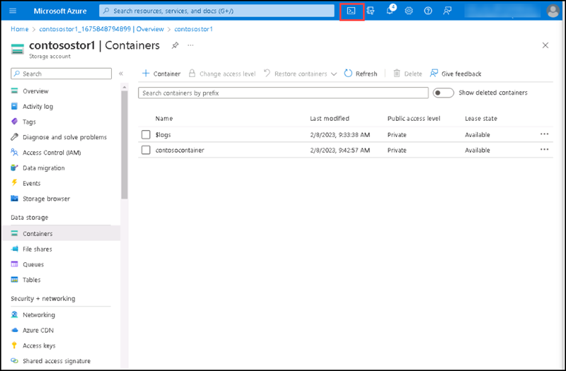
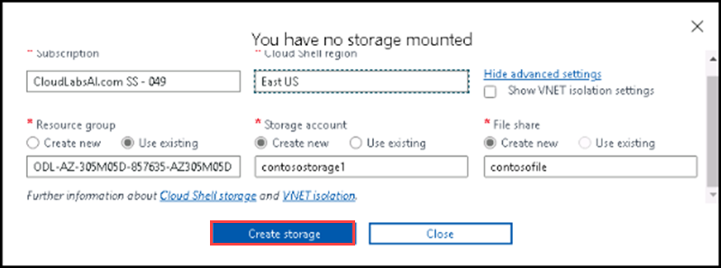
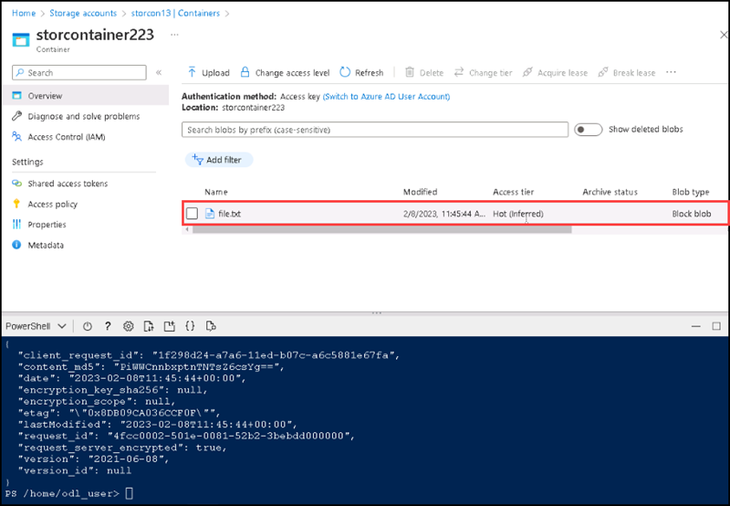

# Instructions

## Exercise 3: Migrate a blob data to Azure storage account.

In this exercise you will create a storage account and upload a blob file by using powershell script.

In this exercise, you will:

+ Task 1: Create an Azure Storage account and upload a blob file to azure storage by using Powershell script


### Estimated Timing: 20 minutes

### Task 1: Create an Azure Storage account and upload a blob file to azure storage by using Powershell script

In this task, you will learn how to create an Azure Storage account via azure portal.

#### Pre-requisites for this task

An Azure account

#### Steps

1. Go to Azure portal, Select **Cloudshell** from the top.



2. Select **Powershell**, then select **Show Advanced settings**.



3. Enter the following informations, then select **Create storage**.

  | Section | values |
  | ------- | ------ |
  | Subscription | Select the default subscription |
  | Resource group | Select **ODL-AZ-305M05D-XXXXXX-AZ305M05D** |
  | Storage account name | **contosostr2** |
  | Region | **East US** |
  | File share | **contosofile1** |

9. After opening Powershell terminal please enter the following script and press enter to create a file to upload to a block blob.

  ```Powershell
     az storage account create --name storcon13 --resource-group ODL-AZ-305M05D-XXXXX-AZ305M05D --location EastUS --sku Standard_LRS --encryption-services blob
     
     az role assignment create --role "Storage Blob Data Contributor" --assignee odl_user_XXXXXX@cloudlabsai.com --scope "/subscriptions/<subscription-ID>/providers/Microsoft.Storage/storageAccounts/storcon13"
   ```
10. Open a notepade and type **Hello World**, then save it as **file.txt**.

11. On the Powershell terminal click on **Upload** then select the file **file.txt** from the saved location, then Upload. You will get a message shows Successfully Uploaded.

12. On the Powershell terminal please enter the following script.

  ```Powershell
  az storage container create --account-name storcon13 --name storcontainer123 --auth-mode login
  
  az storage blob upload --account-name storcon13 --container-name storcontainer223 --name file.txt --file file.txt --auth-mode login
  ```
  
13. After successfully run the script, please got **Storage accounts** , then select **storcon13**, then select the **container** named **storcontainer223**. You can see the uploaded file **file.txt** there.
  

  
### Clean up resources

   >**Note**: Remember to remove any newly created Azure resources that you no longer use. Removing unused resources ensures you will not see unexpected charges, although keep in mind that Azure policies do not incur extra cost.
   
   >**Note**:  Don't worry if the lab resources cannot be immediately removed. Sometimes resources have dependencies and take a longer time to delete. It is a common Administrator task to monitor resource usage, so just periodically review your resources in the Portal to see how the cleanup is going.

   >**When you're done, delete the resource group. Deleting the resource group deletes the storage account, the Azure file share, virtual machine and any other resources that you deployed inside the resource group.**

1. Select Home and then Resource group named **ODL-AZ-305M05D-XXXXXX-AZ305M05D**.

2. Select the storage account named **contosostr2** and azure sql database named **contosodb1** then delete it.
   
#### Review

In this lab, you have:

- Created an Azure Storage account and uploaded a blob file to azure storage by using Powershell script
