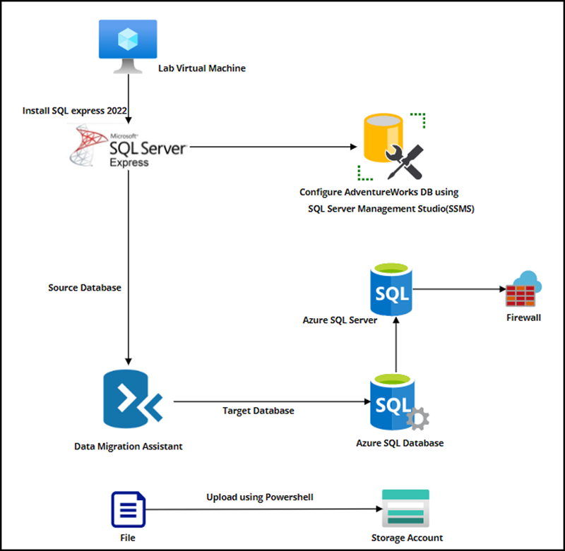

# Lab 09 - Migrate Data to Azure
# Student lab manual

## Lab scenario

Contoso Traders is a fictitious home improvement retailer with retail hardware stores worldwide and online. To host their retail website, the company currently manages on-premises datacenters. These datacenters also house all of the company's data and streaming video.

Currently, the IT department is in charge of all management tasks for the company's computing hardware and software. The team is in charge of purchasing new hardware, installing and configuring software, and deploying everything throughout the datacenter. These management responsibilities create some challenges for Tailwind Traders' users and customers in terms of timely application delivery. You've been tasked with researching the various migration options. You must choose the best options to support the planned migrations of workloads on virtual machines, databases, and servers.

In order to choose the best options to support the planned migrations of workloads on databases, you have been tasked with implementing the following functionality:

- Install and Configure SQL Server. You are going to install SQL Server Express edition and configure it. Attach a sample database named Adventureworks2019.

- Migrate SQL Server database to Azure. Cloud migration and modernization is a continuous process that involves significant organizational change management spanning people, process, and technology. You can use Azure Database Migration Service to migrate the databases from a SQL Server instance to Azure SQL Database.

- Migrate a blob data to Azure storage account. You will create azure storage account and upload a blob file by using powershell script.

## Objectives

In this lab, you will have:

+ Exercise 1: Install and Configure SQL Server
+ Exercise 2: Migrate SQL Server database to Azure
+ Exercise 3: Migrate a blob data to Azure storage account

## Estimated timing: 200 minutes
## Solution Architecture

  
