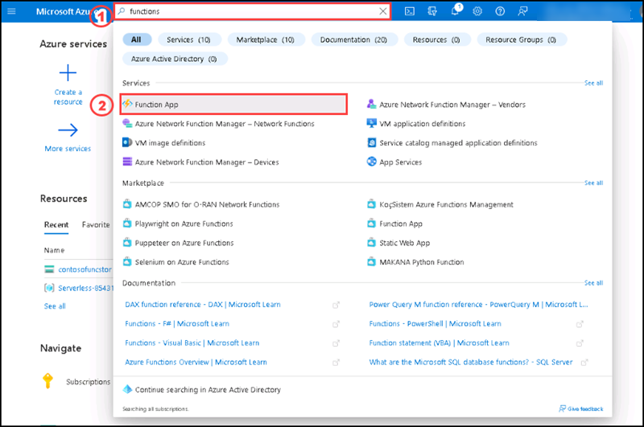

# Instructions

## Exercise 1: Create Azure resources

In this Exercise, you are going to create an Azure storage account and a function app.

In this Exercise, you will have:

  + Task 1: Create an Azure Storage account.
  + Task 2: Create a function app

### Estimated Timing: 30 minutes

### Task 1: Create an Azure Storage account

In this task, you will create an Azure storage account.

#### Pre-requisites for this task

An Azure account

#### Steps:

1. In the Azure portal, use the search bar to search for **Storage Accounts**, and then, in the list of results, select **Storage Accounts**.

1. On the **Storage accounts** blade, select **+ Create**.

    

1. On the **Create a storage account** blade, on the **Basics** tab, perform the following actions, and then select **Review**:

    | Setting | Action |
    | -- | -- |
    | **Subscription** drop-down list | Retain the default value |
    | **Resource group** section | Select **Serverless - XXXXX** |
    | **Storage account name** text box | Enter **contosofuncstor** |
    | **Region** drop-down list | Select **(US) East US** |
    | **Performance** section | Select the **Standard** option |
    | **Redundancy** drop-down list | Select **Locally-redundant storage (LRS)** |

    The following screenshot displays the configured settings in the **Create a storage account** blade.

       

1. On the **Review** tab, review the options that you selected during the previous steps.

1. Select **Create** to create the storage account by using your specified configuration.

    > **Note**: Wait for the creation task to complete before you proceed with this lab.

1. On the **Overview** blade, select the **Go to resource** button to go to the blade of the newly created storage account.

1. On the **Storage account** blade, in the **Security + networking** section, select **Access keys**.

1. On the **Access keys** blade, select **Show keys**.

     

1. Review any one of the keys, and then copy the value of either of the **Connection string** boxes to the clipboard

     > **Note**: It doesn't matter which connection string you choose. They are interchangeable.

1. Open Notepad, and then paste the copied connection string value to Notepad. You'll use this value later in this lab.

### Task 2: Create a function app

In this task, you will create a function app.

#### Pre-requisites for this task

Completed Exercise 1 - Task 1

#### Steps:

1. On the Azure portal's search bar, please enter **function app**, then select **Function app** from the list.

     

1. On the **Function App** blade, select **Create**.

     

1. On the **Create Function App** blade, on the **Basics** tab, perform the following actions, and then select **Next: Hosting**:

    | Setting | Action |
    | -- | -- |
    | **Subscription** drop-down list | Retain the default value |
    | **Resource group** section | Select **Serverless-XXXXXX** |
    | **Function App name** text box | Enter **contosofunclogic** |
    | **Publish** section | Select **Code** |
    | **Runtime stack** drop-down list | Select **.NET** |
    | **Version** drop-down list | Select **6** |
    | **Region** drop-down list | Select the **East US** region |
    | **Operating System** option | Select **Linux** |
    | **Plan type** drop-down list | Select **Consumption (Serverless)** |

    The following screenshot displays the configured settings in the **Create Function App** blade.

        

1. On the **Hosting** tab, perform the following actions, and then select **Review + create**:

    | Setting | Action |
    | -- | -- |
    | **Storage account** drop-down list | Select the **contosofuncstor** storage account |
    
          

1. On the **Review + create** tab, review the options that you selected during the previous steps.

1. Select **Create** to create the function app by using your specified configuration.

    > **Note**: Wait for the creation task to complete before you move forward with this lab.

### Clean up resources

>**Note : Please do not delete resources you deployed in this lab. You will reference them in the next Exercises of this module.**

#### Review

In this lab, you have:

- Created a storage account.
- Created a function app.

