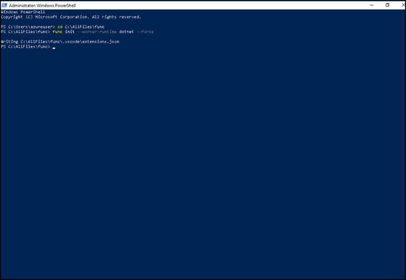
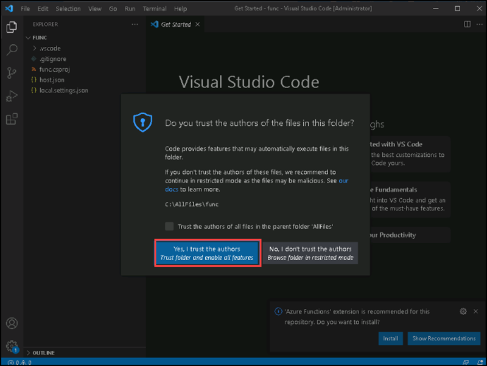
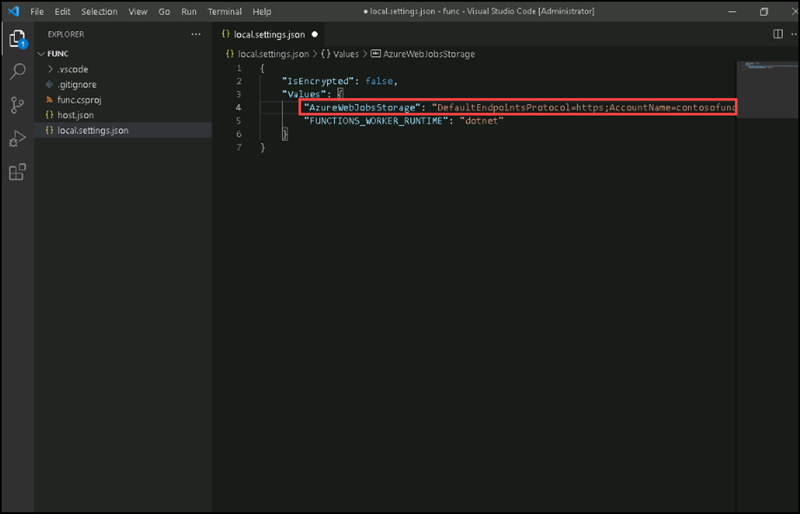
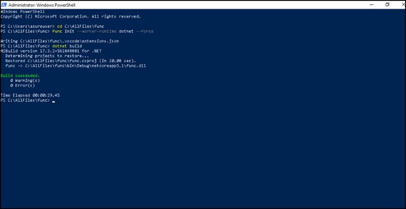

# Instructions

## Exercise 2: Configure a local Azure Functions project

In this exercise, you are going to create a local project that you'll use for Azure Functions development. 

In this Exercise, you will have:

  + Task 1: Initialize a function project.
  + Task 2: Configure a connection string.
  + Task 3: Build and validate a project

### Estimated Timing: 45 minutes

### Task 1: Initialize a function project

In this task, you will initialize a function project.

#### Pre-requisites for this task

Completed Exercise 1

#### Steps:

1. OPen **Windows Explorer**, then go to C://AllFiles. Create a **folder** named **func**.

1. On the taskbar, open **Windows Powershell**.

1. Run the following command to change the current directory to the **C:\AllFiles\func** empty directory:

    ```powershell
    cd C:\AllFiles\func
    ```

1. Run the following command to use the **Azure Functions Core Tools** to create a new local Azure Functions project in the current directory using the **dotnet** runtime:

    ```powershell
    func init --worker-runtime dotnet --force
    ```
    
    
1. Close the **Windows Powershell** application.

#### Task 2: Configure a connection string

In this task, you will configure a connection string.

#### Pre-requisites for this task

Completed Exercise 1 & Exercise 2 - Task 1

#### Steps:

1. On the **Start** screen, select the **Visual Studio Code**.

1. On the **File** menu, select **Open Folder**.

1. In the **File Explorer** window that opens, browse to **C:\AllFiles\func**, and then select **Select Folder**. If its ask for **DO you trust the authors of the files in this folder** please select **Yes, I trust the authors**

    

1. On the **Explorer** pane of the **Visual Studio Code** window, open the **local.settings.json** file.

1. Observe the current value of the **AzureWebJobsStorage** setting:

    ```json
    "AzureWebJobsStorage": "UseDevelopmentStorage=true",
    ```

1. Change the value of the **AzureWebJobsStorage** element to the **connection string** of the storage account that you recorded earlier in this lab.

    

1. Save the **local.settings.json** file.

#### Task 3: Build and validate a project

#### Pre-requisites for this task

Completed Exercise 1 & Exercise 2 - Task 1 & Task 2

#### Steps:

1. On the taskbar, open **Windows Powershell**.

1. Run the following command to change the current directory to the **C:\AllFiles\func** empty directory:

    ```powershell
    cd C:\AllFiles\func
    ```

1. Run the following command to **build** the .NET Core 3.1 project:

    ```powershell
    dotnet build
    ```
You will get a build succeeded message on Powershell.

    


### Clean up resources

>**Note : Please do not delete resources you deployed in this lab. You will reference them in the next Exercises of this module.**

#### Review

In this lab, you have:

- Initialized a function project.
- Configured a connection string.
- validated a project
