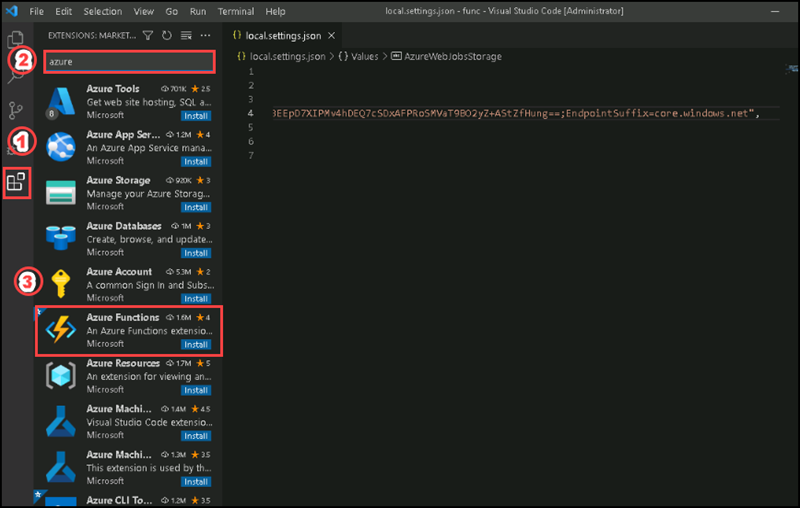
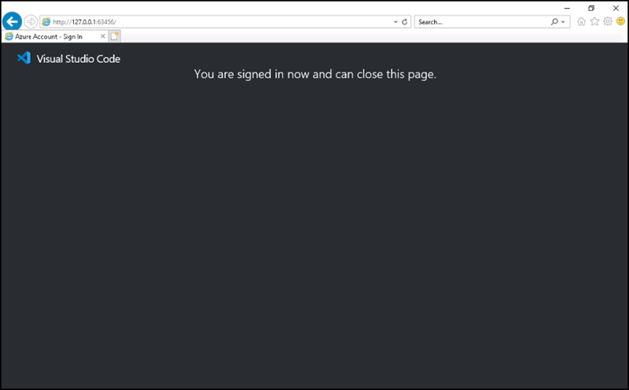
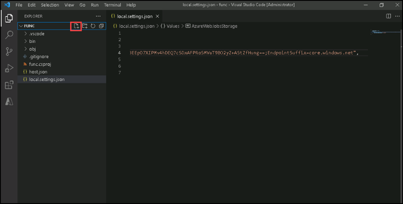
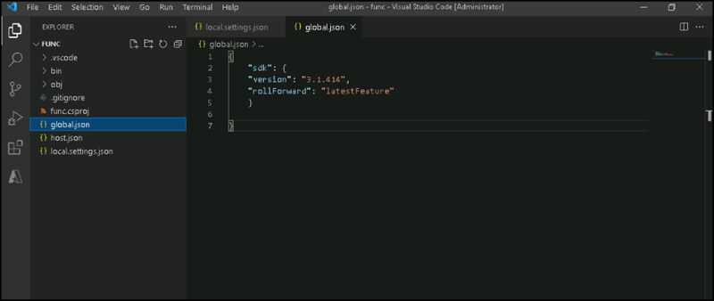
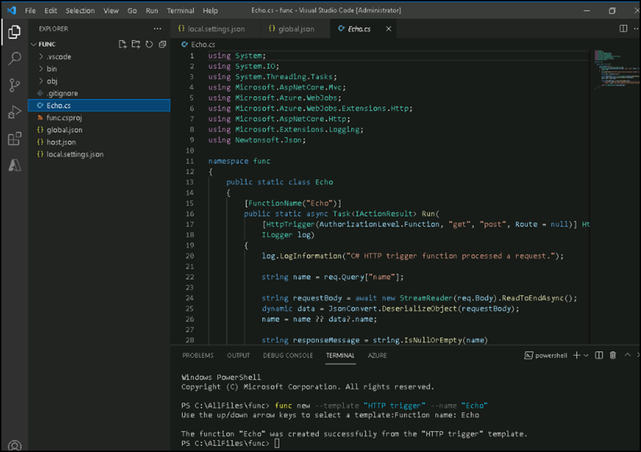
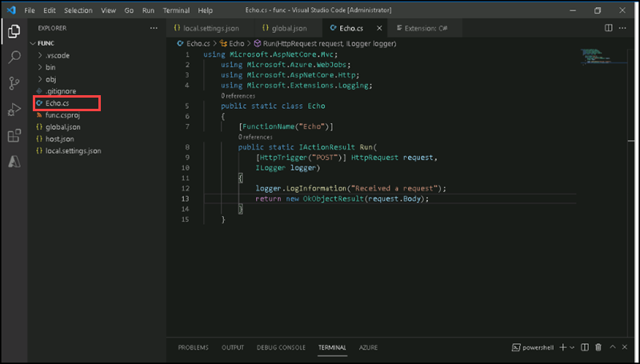

# Instructions
## Exercise 3: Create a function that's triggered by an HTTP request

In this exercise, you are going to create a basic function that echoes the content sent through an HTTP POST request. 

In this Exercise, you will have:

  + Task 1: Create an HTTP-triggered function.
  + Task 2: Write HTTP-triggered function code.
  + Task 3: Test the HTTP-triggered function by using httprepl

### Task 1: Initialize a function project


#### Pre-requisites for this task

Completed Exercise 1 & Exercise 2

#### Steps:

1. Open **Visual studio code**, open the terminal

1. Run the following command to change the current directory to the **C:\AllFiles\func** directory:

    ```powershell
    cd C:\AllFiles\func
    ```
1. Install Azure functions extension by clicking on **Extension tab** on the left side and search **Azure** on the search box then click **Install** on **Azure functions**.




1. After installing, please select **Sign In** for signing into Azure portal. If it ask for username and password, please enter the username and password provided on **Environment details** of the Lab guide. After a while you will get a message showing **You are signed in now and can close this page**. Please check the Azure tab of the Visual studio code you can see the default subscription of Azure. Please close the browser page.



1. Add a new file on the local project named **func** by clicking on **New file** button.



1. Enter the name **global.json** and press **Enter**, you have created the file named global.json. Please enter the following code on it.

    ```JSON
    {
        "sdk": {
        "version": "3.1.414",
        "rollForward": "latestFeature"
        }
      
     }
    ```



1. Open the termninal then run the following command to use the **Azure Functions Core Tools** to create a new function named **Echo** using the **HTTP trigger** template:

    ```powershell
    func new --template "HTTP trigger" --name "Echo"
    ```

1. You have successfully created the file named Echo.cs.



>**Note:** If its asking of installing C# extension, please install. Or else please go to the Extension tab and type C# on the search box and install C# for Visual studio code.

No need to close the Terminal.

#### Task 2: Write HTTP-triggered function code

1. On the **Explorer** pane of the **Visual Studio Code** window, open the **Echo.cs** file.

1. In the code editor, observe the example implementation:

    ```csharp
    using System;
    using System.IO;
    using System.Threading.Tasks;
    using Microsoft.AspNetCore.Mvc;
    using Microsoft.Azure.WebJobs;
    using Microsoft.Azure.WebJobs.Extensions.Http;
    using Microsoft.AspNetCore.Http;
    using Microsoft.Extensions.Logging;
    using Newtonsoft.Json;
    namespace func
    {
        public static class Echo
        {
            [FunctionName("Echo")]
            public static async Task<IActionResult> Run(
                [HttpTrigger(AuthorizationLevel.Function, "get", "post", Route = null)] HttpRequest req,
                ILogger log)
            {
                log.LogInformation("C# HTTP trigger function processed a request.");
                string name = req.Query["name"];
                string requestBody = await new StreamReader(req.Body).ReadToEndAsync();
                dynamic data = JsonConvert.DeserializeObject(requestBody);
                name = name ?? data?.name;
                string responseMessage = string.IsNullOrEmpty(name)
                    ? "This HTTP triggered function executed successfully. Pass a name in the query string or in the request body for a personalized response."
                    : $"Hello, {name}. This HTTP triggered function executed successfully.";
                return new OkObjectResult(responseMessage);
            }
        }
    }
    ```

1. Delete all the content within the **Echo.cs** file.

1. Add the following lines of code to add **using directives** for the **Microsoft.AspNetCore.Mvc**, **Microsoft.Azure.WebJobs**, **Microsoft.AspNetCore.Http**, and **Microsoft.Extensions.Logging** namespaces:

    ```csharp
    using Microsoft.AspNetCore.Mvc;
    using Microsoft.Azure.WebJobs;
    using Microsoft.AspNetCore.Http;
    using Microsoft.Extensions.Logging;
    ```

1. Create a new **public static** class named **Echo**:

    ```csharp
    public static class Echo
    { }
    ```

1. Observe the **Echo.cs** file again, which should now include:

    ```csharp
    using Microsoft.AspNetCore.Mvc;
    using Microsoft.Azure.WebJobs;
    using Microsoft.AspNetCore.Http;
    using Microsoft.Extensions.Logging;
    public static class Echo
    { }
    ```

1. Within the **Echo** class, add the following code block to create a new **public static** method named **Run** that returns a variable of type **IActionResult** and that also takes in variables of type **HttpRequest** and **ILogger** as parameters named *request* and *logger*:

    ```csharp
    public static IActionResult Run(
        HttpRequest request,
        ILogger logger)
    { }
    ```

1. Add the following code to append an attribute to the **Run** method of type **FunctionNameAttribute** that has its **name** parameter set to a value of **Echo**:

    ```csharp
    [FunctionName("Echo")]
    public static IActionResult Run(
        HttpRequest request,
        ILogger logger)
    { }
    ```

1. Add the following code to append an attribute to the **request** parameter of type **HttpTriggerAttribute** that has its **methods** parameter array set to a single value of **POST**:

    ```csharp
    [FunctionName("Echo")]
    public static IActionResult Run(
        [HttpTrigger("POST")] HttpRequest request,
        ILogger logger)
    { }
    ```

1. Observe the **Echo.cs** file again, which should now include the following code:

    ```csharp
    using Microsoft.AspNetCore.Mvc;
    using Microsoft.Azure.WebJobs;
    using Microsoft.AspNetCore.Http;
    using Microsoft.Extensions.Logging;
    public static class Echo
    {
        [FunctionName("Echo")]
        public static IActionResult Run(
            [HttpTrigger("POST")] HttpRequest request,
            ILogger logger)
        { }
    }
    ```

1. In the **Run** method, enter the following line of code to log a fixed message:

    ```csharp
    logger.LogInformation("Received a request");
    ```

1. Enter the following line of code to echo the body of the HTTP request as the HTTP response:

    ```csharp
    return new OkObjectResult(request.Body);
    ```

1. Observe the **Echo.cs** file again, which should now include the following code:

    ```csharp
    using Microsoft.AspNetCore.Mvc;
    using Microsoft.Azure.WebJobs;
    using Microsoft.AspNetCore.Http;
    using Microsoft.Extensions.Logging;
    public static class Echo
    {
        [FunctionName("Echo")]
        public static IActionResult Run(
            [HttpTrigger("POST")] HttpRequest request,
            ILogger logger)
        {
            logger.LogInformation("Received a request");
            return new OkObjectResult(request.Body);
        }
    }
    ```




1. Select **Save** to save your changes to the **Echo.cs** file.

#### Task 3: Test the HTTP-triggered function by using httprepl

1. Run the following command to run the function app project:

    ```powershell
    func start --build
    ```

    > **Note**: You can review the documentation to [start the function app project locally](https://docs.microsoft.com/azure/azure-functions/functions-develop-local) using the **Azure Functions Core Tools**.    

1. Open a new Terminal, run the following command to install and start the **httprepl** tool, setting the base Uniform Resource Identifier (URI) to ``http://localhost:7071``:

    ```powershell
    dotnet tool install --global Microsoft.dotnet-httprepl --version 3.1.0 
    
    httprepl http://localhost:7071
    
    ```

    > **Note**: An error message is displayed by the **httprepl** tool. This message occurs because the tool is searching for a Swagger definition file to use to traverse the API. Because your function project doesn't produce a Swagger definition file, you'll need to traverse the API manually.
1. From the tool's prompt, run the following command to browse to the relative **api** directory:

    ```powershell
    cd api
    ```

1. Run the following command to browse to the relative **echo** directory:

    ```powershell
    cd echo
    ```

1. Run the following command to run the **post** command, sending in an HTTP request body set to a numeric value of **3** by using the **\-\-content** option:

    ```powershell
    post --content 3
    ```

1. Run the following command to run the **post** command, sending in an HTTP request body set to a numeric value of **5** by using the **\-\-content** option:

    ```powershell
    post --content 5
    ```

1. Run the following command to run the **post** command, sending in an HTTP request body set to a string value of **Hello** by using the **\-\-content** option:

    ```powershell
    post --content "Hello"
    ```

1. Run the following command to run the **post** command, sending in an HTTP request body set to a JavaScript Object Notation (JSON) value of **{"msg": "Successful"}** by using the **\-\-content** option:

    ```powershell
    post --content "{"msg": "Successful"}"
    ```

1. Run the following command to exit the **httprepl** application:

    ```powershell
    exit
    ```

1. Close all currently running instances of the **Windows Terminal** application.

#### Review
