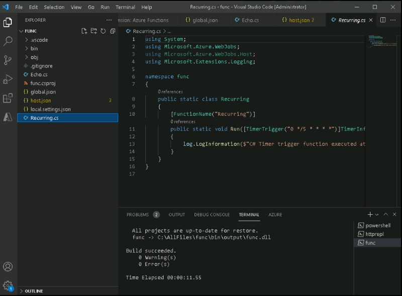
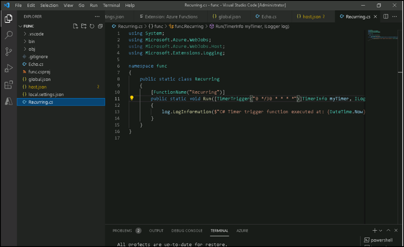

# Instructions

## Exercise 4: Create a function that triggers on a schedule

In this exercise, you are going to create a function that runs automatically based on a fixed schedule.

In this Exercise, you have

    + Task 1: Create a schedule-triggered function
    + Task 2: Observe function code
    + Task 3: Observe function runs
    + Task 4: Update the function integration configuration
    + Task 5: Observe function runs

### Task 1: Create a schedule-triggered function

In this task, you are going to create a scheduled-triggered function

#### Pre-requisites

Completed Exercise 1 & Exercise 2 & Exercise 3

#### Steps

1.Open **Visual studio code** from the **Start** button, Open a new terminal.

1.Run the following command to change the current directory to the **C:\AllFiles\func* directory:

    ```powershell
    cd C:\AllFiles\func
    ```

1. On the terminal, run the following command to use the **Azure Functions Core Tools** to create a new function named **Recurring**, using the **Timer trigger** template:

    ```powershell
    func new --template "Timer trigger" --name "Recurring"
    ```

You will get a message showing **The function "Recurring" was created successfully from the "Timer trigger" template.**  

#### Task 2: Observe function code

#### Pre-requisites

Completed Exercise 1 & Exercise 2 & Exercise 3 & Exercise 4 - Task 1

#### Steps

1. On the **Explorer** pane of the **Visual Studio Code** window, open the **Recurring.cs** file.

1. In the code editor, observe the implementation:

    ```csharp
    using System;
    using Microsoft.Azure.WebJobs;
    using Microsoft.Azure.WebJobs.Host;
    using Microsoft.Extensions.Logging;    
    namespace func
    {
        public static class Recurring
        {
            [FunctionName("Recurring")]
            public static void Run([TimerTrigger("0 */5 * * * *")]TimerInfo myTimer, ILogger log)
            {
                log.LogInformation($"C# Timer trigger function executed at: {DateTime.Now}");
            }
        }
    }
    ```


#### Task 3: Observe function runs

In this task, you are observing the function run that occurs about every five minutes.

#### Pre-requisites

Completed Exercise 1 & Exercise 2 & Exercise 3 & Exercise 4 - Task 1 & Task 2

#### Steps

1. From the terminal, run the following command to run the function app project:

    ```powershell
    func start --build
    ```
    
1. Observe the function run that occurs about every five minutes. Each function run should render a simple message to the log.


#### Task 4: Update the function integration configuration

In this task, you are going to update the function by changing the schedule to run once every 30 seconds.

#### Pre-requisites

Completed Exercise 1 & Exercise 2 & Exercise 3 & Exercise 4 - Task 1 & Task 2 & Task 3

#### Steps

1. On the **Explorer** pane of the **Visual Studio Code** window, open the **Recurring.cs** file.

1. In the code editor, observe the existing **Run** method signature:

    ```csharp
    [FunctionName("Recurring")]
    public void Run([TimerTrigger("0 */5 * * * *")]TimerInfo myTimer, ILogger log)
    ```

1. Update the **Run** method signature code block to change the schedule to run once every **30 seconds**:

    ```csharp
    [FunctionName("Recurring")]
    public void Run([TimerTrigger("*/30 * * * * *")]TimerInfo myTimer, ILogger log)
    ```

1. Select **Save** to save your changes to the **Recurring.cs** file.



#### Task 5: Observe function runs

In this task, you will observe the function runs every 30 seconds.

#### Pre-requisites

Completed Exercise 1 & Exercise 2 & Exercise 3 & Exercise 4 - Task 1 & Task 2 & Task 3 & Task 4

#### Steps

1. From the command prompt, run the following command to run the function app project:

    ```powershell
    func start --build
    ```
     
1. Observe the function run that occurs about every 30 seconds. Each function run should render a simple message to the log.

1. Close the currently running **Windows Terminal** application.

1. Close the Visual Studio Code window.

### Clean up resources

>**Note : Please do not delete resources you deployed in this lab. You will reference them in the next Exercises of this module.**

#### Review

In this lab, you have:

- Create a schedule-triggered function.
- Observed it runs every 5 seconds.
- Updated the function.
- Observed it runs every 30 seconds.


