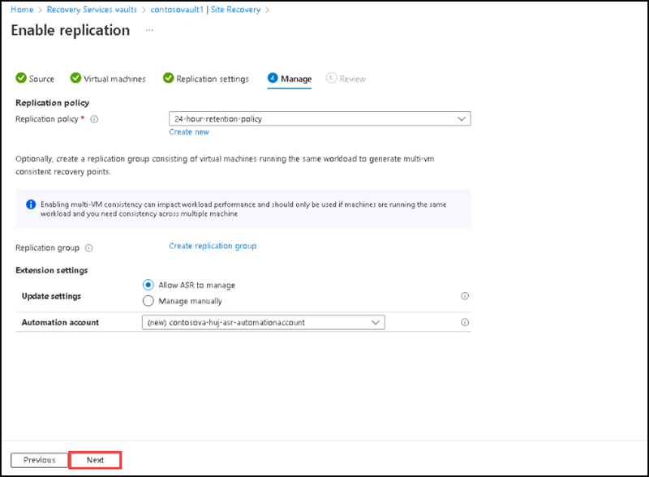

# Instructions

## Exercise 1: Setup Azure Site Recovery 

In this exercise, you are going to deploy a quickstart template on Azure. 

In this exercise, you will:

+ Task 1: Create a Virtual network
+ Task 2: Create two Virtual Machines.
+ Task 3: Create a Recovery Services Vault and enable Replication.

### Estimated Timing: 60 minutes

### Task 1: Create two virtual networks

In this task you are going to create two virtual networks. One will be in the West US region and the other will be in the East US region.

#### Pre-requisites for this task

#### Steps:

1. Search for **Virtual networks** on the **search** box of the **Home** page, then select **Virtual networks** from the list below.

2. Please select the **+ Create** on the **Virtual network** page.

    
  
3. On the **Create Virtual Network** page, please enter the following details on Basics tab:

    | Section | Values |
    | ------- | ------ |
    | Subscription | **Default** Select the default subscription |
    | Resource group | Select or create a new resource group to store the virtual network, here we will use a resource group named **contosovnet** |
    | Name | **Contoso-Vnet-WestUS** |
    | Region | **West US** |
  
    
  
4. Go to **Next: IP Addresses**, then on the **IP Addresses** tab, please review the default IP addresses and subnet given, then select **Review + Create**.
  
    
  
5. Once the validation passed successfully, please click on **Create**.   
 
6. After completing the deployment, please select **Go to resource**.

7. Repeat steps 2-5 to create another virtual network into the same resource group with the following information:

   **Second Virtual Network:**
  
    | Section | Values |
    | ------- | ------ |
    | Name | **Contoso-Vnet-EastUS** | 
    | Resource group | **contosovnet** |
    | Region | **East US** |
    
   For the **IP Addresses** tab keep the default settings.
   
   After completing this task, you deployed two virtual networks.

### Task 2: Create two Virtual Machines

In this task, you will learn how to use Azure portal to create two virtual machines

#### Pre-requisites for this task

An Azure account

#### Steps

1. Sign in to Azure portal, search for **Virtual machines**, then select **Virtual machines** from the list.

2. On the Virtaul machines page please select **+ Create**, then select **Azure virtual machine**.

  
  
3. On the **Create a Virtual machine** page please enter the following details on the **Basics** tab:

    | Section | Values |
    | ------- | ------ |
    | Subscriptioon | Select the default subscription |
    | Resource group | **contosovnet** |
    | Virtual machine name  | **contoso-vm-1** |
    | Region | **East US** |
    | Availability options | **No infrastructure redundancy required** |
    | Security type | **Standard** |
    | Image | **Windows Server 2019 Datacenter - x64 Gen2** |
    | VM architecture | **x64** |
    | Size | **Standard_DS1-V2 - 1 -vcpu, 3.5 Gib memory** |
    | Username | **contosoadmin** |
    | Password | **Pa$$w0rd123!** | 

 4. Keep the default options for rest of the settings on the basic tab and select **Next: Disks>** at the bottom. Please select **Standard SSD(Locally-redundant storage)** for **OS disk type**, then select **Next: Networking>** at the bottom.

    
5. On the **Networking** tab please review all the default settings and the values, also notice default value of **virtual network** as **Contoso-Vnet-EastUS**, then select **Review + create** at the bottom.

6. After validation, please select **Create**.

7. After completing the deployment, please select **Go to resource**.

8. Repeat steps 2-6 to create another virtual machine with name **contoso-vm-2**.
   
After completing this task, you deployed two virtual machines named **contoso-vm-1** and **contoso-vm-2**.

### Task 3: Create a Recovery Services Vault

In this task you are going to create two virtual networks. One will be in the West US region and the other will be in the East US region.

#### Pre-requisites for this task

#### Steps:

1. On the Home page of Azure portal, please search for **Recovery Service Vaults** and then select **Recovery Service Vaults** from the list.

2. On the **Recovery Service Vaults** page please select **+ Create**.

3. On the **Create Recovery Services vault** page, please enter the following details on the **Basics** tab.
    
    | Section | Values |
    | ------- | ------ |
    | Subscriptioon | Select the default subscription |
    | Resource group | **contosovnet** |
    | Virtual machine name  | **contosovault1** |
    | Region | **West US** |
    
  
    
4. Please select **Review + create**, after the validation select **Create**. 
    
5.  Click on **Go To Resource** to open the vault for further configuration.

6.  On the **contosovault1** page, at the **Overview** section, please select **+ Enable Site Recovery**.

  
    
7. On the **Site recovery** section please select **Enable replication**.

    
    
8. On the **Enable replication** page, please select the **Resource group** as **contosovnet** and then select **Next**.

    

9. Please select **contoso-vm-1** under **Virtual machines** tab and then select **Next**.

  

10. On the **Replication settings** tab, please review the default settings and the values, then select **Next**. 

 

11. On the **Manage** tab, please review the default settings and the values, then select **Next**

 

12. On the **Review** tab, please select **Enable replication**.

13. It will take 5-7 minutes to complete the replication, please select **Replicated items** on **contosovault1** page. You can see the Virtual machine enabled for replication.

You have successfully enabled the replication for **contoso-vm-1**.

