# Instructions

## Exercise 3: Validate Disaster Failover for Virtual Machines

In this exercise, you are going to validate disaster failover for virtual machines. 

In this exercise, you will:

+ Task 1: Verify Virtual Machine settings.
+ Task 2: Fail over Azure Virtual Machine to a secondary region.
+ Task 3: Reprotect the VM

### Estimated Timing: 30 minutes

### Task 2: Fail over Azure Virtual Machine to a secondary region

#### Pre-requisites for this task

Complete Exercise 1

#### Steps:

1. Go to the **Recovery service vault** named **contosovault1** that you hvae created on Exercise-1.

2. Please select the replicated virtual machine named **contoso-vm-1** on the **Replicated items** section.

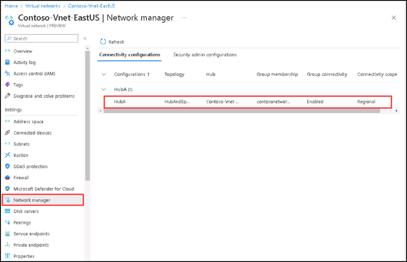

3. On the Overview section, check that the Virtual Machine is protected and healthy.

4. On the Overview section, please select **Test Failover**.

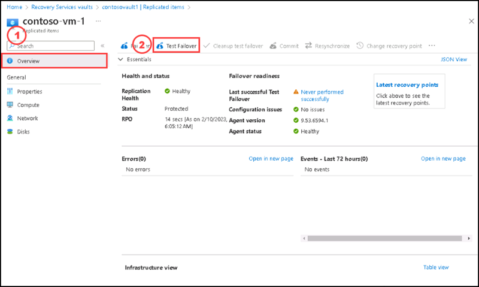

5. On the **Test Failover** page, please select **Contoso-Vnet-WestUS** for **Azure virtual network**, keep the default settings for **From** as **East US** and for **To** as **West US**, then select **Ok**.

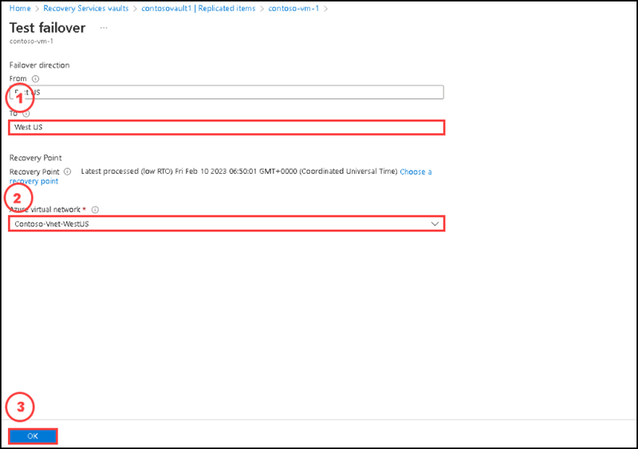

6. Monitor the test failover in notifications.

7.After the failover finishes, the Azure Virtual Machine created in the target region appears in the Azure portal Virtual Machines. Make sure that the Virtual Machine is running, sized appropriately, and connected to the network you selected.

8. Go to **Virtual machines** page, you can see **contoso-vm-1-test** virtual machine created on **West US** region. 

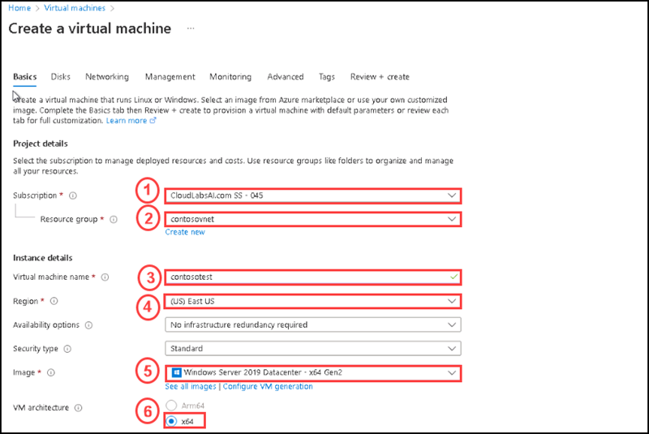

9. Go to **Recovery service vault** named **contosovault1**, select **Replicated items**, then select **contoso-vm-1**.

10. On the **Overview** section, please select **Cleanup test failover**.

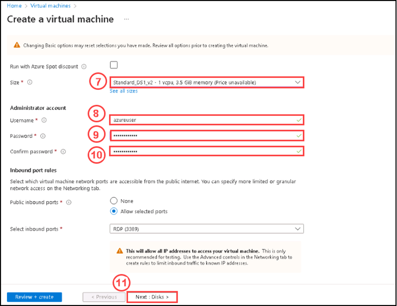

11. On the **Test failover** page, please enter **Test failover succeeded, no issues.** on the **Notes**, then please do **Check** for **Testing is complete. Delete test failover virtual machine(s)**, then select **Ok**.

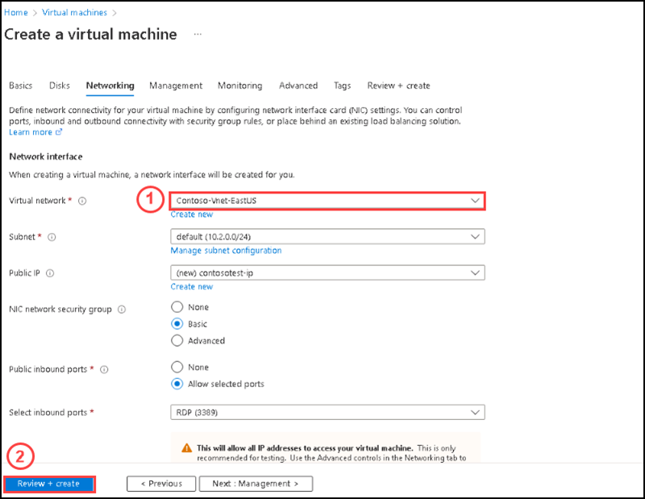

12. Monitor cleanup progress in notifications. After succeeding with the cleanup, please check on the **Virtual machines** page, you can see **contoso-vm-1-test** virtual machine delected. 

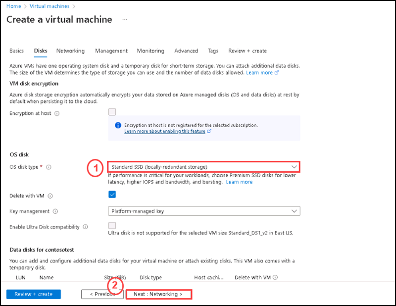

In this task, you ran a disaster recovery drill to check that failover works as expected. 

### Task 1: Verify Virtual Machine settings.

#### Pre-requisites for this task

Complete Exercise 1 & Exercise 3 - Task 1

#### Steps:

1. Go to the **Recovery service vault** named **contosovault1**, please select the replicated virtual machine named **contoso-vm-1** on the **Replicated items** section.

2. On the **Overview** section, please select **Failover**.

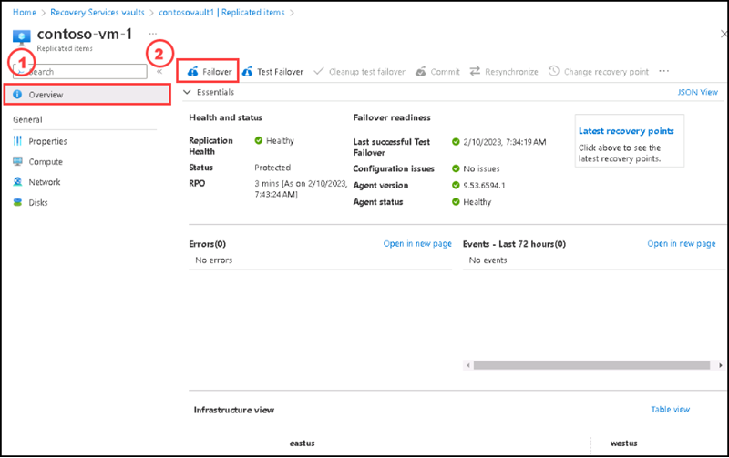

3. In Failover, choose a recovery point. The Azure VM in the target region is created using data from this recovery point. Please select **Choose a recovery point** the select **Use Latest processed recovery point**, then select **Save**.

    - Latest processed recovery point: Uses the latest recovery point processed by Site Recovery. The time stamp is shown. No time is spent processing data, so it  provides a low recovery time objective (RTO).
    - Latest: Processes all the data sent to Site Recovery, to create a recovery point for each VM before failing over to it. Provides the lowest recovery point objective (RPO), because all data is replicated to Site Recovery when the failover is triggered.
    - Latest app-consistent: This option fails over VMs to the latest app-consistent recovery point. The time stamp is shown.
    - Custom: Fail over to particular recovery point. Custom is only available when you fail over a single VM, and don't use a recovery plan.

4. Please make sure **Shut down machine before beginning failover** is checked. Shutdown helps to ensure no data loss. Failover continues even if shutdown fails.

5. To start the failover, select **Ok**.

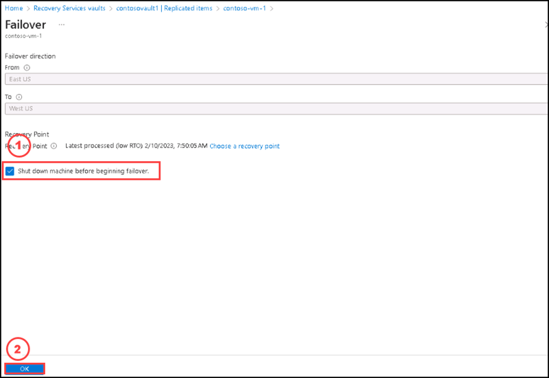

6. Monitor the failover in notifications.

7. After the failover, the Azure VM created in the target region appears in Virtual Machines. Make sure that the VM is running, and sized appropriately. 

  >**Note**: If you want to use a different recovery point for the VM, select Change recovery point, on the Essentials page.
  
8. Go to the **Replicated items** section of the **contosovault1** Recovery service vault, please review the virtual machine **contoso-vm-1** status became **Failover completed**.

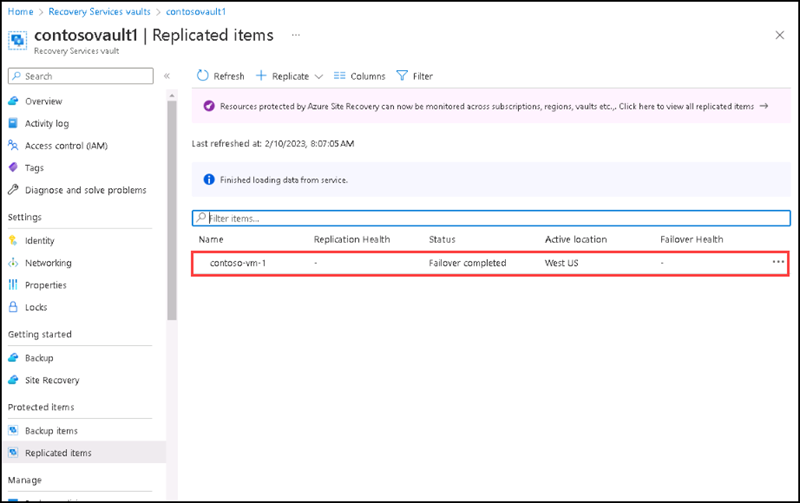

9. On the **Overview** section please select **Commit** to finish the failover.

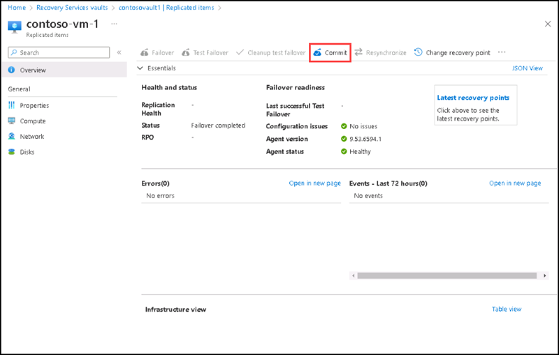

10. On the **Commit** page, please select **Ok**. Commit deletes all the available recovery points for the VM in Site Recovery, and you won't be able to change the recovery point.

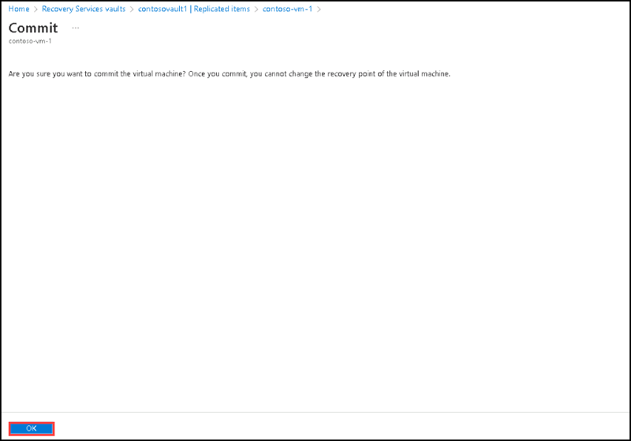

11. Monitor the commit progress in notifications.

12. Once successfully completed the commit fail over, please go to Virtual machines tab and you can see a virtual machine depoyed in West US region.

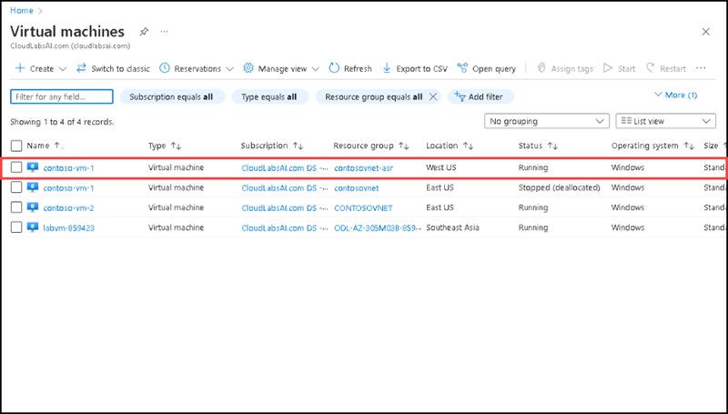

### Task 3: Reprotect the VM

After failover, you reprotect the VM in the secondary region, so that it replicates back to the primary region.

#### Steps:

1. Make sure that VM Status is **Failover committed** before you start. Please select the virtaul machine **contoso-vm-1**.

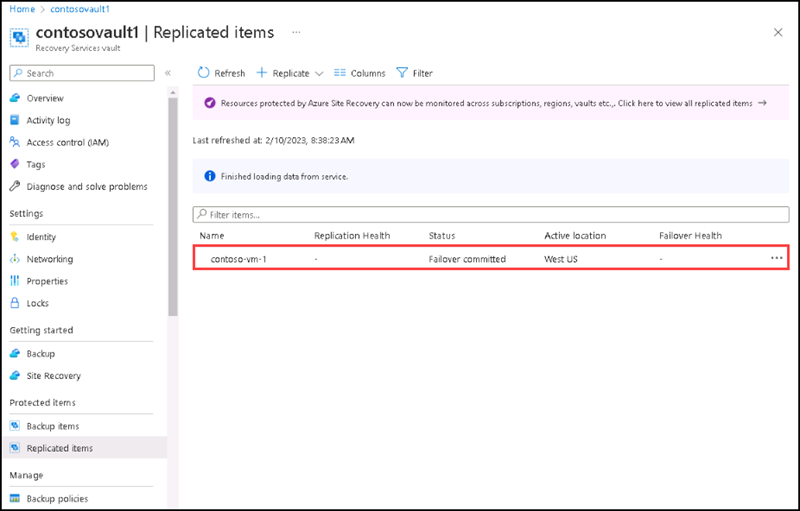

2. On the **Overview** section, Please select **Re-protect** by clicking on the **ellipsis(...)**.

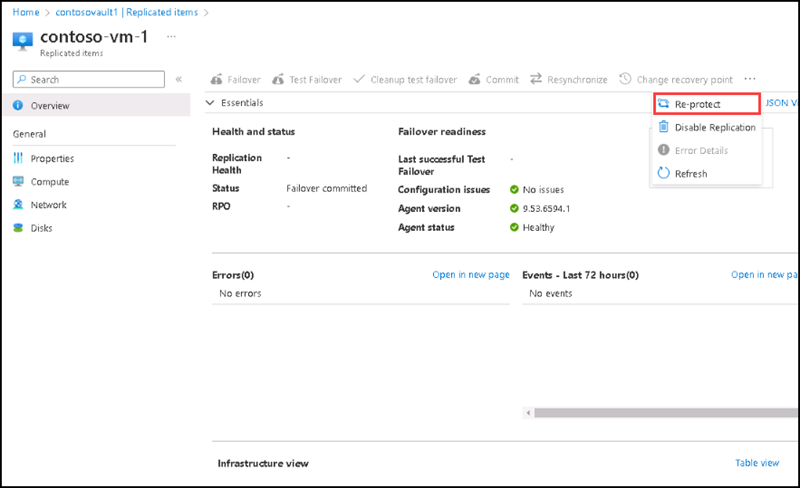

3. In Re-protect, verify the replication direction (secondary to primary region), and review the target settings for the primary region. Resources marked as new are created by Site Recovery as part of the reprotect operation. Please select **Ok** to start the reprotect process. The process sends initial data to the target location, and then replicates delta information for the VMs to the target.

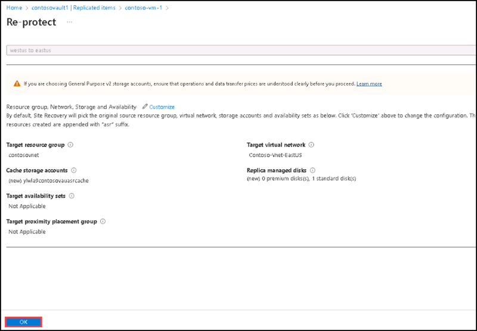

4. Monitor reprotect progress in the notifications.

5. You have suucessfully protected the virtual machine on the secondary region.

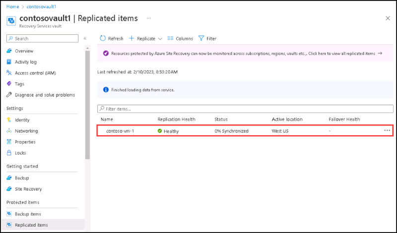

In this task, you failed over from the primary region to the secondary, and started replicating VMs back to the primary region. Now you can fail back from the secondary region to the primary.

