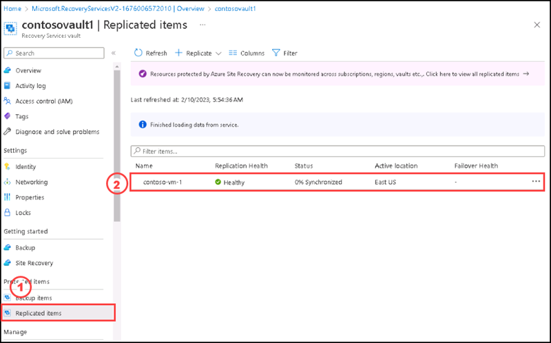

# Instructions

## Exercise 3: 4.	Validate Disaster Failover for Virtual Machines

In this exercise, you are going to validate disaster failover for virtual machines. 

In this exercise, you will:

+ Task 1: Verify Virtual Machine settings

### Estimated Timing: 30 minutes

### Task 1: Verify Virtual Machine settings

#### Pre-requisites for this task

#### Steps:

1. Go to the **Recovery service vault** named **contosovault1** that you hvae created on Exercise-1.

2. Please select the replicated virtual machine named **contoso-vm-1** on the **Replicated items** section.

3. On the Overview section, check that the Virtual Machine is protected and healthy.

4. On the Overview section, please select **Test Failover**.

5. On the **Test Failover** page, please select **Contoso-Vnet-WestUS** for **Azure virtual network**, keep the default settings for **From** as **East US** and for **To** as **West US**, then select **Ok**.

6. Monitor the test failover in notifications.

  
